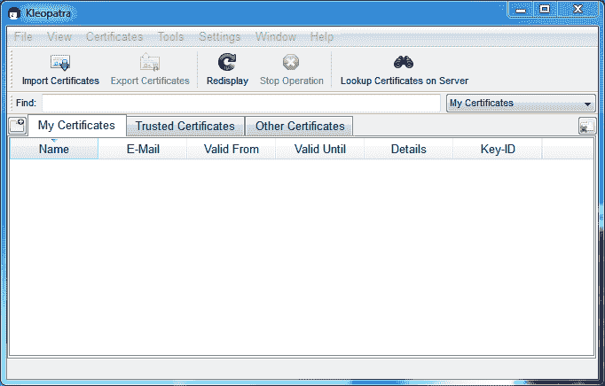
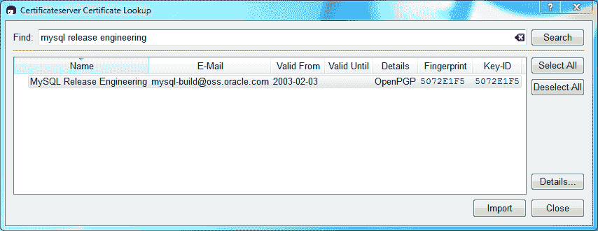
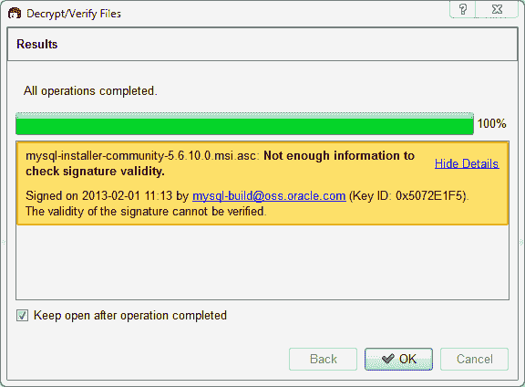
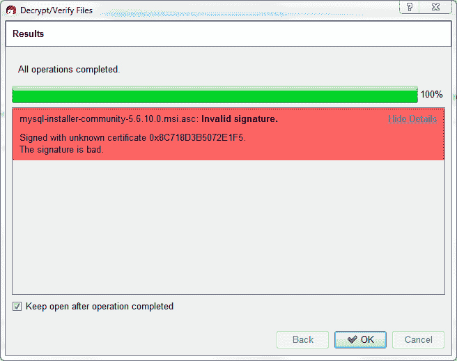

> 原文：[`dev.mysql.com/doc/refman/8.0/en/checking-gpg-signature-windows.html`](https://dev.mysql.com/doc/refman/8.0/en/checking-gpg-signature-windows.html)

#### 2.1.4.3 使用 Gpg4win 在 Windows 上进行签名检查

第 2.1.4.2 节，“使用 GnuPG 进行签名检查”部分描述了如何使用 GPG 验证 MySQL 下载。该指南也适用于 Microsoft Windows，但另一种选择是使用类似[Gpg4win](http://www.gpg4win.org/)的 GUI 工具。您可以使用不同的工具，但我们的示例是基于 Gpg4win，并利用其捆绑的`Kleopatra` GUI。

下载并安装 Gpg4win，然后加载 Kleopatra。对话框应该类似于：

**图 2.1 Kleopatra：初始屏幕**

接下来，添加 MySQL Release Engineering 证书。通过单击文件，查找服务器上的证书来执行此操作。在搜索框中键入“Mysql Release Engineering”并按搜索。

**图 2.2 Kleopatra：在服务器上查找证书向导：查找证书**

选择“MySQL Release Engineering”证书。对于 MySQL 8.0.28 及更高版本，指纹和密钥 ID 必须为“3A79BD29”，对于 MySQL 8.0.27 及更早版本，必须为“5072E1F5”，或选择“详细信息...”以确认证书是否有效。现在，通过单击“导入”来导入它。当显示导入对话框时，选择“确定”，此证书现在应该列在“导入的证书”选项卡下。

接下来，配置我们证书的信任级别。选择我们的证书，然后从主菜单中选择证书，更改所有者信任....我们建议选择“我相信检查非常准确”以验证我们的证书，否则您可能无法验证我们的签名。选择“我相信检查非常准确”以启用“完全信任”，然后按“确定”。

**图 2.3 Kleopatra：更改 MySQL 发布工程的信任级别**

接下来，验证已下载的 MySQL 软件包文件。这需要打包文件和签名文件。签名文件必须与打包文件同名，但要附加一个 .asc 扩展名，如下表中的示例所示。签名在每个 MySQL 产品的下载页面上都有链接。您必须使用此签名创建 .asc 文件。

**表 2.2 MySQL Installer for Microsoft Windows 的 MySQL 软件包和签名文件**

| 文件类型 | 文件名 |
| --- | --- |
| 分发文件 | `mysql-installer-community-8.0.36.msi` |
| 签名文件 | `mysql-installer-community-8.0.36.msi.asc` |

确保两个文件存储在同一目录中，然后运行以下命令来验证分发文件的签名。要么将签名（.asc）文件拖放到 Kleopatra 中，要么从文件中加载对话框，选择 Decrypt/Verify Files...，然后选择 .msi 或 .asc 文件。

**图 2.4 Kleopatra：解密和验证文件对话框**

点击 Decrypt/Verify 来检查文件。最常见的两种结果看起来像下图；尽管黄色警告可能看起来有问题，但以下内容表示文件检查已成功通过。您现在可以运行此安装程序。

**图 2.5 Kleopatra：解密和验证结果对话框：所有操作已完成**

如果看到红色的"The signature is bad"错误，意味着文件无效。如果看到此错误，请不要执行 MSI 文件。

**图 2.6 Kleopatra：解密和验证结果对话框：错误**

第 2.1.4.2 节，“使用 GnuPG 进行签名检查”解释了为什么你看不到绿色的`Good signature`结果。
