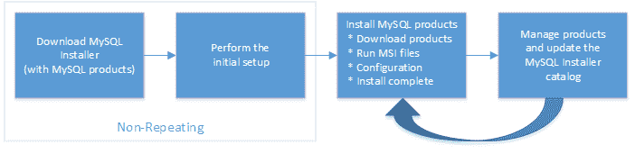
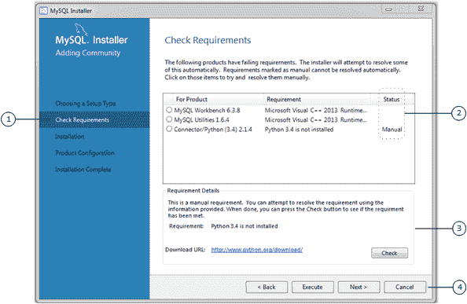

> 原文：[`dev.mysql.com/doc/refman/8.0/en/mysql-installer-setup.html`](https://dev.mysql.com/doc/refman/8.0/en/mysql-installer-setup.html)

#### 2.3.3.1 MySQL Installer 初始设置

+   选择设置类型

+   路径冲突

+   检查要求

+   MySQL Installer 配置文件

当您第一次下载 MySQL Installer 时，设置向导将引导您完成 MySQL 产品的初始安装。如下图所示，初始设置是整个过程中的一次性活动。MySQL Installer 在初始设置期间检测主机上已安装的现有 MySQL 产品，并将它们添加到要管理的产品列表中。

**图 2.7 MySQL Installer 流程概述**

MySQL Installer 在初始设置期间将配置文件（稍后描述）提取到主机的硬盘上。尽管 MySQL Installer 是一个 32 位应用程序，但它可以安装 32 位和 64 位二进制文件。

初始设置会在“开始”菜单下的 MySQL 文件夹组中添加一个链接。点击“开始”，MySQL，然后点击 MySQL Installer - [社区 | 商业]以打开图形工具的社区版或商业版。

##### 选择设置类型

在初始设置过程中，您将被提示选择要在主机上安装的 MySQL 产品。一个选择是使用符合您设置要求的预定设置类型。默认情况下，下载和安装时会包括 GA 和预发布产品，其中 Client only 和 Full 设置类型。选择“仅安装 GA 产品”选项，以在使用这些设置类型时限制产品集仅包括 GA 产品。

注意

仅商业版 MySQL 产品，如 MySQL 企业备份，可供选择和安装，如果您使用 MySQL Installer 的商业版（参见 MySQL Installer 商业版发布）。

选择以下设置类型之一确定初始安装，不限制您以后安装或更新 Windows 上的 MySQL 产品的能力：

+   **仅服务器**：仅安装 MySQL 服务器。此设置类型安装您在下载 MySQL Installer 时选择的 GA 或开发版本服务器。它使用默认安装和数据路径。

+   **仅客户端**：仅安装最新的 MySQL 应用程序（如 MySQL Shell、MySQL Router 和 MySQL Workbench）。此设置类型不包括 MySQL 服务器或通常与服务器捆绑在一起的客户端程序，如**mysql**或**mysqladmin**。

+   **完整**：安装所有可用的 MySQL 产品，不包括 MySQL 连接器。

+   **自定义**：自定义设置类型使您可以从 MySQL Installer 目录中筛选和选择单个 MySQL 产品。

    注意

    对于 MySQL Server 版本 8.0.20（及更早版本）和 MySQL 5.7（所有版本），您用于运行 MySQL Installer 的帐户可能没有足够的权限来安装服务器数据文件，这可能会中断安装，因为无法执行`ExecSecureObjects` MSI 操作。要继续，请在再次尝试安装服务器之前取消选择“服务器数据文件”功能。如需帮助，请参阅要安装的产品功能。

    对于 MySQL Server 8.0.21（及更高版本），“服务器数据文件”复选框已从功能树中移除。

    使用`自定义`设置类型安装：

    +   产品或产品版本不在通常的下载位置提供。目录包含所有产品发布版本，包括预发布（或开发）和 GA 之间的其他发布版本。

    +   使用替代安装路径、数据路径或两者的 MySQL 服务器实例。有关如何调整路径的说明，请参阅第 2.3.3.2 节，“使用 MySQL Installer 设置替代服务器路径”。

    +   同一主机上同时存在两个或更多个 MySQL 服务器版本（例如，5.7 和 8.0）。

    +   一种特定的产品和功能组合不作为预设的设置类型提供。例如，您可以安装单个产品，如 MySQL Workbench，而不是为 Windows 安装所有客户端应用程序。

##### 路径冲突

当产品的默认安装或数据文件夹（MySQL 服务器所需）已经存在于主机上时，向导会显示路径冲突步骤，以识别每个冲突并使您能够采取措施避免新安装覆盖现有文件夹中的文件。仅当 MySQL Installer 检测到冲突时，您才会在初始设置中看到此步骤。

要解决路径冲突，请执行以下操作之一：

+   从列表中选择一个产品以显示冲突选项。警告符号表示哪条路径存在冲突。使用浏览按钮选择新路径，然后点击“下一步”。

+   点击“返回”选择不同的设置类型或产品版本（如果适用）。`自定义`设置类型使您可以选择单���产品版本。

+   点击“下一步”以忽略冲突并覆盖现有文件夹中的文件。

+   删除现有产品。点击“取消”以停止初始设置并关闭 MySQL Installer。再次从“开始”菜单打开 MySQL Installer，并使用 MySQL Installer 仪表板中的“删除”操作从主机中删除已安装的产品。

##### 检查要求

MySQL Installer 使用`package-rules.xml`文件中的条目来确定主机上是否安装了每个产品的先决条件软件。当要求检查失败时，MySQL Installer 显示“检查要求”步骤，以帮助您更新主机。每次下载新产品（或版本）进行安装时，都会评估要求。以下图标识并描述了此步骤的关键区域。

**图 2.8 检查要求**

###### 检查要求元素的描述

1.  显示初始设置中的当前步骤。此列表中的步骤可能会略有变化，具体取决于主机上已安装的产品、先决条件软件的可用性以及将要安装在主机上的产品。

1.  按产品列出所有待安装要求，并指示状态如下：

    +   状态列中的空格表示 MySQL Installer 可以尝试为您下载并安装所需软件。

    +   状态列中的单词*手动*表示您必须手动满足要求。选择列表中的每个产品以查看其要求详情。

1.  详细描述要求，以帮助您进行每个手动解决方案。在可能的情况下，提供下载网址。下载并安装所需软件后，点击“检查”以验证是否满足要求。

1.  提供以下一组操作以继续：

    +   返回 - 返回上一步。此操作使您可以选择不同的安装类型。

    +   执行 - 让 MySQL Installer 尝试下载并安装所有没有手动状态的所需软件。手动要求由您解决，并通过点击“检查”进行验证。

    +   下一步 - 不执行自动应用要求的请求，并继续安装，而不包括未通过要求检查步骤的产品。

    +   取消 - 停止安装 MySQL 产品。因为 MySQL Installer 已经安装，所以当您从“开始”菜单打开 MySQL Installer 并从仪表板中点击“添加”时，初始设置将重新开始。有关可用管理操作的描述，请参阅产品目录。

##### MySQL Installer 配置文件

所有 MySQL 安装程序文件都位于`C:\Program Files (x86)`和`C:\ProgramData`文件夹中。以下表格描述了定义 MySQL 安装程序作为独立应用程序的文件和文件夹。

注意

安装的 MySQL 产品在更新或卸载 MySQL 安装程序时既不会被更改也不会被移除。

**表 2.5 MySQL 安装程序配置文件**

| 文件或文件夹 | 描述 | 文件夹层次结构 |
| --- | --- | --- |
| `MySQL Installer for Windows` | 此文件夹包含运行 MySQL 安装程序和**MySQLInstallerConsole.exe**所需的所有文件，这是一个具有类似功能的命令行程序。 | `C:\Program Files (x86)` |
| `模板` | `模板`文件夹中有每个 MySQL 服务器版本的一个文件。模板文件包含一些动态计算值的键和公式。 | `C:\ProgramData\MySQL\MySQL Installer for Windows\Manifest` |
| `package-rules.xml` | 此文件包含要安装的每个产品的先决条件。 | `C:\ProgramData\MySQL\MySQL Installer for Windows\Manifest` |
| `products.xml` | `products`文件（或产品目录）包含所有可供下载的产品列表。 | `C:\ProgramData\MySQL\MySQL Installer for Windows\Manifest` |
| `产品缓存` | `产品缓存`文件夹包含所有与完整包或随后下载的独立`.msi`文件捆绑在一起的文件。 | `C:\ProgramData\MySQL\MySQL Installer for Windows` |
