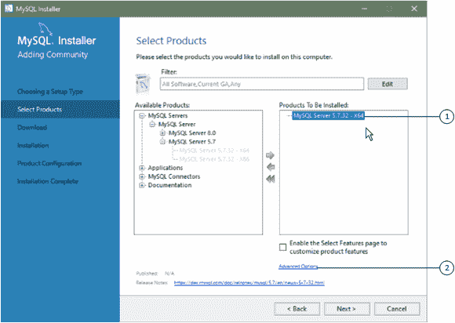

> 原文：[`dev.mysql.com/doc/refman/8.0/en/mysql-installer-change-path-proc.html`](https://dev.mysql.com/doc/refman/8.0/en/mysql-installer-change-path-proc.html)

#### 2.3.3.2 使用 MySQL Installer 设置替代服务器路径

在安装 MySQL 服务器时，您可以更改默认安装路径、数据路径或两者。安装服务器后，不能在不删除和重新安装服务器实例的情况下更改路径。

注意

从 MySQL Installer 1.4.39 开始，如果您手动移动已安装服务器的数据目录，MySQL Installer 会识别更改并可以进行重新配置操作而不会出现错误。

**更改 MySQL 服务器路径**

1.  识别要更改的 MySQL 服务器，并按以下步骤启用高级选项链接：

    1.  通过以下方式之一导航到选择产品页面：

        1.  如果这是 MySQL Installer 的初次设置，请选择`Custom`设置类型并点击下一步。

        1.  如果 MySQL Installer 已安装在您的计算机上，请从仪表板中点击添加。

    1.  点击编辑以在可用产品中显示的产品列表上应用过滤器（请参见查找要安装的产品）。

    1.  选择服务器实例后，使用箭头将所选服务器移动到要安装的产品列表中。

    1.  点击服务器以选择它。当您选择服务器时，在要安装的产品列表下方启用了高级选项链接（请参见下图）。

1.  点击高级选项以打开对话框，您可以在其中输入替代路径名。在路径名经过验证后，点击下一步继续配置步骤。

    **图 2.9 更改 MySQL 服务器路径**

    
