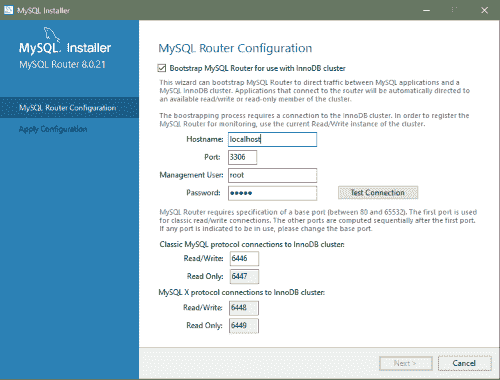

> 原文：[`dev.mysql.com/doc/refman/8.0/en/mysql-installer-workflow.html`](https://dev.mysql.com/doc/refman/8.0/en/mysql-installer-workflow.html)

#### 2.3.3.3 使用 MySQL Installer 进行安装工作流程

MySQL Installer 提供了一个类似向导的工具，用于在 Windows 上安装和配置新的 MySQL 产品。与仅运行一次的初始设置不同，MySQL Installer 每次下载或安装新产品时都会调用向导。对于首次安装，初始设置的步骤直接进入安装步骤。有关产品选择的帮助，请参阅查找要安装的产品。

注意

授予执行 MySQL Installer 的用户对所有生成的文件（如`my.ini`）的完全权限。这不适用于特定产品的文件和目录，例如在`%ProgramData%`中由`SYSTEM`拥有的 MySQL 服务器数据目录。

在主机上安装和配置的产品遵循可能需要您在各个步骤中输入的一般模式。如果尝试安装与现有 MySQL 服务器版本不兼容的产品（或选择升级的版本），则会收到可能不匹配的警告。

MySQL Installer 提供适用于不同工作流程的以下操作序列：

+   **选择产品。** 如果在初始设置期间选择了`Custom`设置类型或从 MySQL Installer dashboard 中点击添加，则 MySQL Installer 会在侧边栏中包含此操作。从此页面，您可以应用筛选器以修改可用产品列表，然后选择一个或多个产品移动（使用箭头键）到要安装的产品列表。

    在此页面上选中复选框以激活选择功能操作，您可以在下载产品后自定义产品功能。

+   **下载。** 如果安装了完整（非 Web）MySQL Installer 软件包，则在初始设置期间所有`.msi`文件都加载到`Product Cache`文件夹中，不会再次下载。否则，点击执行开始下载。每个产品的状态从`准备下载`变为`下载中`，然后变为`已下载`。

    要重试单个未成功下载的内容，请点击“重试”链接。

    要重试所有未成功下载的内容，请点击“尝试全部”。

+   **选择要安装的功能（默认禁用）。** 在 MySQL Installer 下载产品的`.msi`文件后，如果在之前的选择产品操作中启用了可选复选框，则可以自定义功能。

    要在安装后自定义产品功能，请在 MySQL Installer dashboard 中点击修改。

+   **安装。** 列表中每个产品的状态从`准备安装`变为`正在安装`，最后变为`完成`。在过程中，单击“显示详细信息”以查看安装操作。

    如果此时取消安装，产品将被安装，但服务器（如果已安装）尚未配置。要重新启动服务器配置，请从“开始”菜单中打开 MySQL 安装程序，然后在仪表板旁边单击“重新配置”。

+   **产品配置。** 这一步适用于 MySQL 服务器、MySQL 路由器和样本。列表中每个项目的状态应显示为`准备配置`。单击“下一步”开始为列表中的所有项目启动配置向导。此步骤中呈现的配置选项特定于您选择安装的数据库或路由器版本。

    单击“执行”开始应用配置选项，或单击“返回”（重复）返回到每个配置页面。

+   **安装完成。** 这一步完成了不需要配置的产品的安装。它使您可以将日志复制到剪贴板，并启动某些应用程序，如 MySQL Workbench 和 MySQL Shell。单击“完成”以打开 MySQL 安装程序仪表板。

##### 2.3.3.3.1 使用 MySQL 安装程序配置 MySQL 服务器

MySQL 安装程序执行 MySQL 服务器的初始配置。例如：

+   它创建用于配置 MySQL 服务器的配置文件（`my.ini`）。在安装过程中做出的选择会影响写入此文件的值。某些定义是主机相关的。例如，如果主机的核心少于三个，则启用查询缓存。

    注意

    查询缓存在 MySQL 5.7 中已弃用，并在 MySQL 8.0（以及更高版本）中移除。

+   默认情况下，为 MySQL 服务器添加了一个 Windows 服务。

+   为 MySQL 服务器提供默认安装和数据路径。有关如何更改默认路径的说明，请参见第 2.3.3.2 节，“使用 MySQL 安装程序设置替代服务器路径”。

+   它可以根据一般角色（如 DB 管理员、DB 设计师和备份管理员）创建具有可配置权限的 MySQL 服务器用户帐户。它可以选择创建一个名为`MysqlSys`的 Windows 用户，该用户具有有限的权限，然后运行 MySQL 服务器。

    用户账户也可以在 MySQL Workbench 中添加和配置。

+   选中“显示高级选项”将使您能够设置额外的日志选项。这包括为错误日志、常规日志、慢查询日志（包括执行查询所需的秒数的配置）和二进制日志定义自定义文件路径。

在配置过程中，单击“下一步”以继续下一步或单击“返回”以返回上一步。在最后一步单击“执行”以应用服务器配置。

接下来的部分描述了适用于 Windows 上 MySQL 服务器的服务器配置选项。您安装的服务器版本将决定您可以配置哪些步骤和选项。配置 MySQL 服务器可能包括一些或所有步骤。

###### 2.3.3.3.1.1 类型和网络

+   服务器配置类型

    选择描述您设置的 MySQL 服务器配置类型。此设置定义要分配给 MySQL 服务器实例的系统资源（内存）量。

    +   **开发**：托管许多其他应用程序的计算机，通常是您的个人工作站。此设置配置 MySQL 以使用最少的内存。

    +   **服务器**：预计在此计算机上运行几个其他应用程序，例如 Web 服务器。服务器设置配置 MySQL 以使用中等内存量。

    +   **专用**：专用于运行 MySQL 服务器的计算机。由于此服务器上没有运行其他主要应用程序，因此此设置配置 MySQL 以使用大部分可用内存。

    +   **手动**

        防止 MySQL 安装程序尝试优化服务器安装，而是将默认值设置为`my.ini`配置文件中包含的服务器变量。选择“手动”类型后，MySQL 安装程序使用`tmp_table_size`变量分配的默认值为 16M。

+   连接

    连接选项控制与 MySQL 的连接方式。选项包括：

    +   TCP/IP：默认情况下选择此选项。您可以禁用 TCP/IP 网络以仅允许本地主机连接。选择 TCP/IP 连接选项后，您可以修改以下项目：

        +   用于经典 MySQL 协议连接的端口。默认值为`3306`。

        +   配置 MySQL 8.0 服务器时显示的 X 协议端口。默认值为`33060`。

        +   打开用于网络访问的 Windows 防火墙端口，默认情况下为 TCP/IP 连接选择。

        如果端口号已被使用，您将看到信息图标（）显示在默认值旁边，并且在提供新端口号之前，“下一步”将被禁用。

    +   命名管道：启用并定义管道名称，类似于设置`named_pipe`系统变量。默认名称为`MySQL`。

        当您选择命名管道连接时，然后继续下一步，您将被提示设置授予命名管道连接上客户端软件的访问控制级别。一些客户端只需要最低限度的访问控制来进行通信，而其他客户端则需要对命名管道拥有完全访问权限。

        您可以根据运行客户端的 Windows 用户（或用户）设置访问控制级别如下：

        +   **所有用户的最小访问权限（推荐）。** 默认情况下启用此级别，因为它是最安全的。

        +   **完全访问本地组成员。** 如果最小访问选项对客户端软件过于限制，可以使用此选项来减少具有命名管道上完全访问权限的用户数量。在您可以从列表中选择之前，必须在 Windows 上建立该组。对该组的成员资格应该受到限制和管理。Windows 要求新添加的成员首先注销，然后再次登录以加入本地组。

        +   **所有用户的完全访问权限（不推荐）。** 此选项不够安全，应仅在实施其他保障措施时设置。

    +   共享内存：启用并定义内存名称，类似于设置`shared_memory`系统变量。默认名称为`MySQL`。

+   高级配置

    选择显示高级和日志选项以在后续步骤中设置自定义日志记录和高级选项。日志选项步骤使您能够为错误日志、常规日志、慢查询日志（包括执行查询所需的秒数的配置）和二进制日志定义自定义文件路径。高级选项步骤使您能够设置在启用复制拓扑中的二进制日志记录时所需的唯一服务器 ID。

+   MySQL Enterprise Firewall（仅企业版）

    默认情况下未选中启用 MySQL Enterprise Firewall 复选框。选择此选项以启用提供对某些类型攻击的保护的安全列表。需要进行额外的安装后配置（参见第 8.4.7 节，“MySQL Enterprise Firewall”）。

    重要提示

    MySQL 8.0.19 存在一个问题，如果在服务器配置步骤中选择了 MySQL Enterprise Firewall，则会导致服务器无法启动。如果服务器启动操作失败，请点击取消以结束配置过程并返回仪表板。您必须卸载服务器。

    解决方法是在运行 MySQL Installer 时不选择 MySQL Enterprise Firewall（即不选中启用 MySQL Enterprise Firewall 复选框）。然后按照手动安装的说明安装 MySQL Enterprise Firewall（参见第 8.4.7.2 节，“安装或卸载 MySQL Enterprise Firewall”）。

###### 2.3.3.3.1.2 认证方法

认证方法步骤仅在安装或升级 MySQL 8.0.4 或更高版本时可见。它介绍了两种服务器端认证选项之间的选择。您在下一步中创建的 MySQL 用户帐户将使用您在此步骤中选择的认证方法。

使用`libmysqlclient` 8.0 的 MySQL 8.0 连接器和社区驱动程序现在支持`caching_sha2_password`默认认证插件。然而，如果您无法更新客户端和应用程序以支持这种新的认证方法，您可以配置 MySQL 服务器使用`mysql_native_password`进行传统认证。有关此更改的影响的更多信息，请参阅 caching_sha2_password 作为首选认证插件。

如果您正在安装或升级到 MySQL 8.0.4 或更高版本，请选择以下一种认证方法：

+   使用强密码加密进行认证（推荐）

    MySQL 8.0 支持基于改进的、更强大的基于 SHA256 的密码方法的新认证。建议所有新的 MySQL 服务器安装都使用这种方法。

    重要

    服务器上的`caching_sha2_password`认证插件需要新版本的连接器和客户端，这些版本支持新的 MySQL 8.0 默认认证。

+   使用传统认证方法（保留 MySQL 5.x 兼容性）

    仅在以下情况下应考虑使用旧的 MySQL 5.x 传统认证方法：

    +   应用程序无法更新以使用 MySQL 8.0 连接器和驱动程序。

    +   重新编译现有应用程序不可行。

    +   尚无更新的特定语言连接器或驱动程序。

###### 2.3.3.3.1.3 帐户和角色

+   根账户密码

    分配根密码是必需的，在执行其他 MySQL Installer 操作时将要求输入密码。在提供的框中重复输入密码时将评估密码强度。有关密码要求或状态的描述性信息，请将鼠标指针移动到信息图标上（）。

+   MySQL 用户帐户（可选）

    单击“添加用户”或“编辑用户”以创建或修改具有预定义角色的 MySQL 用户帐户。接下来，输入所需的帐户凭据：

    +   用户名：MySQL 用户名最长可达 32 个字符。

    +   主机：仅在需要远程连接到服务器时选择`localhost`以进行本地连接，或选择`<All Hosts (%)>`。

    +   角色：每个预定义角色，如`DB Admin`，都配置有自己的一组特权。例如，`DB Admin`角色比`DB Designer`角色拥有更多特权。角色下拉列表包含每个角色的描述。

    +   密码：在输入密码时会执行密码强度评估。密码必须确认。MySQL 允许空白或空密码（被视为不安全）。

    **仅适用于 MySQL 安装程序商业版本：** Windows 的 MySQL 企业版是一款商业产品，还支持一种在 Windows 上执行外部身份验证的身份验证方法。通过 Windows 操作系统验证的帐户可以在不提供额外密码的情况下访问 MySQL 服务器。

    要创建一个使用 Windows 身份验证的新 MySQL 帐户，请输入用户名，然后选择主机和角色的值。单击 Windows 身份验证以启用`authentication_windows`插件。在 Windows 安全令牌区域，为每个可以使用 MySQL 用户名进行身份验证的 Windows 用户（或组）输入一个令牌。MySQL 帐户可以包括本地 Windows 用户和属于域的 Windows 用户的安全令牌。多个安全令牌由分号字符（`;`）分隔，并对本地和域帐户使用以下格式：

    +   本地帐户

        将简单的 Windows 用户名输入为每个本地用户或组的安全令牌；例如，**`finley;jeffrey;admin`**。

    +   域帐户

        使用标准的 Windows 语法（*`domain`*`\`*`domainuser`*）或 MySQL 语法（*`domain`*`\\`*`domainuser`*）输入 Windows 域用户和组。

        对于域帐户，如果运行 MySQL 安装程序的帐户缺少查询 Active Directory 的权限，则可能需要使用域内管理员的凭据。如果是这种情况，请选择“使用以激活域管理员凭据验证 Active Directory 用户”。

    Windows 身份验证允许您在每次添加或修改令牌时测试所有安全令牌。单击“测试安全令牌”以验证（或重新验证）每个令牌。无效令牌将生成一个带有红色`X`图标和红色令牌文本的描述性错误消息。当所有令牌解析为有效（绿色文本且没有`X`图标）时，您可以单击“确定”以保存更改。

###### 2.3.3.3.1.4 Windows 服务

在 Windows 平台上，MySQL 服务器可以作为由操作系统管理的命名服务运行，并配置为在 Windows 启动时自动启动。或者，您可以配置 MySQL 服务器作为需要手动配置的可执行程序运行。

+   将 MySQL 服务器配置为 Windows 服务（默认选择）。

    当选择默认配置选项时，您还可以选择以下内容：

    +   在系统启动时启动 MySQL 服务器

        当选择（默认）时，服务启动类型设置为自动；否则，启动类型设置为手动。

    +   以以下方式运行 Windows 服务

        当选择标准系统帐户（默认）时，服务将作为网络服务登录。

        自定义用户选项必须具有作为服务登录到 Microsoft Windows 的权限。在配置此用户具有所需权限之前，下一步按钮将被禁用。

        通过在“开始”菜单中搜索“本地安全策略”在 Windows 中配置自定义用户帐户。在本地安全策略窗口中，选择本地策略，用户权限分配，然后选择“作为服务登录”以打开属性对话框。单击“添加用户或组”以添加自定义用户，然后在每个对话框中单击“确定”以保存更改。

+   取消选择 Windows 服务选项。

###### 2.3.3.3.1.5 服务器文件权限

可选地，在服务器配置操作期间可以管理位于`C:\ProgramData\MySQL\MySQL Server 8.0\Data`的文件夹和文件上设置的权限。您有以下选项：

+   MySQL Installer 可以配置文件夹和文件，完全授予运行 Windows 服务的用户（如果适用）和管理员组独占控制权。

    所有其他组和用户被拒绝访问。这是默认选项。

+   使 MySQL Installer 使用类似于刚刚描述的配置选项，但还使 MySQL Installer 显示哪些用户可能具有完全控制权。

    然后您可以决定是否应该给予组或用户完全控制。如果不是，则可以将合格成员从此列表移动到限制所有访问的第二个列表。

+   使 MySQL Installer 跳过在配置操作期间进行文件权限更改。

    如果选择此选项，则在服务器配置完成后，您需要手动保护`Data`文件夹及其相关文件。

###### 2.3.3.3.1.6 日志选项

如果在类型和网络步骤中选择了“显示高级配置”复选框，则可用此步骤。要立即启用此步骤，请单击“返回”返回到类型和网络步骤，并选择复选框。

高级配置选项与以下 MySQL 日志文件相关：

+   错误日志

+   常规日志

+   慢查询日志

+   二进制日志

注意

二进制日志在 MySQL 5.7 及更高版本中默认启用。

###### 2.3.3.3.1.7 高级选项

如果在类型和网络步骤中选择了“显示高级配置”复选框，则可用此步骤。要立即启用此步骤，请单击“返回”返回到类型和网络步骤，并选择复选框。

高级配置选项包括：

+   服务器 ID

    设置在复制拓扑中使用的唯一标识符。如果启用了二进制日志记录，必须指定服务器 ID。默认 ID 值取决于服务器版本。有关更多信息，请参阅`server_id`系统变量的描述。

+   表名大小写

    您可以在初始和后续配置服务器期间设置以下选项。对于 MySQL 8.0 发布系列，这些选项仅适用于服务器的初始配置。

    +   小写

        将`lower_case_table_names`选项值设置为 1（默认值），其中表名以小写形式存储在磁盘上，比较不区分大小写。

    +   保留给定大小写

        将`lower_case_table_names`选项值设置为 2，其中表名按给定方式存储，但比较时不区分大小写。

###### 2.3.3.3.1.8 应用服务器配置

单击“执行”时，所有配置设置将应用于 MySQL 服务器。使用“配置步骤”选项卡跟踪每个操作的进度；每个图标在成功时从白色变为绿色（带有复选标记）。否则，如果某个操作超时，过程将停止并显示错误消息。单击“日志”选项卡查看日志。

安装成功并单击“完成”后，MySQL 安装程序和已安装的 MySQL 产品将添加到 Microsoft Windows“开始”菜单下的`MySQL`组中。打开 MySQL 安装程序会加载仪表板，其中列出了已安装的 MySQL 产品，并提供其他 MySQL 安装程序操作。

##### 2.3.3.3.2 使用 MySQL 安装程序配置 MySQL 路由器

MySQL 安装程序下载并安装了一套用于在 Windows 上开发和管理关键业务应用程序的工具。该套件包括应用程序、连接器、文档和示例。

在初始设置期间，选择除`仅服务器`之外的任何预定设置类型，以安装工具的最新 GA 版本。使用`自定义`设置类型安装单个工具或特定版本。如果 MySQL 安装程序已安装在主机上，请使用“添加”操作从 MySQL 安装程序仪表板中选择并安装工具。

###### MySQL 路由器配置

MySQL 安装程序提供了一个配置向导，可以引导安装的 MySQL Router 8.0 实例，以在 MySQL 应用程序和 InnoDB 集群之间传输流量。配置完成后，MySQL Router 将作为本地 Windows 服务运行。

注意

在初始安装后和显式重新配置已安装的路由器时，会提示您配置 MySQL 路由器。相比之下，升级操作不需要或提示您配置升级后的产品。

要配置 MySQL 路由器，请执行以下操作：

1.  设置 InnoDB 集群。

1.  使用 MySQL 安装程序，下载并安装 MySQL 路由器应用程序。安装完成后，配置向导会提示您提供信息。选择“为 InnoDB 集群配置 MySQL 路由器”复选框以开始配置，并提供以下配置值：

    +   主机名：InnoDB 集群中主要（种子）服务器的主机名（默认为`localhost`）。

    +   端口：InnoDB 集群中主要（种子）服务器的端口号（默认为`3306`）。

    +   管理用户：具有根级别特权的管理用户。

    +   密码：管理用户的密码。

    +   经典的 MySQL 协议连接到 InnoDB 集群

        读/写：将第一个基本端口号设置为未使用的端口号（介于 80 和 65532 之间），向导将为您选择其余端口。

        接下来的图示显示了 MySQL 路由器配置页面的示例，第一个基本端口号指定为 6446，其余端口由向导设置为 6447、6448 和 6449。

    **图 2.10 MySQL 路由器配置**

    

1.  点击“下一步”，然后点击“执行”以应用配置。点击“完成”关闭 MySQL 安装程序或返回到 MySQL 安装程序仪表板。

配置 MySQL 路由器后，root 帐户仅存在于用户表中的`root@localhost`（本地），而不是`root@%`（远程）。无论路由器和客户端位于何处，即使两者都位于与种子服务器相同的主机上，通过路由器传递的任何连接都被服务器视为远程连接，而不是本地连接。因此，使用本地主机进行的连接（请参见下面的示例）不会进行身份验证。

```sql
$> \c root@localhost:6446
```
