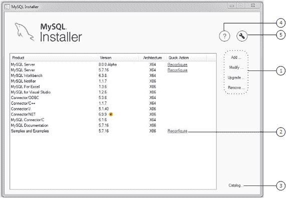
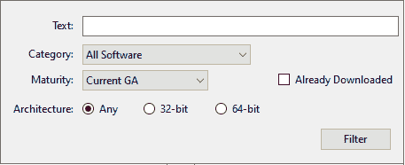

> 原文：[`dev.mysql.com/doc/refman/8.0/en/mysql-installer-catalog-dashboard.html`](https://dev.mysql.com/doc/refman/8.0/en/mysql-installer-catalog-dashboard.html)

#### 2.3.3.4 MySQL 安装程序产品目录和仪表板

本节描述了 MySQL 安装程序产品目录、仪表板以及与产品选择和升级相关的其他操作。

+   产品目录

+   MySQL 安装程序仪表板

+   查找要安装的产品

+   升级 MySQL 服务器

+   移除 MySQL 服务器

+   升级 MySQL 安装程序

##### 产品目录

产品目录存储了适用于 Microsoft Windows 的所有已发布 MySQL 产品的完整列表，可从[MySQL 下载](https://dev.mysql.com/downloads/)中下载。默认情况下，当有互联网连接时，MySQL 安装程序会尝试在每七天启动时更新目录。您也可以从仪表板手动更新目录（稍后描述）。

最新的目录执行以下操作：

+   填充“选择产品”页面的“可用产品”窗格。当您选择时，此步骤会出现：

    +   在初始设置期间的`自定义`设置类型。

    +   从仪表板执行添加操作。

+   识别仪表板中列出的已安装产品是否有可用的产品更新。

该目录包括所有开发版本（预发布）、一般版本（当前 GA）和次要版本（其他版本）。目录中的产品会有所不同，具体取决于您下载的 MySQL 安装程序版本。

##### MySQL 安装程序仪表板

MySQL 安装程序仪表板是在初始设置完成后启动 MySQL 安装程序时看到的默认视图。如果在设置完成之前关闭了 MySQL 安装程序，则 MySQL 安装程序会在显示仪表板之前恢复初始设置。

注意

如果安装了 Oracle 终身维护支持的产品，例如 MySQL for Excel 和 MySQL Notifier，这些产品可能会显示在仪表板中。这些产品只能进行修改或移除。

**图 2.11 MySQL 安装程序仪表板元素**



###### MySQL 安装程序仪表板元素描述

1.  MySQL Installer 仪表板操作提供了适用于已安装产品或目录中列出的产品的各种操作。要启动以下操作，请首先单击操作链接，然后选择要管理的产品或产品：

    +   添加：此操作打开“选择产品”页面。从那里，您可以调整过滤器，选择一个或多个需要下载的产品，并开始安装。有关使用过滤器的提示，请参阅查找要安装的产品。

        使用方向箭头将每个产品从“可用产品”列移动到“要安装的产品”列。要启用“产品功能”页面，您可以在其中自定义功能，请单击相关复选框（默认情况下禁用）。

        注意

        对于 MySQL Server 版本 8.0.20（及更早版本）和 MySQL 5.7（所有版本），您用于运行 MySQL Installer 的帐户可能没有足够的权限来安装服务器数据文件，这可能会中断安装，因为无法执行`ExecSecureObjects` MSI 操作。要继续，请在再次尝试安装服务器之前取消选择“服务器数据文件”功能。

        “服务器数据文件”复选框已从 MySQL Server 8.0.21（或更高版本）的功能树中移除。

    +   修改：使用此操作添加或删除与已安装产品相关联的功能。您可以修改的功能因产品而异。当选择“程序快捷方式”复选框时，产品将出现在`MySQL`组下的“开始”菜单中。

    +   升级：此操作加载“选择要升级的产品”页面，并将其填充为所有升级候选项。已安装产品可能有多个升级版本，该操作需要当前产品目录。MySQL Installer 一次升级所有选定的产品。单击“显示详细信息”以查看 MySQL Installer 执行的操作。

    +   移除：此操作打开“移除产品”页面，并将其填充为主机上安装的 MySQL 产品。选择要移除（卸载）的 MySQL 产品，然后单击“执行”以开始移除过程。在操作过程中，指示器显示已执行的步骤数，作为所有步骤的百分比。

        要选择要移除的产品，请执行以下操作之一：

        +   选择一个或多个产品的复选框。

        +   选择产品复选框以选择所有产品。

1.  在每个已安装服务器旁边的快速操作列中的重新配置链接会加载服务器的当前配置值，然后循环执行所有配置步骤，使您能够更改选项和值。您必须提供具有 root 权限的凭据才能重新配置这些项目。单击“日志”选项卡以显示 MySQL Installer 执行的每个配置步骤的输出。

    完成后，MySQL Installer 停止服务器，应用配置更改，并为您重新启动服务器。有关每个配置选项的描述，请参见 Section 2.3.3.3.1, “MySQL Server Configuration with MySQL Installer”。与特定 MySQL 服务器版本关联的“示例和示例”也可以重新配置以应用新的功能设置（如果有）。

1.  目录链接使您可以手动下载最新的 MySQL 产品目录，然后将这些产品变更与 MySQL Installer 集成。目录下载操作不会对主机上已安装的产品进行升级。相反，它返回到仪表板，并为每个已安装产品的“版本”列添加一个箭头图标，该产品具有更新版本。使用升级操作安装更新的产品版本。

    您还可以使用目录链接显示每个产品的当前变更历史，而无需下载新目录。选择“此时不更新”复选框以仅查看变更历史。

1.  MySQL Installer 关于图标（）显示 MySQL Installer 的当前版本和关于 MySQL 的一般信息。版本号位于返回按钮上方。

    提示

    报告 MySQL Installer 问题时，请始终包括此版本号。

    除了关于 MySQL 信息（）外，您还可以从侧边栏中选择以下图标：

    +   MySQL Installer 的许可证图标（）。

        本产品可能包含根据许可使用的第三方软件。如果您使用的是 MySQL Installer 的商业版本，则该图标将打开 MySQL Installer 商业许可信息用户手册，其中包含有关许可信息的信息，包括可能包含在此商业版本中的第三方软件的许可信息。如果您使用的是 MySQL Installer 的社区版本，则该图标将打开 MySQL Installer 社区许可信息用户手册，其中包含有关许可信息的信息，包括可能包含在此社区版本中的第三方软件的许可信息。

    +   资源链接图标（）指向最新的 MySQL 产品文档、博客、网络研讨会等。

1.  MySQL Installer 选项图标（）包括以下选项卡：

    +   通用：启用或禁用离线模式选项。如果选择了此选项，MySQL Installer 将配置为在不依赖于互联网连接功能的情况下运行。在离线模式下运行 MySQL Installer 时，您会在仪表板上看到一个警告以及一个禁用快捷操作。警告用于提醒您，在离线模式下运行 MySQL Installer 将阻止您下载最新的 MySQL 产品和产品目录更新。离线模式将持续，直到您禁用该选项。

        在启动时，MySQL Installer 将确定是否存在互联网连接，如果没有，则提示您启用离线模式以在没有连接的情况下继续工作。

    +   产品目录：管理自动目录更新。默认情况下，MySQL Installer 每七天在启动时检查目录更新。当有新产品或产品版本可用时，MySQL Installer 将其添加到目录中，然后在仪表板中列出的已安装产品的版本号旁插入一个箭头图标（）。

        使用产品目录选项启用或禁用自动更新，并重置自动目录下载之间的天数。在启动时，MySQL Installer 使用您设置的天数来确定是否应尝试下载。如果 MySQL Installer 在下载目录时遇到错误，则在下次启动时将重复此操作。

    +   连接设置：MySQL Installer 执行的几个操作需要互联网访问。此选项使您能够使用默认值验证连接，或者使用不同的 URL，可以从列表中选择一个或手动添加一个。选择手动选项后，可以添加新的 URL，并且可以移动或删除列表中的所有 URL。当选择自动选项时，MySQL Installer 尝试连接到列表中的每个默认 URL（按顺序）直到建立连接。如果无法建立连接，它会引发错误。

    +   代理：MySQL Installer 提供多种代理模式，使您能够在大多数网络环境中下载 MySQL 产品、更新或甚至产品目录。这些模式包括：

        +   无代理

            选择此模式以阻止 MySQL Installer 查找系统设置。此模式禁用任何代理设置。

        +   自动

            选择此模式，使 MySQL Installer 查找系统设置并在找到时使用这些设置，或者如果未找到任何设置，则不使用代理。这是默认模式。

        +   手动

            选择此模式，使 MySQL Installer 使用您的身份验证详细信息配置代理访问互联网。具体包括：

            +   代理服务器地址（`http://`*`服务器地址`*）和端口号

            +   用于身份验证的用户名和密码

##### 查找要安装的产品

目录中的 MySQL 产品按类别列出：MySQL 服务器，应用程序，MySQL 连接器和文档。默认情况下，只有最新的 GA 版本会显示在“可用产品”窗格中。如果您正在寻找产品的预发布版本或旧版本，则可能在默认列表中看不到。

注意

保持产品目录最新。单击 MySQL Installer 仪表板上的“目录”以下载最新的清单。

要更改默认产品列表，请单击仪表板上的“添加”以打开“选择产品”页面，然后单击“编辑”以打开下图所示的对话框。修改设置，然后单击“筛选”。

**图 2.12 筛选可用产品**



重置以下一个或多个字段以修改可用产品列表：

+   文本：按文本筛选。

+   类别：所有软件（默认），MySQL 服务器，应用程序，MySQL 连接器或文档（用于示例和文档）。

+   成熟度：当前捆绑包（最初仅显示完整包），预发布，当前 GA 或其他版本。如果看到警告，请通过单击 MySQL Installer 仪表板上的“目录”来确认您拥有最新的产品清单。如果 MySQL Installer 无法下载清单，则您看到的产品范围将仅限于已捆绑产品，已位于“产品缓存”文件夹中的独立产品 MSIs，或两者兼有。

    注意

    MySQL Installer 的商业版本在选择预发布成熟度筛选时不显示任何 MySQL 产品。开发中的产品仅在 MySQL Installer 的社区版本中提供。

+   已下载（默认未选中复选框）。允许您仅查看和管理已下载的产品。

+   架构：任何（默认），32 位或 64 位。

##### 升级 MySQL 服务器

重要的服务器升级条件：

+   MySQL Installer 不允许在主要发布版本或次要发布版本之间进行服务器升级，但允许在发布系列内进行升级，例如从 5.7.18 升级到 5.7.19。

+   里程碑版本之间的升级（或从里程碑版本升级到 GA 版本）不受支持。里程碑版本中会发生重大开发变化，您可能会遇到兼容性问题或启动服务器时出现问题。

+   对于升级到 MySQL 8.0.16 服务器及更高版本，复选框使您可以跳过系统表的升级检查和处理，同时正常检查和处理数据字典表。当上一个服务器升级被跳过或服务器被配置为沙箱 InnoDB 集群时，MySQL 安装程序不会提示您使用复选框。这种行为代表了 MySQL 服务器执行升级的方式的变化（参见第 3.4 节，“MySQL 升级过程升级了什么”），并且它改变了 MySQL 安装程序应用于配置过程的步骤顺序。

    如果选择跳过系统表升级检查并处理（不推荐），MySQL 安装程序将使用 `--upgrade=MINIMAL` 服务器选项启动升级后的服务器，该选项仅升级数据字典。如果您在没有 `--upgrade=MINIMAL` 选项的情况下停止然后重新启动服务器，则服务器会根据需要自动升级系统表。

    在升级配置（跳过系统表）完成后，日志选项卡和日志文件中将显示以下信息：

    ```sql
    WARNING: The system tables upgrade was skipped after upgrading MySQL Server. The 
    server will be started now with the --upgrade=MINIMAL option, but then each 
    time the server is started it will attempt to upgrade the system tables, unless 
    you modify the Windows service (command line) to add --upgrade=MINIMAL to bypass 
    the upgrade.

    FOR THE BEST RESULTS: Run mysqld.exe --upgrade=FORCE on the command line to upgrade
    the system tables manually.
    ```

选择新的服务器版本：

1.  点击升级。确认升级产品窗格中产品名称旁边的复选框有一个勾号。取消您目前不打算升级的产品。

    注意

    对于同一发布系列中的服务器里程碑版本，MySQL 安装程序取消选择服务器升级并显示警告以指示不支持升级，识别继续的风险，并提供手动执行逻辑升级的步骤摘要。您可以自行承担重新选择服务器升级的风险。有关如何使用里程碑版本执行逻辑升级的说明，请参见逻辑升级。

1.  点击列表中的产品以突出显示。此操作将在可升级版本窗格中填充每个选定产品的可用版本的详细信息：版本号、发布日期和一个`Changes`链接，以打开该版本的发布说明。

##### 移除 MySQL 服务器

要删除本地 MySQL 服务器：

1.  确定是否应删除本地数据目录。如果保留数据目录，则另一个服务器安装可以重用数据。此选项默认启用（删除数据目录）。

1.  点击执行以开始卸载本地服务器。请注意，您选择要移除的所有产品也将在此时被卸载。

1.  （可选）点击日志选项卡以显示 MySQL 安装程序执行的当前操作。

##### 升级 MySQL 安装程序

MySQL Installer 仍然安装在您的计算机上，就像其他软件一样，MySQL Installer 可以从先前的版本升级。在某些情况下，其他 MySQL 软件可能需要您升级 MySQL Installer 以确保兼容性。本节描述了如何识别当前的 MySQL Installer 版本以及如何手动升级 MySQL Installer。

**定位已安装的 MySQL Installer 版本：**

1.  从搜索菜单启动 MySQL Installer。MySQL Installer 仪表板将打开。

1.  点击 MySQL Installer 关于图标（）。版本号位于返回按钮上方。

**启动 MySQL Installer 的按需升级：**

1.  将安装了 MySQL Installer 的计算机连接到互联网。

1.  从搜索菜单启动 MySQL Installer。MySQL Installer 仪表板将打开。

1.  在仪表板底部点击“目录”打开“更新目录”窗口。

1.  点击“执行”开始该过程。如果已安装的 MySQL Installer 版本可以升级，您将收到提示开始升级。

1.  点击“下一步”查看目录的所有更改，然后点击“完成”返回仪表板。

1.  验证（新）已安装的 MySQL Installer 版本（参见上一个步骤）。
