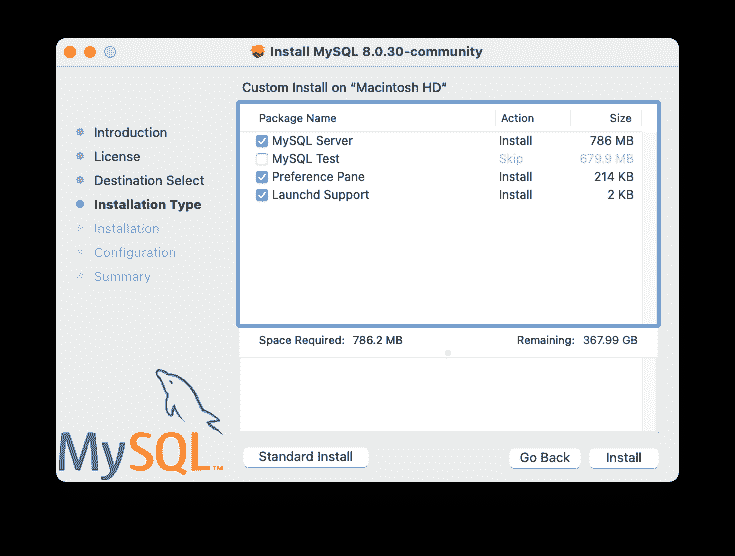

# 2.4.2 使用本机软件包在 macOS 上安装 MySQL

> 原文：[`dev.mysql.com/doc/refman/8.0/en/macos-installation-pkg.html`](https://dev.mysql.com/doc/refman/8.0/en/macos-installation-pkg.html)

软件包位于一个磁盘映像（`.dmg`）文件中，您需要通过在“查找器”中双击其图标来挂载它。然后应该会挂载该映像并显示其内容。

注意

在继续安装之前，请确保通过使用 MySQL 管理应用程序（在 macOS 服务器上）、首选项面板或命令行上的**mysqladmin shutdown**停止所有正在运行的 MySQL 服务器实例。

要使用软件包安装程序安装 MySQL：

1.  下载包含 MySQL 软件包安装程序的磁盘映像（`.dmg`）文件（社区版可在[此处](https://dev.mysql.com/downloads/mysql/)下载）。双击文件以挂载磁盘映像并查看其内容。

    从磁盘双击 MySQL 安装程序包。它的名称根据您下载的 MySQL 版本而定。例如，对于 MySQL 服务器 8.0.36，它的名称可能是`mysql-8.0.36-macos-*`10.13-x86_64`*.pkg`。

1.  初始向导介绍屏幕引用了要安装的 MySQL 服务器版本。点击“继续”开始安装。

    MySQL 社区版显示了相关 GNU 通用公共许可证的副本。点击“继续”，然后同意继续。

1.  从“安装类型”页面，您可以点击“安装”以使用所有默认设置执行安装向导，点击“自定义”以更改要安装的组件（MySQL 服务器、MySQL 测试、首选项面板、Launchd 支持 -- 默认情况下启用所有组件，除了 MySQL 测试）。

    注意

    尽管“更改安装位置”选项可见，但安装位置无法更改。

    **图 2.13 MySQL 软件包安装向导：安装类型**

    

    **图 2.14 MySQL 软件包安装向导：自定义**

    

1.  点击“安装”以安装 MySQL 服务器。如果正在升级当前的 MySQL 服务器安装，则安装过程到此结束，否则按照向导的额外配置步骤为新的 MySQL 服务器安装进行操作。

1.  安装成功后，通过选择密码的默认加密类型、定义根密码，以及在启动时启用（或禁用）MySQL 服务器来完成配置步骤。

1.  默认的 MySQL 8.0 密码机制是`caching_sha2_password`（强），此步骤允许您将其更改为`mysql_native_password`（传统）。

    **图 2.15 MySQL 软件包安装向导：选择密码加密类型**

    

    选择传统密码机制会修改生成的 launchd 文件，将 `--default_authentication_plugin=mysql_native_password` 设置为 `ProgramArguments` 下的值。选择强密码加密不会设置 `--default_authentication_plugin`，因为使用的是默认的 MySQL 服务器值，即 `caching_sha2_password`。

1.  为 root 用户定义密码，并切换 MySQL 服务器是否在配置步骤完成后启动。

    **图 2.16 MySQL 包安装向导：定义根密码**

    

1.  摘要是最后一步，指的是成功和完整的 MySQL 服务器安装。关闭向导。

    **图 2.17 MySQL 包安装向导：摘要**

    

MySQL 服务器现在已安装。如果选择不启动 MySQL，则可以使用命令行中的 launchctl 或通过单击 MySQL 首选项面板中的“启动”来启动 MySQL。有关更多信息，请参阅 第 2.4.3 节，“安装和使用 MySQL Launch Daemon” 和 第 2.4.4 节，“安装和使用 MySQL Preference Pane”。使用 MySQL Preference Pane 或 launchd 配置 MySQL 在启动时自动启动。

使用包安装程序安装时，文件将安装到 `/usr/local` 目录中与安装版本和平台名称匹配的目录中。例如，安装程序文件 `mysql-8.0.36-*`macos10.15-x86_64.dmg`*` 将 MySQL 安装到 `/usr/local/mysql-8.0.36-macos10.15-x86_64/`，并在 `/usr/local/mysql` 中创建符号链接。以下表格显示了此 MySQL 安装目录的布局。

注意

macOS 安装过程不会创建也不会安装示例 `my.cnf` MySQL 配置文件。

**表 2.7 macOS 上的 MySQL 安装布局**

| 目录 | 目录内容 |
| --- | --- |
| `bin` | **mysqld** 服务器、客户端和实用程序 |
| `data` | 日志文件、数据库，其中 `/usr/local/mysql/data/mysqld.local.err` 是默认错误日志 |
| `docs` | 帮助文档，如发布说明和构建信息 |
| `include` | 包含（头）文件 |
| `lib` | 库 |
| `man` | Unix 手册页 |
| `mysql-test` | MySQL 测试套件（在使用安装程序包（DMG）安装过程中，默认情况下会禁用 'MySQL Test'） |
| `share` | 包括错误消息、`dictionary.txt` 和重写 SQL 等各种支持文件 |
| `support-files` | 支持脚本，如 `mysqld_multi.server`、`mysql.server` 和 `mysql-log-rotate`。 |
| `/tmp/mysql.sock` | MySQL Unix 套接字的位置 |
| 目录 | 目录内容 |
