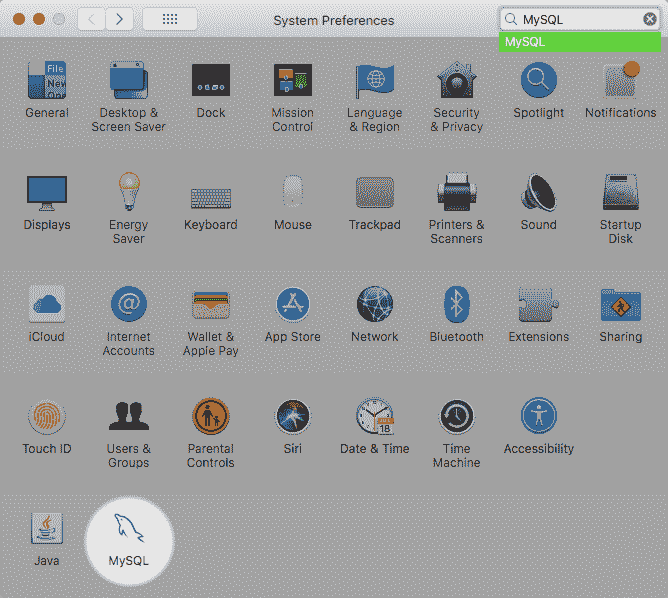

# 2.4.3 安装和使用 MySQL Launch Daemon

> 原文：[`dev.mysql.com/doc/refman/8.0/en/macos-installation-launchd.html`](https://dev.mysql.com/doc/refman/8.0/en/macos-installation-launchd.html)

macOS 使用 launch 守护程序自动启动、停止和管理进程和应用程序，如 MySQL。

默认情况下，macOS 上的安装包（DMG）会安装一个名为`/Library/LaunchDaemons/com.oracle.oss.mysql.mysqld.plist`的 launchd 文件，其中包含类似于以下的 plist 定义：

```sql
<?xml version="1.0" encoding="UTF-8"?>
<!DOCTYPE plist PUBLIC "-//Apple Computer//DTD PLIST 1.0//EN" "http://www.apple.com/DTDs/PropertyList-1.0.dtd">
<plist version="1.0">
<dict>
    <key>Label</key>             <string>com.oracle.oss.mysql.mysqld</string>
    <key>ProcessType</key>       <string>Interactive</string>
    <key>Disabled</key>          <false/>
    <key>RunAtLoad</key>         <true/>
    <key>KeepAlive</key>         <true/>
    <key>SessionCreate</key>     <true/>
    <key>LaunchOnlyOnce</key>    <false/>
    <key>UserName</key>          <string>_mysql</string>
    <key>GroupName</key>         <string>_mysql</string>
    <key>ExitTimeOut</key>       <integer>600</integer>
    <key>Program</key>           <string>/usr/local/mysql/bin/mysqld</string>
    <key>ProgramArguments</key>
        <array>
            <string>/usr/local/mysql/bin/mysqld</string>
            <string>--user=_mysql</string>
            <string>--basedir=/usr/local/mysql</string>
            <string>--datadir=/usr/local/mysql/data</string>
            <string>--plugin-dir=/usr/local/mysql/lib/plugin</string>
            <string>--log-error=/usr/local/mysql/data/mysqld.local.err</string>
            <string>--pid-file=/usr/local/mysql/data/mysqld.local.pid</string>
            <string>--keyring-file-data=/usr/local/mysql/keyring/keyring</string>
            <string>--early-plugin-load=keyring_file=keyring_file.so</string>
        </array>
    <key>WorkingDirectory</key>  <string>/usr/local/mysql</string>
</dict>
</plist>
```

注意

一些用户报告称，添加一个 plist 的 DOCTYPE 声明会导致 launchd 操作失败，尽管它通过了 lint 检查。我们怀疑这是一个复制粘贴错误。包含上述片段的文件的 md5 校验和为*d925f05f6d1b6ee5ce5451b596d6baed*。

要启用 launchd 服务，您可以选择：

+   打开 macOS 系统偏好设置，选择 MySQL 偏好设置面板，然后执行启动 MySQL 服务器。

    **图 2.18 MySQL 偏好设置窗格：位置**

    

    实例页面包括启动或停止 MySQL 的选项，并且初始化数据库会重新创建`data/`目录。卸载会卸载 MySQL 服务器，以及可选地卸载 MySQL 偏好设置面板和 launchd 信息。

    **图 2.19 MySQL 偏好设置窗格：实例**

    

+   或者，手动加载 launchd 文件。

    ```sql
    $> cd /Library/LaunchDaemons
    $> sudo launchctl load -F com.oracle.oss.mysql.mysqld.plist
    ```

+   要配置 MySQL 在启动时自动启动，您可以：

    ```sql
    $> sudo launchctl load -w com.oracle.oss.mysql.mysqld.plist
    ```

注意

在升级 MySQL 服务器时，launchd 安装过程会删除使用 MySQL 服务器 5.7.7 及以下版本安装的旧启动项。

升级还会替换名为`com.oracle.oss.mysql.mysqld.plist`的现有 launchd 文件。

附加的 launchd 相关信息：

+   plist 条目会覆盖`my.cnf`条目，因为它们作为命令行参数传递。有关传递程序选项的更多信息，请参见第 6.2.2 节，“指定程序选项”。

+   **ProgramArguments**部分定义了传递给程序的命令行选项，在这种情况下是`mysqld`二进制文件。

+   默认的 plist 定义是为了更简单的用例而编写的。对于更复杂的设置，您可能希望删除一些参数，而是依赖于 MySQL 配置文件，比如`my.cnf`。

+   如果你编辑了 plist 文件，在重新安装或升级 MySQL 时取消安装程序选项。否则，你编辑过的 plist 文件会被覆盖，所有编辑都会丢失。

因为默认的 plist 定义了几个**ProgramArguments**，你可能会删除大部分这些参数，而是依赖于你的`my.cnf` MySQL 配置文件来定义它们。例如：

```sql
<?xml version="1.0" encoding="UTF-8"?>
<!DOCTYPE plist PUBLIC "-//Apple Computer//DTD PLIST 1.0//EN" "http://www.apple.com/DTDs/PropertyList-1.0.dtd">
<plist version="1.0">
<dict>
    <key>Label</key>             <string>com.oracle.oss.mysql.mysqld</string>
    <key>ProcessType</key>       <string>Interactive</string>
    <key>Disabled</key>          <false/>
    <key>RunAtLoad</key>         <true/>
    <key>KeepAlive</key>         <true/>
    <key>SessionCreate</key>     <true/>
    <key>LaunchOnlyOnce</key>    <false/>
    <key>UserName</key>          <string>_mysql</string>
    <key>GroupName</key>         <string>_mysql</string>
    <key>ExitTimeOut</key>       <integer>600</integer>
    <key>Program</key>           <string>/usr/local/mysql/bin/mysqld</string>
    <key>ProgramArguments</key>
        <array>
            <string>/usr/local/mysql/bin/mysqld</string>
            <string>--user=_mysql</string>
            <string>--basedir=/usr/local/mysql</string>
            <string>--datadir=/usr/local/mysql/data</string>
            <string>--plugin-dir=/usr/local/mysql/lib/plugin</string>
            <string>--log-error=/usr/local/mysql/data/mysqld.local.err</string>
            <string>--pid-file=/usr/local/mysql/data/mysqld.local.pid</string>
            <string>--keyring-file-data=/usr/local/mysql/keyring/keyring</string>
            <string>--early-plugin-load=keyring_file=keyring_file.so</string>
        </array>
    <key>WorkingDirectory</key>  <string>/usr/local/mysql</string>
</dict>
</plist>
```

在这种情况下，`basedir`，`datadir`，`plugin_dir`，`log_error`，`pid_file`，`keyring_file_data`，和`--early-plugin-load` 选项已从默认 plist *ProgramArguments* 定义中删除，你可以在`my.cnf`中定义它们。
