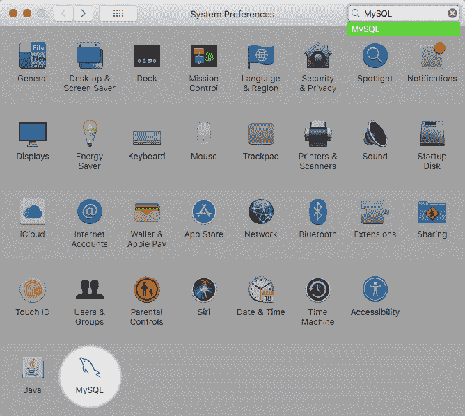
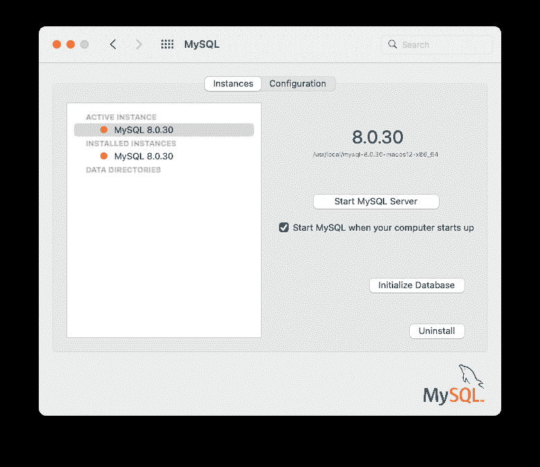
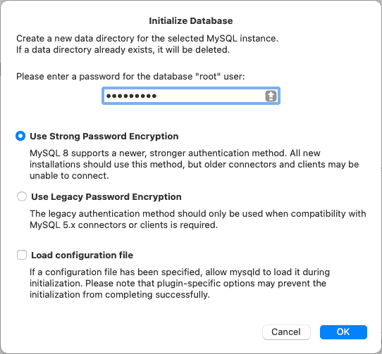
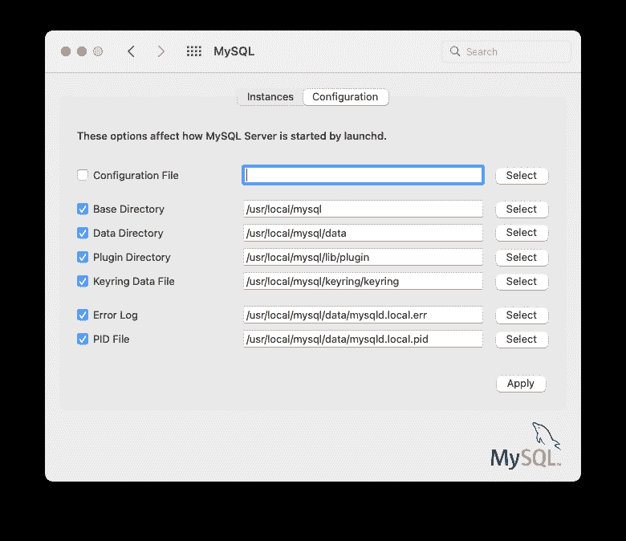

# 2.4.4 安装和使用 MySQL 偏好设置面板

> 原文：[`dev.mysql.com/doc/refman/8.0/en/macos-installation-prefpane.html`](https://dev.mysql.com/doc/refman/8.0/en/macos-installation-prefpane.html)

MySQL 安装包包括一个 MySQL 偏好设置面板，使您能够启动、停止和控制 MySQL 安装在启动时自动启动的过程。

这个偏好设置面板是默认安装的，并列在您系统的*系统偏好设置*窗口下。

**图 2.20 MySQL 偏好设置面板：位置**

MySQL 偏好设置面板与安装 MySQL 服务器的 DMG 文件一起安装。通常它与 MySQL 服务器一起安装，但也可以单独安装。

要安装 MySQL 偏好设置面板：

1.  按照文档中描述的步骤安装 MySQL 服务器，详见 Section 2.4.2, “在 macOS 上使用本机软件包安装 MySQL”。

1.  在安装类型步骤中点击自定义。"偏好设置面板"选项在那里列出并默认启用；确保它没有被取消选择。其他选项，如 MySQL 服务器，可以选择或取消选择。

    **图 2.21 MySQL 软件包安装向导：自定义**

    

1.  完成安装过程。

注意

MySQL 偏好设置面板仅启动和停止从 MySQL 软件包安装的 MySQL 安装，这些安装已安装在默认位置。

一旦安装了 MySQL 偏好设置面板，您可以使用此偏好设置面板控制您的 MySQL 服务器实例。

实例页面包括一个选项来启动或停止 MySQL，并且初始化数据库重新创建`data/`目录。卸载卸载 MySQL 服务器和可选的 MySQL 偏好设置面板和 launchd 信息。

**图 2.22 MySQL 偏好设置面板：实例**

**图 2.23 MySQL 偏好设置面板：初始化数据库**

配置页面显示 MySQL 服务器选项，包括 MySQL 配置文件的路径。

**图 2.24 MySQL 偏好设置窗格：配置**

MySQL 偏好设置窗格显示 MySQL 服务器的当前状态，如果服务器未运行，则显示停止（红色），如果服务器已经启动，则显示运行（绿色）。偏好设置窗格还显示了 MySQL 服务器是否已设置为自动启动的当前设置。
