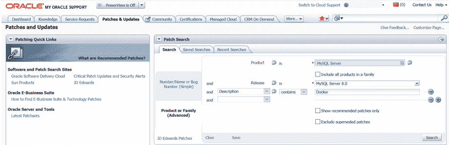

> 原文：[`dev.mysql.com/doc/refman/8.0/en/docker-mysql-getting-started.html`](https://dev.mysql.com/doc/refman/8.0/en/docker-mysql-getting-started.html)

#### 2.5.6.1 使用 Docker 部署 MySQL 服务器的基本步骤

警告

MySQL 团队维护的 MySQL Docker 镜像专为 Linux 平台构建。不支持其他平台，使用这些 MySQL Docker 镜像的用户自担风险。请参阅这里的讨论以了解在非 Linux 操作系统上运行这些容器的一些已知限制。

+   下载 MySQL 服务器 Docker 镜像

+   启动 MySQL 服务器实例

+   从容器内部连接到 MySQL 服务器

+   容器 Shell 访问

+   停止和删除 MySQL 容器

+   升级 MySQL 服务器容器

+   使用 Docker 部署 MySQL 服务器的更多主题

##### 下载 MySQL 服务器 Docker 镜像

重要

*对于 MySQL 企业版用户*：使用 Docker 镜像需要订阅 MySQL 企业版。订阅采用自带许可证模式；详细信息请参阅[如何购买 MySQL 产品和服务](https://www.mysql.com/buy-mysql/)。

在单独的步骤中下载服务器镜像并不是绝对必要的；但是，在创建 Docker 容器之前执行此步骤可以确保您的本地镜像是最新的。要从[Oracle 容器注册表（OCR）](https://container-registry.oracle.com/)下载 MySQL 社区版镜像，请运行以下命令：

```sql
docker pull container-registry.oracle.com/mysql/community-server:*tag*
```

*`tag`*是您想要拉取的镜像版本的标签（例如，`5.7`，`8.0`或`latest`）。如果**`:*`tag`*`**被省略，则使用`latest`标签，并下载 MySQL 社区服务器最新 GA 版本的镜像。

要从 OCR 下载 MySQL 企业版镜像，您需要首先在 OCR 上接受许可协议，并使用 Docker 客户端登录到容器仓库。请按照以下步骤操作：

+   访问 OCR 网站[`container-registry.oracle.com/`](https://container-registry.oracle.com/)并选择 MySQL。

+   在 MySQL 仓库列表中选择`enterprise-server`。

+   如果您尚未登录到 OCR，请点击页面右侧的“登录”按钮，然后在提示时输入您的 Oracle 帐户凭据。

+   按照页面右侧的说明接受许可协议。

+   使用例如 `docker login` 命令登录到 OCR 客户端：

    ```sql
    # docker login container-registry.oracle.com 
    Username: *Oracle-Account-ID*
    Password: *password*
    Login successful.
    ```

使用以下命令从 OCR 下载 MySQL Enterprise Edition 镜像：

```sql
docker pull  container-registry.oracle.com/mysql/enterprise-server:*tag*
```

要从[My Oracle Support](https://support.oracle.com/)网站下载 MySQL Enterprise Edition 镜像，请进入网站，登录到您的 Oracle 帐户，然后在登陆页面执行以下步骤：

+   选择“补丁和更新”选项卡。

+   转到“补丁搜索”区域，在“搜索”选项卡上切换到“产品”或“家族（高级）”子选项卡。

+   在“产品”字段中输入“MySQL Server”，在“版本”字段中输入所需的版本号。

+   使用下拉菜单进行额外的筛选以选择“描述—包含”，并在文本字段中输入“Docker”。

    下图显示了 MySQL Server 8.0 的 MySQL Enterprise Edition 镜像的搜索设置：

    

+   点击“搜索”按钮，从结果列表中选择您想要的版本，然后点击“下载”按钮。

+   在弹出的文件下载对话框中，点击并下载 Docker 镜像的 `.zip` 文件。

解压下载的 `.zip` 存档以获取内部的 tarball（`mysql-enterprise-server-*`version`*.tar`），然后运行以下命令加载镜像：

```sql
docker load -i mysql-enterprise-server-*version*.tar
```

您可以使用以下命令列出已下载的 Docker 镜像：

```sql
$> docker images
REPOSITORY                                             TAG       IMAGE ID       CREATED        SIZE
container-registry.oracle.com/mysql/community-server   latest    1d9c2219ff69   2 months ago   496MB
```

##### 启动 MySQL 服务器实例

要为 MySQL Server 启动一个新的 Docker 容器，请使用以下命令：

```sql
docker run --name=*container_name*  --restart on-failure -d *image_name*:*tag*
```

*`image_name`* 是要用来启动容器的镜像名称；请参阅下载 MySQL 服务器 Docker 镜像获取更多信息。

`--name` 选项用于为您的服务器容器提供自定义名称，是可选的；如果未提供容器名称，则会生成一个随机名称。

`--restart` 选项用于配置容器的[重启策略](https://docs.docker.com/config/containers/start-containers-automatically/)；它应设置为值`on-failure`，以启用在客户端会话中支持服务器重启（例如，当客户端执行 RESTART 语句或在配置 InnoDB 集群实例期间发生时）。启用重启支持后，在客户端会话中发出重启命令会导致服务器和容器停止然后重新启动。*MySQL 8.0.21 及更高版本支持服务器重启。*

例如，要启动一个新的 MySQL Community Server 的 Docker 容器，请使用以下命令：

```sql
docker run --name=mysql1 --restart on-failure -d container-registry.oracle.com/mysql/community-server:latest
```

要使用从 OCR 下载的 Docker 镜像启动 MySQL Enterprise Server 的新 Docker 容器，请使用此命令：

```sql
docker run --name=mysql1 --restart on-failure -d container-registry.oracle.com/mysql/enterprise-server:latest
```

要使用从 My Oracle Support 下载的 Docker 镜像启动 MySQL Enterprise Server 的新 Docker 容器，请使用此命令：

```sql
docker run --name=mysql1 --restart on-failure -d mysql/enterprise-server:latest
```

如果指定名称和标签的 Docker 镜像尚未通过早期的**docker pull**或**docker run**命令下载，那么现在将下载该镜像。容器的初始化开始，并且当你运行**docker ps**命令时，容器将出现在正在运行的容器列表中。例如：

```sql
$> docker ps
CONTAINER ID   IMAGE                                                         COMMAND                  CREATED          STATUS                    PORTS                       NAMES
4cd4129b3211   container-registry.oracle.com/mysql/community-server:latest   "/entrypoint.sh mysq…"   8 seconds ago    Up 7 seconds (health: starting)   3306/tcp, 33060-33061/tcp   mysql1
```

容器初始化可能需要一些时间。当服务器准备就绪时，**docker ps**命令输出中容器的`STATUS`从`(health: starting)`变为`(healthy)`。

上述**docker run**命令中使用的`-d`选项使容器在后台运行。使用此命令监视容器的输出：

```sql
docker logs mysql1
```

一旦初始化完成，命令的输出将包含为 root 用户生成的随机密码；例如，使用此命令检查密码：

```sql
$> docker logs mysql1 2>&1 | grep GENERATED
GENERATED ROOT PASSWORD: Axegh3kAJyDLaRuBemecis&EShOs
```

##### 从容器内连接到 MySQL 服务器

一旦服务器准备就绪，你可以在刚刚启动的 MySQL 服务器容器内运行**mysql**客户端，并连接到 MySQL 服务器。使用**docker exec -it**命令在你启动的 Docker 容器内启动**mysql**客户端，如下所示：

```sql
docker exec -it mysql1 mysql -uroot -p
```

当询问时，请输入生成的 root 密码（请参阅启动 MySQL 服务器实例中如何找到密码的最后一步）。因为`MYSQL_ONETIME_PASSWORD`选项默认为 true，在连接到服务器的**mysql**客户端后，你必须通过发出此语句重置服务器 root 密码：

```sql
mysql> ALTER USER 'root'@'localhost' IDENTIFIED BY '*password*';
```

用你选择的密码替换*`password`*。一旦密码重置，服务器就可以使用了。

##### 容器 Shell 访问

要访问你的 MySQL 服务器容器的 shell，请使用**docker exec -it**命令在容器内启动一个 bash shell：

```sql
$> docker exec -it mysql1 bash
bash-4.2#
```

然后你可以在容器内运行 Linux 命令。例如，要查看容器内服务器数据目录中的内容，请使用此命令：

```sql
bash-4.2# ls /var/lib/mysql
auto.cnf    ca.pem	     client-key.pem  ib_logfile0  ibdata1  mysql       mysql.sock.lock	   private_key.pem  server-cert.pem  sys
ca-key.pem  client-cert.pem  ib_buffer_pool  ib_logfile1  ibtmp1   mysql.sock  performance_schema  public_key.pem   server-key.pem
```

##### 停止和删除 MySQL 容器

要停止我们创建的 MySQL 服务器容器，请使用此命令：

```sql
docker stop mysql1
```

**docker stop**向**mysqld**进程发送 SIGTERM 信号，以便服务器正常关闭。

还要注意，当容器的主要进程（在 MySQL 服务器容器的情况下为**mysqld**）停止时，Docker 容器会自动停止。

要再次启动 MySQL 服务器容器：

```sql
docker start mysql1
```

要一次性停止和重新启动 MySQL 服务器容器：

```sql
docker restart mysql1
```

要删除 MySQL 容器，首先停止它，然后使用**docker rm**命令：

```sql
docker stop mysql1
```

```sql
docker rm mysql1
```

如果希望同时删除服务器数据目录的 Docker 卷，请在**docker rm**命令中添加`-v`选项。

##### 升级 MySQL 服务器容器

重要提示

+   在对 MySQL 进行任何升级之前，请仔细遵循第三章，*升级 MySQL*中的说明。在那里讨论的其他说明中，特别重要的是在升级之前备份数据库。

+   本节中的说明要求服务器的数据和配置已经在主机上持久化。详细信息请参见持久化数据和配置更改。

按照以下步骤将 Docker 安装的 MySQL 5.7 升级到 8.0：

+   停止 MySQL 5.7 服务器（在此示例中容器名称为`mysql57`）：

    ```sql
    docker stop mysql57
    ```

+   下载 MySQL 8.0 服务器 Docker 镜像。请参见下载 MySQL 服务器 Docker 镜像中的说明。确保使用正确的 MySQL 8.0 标签。

+   使用旧服务器数据和配置（如果需要进行适当修改，请参见第三章，*升级 MySQL*）在主机上持久化（在此示例中通过[绑定挂载](https://docs.docker.com/engine/reference/commandline/service_create/#add-bind-mounts-or-volumes)）。对于 MySQL Community Server，请运行以下命令：

    ```sql
    docker run --name=mysql80 \
       --mount type=bind,src=/path-on-host-machine/my.cnf,dst=/etc/my.cnf \
       --mount type=bind,src=/path-on-host-machine/datadir,dst=/var/lib/mysql \
       -d container-registry.oracle.com/mysql/community-server:8.0
    ```

    如果需要，将`container-registry.oracle.com/mysql/community-server`调整为正确的镜像名称，例如，从 OCR 下载的 MySQL Enterprise Edition 镜像替换为`container-registry.oracle.com/mysql/enterprise-server`，或者从 My Oracle Support 下载的 MySQL Enterprise Edition 镜像替换为`mysql/enterprise-server`。

+   等待服务器完成启动。您可以使用**docker ps**命令（请参见启动 MySQL 服务器实例）来检查服务器的状态。

对于在 8.0 系列内升级（即从版本 8.0.*`x`* 到 8.0.*`y`*）的相同步骤：停止原始容器，然后在旧服务器数据和配置上启动一个新容器。如果您在启动原始容器时使用了 `8.0` 或 `latest` 标签，并且现在有一个新的 MySQL 8.0 版本需要升级，您必须首先使用以下命令拉取新版本的镜像：

```sql
docker pull container-registry.oracle.com/mysql/community-server:8.0
```

然后，您可以通过在旧数据和配置上启动一个*新*容器来升级（如果您使用的是 MySQL 企业版，请调整镜像名称；请参阅下载 MySQL 服务器 Docker 镜像)：

```sql
docker run --name=mysql80new \
   --mount type=bind,src=/path-on-host-machine/my.cnf,dst=/etc/my.cnf \
   --mount type=bind,src=/path-on-host-machine/datadir,dst=/var/lib/mysql \
-d container-registry.oracle.com/mysql/community-server:8.0
```

注意

*对于 MySQL 8.0.15 及更早版本：* 您需要通过在 MySQL 8.0 服务器容器中运行 mysql_upgrade 实用程序来完成升级过程（对于 MySQL 8.0.16 及更高版本，此步骤*不*需要）。

+   ```sql
    docker exec -it mysql80 mysql_upgrade -uroot -p
    ```

    在提示时，输入旧服务器的 root 密码。

+   通过重新启动新容器完成升级：

    ```sql
    docker restart mysql80
    ```

##### 使用 Docker 部署 MySQL 服务器的更多主题

有关使用 Docker 部署 MySQL 服务器的更多主题，如服务器配置、持久化数据和配置、服务器错误日志和容器环境变量，请参阅第 2.5.6.2 节，“使用 Docker 部署 MySQL 服务器的更多主题”。
