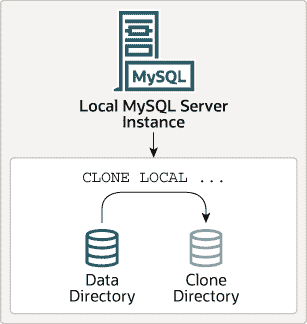
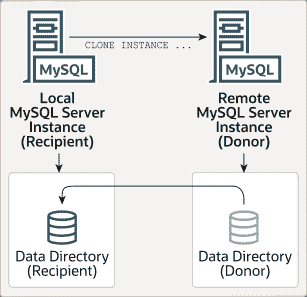

# 7.6.7 克隆插件

> 原文：[`dev.mysql.com/doc/refman/8.0/en/clone-plugin.html`](https://dev.mysql.com/doc/refman/8.0/en/clone-plugin.html)

7.6.7.1 安装克隆插件

7.6.7.2 本地克隆数据

7.6.7.3 克隆远程数据

7.6.7.4 克隆和并发 DDL

7.6.7.5 克隆加密数据

7.6.7.6 克隆压缩数据

7.6.7.7 用于复制的克隆

7.6.7.8 克隆操作期间创建的目录和文件

7.6.7.9 处理远程克隆操作失败

7.6.7.10 监控克隆操作

7.6.7.11 停止克隆操作

7.6.7.12 克隆系统变量参考

7.6.7.13 克隆系统变量

7.6.7.14 克隆插件限制

克隆插件，引入于 MySQL 8.0.17，允许在本地或从远程 MySQL 服务器实例克隆数据。克隆数据是存储在 `InnoDB` 中的数据的物理快照，包括模式、表、表空间和数据字典元数据。克隆数据包括一个完全功能的数据目录，允许使用克隆插件进行 MySQL 服务器的配置。

**图 7.1 本地克隆操作**

本地克隆操作将数据从启动克隆操作的 MySQL 服务器实例克隆到运行 MySQL 服务器实例的同一服务器或节点上的目录。

**图 7.2 远程克隆操作**

远程克隆操作涉及本地 MySQL 服务器实例（“接收方”），在该实例上启动克隆操作，并远程 MySQL 服务器实例（“捐赠方”），源数据位于该实例上。当在接收方上启动远程克隆操作时，克隆数据通过网络从捐赠方传输到接收方。默认情况下，远程克隆操作会在从捐赠方克隆数据之前，从接收方数据目录中删除现有的用户创建的数据（模式、表、表空间）和二进制日志。可选地，您可以将数据克隆到接收方的不同目录，以避免从当前接收方数据目录中删除数据。

通过本地克隆操作克隆的数据与通过远程克隆操作克隆的数据没有任何区别。这两种操作都会克隆相同的数据集。

克隆插件支持复制。除了克隆数据外，克隆操作还会从捐赠者中提取和传输复制坐标，并在接收者上应用这些坐标，从而使克隆插件能够为配置组复制成员和副本提供服务。使用克隆插件进行配置比复制大量事务要快得多且更有效（请参阅第 7.6.7.7 节，“用于复制的克隆”）。组复制成员还可以配置为使用克隆插件作为恢复的替代方法，以便成员自动选择从种子成员检索组数据的最有效方式。有关更多信息，请参阅第 20.5.4.2 节，“用于分布式恢复的克隆”。

克隆插件支持克隆加密和页面压缩的数据。请参阅第 7.6.7.5 节，“克隆加密数据”，以及第 7.6.7.6 节，“克隆压缩数据”。

在使用克隆插件之前，必须先安装它。有关安装说明，请参阅第 7.6.7.1 节，“安装克隆插件”。有关克隆说明，请参阅第 7.6.7.2 节，“本地数据克隆”，以及第 7.6.7.3 节，“远程数据克隆”。

提供了用于监视克隆操作的性能模式表和工具。请参阅第 7.6.7.10 节，“监视克隆操作”。
