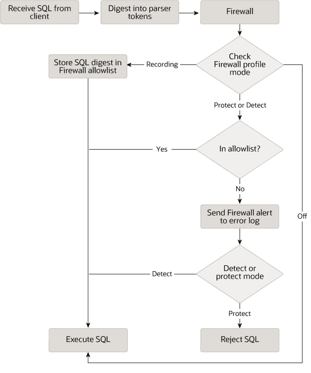

# 8.4.7 MySQL 企业防火墙

> 原文：[`dev.mysql.com/doc/refman/8.0/en/firewall.html`](https://dev.mysql.com/doc/refman/8.0/en/firewall.html)

8.4.7.1 MySQL 企业防火墙元素

8.4.7.2 安装或卸载 MySQL 企业防火墙

8.4.7.3 使用 MySQL 企业防火墙

8.4.7.4 MySQL 企业防火墙参考

注意

MySQL 企业防火墙是 MySQL 企业版中包含的一个扩展，是一款商业产品。要了解更多关于商业产品的信息，请参见[`www.mysql.com/products/`](https://www.mysql.com/products/)。

MySQL 企业版包括 MySQL 企业防火墙，这是一个应用级防火墙，允许数据库管理员根据匹配接受的语句模式列表来允许或拒绝 SQL 语句的执行。这有助于加固 MySQL 服务器，防止 SQL 注入等攻击或试图利用应用程序以外的合法查询工作负载特征。

注册到防火墙的每个 MySQL 账户都有自己的语句允许列表，可以根据账户进行定制保护。对于给定的账户，防火墙可以在记录、保护或检测模式下运行，用于训练接受的语句模式、主动保护不可接受的语句或被动检测不可接受的语句。该图示说明了防火墙在每种模式下如何处理传入的语句。

**图 8.1 MySQL 企业防火墙操作**

以下各节描述了 MySQL 企业防火墙的元素，讨论了如何安装和使用它，并为其元素提供参考信息。
