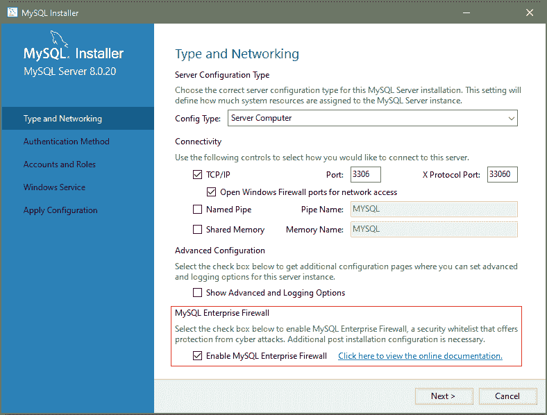

> 原文：[`dev.mysql.com/doc/refman/8.0/en/firewall-installation.html`](https://dev.mysql.com/doc/refman/8.0/en/firewall-installation.html)

#### 8.4.7.2 安装或卸载 MySQL 企业防火墙

MySQL 企业防火墙安装是一次性操作，安装了 第 8.4.7.1 节，“MySQL 企业防火墙的元素” 中描述的元素。安装可以使用图形界面或手动进行：

+   在 Windows 上，MySQL 安装程序包括一个选项，可以为您启用 MySQL 企业防火墙。

+   MySQL Workbench 6.3.4 或更高版本可以安装 MySQL 企业防火墙，启用或禁用已安装的防火墙，或卸载防火墙。

+   手动安装 MySQL 企业防火墙涉及运行位于 MySQL 安装的 `share` 目录中的脚本。

重要

在按照本节的说明之前，请阅读整个部分。根据您的环境，步骤的某些部分可能有所不同。

注意

如果安装了 MySQL 企业防火墙，即使禁用了，也会带来一些最小的开销。为避免这种开销，请不要安装防火墙，除非您打算使用它。

有关使用说明，请参阅 第 8.4.7.3 节，“使用 MySQL 企业防火墙”。有关参考信息，请参阅 第 8.4.7.4 节，“MySQL 企业防火墙参考”。

+   安装 MySQL 企业防火墙

+   卸载 MySQL 企业防火墙

##### 安装 MySQL 企业防火墙

如果 MySQL 企业防火墙已经从较旧版本的 MySQL 安装，使用本节后面给出的说明卸载它，然后在安装当前版本之前重新启动服务器。在这种情况下，还需要重新注册您的配置。

在 Windows 上，您可以使用 MySQL 安装程序来安装 MySQL 企业防火墙，如 图 8.2，“Windows 上的 MySQL 企业防火墙安装” 所示。勾选启用 MySQL 企业防火墙复选框。（为网络访问打开防火墙端口有不同的目的。它指的是 Windows 防火墙，并控制 Windows 是否阻止 MySQL 服务器用于客户端连接的 TCP/IP 端口。）

重要

对于使用 MySQL 安装程序安装的 MySQL 8.0.19 存在一个问题，如果在服务器配置步骤中选择了 MySQL 企业防火墙，则会阻止服务器启动。如果服务器启动操作失败，请单击“取消”以结束配置过程并返回仪表板。您必须卸载服务器。

解决方法是在没有选择 MySQL 企业防火墙的情况下运行 MySQL 安装程序。（即，不要选择启用 MySQL 企业防火墙复选框。）然后按照本节后面的手动安装说明安装 MySQL 企业防火墙。这个问题在 MySQL 8.0.20 中已经得到修正。

**图 8.2 Windows 上的 MySQL 企业防火墙安装**



要使用 MySQL Workbench 6.3.4 或更高版本安装 MySQL 企业防火墙，请参阅 MySQL 企业防火墙界面。

要手动安装 MySQL 企业防火墙，请查看 MySQL 安装的`share`目录，并选择适合您平台的脚本。可用的脚本在用于引用脚本的文件名上有所不同：

+   `win_install_firewall.sql`

+   `linux_install_firewall.sql`

安装脚本在默认数据库`mysql`中创建存储过程。在命令行上运行脚本如下。这里的示例使用 Linux 安装脚本。对于您的系统进行适当的替换。

```sql
$> mysql -u root -p < linux_install_firewall.sql
Enter password: *(enter root password here)*
```

注意

要在源/副本复制、组复制或 InnoDB 集群的上下文中使用 MySQL 企业防火墙，必须在在源节点上运行安装脚本之前准备好副本节点。这是必要的，因为脚本中的`INSTALL PLUGIN`语句不会被复制。

1.  在每个副本节点上，从安装脚本中提取`INSTALL PLUGIN`语句，并手动执行它们。

1.  在源节点上，按照前面描述的方式运行安装脚本。

使用图形界面或手动安装 MySQL 企业防火墙应该启用防火墙。要验证，请连接到服务器并执行此语句：

```sql
mysql> SHOW GLOBAL VARIABLES LIKE 'mysql_firewall_mode';
+---------------------+-------+
| Variable_name       | Value |
+---------------------+-------+
| mysql_firewall_mode | ON    |
+---------------------+-------+
```

如果插件初始化失败，请检查服务器错误日志以获取诊断消息。

##### 卸载 MySQL 企业防火墙

MySQL 企业防火墙可以使用 MySQL Workbench 或手动卸载。

要使用 MySQL Workbench 6.3.4 或更高版本卸载 MySQL 企业防火墙，请参阅 MySQL 企业防火墙界面，在第三十三章，*MySQL Workbench*中。

要手动卸载 MySQL 企业防火墙，请执行以下语句。语句使用`IF EXISTS`，因为根据先前安装的防火墙版本，一些对象可能不存在，或者通过卸载安装它们的插件而被隐式删除。

```sql
DROP TABLE IF EXISTS mysql.firewall_group_allowlist;
DROP TABLE IF EXISTS mysql.firewall_groups;
DROP TABLE IF EXISTS mysql.firewall_membership;
DROP TABLE IF EXISTS mysql.firewall_users;
DROP TABLE IF EXISTS mysql.firewall_whitelist;

UNINSTALL PLUGIN MYSQL_FIREWALL;
UNINSTALL PLUGIN MYSQL_FIREWALL_USERS;
UNINSTALL PLUGIN MYSQL_FIREWALL_WHITELIST;

DROP FUNCTION IF EXISTS firewall_group_delist;
DROP FUNCTION IF EXISTS firewall_group_enlist;
DROP FUNCTION IF EXISTS mysql_firewall_flush_status;
DROP FUNCTION IF EXISTS normalize_statement;
DROP FUNCTION IF EXISTS read_firewall_group_allowlist;
DROP FUNCTION IF EXISTS read_firewall_groups;
DROP FUNCTION IF EXISTS read_firewall_users;
DROP FUNCTION IF EXISTS read_firewall_whitelist;
DROP FUNCTION IF EXISTS set_firewall_group_mode;
DROP FUNCTION IF EXISTS set_firewall_mode;

DROP PROCEDURE IF EXISTS mysql.sp_firewall_group_delist;
DROP PROCEDURE IF EXISTS mysql.sp_firewall_group_enlist;
DROP PROCEDURE IF EXISTS mysql.sp_reload_firewall_group_rules;
DROP PROCEDURE IF EXISTS mysql.sp_reload_firewall_rules;
DROP PROCEDURE IF EXISTS mysql.sp_set_firewall_group_mode;
DROP PROCEDURE IF EXISTS mysql.sp_set_firewall_group_mode_and_user;
DROP PROCEDURE IF EXISTS mysql.sp_set_firewall_mode;
DROP PROCEDURE IF EXISTS mysql.sp_migrate_firewall_user_to_group;
```
