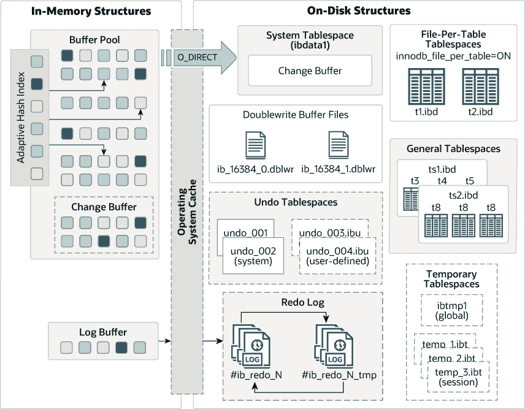

# 17.4 InnoDB 架构

> 原文：[`dev.mysql.com/doc/refman/8.0/en/innodb-architecture.html`](https://dev.mysql.com/doc/refman/8.0/en/innodb-architecture.html)

以下图表显示了组成`InnoDB`存储引擎架构的内存和磁盘结构。有关每个结构的信息，请参见第 17.5 节，“InnoDB 内存结构”和第 17.6 节，“InnoDB 磁盘结构”。

**图 17.1 InnoDB 架构**

