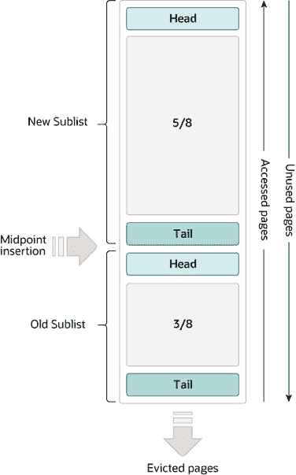

# 17.5.1 缓冲池

> 原文：[`dev.mysql.com/doc/refman/8.0/en/innodb-buffer-pool.html`](https://dev.mysql.com/doc/refman/8.0/en/innodb-buffer-pool.html)

缓冲池是主内存中的一个区域，`InnoDB`在访问时缓存表和索引数据。缓冲池允许频繁使用的数据直接从内存中访问，从而加快处理速度。在专用服务器上，通常将物理内存的高达 80%分配给缓冲池。

为了高效处理高容量读操作，缓冲池被划分为可以潜在地容纳多行的页面。为了高效管理缓存，缓冲池被实现为页面的链表；很少使用的数据通过最近最少使用（LRU）算法的变体从缓存中淘汰。

知道如何利用缓冲池将频繁访问的数据保留在内存中是 MySQL 调优的重要方面。

#### 缓冲池 LRU 算法

缓冲池使用 LRU 算法的变体作为列表进行管理。当需要空间将新页面添加到缓冲池时，最近最少使用的页面会被驱逐，并在列表的中间添加新页面。这种中点插入策略将列表视为两个子列表：

+   在头部，是最近访问的新（“年轻”）页面的子列表

+   在尾部，是最近访问较少的旧页面的子列表

**图 17.2 缓冲池列表**



该算法将频繁使用的页面保留在新子列表中。旧子列表包含不太频繁使用的页面；这些页面是驱逐的候选页面。

默认情况下，算法的操作如下：

+   缓冲池的 3/8 专门用于旧子列表。

+   列表的中点是新子列表的尾部与旧子列表的头部相遇的边界。

+   当`InnoDB`将页面读入缓冲池时，它最初将其插入到中点（旧子列表的头部）。页面可以被读取，因为它是用户发起的操作（如 SQL 查询）所需，或者作为`InnoDB`自动执行的预读取操作的一部分。

+   访问旧子列表中的页面会使其“年轻”，将其移动到新子列表的头部。如果页面是因为用户发起的操作而被读取，第一次访问会立即发生并使页面变为年轻。如果页面是由于预读取操作而被读取，第一次访问不会立即发生，并且在页面被驱逐之前可能根本不会发生。

+   随着数据库的运行，缓冲池中未被访问的页面会“老化”，向列表的尾部移动。随着其他页面变为新页面，新旧子列表中的页面都会老化。随着页面在中点插入，旧子列表中的页面也会老化。最终，一个保持未使用状态的页面到达旧子列表的尾部并被驱逐。

默认情况下，由查询读取的页面立即移动到新子列表中，这意味着它们在缓冲池中停留的时间更长。例如，为了进行**mysqldump**操作或没有`WHERE`子句的`SELECT`语句执行表扫描，可能会将大量数据带入缓冲池并驱逐相同数量的旧数据，即使新数据永远不会再次使用。类似地，由预读后台线程加载并仅访问一次的页面被移动到新列表的开头。这些情况可能会将经常使用的页面推到旧子列表，使其成为可能被驱逐的对象。有关优化此行为的信息，请参见第 17.8.3.3 节，“使缓冲池具有扫描抵抗性”和第 17.8.3.4 节，“配置 InnoDB 缓冲池预取（预读）”。

`InnoDB`标准监视器输出包含关于缓冲池 LRU 算法操作的`BUFFER POOL AND MEMORY`部分中的几个字段。详情请参见使用 InnoDB 标准监视器监视缓冲池。

#### 缓冲池配置

您可以配置缓冲池的各个方面以提高性能。

+   理想情况下，您应将缓冲池的大小设置为尽可能大的值，同时留出足够的内存供服务器上的其他进程运行，以避免过多的分页。缓冲池越大，`InnoDB`就越像一个内存数据库，从磁盘读取数据一次，然后在后续读取中从内存访问数据。请参见第 17.8.3.1 节，“配置 InnoDB 缓冲池大小”。

+   在具有足够内存的 64 位系统上，您可以将缓冲池分割为多个部分，以减少并发操作之间对内存结构的争用。详情请参见第 17.8.3.2 节，“配置多个缓冲池实例”。

+   无论有大量不经常访问的数据进入缓冲池的操作突然激增，您都可以将经常访问的数据保留在内存中。详情请参见第 17.8.3.3 节，“使缓冲池具有扫描抵抗性”。

+   您可以控制何时以及如何执行预读取请求，以异步地将页面预取到缓冲池中，以便提前满足对它们的需求。有关详细信息，请参见第 17.8.3.4 节，“配置 InnoDB 缓冲池预读取（预读取）”。

+   您可以控制后台刷新发生的时间以及刷新速率是否根据工作负载动态调整。有关详细信息，请参见第 17.8.3.5 节，“配置缓冲池刷新”。

+   您可以配置`InnoDB`如何保留当前缓冲池状态，以避免服务器重新启动后出现漫长的热身期。有关详细信息，请参见第 17.8.3.6 节，“保存和恢复缓冲池状态”。

#### 使用 InnoDB 标准监视器监视缓冲池

`InnoDB`标准监视器输出可以通过`SHOW ENGINE INNODB STATUS`访问，提供有关缓冲池操作的指标。缓冲池指标位于`InnoDB`标准监视器输出的`BUFFER POOL AND MEMORY`部分：

```sql
----------------------
BUFFER POOL AND MEMORY
----------------------
Total large memory allocated 2198863872
Dictionary memory allocated 776332
Buffer pool size   131072
Free buffers       124908
Database pages     5720
Old database pages 2071
Modified db pages  910
Pending reads 0
Pending writes: LRU 0, flush list 0, single page 0
Pages made young 4, not young 0
0.10 youngs/s, 0.00 non-youngs/s
Pages read 197, created 5523, written 5060
0.00 reads/s, 190.89 creates/s, 244.94 writes/s
Buffer pool hit rate 1000 / 1000, young-making rate 0 / 1000 not
0 / 1000
Pages read ahead 0.00/s, evicted without access 0.00/s, Random read
ahead 0.00/s
LRU len: 5720, unzip_LRU len: 0
I/O sum[0]:cur[0], unzip sum[0]:cur[0]
```

以下表格描述了`InnoDB`标准监视器报告的缓冲池指标。

`InnoDB`标准监视器输出中提供的每秒平均值是基于自上次打印`InnoDB`标准监视器输出以来的经过时间。

**表 17.2 InnoDB 缓冲池指标**

| 名称 | 描述 |
| --- | --- |
| 总分配内存 | 缓冲池分配的总内存（以字节为单位）。 |
| 分配的字典内存 | `InnoDB`数据字典分配的总内存（以字节为单位）。 |
| 缓冲池大小 | 分配给缓冲池的总页数。 |
| 空闲缓冲区 | 缓冲池空闲列表的总页数。 |
| 数据库页面 | 缓冲池 LRU 列表的总页数。 |
| 旧数据库页面 | 缓冲池旧 LRU 子列表的总页数。 |
| 修改的数据库页面 | 缓冲池中当前修改的页面数。 |
| 待读取 | 等待读入缓冲池的缓冲池页面数。 |
| 待写入 LRU | 缓冲池中旧脏页的数量，将从 LRU 列表底部写入。 |
| 待写入刷新列表 | 在检查点期间刷新的缓冲池页面数。 |
| 待写入单页 | 缓冲池内独立页面写入的待处理数量。 |
| 年轻化的页面 | 缓冲池 LRU 列表中年轻化的页面总数（移动到“新”页面子列表的头部）。 |
| 未年轻化的页面 | 缓冲池 LRU 列表中未年轻化的页面总数（保持在“旧”子列表中未年轻化的页面）。 |
| 年轻化/s | 缓冲池 LRU 列表中对旧页面的每秒平均访问次数，导致页面变年轻。有关更多信息，请参阅表后的注释。 |
| 非年轻化/s | 缓冲池 LRU 列表中对旧页面的每秒平均访问次数，导致页面不变年轻。有关更多信息，请参阅表后的注释。 |
| 读取的页面 | 从缓冲池中读取的页面总数。 |
| 创建的页面 | 在缓冲池内创建的页面总数。 |
| 写入的页面 | 从缓冲池中写入的页面总数。 |
| 读取/s | 每秒缓冲池页面读取的平均数量。 |
| 创建/s | 每秒创建的缓冲池页面的平均数量。 |
| 写入/s | 每秒缓冲池页面写入的平均数量。 |
| 缓冲池命中率 | 从缓冲池读取的页面与从磁盘存储读取的页面的缓冲池页面命中率。 |
| 年轻化率 | 页面访问导致页面变年轻的平均命中率。有关更多信息，请参阅表后的注释。 |
| 非（年轻化率） | 页面访问未导致页面变年轻的平均命中率。有关更多信息，请参阅表后的注释。 |
| 预读取的页面 | 预读取操作的每秒平均次数。 |
| 未访问而被驱逐的页面 | 每秒从缓冲池中未被访问而被驱逐的页面的平均数量。 |
| 随机读取预读 | 随机读取预读操作的每秒平均次数。 |
| LRU 长度 | 缓冲池 LRU 列表的总大小（以页面为单位）。 |
| unzip_LRU 长度 | 缓冲池 unzip_LRU 列表的长度（以页面为单位）。 |
| I/O sum | 访问的缓冲池 LRU 列表页面总数。 |
| I/O cur | 当前间隔内访问的缓冲池 LRU 列表页面总数。 |
| I/O unzip sum | 解压缩的缓冲池 unzip_LRU 列表页面总数。 |
| I/O unzip cur | 当前间隔内解压缩缓冲池 unzip_LRU 列表页面的总数。 |
| 名称 | 描述 |

**注释**:

+   `youngs/s` 指标仅适用于旧页面。它基于页面访问次数。对于给定页面可能有多次访问，所有这些访问都会计数。如果在没有进行大型扫描时看到非常低的 `youngs/s` 值，请考虑减少延迟时间或增加用于旧子列表的缓冲池百分比。增加百分比会使旧子列表变大，使得该子列表中的页面移动到尾部所需的时间更长，从而增加这些页面再次被访问并变年轻的可能性。请参阅第 17.8.3.3 节，“使缓冲池具有扫描抵抗性”。

+   `non-youngs/s` 指标仅适用于旧页面。它基于页面访问次数。对于给定页面可能会有多次访问，所有这些都会被计算。如果在执行大表扫描时看不到更高的 `non-youngs/s` 值（以及更高的 `youngs/s` 值），请增加延迟值。参见 Section 17.8.3.3, “使缓冲池具有扫描抵抗力”。

+   `young-making` 率考虑了所有缓冲池页面访问，而不仅仅是旧子列表中页面的访问。`young-making` 率和 `not` 率通常不会加起来等于整体缓冲池命中率。旧子列表中的页面命中会导致页面移动到新子列表，但新子列表中的页面命中只有在它们距离头部一定距离时才会导致页面移动到头部。

+   `not (young-making rate)` 是页面访问未导致页面由于未达到由 `innodb_old_blocks_time` 定义的延迟，或由于新子列表中的页面命中未导致页面移动到头部的平均命中率。此率考虑了所有缓冲池页面访问，而不仅仅是旧子列表中页面的访问。

缓冲池 服务器状态变量 和 `INNODB_BUFFER_POOL_STATS` 表提供了许多与 `InnoDB` 标准监视器输出中找到的缓冲池指标相同的信息。有关更多信息，请参见 Example 17.10, “查询 INNODB_BUFFER_POOL_STATS 表”。
