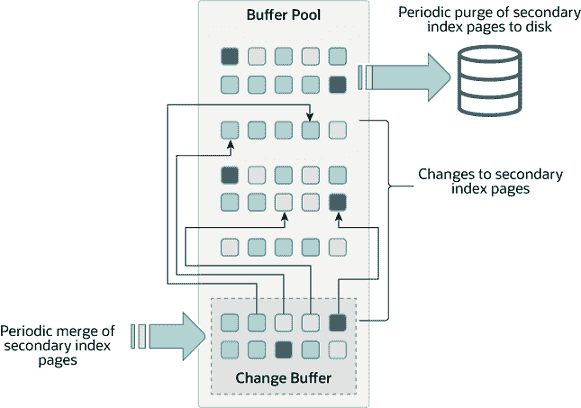

# 17.5.2 更改缓冲区

> 原文：[`dev.mysql.com/doc/refman/8.0/en/innodb-change-buffer.html`](https://dev.mysql.com/doc/refman/8.0/en/innodb-change-buffer.html)

更改缓冲区是一种特殊的数据结构，用于缓存对次要索引页面的更改，当这些页面不在缓冲池中时。缓冲的更改可能来自`INSERT`、`UPDATE`或`DELETE`操作（DML），稍后在其他读取操作将这些页面加载到缓冲池时进行合并。

**图 17.3 更改缓冲区**



与聚簇索引不同，次要索引通常是非唯一的，并且对次要索引的插入以相对随机的顺序发生。同样，删除和更新可能会影响不相邻的索引树中的次要索引页面。在其他操作将受影响页面从磁盘读入缓冲池时，稍后合并缓存的更改，避免了需要从磁盘将次要索引页面读入缓冲池的大量随机访问 I/O。

定期地，在系统大部分空闲时运行的清理操作，或在慢速关闭期间，将更新的索引页面写入磁盘。清理操作可以更有效地为一系列索引值写入磁盘块，而不是立即将每个值写���磁盘。

当受影响的行数和需要更新的次要索引很多时，更改缓冲区合并可能需要几个小时。在此期间，磁盘 I/O 增加，这可能导致磁盘密集型查询显着减慢。更改缓冲区合并可能在事务提交后继续发生，甚至在服务器关闭和重新启动后也会发生（有关更多信息，请参见第 17.21.3 节，“强制 InnoDB 恢复”）。

在内存中，更改缓冲区占据了缓冲池的一部分。在磁盘上，更改缓冲区是系统表空间的一部分，在数据库服务器关闭时，索引更改被缓冲。

更改缓冲区中缓存的数据类型由`innodb_change_buffering`变量控制。有关更多信息，请参见配置更改缓冲。您还可以配置最大更改缓冲区大小。有关更多信息，请参见配置更改缓冲区最大大小。

如果索引包含降序索引列或主键包含降序索引列，则不支持对辅助索引进行改变缓冲。

有关改变缓冲的常见问题的答案，请参阅 Section A.16, “MySQL 8.0 FAQ: InnoDB Change Buffer”。

#### 配置改变缓冲

当在表上执行`INSERT`、`UPDATE`和`DELETE`操作时，索引列的值（特别是辅助键的值）通常是无序的，需要大量 I/O 才能更新辅助索引。当相关页面不在缓冲池中时，改变缓冲缓存对辅助索引条目的更改，从而避免通过立即从磁盘读取页面来执行昂贵的 I/O 操作。当页面加载到缓冲池中时，缓冲的更改会合并，更新后的页面稍后会刷新到磁盘。当服务器几乎空闲时，`InnoDB`主线程会合并缓冲的更改，并在慢关闭期间执行。

由于可以减少磁盘读写次数，改变缓冲对于 I/O 受限的工作负载最有价值；例如，具有大量 DML 操作（如批量插入）的应用程序受益于改变缓冲。

然而，改变缓冲占用缓冲池的一部分，减少了用于缓存数据页的可用内存。如果工作集几乎适合缓冲池，或者如果您的表具有相对较少的辅助索引，禁用改变缓冲可能是有用的。如果工作数据集完全适合缓冲池，改变缓冲不会带来额外的开销，因为它仅适用于不在缓冲池中的页面。

`innodb_change_buffering`变量控制`InnoDB`执行改变缓冲的程度。您可以为插入、删除操作（当索引记录最初标记为删除时）和清除操作（当索引记录物理删除时）启用或禁用缓冲。更新操作是插入和删除的组合。默认的`innodb_change_buffering`值为`all`。

允许的`innodb_change_buffering`值包括：

+   **`all`**

    默认值：缓冲插入、删除标记操作和清除操作。

+   **`none`**

    不要缓冲任何操作。

+   **`inserts`**

    缓冲插入操作。

+   **`deletes`**

    缓冲删除标记操作。

+   **`changes`**

    缓冲插入和删除标记操作。

+   **`purges`**

    缓冲后台中发生的物理删除操作。

您可以在 MySQL 选项文件（`my.cnf`或`my.ini`）中设置`innodb_change_buffering`变量，或使用`SET GLOBAL`语句动态更改它，这需要足够的权限来设置全局系统变量。请参见 第 7.1.9.1 节，“系统变量权限”。更改设置会影响新操作的缓冲；现有缓冲条目的合并不受影响。

#### 配置变更缓冲区最大大小。

`innodb_change_buffer_max_size`变量允许将变更缓冲区的最大大小配置为缓冲池总大小的百分比。默认情况下，`innodb_change_buffer_max_size`设置为 25。最大设置为 50。

考虑在具有大量插入、更新和删除活动的 MySQL 服务器上增加`innodb_change_buffer_max_size`，其中变更缓冲区合并无法跟上新的变更缓冲区条目，导致变更缓冲区达到其最大大小限制。

考虑在用于报告的静态数据的 MySQL 服务器上减少`innodb_change_buffer_max_size`，或者如果变更缓冲区消耗了与缓冲池共享的内存空间过多，导致页面比预期更早地从缓冲池中过期。

使用代表性工作负载测试不同设置，以确定最佳配置。`innodb_change_buffer_max_size` 变量是动态的，允许在不重新启动服务器的情况下修改设置。

#### 监控变更缓冲区。

可用于变更缓冲区监视的选项如下：

+   `InnoDB`标准监视器输出包括变更缓冲区状态信息。要查看监视器数据，请发出`SHOW ENGINE INNODB STATUS`语句。

    ```sql
    mysql> SHOW ENGINE INNODB STATUS\G
    ```

    变更缓冲区状态信息位于`INSERT BUFFER AND ADAPTIVE HASH INDEX`标题下，并且类似于以下内容：

    ```sql
    -------------------------------------
    INSERT BUFFER AND ADAPTIVE HASH INDEX
    -------------------------------------
    Ibuf: size 1, free list len 0, seg size 2, 0 merges
    merged operations:
     insert 0, delete mark 0, delete 0
    discarded operations:
     insert 0, delete mark 0, delete 0
    Hash table size 4425293, used cells 32, node heap has 1 buffer(s)
    13577.57 hash searches/s, 202.47 non-hash searches/s
    ```

    有关更多信息，请参见 第 17.17.3 节，“InnoDB 标准监视器和锁监视器输出”。

+   信息模式`INNODB_METRICS`表提供了`InnoDB`标准监视器输出中找到的大部分数据点以及其他数据点。要查看变更缓冲区指标和每个指标的描述，请发出以下查询：

    ```sql
    mysql> SELECT NAME, COMMENT FROM INFORMATION_SCHEMA.INNODB_METRICS WHERE NAME LIKE '%ibuf%'\G
    ```

    参见第 17.15.6 节，“InnoDB INFORMATION_SCHEMA 指标表”。

+   信息模式`INNODB_BUFFER_PAGE`表提供关于缓冲池中每个页面的元数据，包括变更缓冲区索引和变更缓冲区位图页面。 变更缓冲区页面由`PAGE_TYPE`标识。 `IBUF_INDEX`是变更缓冲区索引页面的页面类型，`IBUF_BITMAP`是变更缓冲区位图页面的页面类型。

    警告

    查询`INNODB_BUFFER_PAGE`表可能会引入显着的性能开销。 为避免影响性能，请在测试实例上重现要调查的问题，并在测试实例上运行您的查询。

    例如，您可以查询`INNODB_BUFFER_PAGE`表，以确定`IBUF_INDEX`和`IBUF_BITMAP`页面的大致数量占总缓冲池页面的百分比。

    ```sql
    mysql> SELECT (SELECT COUNT(*) FROM INFORMATION_SCHEMA.INNODB_BUFFER_PAGE
           WHERE PAGE_TYPE LIKE 'IBUF%') AS change_buffer_pages,
           (SELECT COUNT(*) FROM INFORMATION_SCHEMA.INNODB_BUFFER_PAGE) AS total_pages,
           (SELECT ((change_buffer_pages/total_pages)*100))
           AS change_buffer_page_percentage;
    +---------------------+-------------+-------------------------------+
    | change_buffer_pages | total_pages | change_buffer_page_percentage |
    +---------------------+-------------+-------------------------------+
    |                  25 |        8192 |                        0.3052 |
    +---------------------+-------------+-------------------------------+
    ```

    有关`INNODB_BUFFER_PAGE`表提供的其他数据信息，请参阅第 28.4.2 节，“INFORMATION_SCHEMA INNODB_BUFFER_PAGE 表”。 有关相关用法信息，请参阅第 17.15.5 节，“InnoDB INFORMATION_SCHEMA 缓冲池表”。

+   性能模式为高级性能监控提供了变更缓冲区互斥等待仪器。 要查看变更缓冲区仪器，执行以下查询：

    ```sql
    mysql> SELECT * FROM performance_schema.setup_instruments
           WHERE NAME LIKE '%wait/synch/mutex/innodb/ibuf%';
    +-------------------------------------------------------+---------+-------+
    | NAME                                                  | ENABLED | TIMED |
    +-------------------------------------------------------+---------+-------+
    | wait/synch/mutex/innodb/ibuf_bitmap_mutex             | YES     | YES   |
    | wait/synch/mutex/innodb/ibuf_mutex                    | YES     | YES   |
    | wait/synch/mutex/innodb/ibuf_pessimistic_insert_mutex | YES     | YES   |
    +-------------------------------------------------------+---------+-------+
    ```

    关于监控`InnoDB`互斥等待的信息，请参阅第 17.16.2 节，“使用性能模式监控 InnoDB 互斥等待”。
