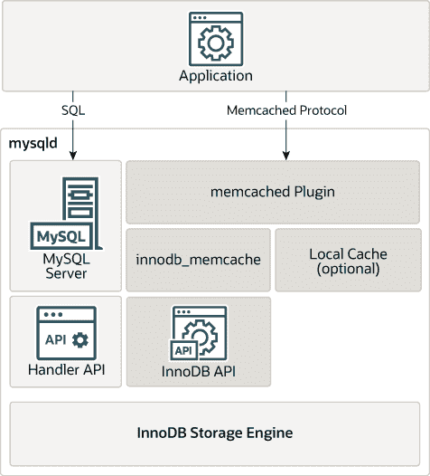

# 17.20.2 InnoDB memcached 架构

> 原文：[`dev.mysql.com/doc/refman/8.0/en/innodb-memcached-intro.html`](https://dev.mysql.com/doc/refman/8.0/en/innodb-memcached-intro.html)

`InnoDB` **memcached**插件将**memcached**实现为直接访问`InnoDB`存储引擎的 MySQL 插件守护程序，绕过 MySQL SQL 层。

以下图示说明了应用程序如何通过`daemon_memcached`插件访问数据，与 SQL 相比。

**图 17.4 集成 memcached 服务器的 MySQL 服务器**

`daemon_memcached`插件的特点：

+   **memcached**作为**mysqld**的守护插件。**mysqld**和**memcached**在同一进程空间中运行，对数据具有非常低的延迟访问。

+   直接访问`InnoDB`表，绕过 SQL 解析器、优化器，甚至 Handler API 层。

+   标准的**memcached**协议，包括基于文本的协议和二进制协议。`daemon_memcached`插件通过了**memcapable**命令的所有 55 个兼容性测试。

+   多列支持。您可以将多列映射到键值存储的“值”部分，列值由用户指定的分隔符字符分隔。

+   默认情况下，使用**memcached**协议直接读写数据到`InnoDB`，让 MySQL 使用`InnoDB`缓冲池管理内存缓存。默认设置代表了高可靠性和数据库应用程序最少惊喜的组合。例如，默认设置避免了数据库端未提交数据，或者为**memcached**的`get`请求返回陈旧数据。

+   高级用户可以将系统配置为传统的**memcached**服务器，所有数据仅缓存在**memcached**引擎（内存缓存）中，或者同时使用“**memcached**引擎”（内存缓存）和`InnoDB` **memcached**引擎（`InnoDB`作为后端持久存储）的组合。

+   控制数据在`InnoDB`和**memcached**操作之间传递频率的配置选项包括`innodb_api_bk_commit_interval`，`daemon_memcached_r_batch_size`，和`daemon_memcached_w_batch_size`。批量大小选项默认值为 1，以确保最大可靠性。

+   通过`daemon_memcached_option`配置参数指定**memcached**选项的能力。例如，您可以更改**memcached**监听的端口，减少最大同时连接数，更改键值对的最大内存大小，或为错误日志启用调试消息。

+   `innodb_api_trx_level`配置选项控制由**memcached**处理的查询的事务隔离级别。虽然**memcached**没有事务的概念，但您可以使用此选项来控制**memcached**何时看到由**daemon_memcached**插件使用的表上发出的 SQL 语句引起的更改。默认情况下，`innodb_api_trx_level`设置为`READ UNCOMMITTED`。

+   `innodb_api_enable_mdl`选项可用于在 MySQL 级别锁定表，以防止通过 SQL 接口对映射表进行 DDL 的删除或更改。如果没有锁定，表可以从 MySQL 层删除，但在**memcached**或其他用户停止使用之前，仍保留在`InnoDB`存储中。“MDL”代表“metadata locking”。
