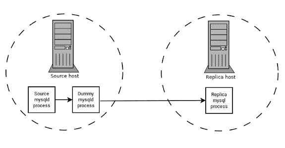

# 18.6 BLACKHOLE 存储引擎

> 原文：[`dev.mysql.com/doc/refman/8.0/en/blackhole-storage-engine.html`](https://dev.mysql.com/doc/refman/8.0/en/blackhole-storage-engine.html)

`BLACKHOLE`存储引擎充当一个“黑洞”，接受数据但将其丢弃并不存储。检索总是返回空结果：

```sql
mysql> CREATE TABLE test(i INT, c CHAR(10)) ENGINE = BLACKHOLE;
Query OK, 0 rows affected (0.03 sec)

mysql> INSERT INTO test VALUES(1,'record one'),(2,'record two');
Query OK, 2 rows affected (0.00 sec)
Records: 2  Duplicates: 0  Warnings: 0

mysql> SELECT * FROM test;
Empty set (0.00 sec)
```

如果您从源代码构建 MySQL 并希望启用`BLACKHOLE`存储引擎，请使用`-DWITH_BLACKHOLE_STORAGE_ENGINE`选项调用**CMake**。

要查看`BLACKHOLE`引擎的源代码，请查看 MySQL 源代码分发的`sql`目录。

当您创建一个`BLACKHOLE`表时，服务器会在全局数据字典中创建表定义。与表相关联的文件不存在。

`BLACKHOLE`存储引擎支持各种类型的索引。也就是说，您可以在表定义中包含索引声明。

截至 MySQL 8.0.27，最大键长度为 3072 字节。在 8.0.27 之前，最大键长度为 1000 字节。

`BLACKHOLE`存储引擎不支持分区。

您可以使用`SHOW ENGINES`语句检查`BLACKHOLE`存储引擎是否可用。

插入到`BLACKHOLE`表中不会存储任何数据，但如果启用基于语句的二进制日志记录，则会记录 SQL 语句并复制到副本服务器。这可以作为中继器或过滤器机制。

假设您的应用程序需要副本端过滤规则，但首先将所有二进制日志数据传输到副本会导致太多的流量。在这种情况下，可以在复制源服务器上设置一个默认存储引擎为`BLACKHOLE`的“虚拟”副本进程，如下所示：

**图 18.1 使用 BLACKHOLE 进行过滤的复制**



源服务器写入其二进制日志。“虚拟”**mysqld**进程充当副本，应用所需的`replicate-do-*`和`replicate-ignore-*`规则，并写入自己的新的、经过过滤的二进制日志。（参见 Section 19.1.6, “Replication and Binary Logging Options and Variables”.）这个经过过滤的日志提供给副本。

虚拟进程实际上不存储任何数据，因此在复制源服务器上运行额外的**mysqld**进程几乎没有处理开销。可以通过额外的副本重复这种设置。

`BLACKHOLE` 表的 `INSERT` 触发器按预期工作。但是，由于 `BLACKHOLE` 表实际上不存储任何数据，因此不会激活 `UPDATE` 和 `DELETE` 触发器：触发器定义中的 `FOR EACH ROW` 子句不适用，因为没有行。

`BLACKHOLE` 存储引擎的其他可能用途包括：

+   验证转储文件语法。

+   通过比较启用和禁用二进制日志记录时使用 `BLACKHOLE` 的性能来测量二进制日志记录的开销。

+   `BLACKHOLE` 本质上是一个“无操作”存储引擎，因此可以用于查找与存储引擎本身无关的性能瓶颈。

`BLACKHOLE` 引擎是事务感知的，即已提交的事务会被写入二进制日志，而回滚的事务则不会。

**黑洞引擎和自增列**

`BLACKHOLE` 引擎是一个无操作引擎。对使用 `BLACKHOLE` 的表执行的任何操作都没有效果。在考虑自增主键列的行为时，应牢记这一点。该引擎不会自动增加字段值，并且不会保留自增字段状态。这在复制中具有重要影响。

考虑以下复制场景，其中所有以下三个条件都适用：

1.  在源服务器上有一个带有自增字段的黑洞表，该字段是主键。

1.  在副本中存在相同的表，但使用 MyISAM 引擎。

1.  在 `INSERT` 语句本身中或通过使用 `SET INSERT_ID` 语句显式设置自增值，将数据插入源表。

在这种情况下，复制会因主键列上的重复条目错误而失败。

在基于语句的复制中，上下文事件中的 `INSERT_ID` 值始终相同。因此，由于尝试插入具有主键列重复值的行，复制失败。

在基于行的复制中，引擎为每次插入返回的行值始终相同。这导致副本尝试使用相同值为主键列重放两个插入日志条目，因此复制失败。

**列过滤**

当使用基于行的复制（`binlog_format=ROW`）时，支持表中缺少最后列的副本，如第 19.5.1.9 节，“源和副本上具有不同表定义的复制”中所述。

此过滤在副本端执行，即在过滤之前将列复制到副本。至少有两种情况下不希望将列复制到副本：

1.  如果数据是机密的，那么副本服务器不应该访问它。

1.  如果源有很多副本，那么在发送到副本之前进行过滤可能会减少网络流量。

使用`BLACKHOLE`引擎可以实现源列过滤。这是通过类似于源表过滤的方式实现的 - 使用`BLACKHOLE`引擎和`--replicate-do-table`或`--replicate-ignore-table`选项。

源的设置为：

```sql
CREATE TABLE t1 (public_col_1, ..., public_col_N,
                 secret_col_1, ..., secret_col_M) ENGINE=MyISAM;
```

受信任副本的设置为：

```sql
CREATE TABLE t1 (public_col_1, ..., public_col_N) ENGINE=BLACKHOLE;
```

不受信任副本的设置为：

```sql
CREATE TABLE t1 (public_col_1, ..., public_col_N) ENGINE=MyISAM;
```
