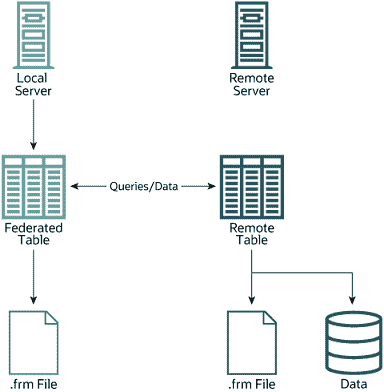

# 18.8.1 FEDERATED 存储引擎概述

> 原文：[`dev.mysql.com/doc/refman/8.0/en/federated-description.html`](https://dev.mysql.com/doc/refman/8.0/en/federated-description.html)

当您使用标准存储引擎（如`MyISAM`、`CSV`或`InnoDB`）之一创建表时，表由表定义和相关数据组成。创建`FEDERATED`表时，表定义相同，但数据的物理存储在远程服务器上处理。

`FEDERATED`表由两个元素组成：

+   具有数据库表的远程服务器，该表又由表定义（存储在 MySQL 数据字典中）和相关表组成。远程表的表类型可以是远程`mysqld`服务器支持的任何类型，包括`MyISAM`或`InnoDB`。

+   本地服务器具有一个数据库表，其中表定义与远程服务器上相应表的定义相匹配。表定义存储在数据字典中。本地服务器上没有数据文件。相反，表定义包括一个指向远程表的连接字符串。

在本地服务器上对`FEDERATED`表执行查询和语句时，通常会向本地数据文件插入、更新或删除信息的操作会被发送到远程服务器进行执行，其中它们会更新远程服务器上的数据文件或从远程服务器返回匹配的行。

`FEDERATED`表设置的基本结构如图 18.2，“FEDERATED 表结构”所示。

**图 18.2 FEDERATED 表结构**

当客户端发出引用`FEDERATED`表的 SQL 语句时，在本地服务器（执行 SQL 语句的地方）和远程服务器（存储数据的地方）之间的信息流如下：

1.  存储引擎遍历`FEDERATED`表具有的每一列，并构造一个适当的 SQL 语句，引用远程表。

1.  该语句使用 MySQL 客户端 API 发送到远程服务器。

1.  远程服务器处理语句，本地服务器检索语句产生的任何结果（受影响行数或结果集）。

1.  如果语句产生结果集，则将每列转换为`FEDERATED`引擎期望的内部存储引擎格式，并可以将结果显示给发出原始语句的客户端。

本地服务器使用 MySQL 客户端 C API 函数与远程服务器通信。它调用`mysql_real_query()`来发送语句。要读取结果集，它使用`mysql_store_result()`并使用`mysql_fetch_row()`逐行获取行。
