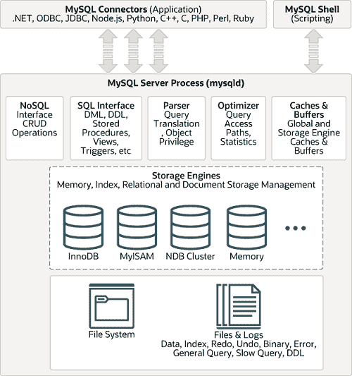

# 18.11 MySQL 存储引擎架构概述

> 原文：[`dev.mysql.com/doc/refman/8.0/en/pluggable-storage-overview.html`](https://dev.mysql.com/doc/refman/8.0/en/pluggable-storage-overview.html)

18.11.1 可插拔存储引擎架构

18.11.2 共同的数据库服务器层

MySQL 可插拔存储引擎架构使数据库专业人员能够为特定应用需求选择专门的存储引擎，同时完全屏蔽了管理任何特定应用编码需求的需要。MySQL 服务器架构将应用程序员和数据库管理员与存储级别的所有低级实现细节隔离开来，提供一致且易于使用的应用模型和 API。因此，尽管不同存储引擎具有不同的功能，但应用程序被屏蔽免受这些差异的影响。

MySQL 可插拔存储引擎架构显示在图 18.3，“带有可插拔存储引擎的 MySQL 架构”中。

**图 18.3 MySQL 架构与可插拔存储引擎**

可插拔存储引擎架构提供了一套标准的管理和支持服务，这些服务在所有底层存储引擎中都是共同的。存储引擎本身是数据库服务器的组件，实际上在物理服务器级别上执行对底层数据的操作。

这种高效且模块化的架构为那些希望专门针对特定应用需求（如数据仓库、事务处理或高可用性情况）的人提供了巨大的好处，同时享受利用独立于任何一个存储引擎的一组接口和服务的优势。

应用程序员和数据库管理员通过位于存储引擎之上的连接器 API 和服务层与 MySQL 数据库进行交互。如果应用程序的更改带来了需要更改底层存储引擎或添加一个或多个存储引擎以支持新需求的要求，那么不需要进行重大的编码或流程更改即可使事情正常运行。MySQL 服务器架构通过提供一致且易于使用的 API 来屏蔽应用程序免受存储引擎的底层复杂性。
