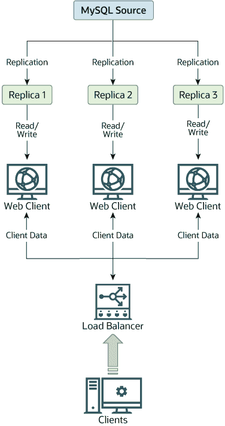

# 19.4.5 利用复制进行规模扩展

> 原文：[`dev.mysql.com/doc/refman/8.0/en/replication-solutions-scaleout.html`](https://dev.mysql.com/doc/refman/8.0/en/replication-solutions-scaleout.html)

您可以将复制用作规模扩展解决方案；也就是说，您希望在多个数据库服务器之间分配数据库查询负载，但在一定的限制范围内。

由于复制是从一个源到一个或多个副本的分发，因此在具有大量读取和少量写入/更新的环境中使用复制以实现规模扩展性效果最佳。大多数网站属于这一类别，用户在浏览网站、阅读文章、帖子或查看产品时进行操作。更新仅在会话管理期间发生，或在进行购买或向论坛添加评论/消息时发生。

在这种情况下，复制使您能够将读取操作分布到副本上，同时仍然使您的网络服务器在需要写入时与源进行通信。您可以在图 19.1 “利用复制提高规模扩展性”中查看此场景的示例复制布局。

**图 19.1 利用复制提高规模扩展性**

如果负责数据库访问的代码部分已经被正确抽象化/模块化，那么将其转换为运行在复制设置中应该是非常顺利和容易的。将数据库访问的实现更改为将所有写操作发送到源，将读取操作发送到源或副本。如果您的代码没有达到这种抽象化水平，设置一个复制系统将为您提供整理代码的机会和动力。首先创建一个实现以下功能的包装库或模块：

+   `safe_writer_connect()`

+   `safe_reader_connect()`

+   `safe_reader_statement()`

+   `safe_writer_statement()`

每个函数名称中的`safe_`表示该函数负责处理所有错误条件。您可以为函数使用不同的名称。重要的是要为读取连接、写入连接、执行读取和执行写入提供统一的接口。

然后将客户端代码转换为使用包装库。起初，这可能是一个痛苦和可怕的过程，但从长远来看是值得的。所有使用上述方法的应用程序都能够利用源/副本配置，甚至涉及多个副本。代码更容易维护，并且添加故障排除选项很简单。您只需要修改一个或两个函数（例如，记录每个语句花费的时间，或者哪个语句中出现了错误）。

如果您编写了大量代码，可能希望通过编写转换脚本来自动化转换任务。理想情况下，您的代码使用一致的编程风格约定。如果没有，那么最好重新编写它，或者至少通过手动规范化来使用一致的风格。
