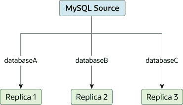

# 19.4.6 将不同的数据库复制到不同的副本

> 原文：[`dev.mysql.com/doc/refman/8.0/en/replication-solutions-partitioning.html`](https://dev.mysql.com/doc/refman/8.0/en/replication-solutions-partitioning.html)

可能存在这样的情况，您有一个单一的源服务器，并且希望将不同的数据库复制到不同的副本。例如，您可能希望将不同的销售数据分发给不同的部门，以帮助在数据分析期间分担负载。此布局的示例显示在图 19.2，“复制数据库以分离副本”中。

**图 19.2 复制数据库以分离副本**

您可以通过将源和副本配置为正常操作，然后通过在每个副本上使用`--replicate-wild-do-table`配置选项来限制每个副本处理的二进制日志语句，从而实现此分离。

重要提示

当使用基于语句的复制时，不应该使用`--replicate-do-db`来实现此目的，因为基于语句的复制会导致此选项的效果根据当前选择的数据库而变化。这也适用于混合格式复制，因为这样可以使用基于语句的格式复制一些更新。

但是，如果仅使用基于行的复制，则可以放心使用`--replicate-do-db`来实现此目的，因为在这种情况下，当前选择的数据库对选项的操作没有影响。

例如，要支持如图 19.2，“复制数据库以分离副本”所示的分离，您应该在执行`START REPLICA`之前，为每个副本配置如下：

+   副本 1 应使用`--replicate-wild-do-table=databaseA.%`。

+   副本 2 应使用`--replicate-wild-do-table=databaseB.%`。

+   副本 3 应使用`--replicate-wild-do-table=databaseC.%`。

在这种配置中，每个副本都接收源自源服务器的整个二进制日志，但仅执行二进制日志中适用于副本上生效的`--replicate-wild-do-table`选项包含的数据库和表的事件。

如果您有必须在复制开始之前同步到副本的数据，则有多种选择：

+   将所有数据同步到每个副本，并删除您不想保留的数据库、表或两者。

+   使用**mysqldump**为每个数据库创建单独的转储文件，并在每个副本上加载适当的转储文件。

+   使用原始数据文件转储，并仅包含每个副本所需的特定文件和数据库。

    注意

    这对`InnoDB`数据库不起作用，除非您使用`innodb_file_per_table`。
