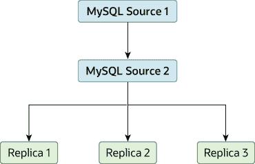

# 19.4.7 改进复制性能

> 原文：[`dev.mysql.com/doc/refman/8.0/en/replication-solutions-performance.html`](https://dev.mysql.com/doc/refman/8.0/en/replication-solutions-performance.html)

随着连接到源的副本数量的增加，负载虽然很小，但也会增加，因为每个副本都使用客户端连接到源。此外，由于每个副本必须接收源的二进制日志的完整副本，因此源上的网络负载也可能增加并创建瓶颈。

如果您正在使用大量与一个源连接的副本，并且该源也在忙于处理请求（例如，作为扩展解决方案的一部分），那么您可能希望改进复制过程的性能。

改进复制过程性能的一种方法是创建一个更深层次的复制结构，使源只能复制到一个副本，而其余副本则连接到此主要副本以满足各自的复制需求。此结构示例如 图 19.3，“使用额外的复制源以提高性能” 中所示。

**图 19.3 使用额外的复制源以提高性能**

要使其正常工作，您必须按以下方式配置 MySQL 实例：

+   源 1 是所有更改和更新都写入数据库的主要源。两个源服务器都启用了二进制日志记录，这是默认设置。

+   源 2 是向其余副本提供复制功能的服务器源 1 的副本。源 2 是唯一被允许连接到源 1 的机器。源 2 启用了 `--log-slave-updates` 选项（默认情况下启用）。通过此选项，源 1 的复制指令也会被写入源 2 的二进制日志中，然后可以被复制到真正的副本中。

+   副本 1、副本 2 和副本 3 充当源 2 的副本，并复制来自源 2 的信息，实际上包括在源 1 上记录的升级。

上述解决方案减少了主要源上的客户端负载和网络接口负载，应该提高主要源作为直接数据库解决方案时的整体性能。

如果您的副本在源上跟不上复制过程，那么有多种选择可供选择：

+   如果可能的话，将中继日志和数据文件放在不同的物理驱动器上。为此，请设置`relay_log`系统变量以指定中继日志的位置。

+   如果读取二进制日志文件和中继日志文件的磁盘 I/O 活动较大，考虑增加`rpl_read_size`系统变量的值。该系统变量控制从日志文件中读取的最小数据量，增加该值可能会减少文件读取和 I/O 停顿，尤其是当文件数据当前未被操作系统缓存时。请注意，为从二进制日志和中继日志文件读取的每个线程分配了与此值大小相同的缓冲区，包括源上的转储线程和副本上的协调器线程。因此，设置一个较大的值可能会影响服务器的内存消耗。

+   如果副本比源慢得多，您可能希望将不同数据库的复制责任分配给不同的副本。参见 Section 19.4.6, “将不同数据库复制到不同副本”。

+   如果您的源使用事务，并且您不关心副本上的事务支持，请在副本上使用`MyISAM`或其他非事务引擎。参见 Section 19.4.4, “使用不同源和副本存储引擎进行复制”。

+   如果您的副本不充当源，并且已经有潜在的解决方案确保在发生故障时可以启动源，则可以在副本上禁用系统变量`log_replica_updates`（从 MySQL 8.0.26 开始）或`log_slave_updates`（MySQL 8.0.26 之前）。这可以防止“愚蠢”的副本也将其执行的事件记录到自己的二进制日志中。
