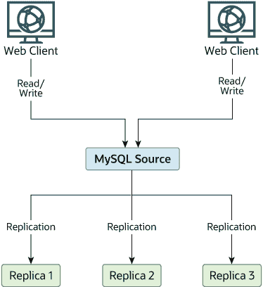
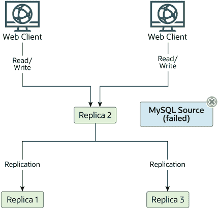

# 19.4.8 故障转移期间切换源

> 原文：[`dev.mysql.com/doc/refman/8.0/en/replication-solutions-switch.html`](https://dev.mysql.com/doc/refman/8.0/en/replication-solutions-switch.html)

你可以使用`CHANGE REPLICATION SOURCE TO`语句（MySQL 8.0.23 之前为 `CHANGE MASTER TO` 选项），这是默认设置。如果您没有使用 GTIDs 进行复制，那么复制品还应该运行 `--log-slave-updates=OFF`（记录复制品更新是默认设置）。这样，复制品就可以在不重新启动复制品的情况下准备成为源。假设您拥有 图 19.4，“使用复制实现冗余，初始结构” 中显示的结构。

**图 19.4 使用复制实现冗余，初始结构**

在这个图中，`Source` 拥有源数据库，`Replica*` 主机是复制品，`Web Client` 机器正在发出数据库读取和写入。只发出读取的 Web 客户端（通常连接到复制品）没有显示，因为它们在故障发生时不需要切换到新服务器。有关读写扩展复制结构的更详细示例，请参见 19.4.5 “使用复制进行扩展”。

每个 MySQL 副本（`副本 1`、`副本 2`和`副本 3`）都是启用二进制日志记录的副本，并且使用`--log-slave-updates=OFF`。因为当指定`--log-slave-updates=OFF`时，从源接收的更新不会写入二进制日志，所以每个副本上的二进制日志最初是空的。如果由于某种原因`Source`不可用，您可以选择其中一个副本成为新的源。例如，如果选择`副本 1`，则所有`Web Clients`应重定向到`副本 1`，它会将更新写入其二进制日志。然后`副本 2`和`副本 3`应从`副本 1`复制。

运行副本时使用`--log-slave-updates=OFF`的原因是为了防止副本在您导致其中一个副本成为新源时收到更新两次。如果`副本 1`启用了`--log-slave-updates`，这是默认设置，它会将从`Source`接收的任何更新写入自己的二进制日志。这意味着当`副本 2`从`Source`更改为`副本 1`作为其源时，它可能会收到已经从`Source`接收过的`副本 1`的更新。

确保所有副本都已处理其中继日志中的任何语句。在每个副本上，发出`STOP REPLICA IO_THREAD`命令，然后检查`SHOW PROCESSLIST`的输出，直到看到`Has read all relay log`。当所有副本都满足此条件时，它们可以重新配置到新的设置。在晋升为源的副本`副本 1`上，发出`STOP REPLICA`和`RESET MASTER`命令。

在其他副本`副本 2`和`副本 3`上，使用`STOP REPLICA`和`CHANGE REPLICATION SOURCE TO SOURCE_HOST='Replica1'`或`CHANGE MASTER TO MASTER_HOST='Replica1'`（其中`'Replica1'`代表`副本 1`的真实主机名）。要使用`CHANGE REPLICATION SOURCE TO`，添加有关如何从`副本 2`或`副本 3`连接到`副本 1`的所有信息（*`user`*、*`password`*、*`port`*）。在此场景中发出该语句时，无需指定要从中读取的`副本 1`二进制日志文件的名称或位置，因为第一个二进制日志文件和位置 4 是默认值。最后，在`副本 2`和`副本 3`上执行`START REPLICA`。

一旦新的复制设置就位，你需要告诉每个 `Web 客户端` 将其语句发送到 `Replica 1`。从那时起，`Web 客户端` 发送到 `Replica 1` 的所有更新都将写入 `Replica 1` 的二进制日志中，其中包含自 `Source` 不可用以来发送到 `Replica 1` 的每个更新。

结果显示的服务器结构如 图 19.5，“使用复制实现冗余，在源故障后” 所示。

**图 19.5 使用复制实现冗余，在源故障后**

当 `Source` 再次可用时，你应该将其设置为 `Replica 1` 的副本。为此，在 `Source` 上发出与之前在 `Replica 2` 和 `Replica 3` 上发出的相同的 `CHANGE REPLICATION SOURCE TO`（或 `CHANGE MASTER TO`）语句。然后，`Source` 成为 `Replica 1` 的副本，并接收它在离线时错过的 `Web 客户端` 写入数据。

要使 `Source` 再次成为源，请按照上述步骤操作，就好像 `Replica 1` 不可用，而 `Source` 将成为新的源一样。在此过程中，不要忘记在将 `Replica 1`、`Replica 2` 和 `Replica 3` 设置为 `Source` 的副本之前，在 `Source` 上运行 `RESET MASTER`。如果你忘记了这一步，副本可能会接收到自 `Source` 不可用之前的时间点起的旧写入数据。

你应该意识到副本之间没有同步，即使它们共享相同的源，因此某些副本可能比其他副本领先很多。这意味着在某些情况下，前面示例中概述的过程可能不会按预期工作。然而，在实践中，所有副本上的中继日志应该相对接近。

保持应用程序了解源位置的一种方法是为源主机设置动态 DNS 条目。使用 `BIND`，你可以使用 **nsupdate** 动态更新 DNS。
