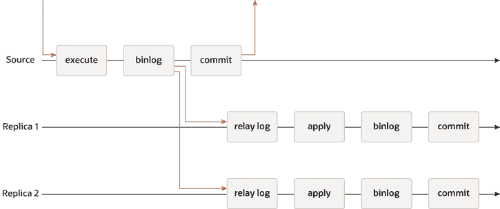
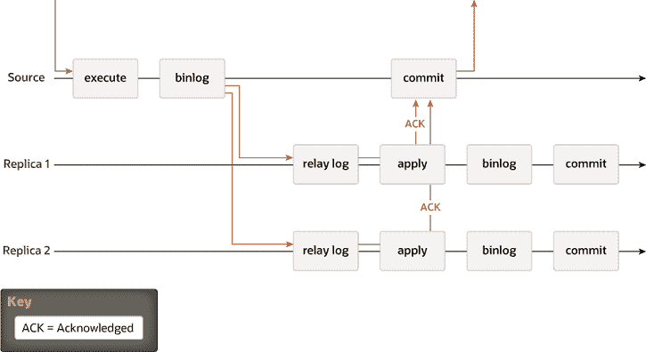

> 原文：[`dev.mysql.com/doc/refman/8.0/en/group-replication-primary-secondary-replication.html`](https://dev.mysql.com/doc/refman/8.0/en/group-replication-primary-secondary-replication.html)

#### 20.1.1.1 源到副本复制

传统的 MySQL 复制 提供了一种简单的源到副本的复制方法。源是主服务器，副本是从服务器。源应用事务，提交它们，然后稍后（因此是异步的）将它们发送到副本以重新执行（在基于语句的复制中）或应用（在基于行的复制中）。这是一个共享无系统，所有服务器默认都有完整的数据副本。

**图 20.1 MySQL 异步复制**

还有半同步复制，它在协议中添加了一个同步步骤。这意味着主服务器在应用时等待副本确认已*接收*事务。只有在副本确认接收事务后，主服务器才恢复提交操作。

**图 20.2 MySQL 半同步复制**

在这两幅图中有一个经典的异步 MySQL 复制协议的图示（以及其半同步变体）。不同实例之间的箭头代表服务器之间或服务器与客户端应用程序之间交换的消息。
