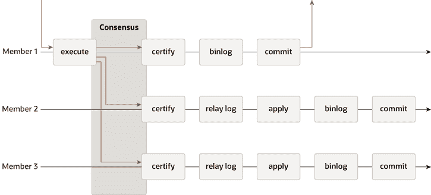

> 原文：[`dev.mysql.com/doc/refman/8.0/en/group-replication-summary.html`](https://dev.mysql.com/doc/refman/8.0/en/group-replication-summary.html)

#### 20.1.1.2 Group Replication

Group Replication 是一种可用于实现容错系统的技术。复制组是一组每个服务器都拥有自己完整数据副本的服务器（共享无内容复制方案），并通过消息传递相互交互。通信层提供了一组保证，如原子消息和总顺消息传递。这些是非常强大的属性，可以转化为非常有用的抽象，可以用来构建更高级的数据库复制解决方案。

MySQL Group Replication 建立在这些属性和抽象之上，并实现了一个多源更新的复制协议。一个复制组由多个服务器组成，组中的每个服务器可以随时独立执行事务。然而，所有读写事务只有在组批准后才提交。换句话说，对于任何读写事务，组都需要决定是否提交，因此提交操作不是来自原始服务器的单方面决定。只读事务在组内不需要协调，立即提交。

当一个读写事务在原始服务器准备提交时，服务器会原子地广播写入值（已更改的行）和相应的写入集（已更新行的唯一标识符）。由于事务通过原子广播发送，组中的所有服务器都会接收到事务，或者都不会接收到。如果它们接收到了，那么它们都会按照与之前发送的其他事务相同的顺序接收它。因此，所有服务器以相同的顺序接收相同的事务集，并为事务建立了全局总顺序。

然而，在不同服务器上并发执行的事务之间可能存在冲突。这种冲突是通过检查和比较两个不同且并发事务的写入集来检测的，在一个称为*认证*的过程中。在认证过程中，冲突检测是在行级别进行的：如果两个并发事务，在不同服务器上执行，更新了相同的行，则存在冲突。冲突解决程序规定，首先被排序的事务在所有服务器上提交，而第二个被排序的事务中止，因此在原始服务器上回滚，并被组中的其他服务器丢弃。例如，如果 t1 和 t2 在不同站点并发执行，都更改了相同的行，并且 t2 在 t1 之前被排序，那么 t2 赢得冲突，t1 被回滚。实际上，这是一个分布式的“先提交者获胜”规则。请注意，如果两个事务往往会发生冲突，那么将它们放在同一服务器上开始是一个好的做法，这样它们有机会在本地锁管理器上同步，而不是由于认证的结果而被回滚。

为了应用和外部化经过认证的事务，集群复制允许服务器偏离事务的约定顺序，如果这不会破坏一致性和有效性。集群复制是一个最终一致性系统，意味着一旦传入流量减少或停止，所有组成员都具有相同的数据内容。在流量流动时，事务可以以稍微不同的顺序外部化，或者在某些成员之前外部化。例如，在多主模式下，一个本地事务可能会在认证后立即外部化，尽管一个在全局顺序中较早的远程事务尚未被应用。当认证过程已经确定事务之间没有冲突时，这是允许的。在单主模式下，在主服务器上，存在一个小概率，即并发的、非冲突的本地事务可能会按照与集群复制约定的全局顺序不同的顺序提交和外部化。在不接受来自客户端的写入的从属服务器上，事务总是按照约定的顺序提交和外部化。

以下图描述了 MySQL 集群复制协议，并通过将其与 MySQL 复制（甚至 MySQL 半同步复制）进行比较，您可以看到一些差异。为了清晰起见，这张图片中省略了一些底层共识和 Paxos 相关的消息。

**图 20.3 MySQL 集群复制协议**

