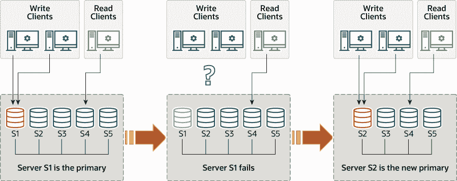

> 原文：[`dev.mysql.com/doc/refman/8.0/en/group-replication-single-primary-mode.html`](https://dev.mysql.com/doc/refman/8.0/en/group-replication-single-primary-mode.html)

#### 20.1.3.1 单主模式

在单主模式下（`group_replication_single_primary_mode=ON`），组具有一个被设置为读写模式的单主服务器。组中的所有其他成员都被设置为只读模式（使用`super_read_only=ON`）。主服务器通常是第一个引导组的服务器。加入组的所有其他服务器都会了解主服务器并自动设置为只读模式。

在单主模式下，组复制要求只有一个服务器写入组，因此与多主模式相比，一致性检查可以更宽松，DDL 语句不需要额外小心处理。选项`group_replication_enforce_update_everywhere_checks`用于启用或禁用组的严格一致性检查。在部署单主模式或将组更改为单主模式时，必须将此系统变量设置为`OFF`。

被指定为主服务器的成员可以通过以下方式更改：

+   如果现有的主服务器离开组，无论是自愿还是意外，新的主服务器将自动选举产生。

+   您可以使用`group_replication_set_as_primary()`函数指定特定成员作为新的主服务器。

+   如果使用`group_replication_switch_to_single_primary_mode()`函数将运行在多主模式下的组更改为单主模式，新的主服务器将自动选举产生，或者您可以通过该函数指定新的主服务器。

这些函数只能在所有组成员运行 MySQL 8.0.13 或更高版本时使用。当新的主服务器自动选举产生或手动指定时，它会自动设置为读写模式，其他组成员保持为从服务器，因此为只读模式。图 20.4, “新主服务器选举”展示了这个过程。

**图 20.4 新主服务器选举**



当新的主要被选举或任命时，它可能有一些在旧主要上已应用但尚未应用在此服务器上的更改积压。在这种情况下，直到新的主要赶上旧的主要，读写事务可能会导致冲突并被回滚，只读事务可能会导致过时读取。如果激活并正确调整了 Group Replication 的流量控制机制，它将减少快速和慢速成员之间的差异，从而降低发生这种情况的机会。有关流量控制的更多信息，请参见第 20.7.2 节，“流量控制”。从 MySQL 8.0.14 开始，您还可以使用`group_replication_consistency`系统变量来配置组的事务一致性级别，以防止此问题。设置`BEFORE_ON_PRIMARY_FAILOVER`（或任何更高的一致性级别）将新事务保留在新选举的主要上，直到积压被应用。有关事务一致性的更多信息，请参见第 20.5.3 节，“事务一致性保证”。如果组未使用流量控制和事务一致性保证，等待新主要应用其与复制相关的中继日志再将客户端应用程序重新路由到它是一个良好的做法。

##### 20.1.3.1.1 主要选举算法

自动主要成员选举过程涉及每个成员查看组的新视图，对潜在的新主要成员进行排序，并选择符合条件的最合适的成员。每个成员在本地做出自己的决定，遵循其 MySQL Server 版本中的主要选举算法。因为所有成员必须达成相同的决定，如果其他组成员运行较低版本的 MySQL Server，则成员会调整其主要选举算法，以使其与组中具有最低 MySQL Server 版本的成员具有相同的行为。

成员在选举主要时考虑的因素按顺序如下：

1.  考虑的第一个因素是哪个成员或哪些成员正在运行最低版本的 MySQL 服务器。如果所有组成员都在运行 MySQL 8.0.17 或更高版本，则首先按照其发布的补丁版本对成员进行排序。如果有任何成员正在运行 MySQL 服务器 5.7 或 MySQL 8.0.16 或更低版本，则首先按照其发布的主要版本对成员进行排序，而忽略补丁版本。

1.  如果有多个成员运行最低版本的 MySQL 服务器，则考虑的第二个因素是每个成员的成员权重，由成员上的`group_replication_member_weight`系统变量指定。如果组中的任何成员正在运行 MySQL 服务器 5.7，在那里这个系统变量不可用，则忽略此因素。

    `group_replication_member_weight`系统变量指定一个范围为 0-100 的数字。所有成员的默认权重为 50，因此将权重设置为低于此值以降低其排序，将权重设置为高于此值以增加其排序。您可以使用此加权函数来优先使用更好的硬件或确保在主服务器计划维护期间故障转移到特定成员。

1.  如果有多个成员运行最低版本的 MySQL 服务器，并且其中有多个成员具有最高的成员权重（或正在忽略成员权重），则考虑的第三个因素是每个成员生成的服务器 UUID 的词典顺序，由`server_uuid`系统变量指定。具有最低服务器 UUID 的成员被选择为主服务器。此因素充当保证和可预测的决定者，以便如果没有任何重要因素可以确定，则所有组成员达成相同的决定。

##### 20.1.3.1.2 找到主服务器

要找出在单主模式下当前是主服务器的服务器，请使用`performance_schema.replication_group_members`表中的`MEMBER_ROLE`列。例如：

```sql
mysql> SELECT MEMBER_HOST, MEMBER_ROLE FROM performance_schema.replication_group_members;
+-------------------------+-------------+
| MEMBER_HOST             | MEMBER_ROLE |
+-------------------------+-------------+
| remote1.example.com     | PRIMARY     |
| remote2.example.com     | SECONDARY   |
| remote3.example.com     | SECONDARY   |
+-------------------------+-------------+
```

警告

`group_replication_primary_member`状态变量已被弃用，并计划在将来的版本中删除。

或者使用`group_replication_primary_member`状态变量。

```sql
mysql> SHOW STATUS LIKE 'group_replication_primary_member'
```
