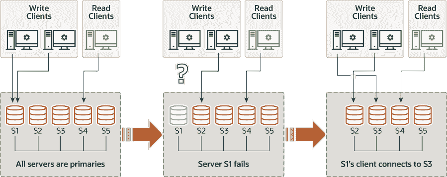

> 原文：[`dev.mysql.com/doc/refman/8.0/en/group-replication-multi-primary-mode.html`](https://dev.mysql.com/doc/refman/8.0/en/group-replication-multi-primary-mode.html)

#### 20.1.3.2 多主模式

在多主模式（`group_replication_single_primary_mode=OFF`）中，没有任何成员担任特殊角色。任何与其他组成员兼容的成员在加入组时被设置为读写模式，并且可以处理写事务，即使这些事务是并发发出的。

如果某个成员停止接受写事务，例如，出现意外服务器退出的情况，连接到该成员的客户端可以被重定向或故障转移至任何处于读写模式的其他成员。Group Replication 本身不处理客户端故障转移，因此您需要使用中间件框架（如 MySQL Router 8.0）、代理、连接器或应用程序本身来安排这一点。图 20.5，“客户端故障转移” 显示了客户端如何在成员离开组时重新连接到另一个组成员。

**图 20.5 客户端故障转移**

Group Replication 是一个最终一致性系统。这意味着一旦传入流量减少或停止，所有组成员都具有相同的数据内容。在流量流动时，事务可以在某些成员上外部化，然后在其他成员上，特别是如果某些成员的写吞吐量较低，则可能导致过时读取的可能性。在多主模式下，较慢的成员也可能积累过多的待认证和应用的事务，导致冲突和认证失败的风险增加。为了限制这些问题，您可以激活和调整 Group Replication 的流量控制机制，以最小化快速和慢速成员之间的差异。有关流量控制的更多信息，请参见第 20.7.2 节，“流量控制”。

从 MySQL 8.0.14 开始，如果您希望对组中的每个事务都有事务一致性保证，可以使用`group_replication_consistency`系统变量来实现。您可以选择适合组工作负载和数据读写优先级的设置，考虑到增加一致性所需的同步对性能的影响。您还可以为单个会话设置系统变量，以保护特别关注并发性的事务。有关事务一致性的更多信息，请参见 Section 20.5.3, “Transaction Consistency Guarantees”。

##### 20.1.3.2.1 事务检查

在多主模式下部署组时，会对事务进行检查以确保其与模式兼容。当在多主模式下部署 Group Replication 时，将进行以下严格的一致性检查：

+   如果在 SERIALIZABLE 隔离级别下执行事务，则在与组同步时，其提交将失败。

+   如果一个事务针对具有级联约束的外键的表执行，那么当与组进行同步时，其提交将失败。

这些检查由`group_replication_enforce_update_everywhere_checks`系统变量控制。在多主模式下，该系统变量通常应设置为`ON`，但可以通过将系统变量设置为`OFF`来选择性地停用检查。在部署单主模式时，该系统变量必须设置为`OFF`。

##### 20.1.3.2.2 数据定义语句

在多主模式下部署 Group Replication 拓扑时，在执行数据定义语句时，也通常称为数据定义语言（DDL），需要注意。

MySQL 8.0 引入了对原子数据定义语言（DDL）语句的支持，其中完整的 DDL 语句要么作为单个原子事务提交，要么回滚。然而，DDL 语句，无论是否原子，都会隐式结束当前会话中的任何活动事务，就好像在执行该语句之前执行了`COMMIT`一样。这意味着 DDL 语句不能在另一个事务内执行，在事务控制语句（如`START TRANSACTION ... COMMIT`）内执行，或者与同一事务内的其他语句组合。

Group Replication 基于一种乐观的复制范式，其中语句会乐观地执行，如果需要则会回滚。每个服务器在未先获得组协议的情况下执行。因此，在多主模式下复制 DDL 语句时需要更加小心。如果对同一对象进行模式更改（使用 DDL）和对对象包含的数据进行更改（使用 DML），则这些更改需要在模式操作尚未完成并在所有地方复制之前通过同一服务器处理。如果未能这样做，当操作被中断或仅部分完成时可能导致数据不一致。如果组部署在单主模式下，则不会出现此问题，因为所有更改都通过同一服务器执行，即主服务器。

有关 MySQL 8.0 中原子 DDL 支持的详细信息，以及某些语句复制行为的变化，请参阅 第 15.1.1 节，“原子数据定义语句支持”。

##### 20.1.3.2.3 版本兼容性

为了获得最佳兼容性和性能，组中的所有成员应该运行相同版本的 MySQL Server，因此也应该运行相同版本的 Group Replication。在多主模式下，这更为重要，因为所有成员通常会以读写模式加入组。如果一个组包含运行不止一个 MySQL Server 版本的成员，那么一些成员可能与其他成员不兼容，因为它们支持其他成员不支持的功能，或者缺少其他成员拥有的功能。为了防范这种情况，在新成员加入时（包括已升级并重新启动的前成员），该成员会对其与组中其他成员的兼容性进行检查。

这些兼容性检查的一个重要结果在多主模式下尤为重要。如果加入的成员运行的 MySQL Server 版本高于现有组成员运行的最低版本，它会加入组但保持为只读模式。（在单主模式下运行的组中，新添加的成员默认为只读模式。）运行 MySQL 8.0.17 或更高版本的成员在检查兼容性时会考虑发布的补丁版本。运行 MySQL 8.0.16 或更低版本，或 MySQL 5.7 的成员只考虑主要版本。

在以多主模式运行的组中，成员使用不同的 MySQL Server 版本，Group Replication 会自动管理运行 MySQL 8.0.17 或更高版本的成员的读写和只读状态。如果一个成员离开组，那些运行当前最低版本的成员会自动设置为读写模式。当您将以单主模式运行的组更改为以多主模式运行时，使用`group_replication_switch_to_multi_primary_mode()`函数，Group Replication 会自动将成员设置为正确的模式。如果成员运行的 MySQL 服务器版本高于组中最低版本，则会自动将其置于只读模式，而运行最低版本的成员会置于读写模式。

有关组中版本兼容性的完整信息以及在升级过程中如何影响组行为，请参阅第 20.8.1 节，“在组中组合不同的成员版本”。
