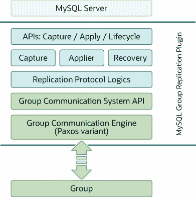

# 20.1.5 Group Replication 插件架构

> 原文：[`dev.mysql.com/doc/refman/8.0/en/group-replication-plugin-architecture.html`](https://dev.mysql.com/doc/refman/8.0/en/group-replication-plugin-architecture.html)

MySQL Group Replication 是一个 MySQL 插件，它建立在现有的 MySQL 复制基础设施之上，利用二进制日志、基于行的日志记录和全局事务标识符等功能。它与当前的 MySQL 框架集成，如性能模式或插件和服务基础设施。以下图表展示了 MySQL Group Replication 的整体架构。

**图 20.6 Group Replication 插件块图**

MySQL Group Replication 插件包括一组用于捕获、应用和生命周期的 API，控制插件与 MySQL 服务器的交互方式。有接口使信息从服务器流向插件，反之亦然。这些接口将 MySQL 服务器核心与 Group Replication 插件隔离开来，主要是放置在事务执行管道中的钩子。在一个方向上，从服务器到插件，有关于事件的通知，如服务器启动、服务器恢复、服务器准备好接受连接以及服务器即将提交事务。在另一个方向上，插件指示服务器执行动作，如提交或中止正在进行的事务，或将事务排队到中继日志中。

Group Replication 插件架构的下一层是一组组件，当通知路由到它们时会做出反应。捕获组件负责跟踪正在执行的事务相关的上下文。应用程序组件负责在数据库上执行远程事务。恢复组件管理分布式恢复，并负责通过选择捐赠者、管理赶上过程和对捐赠者故障做出反应，使加入组的服务器保持最新。

沿着堆栈继续，复制协议模块包含复制协议的具体逻辑。它处理冲突检测，并接收和传播事务到组中。

Group Replication 插件架构的最后两层是 Group Communication System（GCS）API 和基于 Paxos 的群组通信引擎（XCom）的实现。GCS API 是一个高级 API，抽象出构建复制状态机所需的属性（参见第 20.1 节，“Group Replication 背景”）。因此，它将消息传递层的实现与插件的其余上层分离开来。群组通信引擎处理与复制组成员的通信。
