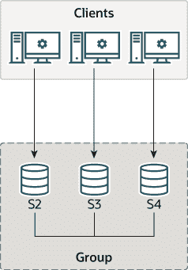

# 20.2.1 在单主模式下部署组复制

> 原文：[`dev.mysql.com/doc/refman/8.0/en/group-replication-deploying-in-single-primary-mode.html`](https://dev.mysql.com/doc/refman/8.0/en/group-replication-deploying-in-single-primary-mode.html)

20.2.1.1 部署用于组复制的实例

20.2.1.2 配置用于组复制的实例

20.2.1.3 分布式恢复的用户凭据

20.2.1.4 启动组复制

20.2.1.5 引导组

20.2.1.6 将实例添加到组中

组中的每个 MySQL 服务器实例可以运行在独立的物理主机上，这是部署组复制的推荐方式。本节解释了如何创建一个由三个 MySQL Server 实例组成的复制组，每个实例运行在不同的主机上。有关在同一主机上部署运行组复制的多个 MySQL 服务器实例的信息，请参见第 20.2.2 节，“在本地部署组复制”，例如用于测试目的。

**图 20.7 组架构**

本教程解释了如何获取并部署带有组复制插件的 MySQL Server，如何在创建组之前配置每个服务器实例，以及如何使用性能模式监视来验证一切是否正常运行。
