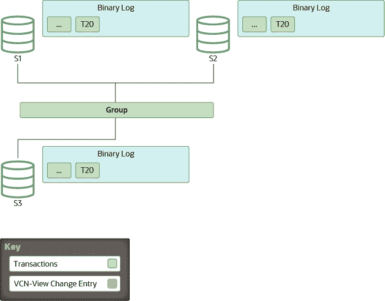
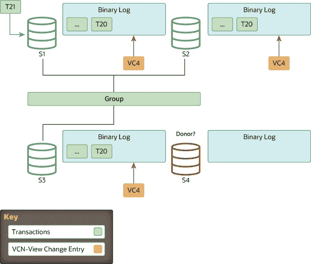
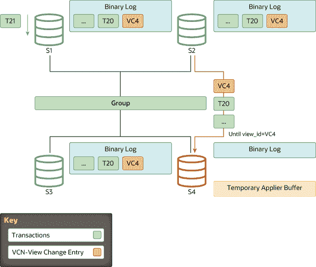
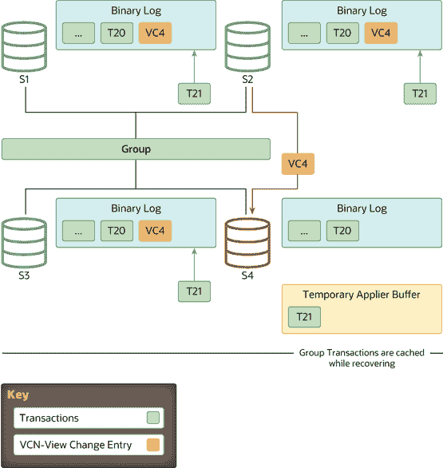
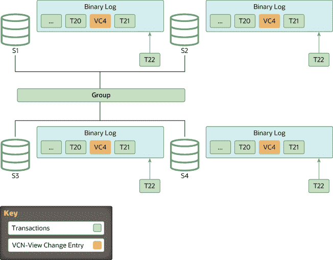

> 原文：[`dev.mysql.com/doc/refman/8.0/en/group-replication-view-changes.html`](https://dev.mysql.com/doc/refman/8.0/en/group-replication-view-changes.html)

#### 20.5.4.5 分布式恢复的工作原理

当 Group Replication 的分布式恢复过程从二进制日志中执行状态传输时，为了使加入的成员与捐赠者在特定时间点上同步，加入的成员和捐赠者使用 GTIDs（参见 Section 19.1.3, “Replication with Global Transaction Identifiers”）。然而，GTIDs 只提供了加入成员缺失的事务信息。它们并不能帮助标记加入群组的服务器必须追赶到的特定时间点，也不能传递认证信息。这是二进制日志视图标记的工作，它们标记了二进制日志流中的视图更改，并且包含额外的元数据信息，为加入成员提供缺失的与认证相关的数据。

本主题解释了视图更改的作用以及视图更改标识符，以及执行从二进制日志中进行状态传输的步骤。

##### 视图和视图更改

一个*视图*对应于在当前配置中积极参与的一组成员，换句话说就是在特定时间点。他们在群组中正常运行并在线。

*视图更改*发生在群组配置发生修改时，比如成员加入或离开。任何群组成员变更都会导致独立的视图更改，同时在同一逻辑时间点向所有成员通信。

*视图标识符*唯一标识一个视图。每当视图更改发生时，它就会生成。

在群组通信层，视图更改及其相关的视图标识符标记了成员加入之前和之后交换的数据之间的边界。这个概念通过二进制日志事件实现："视图更改日志事件"（VCLE）。视图标识符被记录下来，以划分在群组成员身份发生更改之前和之后传输的事务。

视图标识符本身由两部分构成：一个随机生成的部分和一个单调递增的整数。随机生成的部分在创建组时生成，并在组中至少有一个成员时保持不变。整数在每次视图更改发生时递增。使用这两个不同的部分使视图标识符能够识别由成员加入或离开引起的增量组更改，并且能够识别所有成员离开组导致的完全组关闭的情况，因此不会留下任何关于组处于何种视图的信息。在组从一开始创建时随机生成标识符的部分确保二进制日志中的数据标记保持唯一，并且在完全组关闭后不会重复使用相同的标识符，因为这将导致未来的分布式恢复出现问题。

##### 开始：稳定组

所有服务器都在线并处理来自组的传入交易。一些服务器可能在复制交易方面稍有落后，但最终它们会收敛。该组充当一个分布式和复制的数据库。

**图 20.8 稳定组**

##### 视图更改：成员加入

每当新成员加入组，因此执行视图更改时，每个在线服务器都会将视图更改日志事件排队等待执行。这是因为在视图更改之前，服务器上可以排队应用的多个交易，因此这些属于旧视图。在它们之后排队视图更改事件可以保证正确标记此事件发生的时间。

与此同时，加入的成员从在线服务器列表中选择一个适当的捐赠者，如成员服务通过视图抽象所述。一个成员在视图 4 上加入，而在线成员将视图更改事件写入二进制日志。

**图 20.9 成员加入**

##### 状态转移：追赶

如果组成员和加入成员都使用克隆插件进行设置（参见第 20.5.4.2 节，“用于分布式恢复的克隆”），并且加入成员与组之间的事务差异超过了远程克隆操作的阈值（`group_replication_clone_threshold`），则 Group Replication 将开始使用远程克隆操作进行分布式恢复。如果所需事务不再存在于任何组成员的二进制日志文件中，则还会执行远程克隆操作。在远程克隆操作期间，加入成员上的现有数据将被删除，并替换为捐赠者的数据副本。当远程克隆操作完成并加入成员重新启动后，将从捐赠者的二进制日志进行状态转移，以获取在远程克隆操作进行时组应用的事务。如果没有大的事务间隙，或者未安装克隆插件，则 Group Replication 直接进行从捐赠者的二进制日志进行状态转移。

对于从捐赠者的二进制日志进行状态转移，加入成员与捐赠者之间建立连接并开始状态转移。这种与捐赠者的交互会一直持续，直到加入组的服务器的应用程序线程处理与加入组时触发的视图更改日志事件相对应的视图更改日志事件。换句话说，加入组的服务器会从捐赠者进行复制，直到到达与其当前所在的视图标记相匹配的视图标记为止。

**图 20.10 状态转移：追赶上**

由于视图标识符在同一逻辑时间传输到组中的所有成员，因此加入组的服务器知道应在哪个视图标识符处停止复制。这避免了复杂的 GTID 集计算，因为视图标识符清楚地标记了哪些数据属于每个组视图。

当加入组的服务器从捐赠者进行复制时，同时也会缓存来自组的传入事务。最终，它停止从捐赠者进行复制，并切换到应用那些已经缓存的事务。

**图 20.11 排队事务**

##### 完成：追赶上

当加入组的服务器识别到具有预期视图标识符的视图更改日志事件时，与提供者的连接将被终止，并开始应用缓存的事务。虽然它在二进制日志中充当标记，分隔视图更改，但视图更改日志事件还扮演另一个角色。它传达了所有服务器在加入组时感知到的认证信息，换句话说是最后一次视图更改。没有它，加入组的服务器将没有必要的信息来认证（检测冲突）后续事务。

追赶的持续时间不确定，因为它取决于工作负载和事务进入组的速率。这个过程完全在线进行，加入组的服务器在追赶时不会阻塞任何其他服务器。因此，当服务器进入这个阶段时落后的事务数量可能会因工作负载而变化，从而增加或减少。

当加入组的服务器达到零排队事务并且其存储的数据与其他成员相同时，其公共状态变为在线。

**图 20.12 实例在线**

