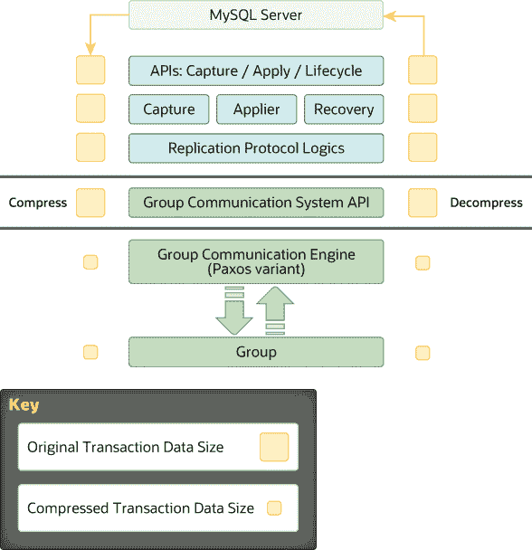

# 20.7.4 消息压缩

> 原文：[`dev.mysql.com/doc/refman/8.0/en/group-replication-message-compression.html`](https://dev.mysql.com/doc/refman/8.0/en/group-replication-message-compression.html)

对于在线群组成员之间发送的消息，Group Replication 默认启用消息压缩。特定消息是否被压缩取决于您使用`group_replication_compression_threshold`系统变量配置的阈值。超过指定字节数的有效载荷的消息将被压缩。

默认压缩阈值为 1000000 字节。您可以使用以下语句将压缩阈值增加到 2MB，例如：

```sql
STOP GROUP_REPLICATION;
SET GLOBAL group_replication_compression_threshold = 2097152;
START GROUP_REPLICATION;
```

如果将`group_replication_compression_threshold`设置为零，则消息压缩将被禁用。

Group Replication 使用 LZ4 压缩算法来压缩组内发送的消息。请注意，LZ4 压缩算法支持的最大输入大小为 2113929216 字节。这个限制低于`group_replication_compression_threshold`系统变量的最大可能值，该值与 XCom 接受的最大消息大小相匹配。因此，LZ4 最大输入大小是消息压缩的实际限制，当启用消息压缩时，超过此大小的事务无法提交。使用 LZ4 压缩算法时，请不要为`group_replication_compression_threshold`设置大于 2113929216 字节的值。

Group Replication 不要求所有组成员的`group_replication_compression_threshold`的值相同。然而，建议在所有组成员上设置相同的值，以避免事务不必要的回滚、消息传递失败或消息恢复失败。

从 MySQL 8.0.18 开始，您还可以为通过从捐赠者的二进制日志进行状态传输的分布式恢复发送的消息配置压缩。这些消息的压缩，从已在组中的捐赠者发送到加入成员，是通过`group_replication_recovery_compression_algorithms`和`group_replication_recovery_zstd_compression_level`系统变量分别控制。有关更多信息，请参见 Section 6.2.8，“连接压缩控制”。

二进制日志事务压缩（自 MySQL 8.0.20 起可用），由`binlog_transaction_compression`系统变量激活，也可用于节省带宽。当事务负载在组成员之间传输时保持压缩。如果您将二进制日志事务压缩与 Group Replication 的消息压缩结合使用，消息压缩的作用机会较少，但仍可压缩标头以及未压缩的事件和事务负载。有关二进制日志事务压缩的更多信息，请参见 Section 7.4.4.5，“二进制日志事务压缩”。

组内发送的消息的压缩发生在组通信引擎级别，即在数据交给组通信线程之前，因此在`mysql`用户会话线程的上下文中进行。如果消息负载大小超过`group_replication_compression_threshold`设置的阈值，事务负载在发送到组之前会被压缩，并在接收时解压缩。接收消息时，成员会检查消息信封以验证是否已压缩。如果需要，则成员在将事务传递到上层之前对其进行解压缩。此过程如下图所示。

**图 20.13 压缩支持**



当网络带宽成为瓶颈时，消息压缩可以在组通信级别提供高达 30-40%的吞吐量改进。这在负载下的大型服务器组的情况下尤为重要。组内*N*个参与者之间的互连是 TCP 点对点的性质，使发送方将相同数量的数据发送*N*次。此外，二进制日志可能具有较高的压缩比。这使得压缩成为包含大型事务的 Group Replication 工作负载的一个引人注目的特性。
