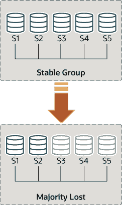
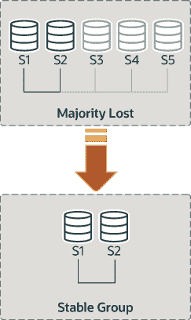

# 20.7.8 处理网络分区和失去法定人数

> 原文：[`dev.mysql.com/doc/refman/8.0/en/group-replication-network-partitioning.html`](https://dev.mysql.com/doc/refman/8.0/en/group-replication-network-partitioning.html)

当需要复制发生的更改时，组需要达成共识。这适用于常规事务，但也适用于组成员更改和保持组一致性的某些内部消息。共识要求组成员中的大多数同意给定决定。当组成员的大多数丢失时，组无法继续进行并阻塞，因为它无法获得法定人数或法定人数。

当有多个非自愿故障导致大多数服务器突然从组中移除时，可能会丢失法定人数。例如，在 5 台服务器组中，如果其中有 3 台同时变得沉默，那么大多数就会受到影响，因此无法实现法定人数。事实上，剩下的两台无法确定其他 3 台服务器是否已崩溃，还是网络分区已将这两台孤立，因此组无法自动重新配置。

另一方面，如果服务器自愿退出组，它们会指示组应重新配置自身。实际上，这意味着要离开的服务器告诉其他人它要离开。这意味着其他成员可以正确地重新配置组，维护成员的一致性并重新计算法定人数。例如，在上述 5 台服务器的情况下，如果有 3 台同时离开，如果这 3 台离开的服务器依次警告组它们要离开，那么成员资格就能够从 5 调整到 2，并同时在此过程中确保法定人数。

注意

失去法定人数本身就是规划不良的副作用。根据预期故障数量规划组大小（无论这些故障是连续发生、同时发生还是零星发生）。

对于单主模式的组，主服务器可能有一些尚未在网络分区发生时其他成员上出现的事务。如果考虑将主服务器排除在新组之外，请注意这些事务可能会丢失。具有额外事务的成员无法重新加入组，尝试会导致错误消息，内容为此成员的已执行事务多于组中存在的事务。设置`group_replication_unreachable_majority_timeout`系统变量以避免此情况。

以下各节解释了如果系统以使组内服务器无法自动实现法定人数的方式分区应该怎么办。

#### 检测分区

`replication_group_members` 性能模式表呈现了从该服务器的视角看到的当前视图中每台服务器的状态。大多数情况下，系统不会遇到分区，因此该表显示跨组中所有服务器一致的信息。换句话说，该表上每台服务器的状态在当前视图中得到了所有人的认可。然而，如果存在网络分区，并且丢失了法定人数，那么对于那些无法联系的服务器，该表将显示状态为 `UNREACHABLE`。这些信息由 Group Replication 内置的本地故障检测器导出。

**图 20.14 失去法定人数**



要理解这种类型的网络分区，以下部分描述了最初有 5 台服务器正确协作的情景，以及一旦只有 2 台服务器在线后组发生的变化。该情景在图中描述。

因此，假设有一个包含这 5 台服务器的组：

+   服务器 s1 的成员标识符为 `199b2df7-4aaf-11e6-bb16-28b2bd168d07`

+   服务器 s2 的成员标识符为 `199bb88e-4aaf-11e6-babe-28b2bd168d07`

+   服务器 s3 的成员标识符为 `1999b9fb-4aaf-11e6-bb54-28b2bd168d07`

+   服务器 s4 的成员标识符为 `19ab72fc-4aaf-11e6-bb51-28b2bd168d07`

+   服务器 s5 的成员标识符为 `19b33846-4aaf-11e6-ba81-28b2bd168d07`

最初，组运行良好，服务器之间愉快地进行通信。您可以通过登录 s1 并查看其 `replication_group_members` 性能模式表来验证这一点。例如：

```sql
mysql> SELECT MEMBER_ID,MEMBER_STATE, MEMBER_ROLE FROM performance_schema.replication_group_members;
+--------------------------------------+--------------+-------------+
| MEMBER_ID                            | MEMBER_STATE | MEMBER_ROLE |
+--------------------------------------+--------------+-------------+
| 1999b9fb-4aaf-11e6-bb54-28b2bd168d07 | ONLINE       | SECONDARY   |
| 199b2df7-4aaf-11e6-bb16-28b2bd168d07 | ONLINE       | PRIMARY     |
| 199bb88e-4aaf-11e6-babe-28b2bd168d07 | ONLINE       | SECONDARY   |
| 19ab72fc-4aaf-11e6-bb51-28b2bd168d07 | ONLINE       | SECONDARY   |
| 19b33846-4aaf-11e6-ba81-28b2bd168d07 | ONLINE       | SECONDARY   |
+--------------------------------------+--------------+-------------+
```

然而，片刻之后发生了灾难性故障，服务器 s3、s4 和 s5 意外停止运行。几秒钟后，再次查看 s1 上的 `replication_group_members` 表，显示它仍然在线，但其他几个成员不在线。事实上，如下所示，它们被标记为 `UNREACHABLE`。此外，系统无法重新配置自身以更改成员资格，因为大多数成员已经丢失。

```sql
mysql> SELECT MEMBER_ID,MEMBER_STATE FROM performance_schema.replication_group_members;
+--------------------------------------+--------------+
| MEMBER_ID                            | MEMBER_STATE |
+--------------------------------------+--------------+
| 1999b9fb-4aaf-11e6-bb54-28b2bd168d07 | UNREACHABLE  |
| 199b2df7-4aaf-11e6-bb16-28b2bd168d07 | ONLINE       |
| 199bb88e-4aaf-11e6-babe-28b2bd168d07 | ONLINE       |
| 19ab72fc-4aaf-11e6-bb51-28b2bd168d07 | UNREACHABLE  |
| 19b33846-4aaf-11e6-ba81-28b2bd168d07 | UNREACHABLE  |
+--------------------------------------+--------------+
```

表格显示，s1 现在处于一个没有办法继续进行的组中，因为大多数服务器无法访问。在这种特殊情况下，需要重置组成员列表以允许系统继续进行，这在本节中有解释。或者，您也可以选择停止 s1 和 s2 上的组复制（或完全停止 s1 和 s2），弄清楚 s3、s4 和 s5 发生了什么，然后重新启动组复制（或服务器）。

#### 解除分区阻塞

组复制使您能够通过强制特定配置来重置组成员列表。例如，在上述情况中，只有 s1 和 s2 在线，您可以选择强制执行仅包含 s1 和 s2 的成员配置。这需要检查有关 s1 和 s2 的一些信息，然后使用 `group_replication_force_members` 变量。

**图 20.15 强制执行新的成员配置**



假设您回到了只剩下 s1 和 s2 两台服务器的情况。服务器 s3、s4 和 s5 突然离开了组。为了让服务器 s1 和 s2 继续运行，您希望强制执行一个只包含 s1 和 s2 的成员配置。

警告

此过程使用 `group_replication_force_members` ，应被视为最后的补救措施。它*必须*极度小心使用，仅用于覆盖丧失法定人数的情况。如果被滥用，可能会导致人为的脑裂情况或完全阻塞整个系统。

在强制执行新的成员配置时，请确保任何要被强制退出组的服务器确实已经停止运行。在上述场景中，如果 s3、s4 和 s5 并非真正无法访问，而是在线的话，它们可能已经形成了自己的功能分区（它们是 5 台中的 3 台，因此拥有多数派）。在这种情况下，强制使用只包含 s1 和 s2 的组成员列表可能会导致人为的脑裂情况。因此，在强制执行新的成员配置之前，确保要排除的服务器确实已关闭，如果没有关闭，请在继续之前关闭它们。

警告

对于单主模式的组，主服务器可能有一些在网络分区时其他成员尚未存在的事务。如果您考虑将主服务器排除在新组之外，请注意这些事务可能会丢失。具有额外事务的成员无法重新加入组，尝试会导致错误消息为此成员的已执行事务多于组中存在的事务。设置`group_replication_unreachable_majority_timeout`系统变量以避免此情况。

请记住系统被阻塞，当前配置如下（由`s1`上的本地故障检测器感知）：

```sql
mysql> SELECT MEMBER_ID,MEMBER_STATE FROM performance_schema.replication_group_members;
+--------------------------------------+--------------+
| MEMBER_ID                            | MEMBER_STATE |
+--------------------------------------+--------------+
| 1999b9fb-4aaf-11e6-bb54-28b2bd168d07 | UNREACHABLE  |
| 199b2df7-4aaf-11e6-bb16-28b2bd168d07 | ONLINE       |
| 199bb88e-4aaf-11e6-babe-28b2bd168d07 | ONLINE       |
| 19ab72fc-4aaf-11e6-bb51-28b2bd168d07 | UNREACHABLE  |
| 19b33846-4aaf-11e6-ba81-28b2bd168d07 | UNREACHABLE  |
+--------------------------------------+--------------+
```

首先要做的是检查`s1`和`s2`的本地地址（组通信标识符）。登录到`s1`和`s2`，并按以下方式获取该信息。

```sql
mysql> SELECT @@group_replication_local_address;
```

一旦知道`s1`（`127.0.0.1:10000`）和`s2`（`127.0.0.1:10001`）的组通信地址，您可以在两个服务器中的一个上使用它来注入新的成员配置，从而覆盖已失去法定人数的现有配置。在`s1`上执行以下操作：

```sql
mysql> SET GLOBAL group_replication_force_members="127.0.0.1:10000,127.0.0.1:10001";
```

通过强制不同配置来解除组的阻塞。在此更改后，检查`s1`和`s2`上的`replication_group_members`以验证组成员身份。首先在`s1`上。

```sql
mysql> SELECT MEMBER_ID,MEMBER_STATE FROM performance_schema.replication_group_members;
+--------------------------------------+--------------+
| MEMBER_ID                            | MEMBER_STATE |
+--------------------------------------+--------------+
| b5ffe505-4ab6-11e6-b04b-28b2bd168d07 | ONLINE       |
| b60907e7-4ab6-11e6-afb7-28b2bd168d07 | ONLINE       |
+--------------------------------------+--------------+
```

然后在`s2`上执行。

```sql
mysql> SELECT * FROM performance_schema.replication_group_members;
+--------------------------------------+--------------+
| MEMBER_ID                            | MEMBER_STATE |
+--------------------------------------+--------------+
| b5ffe505-4ab6-11e6-b04b-28b2bd168d07 | ONLINE       |
| b60907e7-4ab6-11e6-afb7-28b2bd168d07 | ONLINE       |
+--------------------------------------+--------------+
```

在使用`group_replication_force_members`系统变量成功强制新的组成员身份并解除组阻塞后，请确保清除该系统变量。为了发出`START GROUP_REPLICATION`语句，`group_replication_force_members`必须为空。
