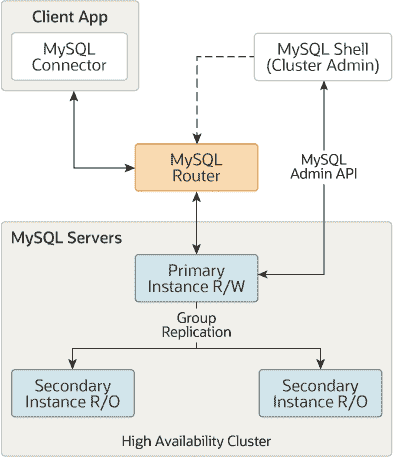

# 第二十三章 InnoDB 集群

> 原文：[`dev.mysql.com/doc/refman/8.0/en/mysql-innodb-cluster-introduction.html`](https://dev.mysql.com/doc/refman/8.0/en/mysql-innodb-cluster-introduction.html)

本章介绍了 MySQL InnoDB 集群，它结合了 MySQL 技术，使您能够部署和管理 MySQL 的完整集成高可用性解决方案。本内容是 InnoDB 集群的高级概述，有关完整文档，请参阅 MySQL InnoDB 集群。

重要

InnoDB 集群不支持 MySQL NDB 集群。有关 MySQL NDB 集群的更多信息，请参阅第二十五章 *MySQL NDB 集群 8.0*和第 25.2.6 节，“使用 InnoDB 的 MySQL 服务器与 NDB 集群比较”。

InnoDB 集群由至少三个 MySQL 服务器实例组成，并提供高可用性和扩展功能。InnoDB 集群使用以下 MySQL 技术：

+   MySQL Shell，这是一个用于 MySQL 的高级客户端和代码编辑器。

+   MySQL 服务器，以及组复制，使一组 MySQL 实例能够提供高可用性。InnoDB 集群提供了一种替代的、易于使用的编程方式来处理组复制。

+   MySQL 路由器，一个轻量级中间件，提供应用程序与 InnoDB 集群之间的透明路由。

以下图表显示了这些技术如何共同工作的概述：

**图 23.1 InnoDB 集群概述**

基于 MySQL 组复制构建，提供了诸如自动成员管理、容错性、自动故障转移等功能。InnoDB 集群通常以单主模式运行，其中一个主实例（读写）和多个次要实例（只读）。高级用户还可以利用多主模式，其中所有实例都是主实例。甚至可以在 InnoDB 集群在线时更改集群的拓扑结构，以确保最高可能的可用性。

你可以使用 AdminAPI 来操作 InnoDB Cluster，该 API 作为 MySQL Shell 的一部分提供。AdminAPI 支持 JavaScript 和 Python，并且非常适合用于脚本编写和自动化部署 MySQL 以实现高可用性和可扩展性。通过使用 MySQL Shell 的 AdminAPI，你可以避免手动配置许多实例的需要。相反，AdminAPI 提供了一个有效的现代界面来管理一组 MySQL 实例，并使你能够从一个中央工具中进行部署、管理和监控。

要开始使用 InnoDB Cluster，你需要[下载](https://dev.mysql.com/downloads/shell/)和安装 MySQL Shell。你需要一些安装了 MySQL Server 实例的主机，并且你也可以安装 MySQL Router。

InnoDB Cluster 支持 MySQL Clone，这使得实例的部署变得简单。在过去，为了在一个 MySQL 实例集合中加入一个新实例，你需要手动将事务传输到加入的实例中。这可能涉及制作文件副本、手动复制等操作。使用 InnoDB Cluster，你只需简单地添加一个实例到集群中，它就会自动部署。

同样，InnoDB Cluster 与 MySQL Router 紧密集成，你可以使用 AdminAPI 来与它们一起工作。MySQL Router 可以根据 InnoDB Cluster 自动配置自身，这个过程称为引导，这消除了你手动配置路由的需要。MySQL Router 然后透明地连接客户端应用程序到 InnoDB Cluster，为客户端连接提供路由和负载均衡。这种集成还使你能够使用 AdminAPI 管理针对 InnoDB Cluster 引导的一些 MySQL Router 的方面。InnoDB Cluster 状态信息包括针对集群引导的 MySQL Router 的详细信息。操作使你能够在集群级别创建 MySQL Router 用户，与引导到集群的 MySQL Router 一起工作等。

欲了解更多关于这些技术的信息，请参阅描述中链接的用户文档。除了这些用户文档外，还有所有 AdminAPI 方法的开发人员文档在 MySQL Shell JavaScript API 参考或 MySQL Shell Python API 参考中，可从 Connectors and APIs 获取。
