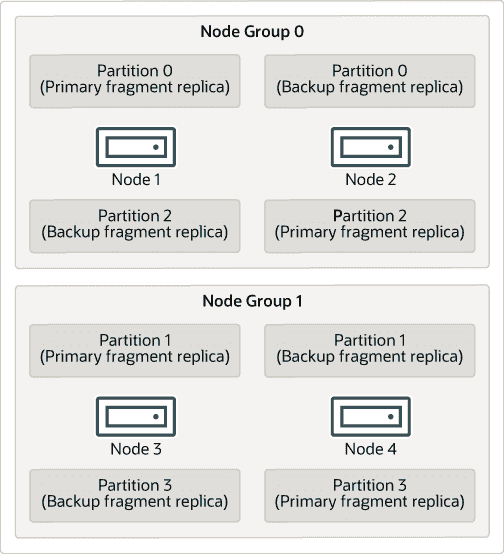
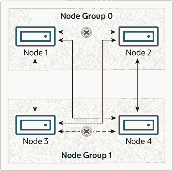

# 25.2.2 NDB Cluster 节点、节点组、分片副本和分区

> 原文：[`dev.mysql.com/doc/refman/8.0/en/mysql-cluster-nodes-groups.html`](https://dev.mysql.com/doc/refman/8.0/en/mysql-cluster-nodes-groups.html)

本节讨论了 NDB Cluster 如何划分和复制数据以进行存储。

下面几段讨论了理解这个主题所需的一些核心概念。

**数据节点。** 一个存储一个或多个分片副本的**ndbd**或**ndbmtd**")进程，即分配给节点组的分区的副本（稍后在本节中讨论）。

每个数据节点应位于单独的计算机上。虽然也可以在单台计算机上托管多个数据节点进程，但通常不建议这样配置。

当提到**ndbd**或**ndbmtd**")进程时，通常会将“节点”和“数据节点”这两个术语互换使用；在本讨论中，管理节点(**ndb_mgmd**进程)和 SQL 节点(**mysqld**进程)在提到时会明确指出。

**节点组。** 节点组由一个或多个节点组成，并存储分区或分片副本集（见下一项）。

NDB Cluster 中的节点组数量不是直接可配置的；它是数据节点数量和分片副本数量(`NoOfReplicas`配置参数)的函数，如下所示：

```sql
[# of node groups] = [# of data nodes] / NoOfReplicas
```

因此，如果在`config.ini`文件中将`NoOfReplicas`设置为 1，则具有 4 个数据节点的 NDB Cluster 有 4 个节点组，如果将`NoOfReplicas`设置为 2，则有 2 个节点组，如果将`NoOfReplicas`设置为 4，则有 1 个节点组。分片副本将在本节后面讨论；有关`NoOfReplicas`的更多信息，请参见第 25.4.3.6 节，“定义 NDB Cluster 数据节点”。

注意

NDB Cluster 中的所有节点组必须具有相同数量的数据节点。

您可以在线向运行中的 NDB Cluster 添加新的节点组（因此添加新的数据节点）；有关更多信息，请参见第 25.6.7 节“在线添加 NDB Cluster 数据节点”。

**分区。** 这是集群中存储的数据的一部分。每个节点负责至少保留分配给它的任何分区（即至少一个片段副本）可供集群使用。

默认情况下，NDB Cluster 使用的分区数量取决于数据节点的数量和数据节点使用的 LDM 线程数量，如下所示：

```sql
[# of partitions] = [# of data nodes] * [# of LDM threads]
```

当使用运行**ndbmtd**的数据节点时，LDM 线程的数量由`MaxNoOfExecutionThreads`的设置控制。当使用**ndbd**时，只有一个 LDM 线程，这意味着参与集群的节点数量与集群分区数量相同。当使用**ndbmtd**且`MaxNoOfExecutionThreads`设置为 3 或更少时也是如此。（您应该注意，LDM 线程的数量随着此参数的值增加，但不是严格线性增加，并且对设置它有额外的约束；有关更多信息，请参阅`MaxNoOfExecutionThreads`的描述。）

**NDB 和用户定义的分区。** NDB Cluster 通常会自动对`NDBCLUSTER`表进行分区。但是，也可以使用`NDBCLUSTER`表进行用户定义的分区。这受以下限制：

1.  仅支持在生产环境中使用`KEY`和`LINEAR KEY`分区方案与`NDB`表。

1.  任何`NDB`表明确定的显式分区的最大数量为`8 * [*线程数*] * [*节点组数*]`，NDB 集群中的节点组数量如本节前面讨论的那样确定。在运行**ndbd**进行数据节点进程时，设置 LDM 线程数不会产生影响（因为`ThreadConfig`仅适用于**ndbmtd**）；在这种情况下，为了进行此计算，可以将此值视为等于 1。

    查看第 25.5.3 节，“ndbmtd — NDB 集群数据节点守护程序（多线程）”，获取更多信息。

有关 NDB 集群和用户定义分区的更多信息，请参阅第 25.2.7 节，“NDB 集群的已知限制”和第 26.6.2 节，“与存储引擎相关的分区限制”。

**分片副本。** 这是集群分区的副本。每个节点组中的每个节点都存储一个分片副本。有时也称为分区副本。分片副本的数量等于每个节点组中的节点数。

一个分片副本完全属于一个节点；一个节点可以（通常也会）存储多个分片副本。

以下图示说明了一个具有四个数据节点的 NDB 集群，运行**ndbd**，排列在两个每个两个节点的节点组中；节点 1 和 2 属于节点组 0，节点 3 和 4 属于节点组 1。

注意

这里只显示数据节点；尽管工作中的 NDB 集群需要一个用于集群管理的**ndb_mgmd**进程和至少一个 SQL 节点来访问集群存储的数据，但出于清晰起见，这些在图中被省略。

**图 25.2 NDB 集群与两个节点组**



集群存储的数据分为四个分区，编号为 0、1、2 和 3。每个分区都存储在同一节点组中的���个副本中。分区存储在交替的节点组中，如下所示：

+   分区 0 存储在节点组 0 上；主分片副本（主分区的备份）存储在节点 1 上，备份分片副本（分区的备份副本）存储在节点 2 上。

+   第 1 分区存储在另一个节点组（节点组 1）上；该分区的主要片段副本位于节点 3 上，备份片段副本位于节点 4 上。

+   第 2 分区存储在节点组 0。然而，其两个片段副本的放置与第 0 分区相反；对于第 2 分区，主要片段副本存储在节点 2 上，备份存储在节点 1 上。

+   第 3 分区存储在节点组 1 上，其两个片段副本的放置与第 1 分区相反。也就是说，其主要片段副本位于节点 4 上，备份位于节点 3 上。

关于 NDB 集群的持续运行意味着：只要参与集群的每个节点组至少有一个节点在运行，集群就拥有所有数据的完整副本并保持可用。这在下一个图表中有所说明。

**图 25.3 2x2 NDB 集群所需的节点**



在这个例子中，集群由两个节点组组成，每个节点组包含两个数据节点。每个数据节点都在运行一个实例的**ndbd**。从节点组 0 中至少选择一个节点和从节点组 1 中至少选择一个节点的任意组合就足以保持集群“活跃”。然而，如果来自单个节点组的两个节点都失败了，那么另一个节点组中剩余的两个节点组成的组合是不够的。在这种情况下，集群已经丢失了一个完整的分区，因此无法再提供对所有 NDB 集群数据的完整访问。

单个 NDB 集群实例支持的最大节点组数为 48。
