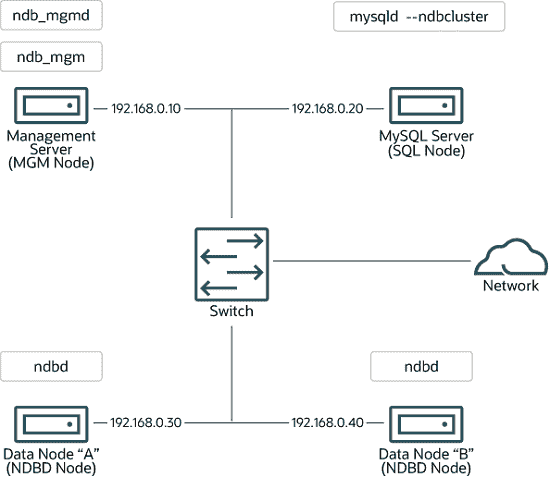

# 25.3 NDB Cluster 安装

> 原文：[`dev.mysql.com/doc/refman/8.0/en/mysql-cluster-installation.html`](https://dev.mysql.com/doc/refman/8.0/en/mysql-cluster-installation.html)

25.3.1 在 Linux 上安装 NDB Cluster

25.3.2 在 Windows 上安装 NDB Cluster

25.3.3 NDB Cluster 的初始配置

25.3.4 NDB Cluster 的初始启动

25.3.5 带有表和数据的 NDB Cluster 示例

25.3.6 NDB Cluster 的安全关闭和重启

25.3.7 NDB Cluster 的升级和降级

25.3.8 NDB Cluster 自动安装程序（不再支持）

本节描述了规划、安装、配置和运行 NDB Cluster 的基础知识。虽然第 25.4 节，“NDB Cluster 的配置”中的示例提供了更深入的关于各种集群选项和配置的信息，但遵循这里概述的指导方针和程序的结果应该是一个符合*最低*可用性和数据保护要求的可用 NDB Cluster。

有关在不同版本之间升级或降级 NDB Cluster 的信息，请参阅第 25.3.7 节，“NDB Cluster 的升级和降级”。

本节涵盖了硬件和软件要求；网络问题；NDB Cluster 的安装；基本配置问题；启动、停止和重启集群；加载示例数据库；以及执行查询。

**假设。** 以下部分对集群的物理和网络配置做出了一些假设。这些假设将在接下来的几段中讨论。

**集群节点和主机计算机。** 集群由四个节点组成，每个节点位于单独的主机计算机上，并且每个节点在典型以太网网络上有一个固定的网络地址，如下所示：

**表 25.5 示例集群中节点的网络地址**

| 节点 | IP 地址 |
| --- | --- |
| 管理节点 (**mgmd**) | 198.51.100.10 |
| SQL 节点 (**mysqld**) | 198.51.100.20 |
| 数据节点 "A" (**ndbd**) | 198.51.100.30 |
| 数据节点 "B" (**ndbd**) | 198.51.100.40 |

这个设置也显示在以下图表中：

**图 25.4 NDB Cluster 多计算机设置**



**网络寻址。** 为了简单（和可靠性）起见，这个*How-To*只使用数字 IP 地址。但是，如果您的网络上有 DNS 解析，可以在配置 Cluster 时使用主机名代替 IP 地址。或者，您可以使用`hosts`文件（通常是 Linux 和其他类 Unix 操作系统的`/etc/hosts`，Windows 上是`C:\WINDOWS\system32\drivers\etc\hosts`，或者您操作系统的等效文件）来提供主机查找的方法（如果可用）。

从 NDB 8.0.22 开始，`NDB`支持所有 NDB Cluster 节点之间的 IPv6 连接。

在运行 NDB 8.0.22 及更高版本时，Linux 平台上已知的问题是操作系统内核需要提供 IPv6 支持，即使没有使用 IPv6 地址。这个问题在 NDB 8.0.34 及更高版本中已修复（Bug #33324817，Bug #33870642）。

如果您正在使用受影响的版本并希望在系统上禁用对 IPv6 的支持（因为您不打算为 NDB Cluster 节点使用任何 IPv6 地址），请在系统启动后执行以下操作：

```sql
$> sysctl -w net.ipv6.conf.all.disable_ipv6=1
$> sysctl -w net.ipv6.conf.default.disable_ipv6=1
```

（或者，您可以将相应的行添加到`/etc/sysctl.conf`中。）在 NDB Cluster 8.0.34 及更高版本中，前述操作是不必要的，如果您不想或不需要使用 IPv6 支持，可以简单地在 Linux 内核中禁用 IPv6 支持。

在 NDB 8.0.21 及更早版本中，用于与数据和管理节点进行连接的所有网络地址必须使用 IPv4 或可解析为 IPv4，包括 SQL 节点用于联系其他节点的地址。

**潜在的主机文件问题。** 当尝试为 Cluster 节点使用主机名时，一个常见问题是由于某些操作系统（包括一些 Linux 发行版）在安装过程中设置系统自身主机名的方式而引起的。考虑两台主机名为`ndb1`和`ndb2`的机器，都在`cluster`网络域中。Red Hat Linux（包括一些衍生版如 CentOS 和 Fedora）将以下条目放在这些机器的`/etc/hosts`文件中：

```sql
#  ndb1 /etc/hosts:
127.0.0.1   ndb1.cluster ndb1 localhost.localdomain localhost
```

```sql
#  ndb2 /etc/hosts:
127.0.0.1   ndb2.cluster ndb2 localhost.localdomain localhost
```

SUSE Linux（包括 OpenSUSE）将这些条目放在机器的`/etc/hosts`文件中：

```sql
#  ndb1 /etc/hosts:
127.0.0.1       localhost
127.0.0.2       ndb1.cluster ndb1
```

```sql
#  ndb2 /etc/hosts:
127.0.0.1       localhost
127.0.0.2       ndb2.cluster ndb2
```

在这两种情况下，`ndb1`将`ndb1.cluster`路由到一个环回 IP 地址，但从 DNS 获取`ndb2.cluster`的公共 IP 地址，而`ndb2`将`ndb2.cluster`路由到一个环回地址，并为`ndb1.cluster`获取公共地址。结果是每个数据节点连接到管理服务器，但无法知道其他数据节点何时连接，因此数据节点在启动时似乎挂起。

注意

你不能在`config.ini`中混合使用`localhost`和其他主机名或 IP 地址。在这种情况下的解决方案（除非对*所有*`config.ini` `HostName`条目使用 IP 地址）是从`/etc/hosts`中删除完全合格的主机名，并在`config.ini`中为所有集群主机使用这些主机名。

**主机计算机类型。** 在我们的安装方案中，每台主机计算机都是一台基于英特尔的台式个人电脑，运行着已安装到磁盘中的支持的操作系统，以标准配置运行，并且不运行任何不必要的服务。具备标准 TCP/IP 网络功能的核心操作系统应该足够了。另外为了简单起见，我们还假设所有主机上的文件系统设置是相同的。如果不是这样，请相应调整这些说明。

**网络硬件。** 每台机器上都安装了标准的 100 Mbps 或 1 千兆以太网卡，以及适当的卡驱动程序，并且所有四台主机通过标准的以太网网络设备（如交换机）连接在一起。（所有机器应使用具有相同吞吐量的网络卡。也就是说，集群中的所有四台机器应该有 100 Mbps 网卡 *或者* 所有四台机器应该有 1 Gbps 网卡。）NDB 集群在 100 Mbps 网络中工作；然而，千兆以太网提供更好的性能。

重要提示

NDB 集群 *不* 适用于吞吐量低于 100 Mbps 或遇到高延迟的网络。因此（以及其他原因），尝试在互联网等广域网上运行 NDB 集群不太可能成功，并且不受生产支持。

**示例数据。** 我们使用可从 MySQL 网站下载的`world`数据库（请参阅`dev.mysql.com/doc/index-other.html`）。我们假设每台机器都有足够的内存来运行操作系统、所需的 NDB 集群进程，并且（在数据节点上）存储数据库。

有关安装 MySQL 的一般信息，请参见第二章，*安装 MySQL*。有关在 Linux 和其他类 Unix 操作系统上安装 NDB 集群的信息，请参见第 25.3.1 节，“在 Linux 上安装 NDB 集群”。有关在 Windows 操作系统上安装 NDB 集群的信息，请参见第 25.3.2 节，“在 Windows 上安装 NDB 集群”。

有关 NDB 集群硬件、软件和网络要求的一般信息，请参见第 25.2.3 节，“NDB 集群硬件、软件和网络要求”。
