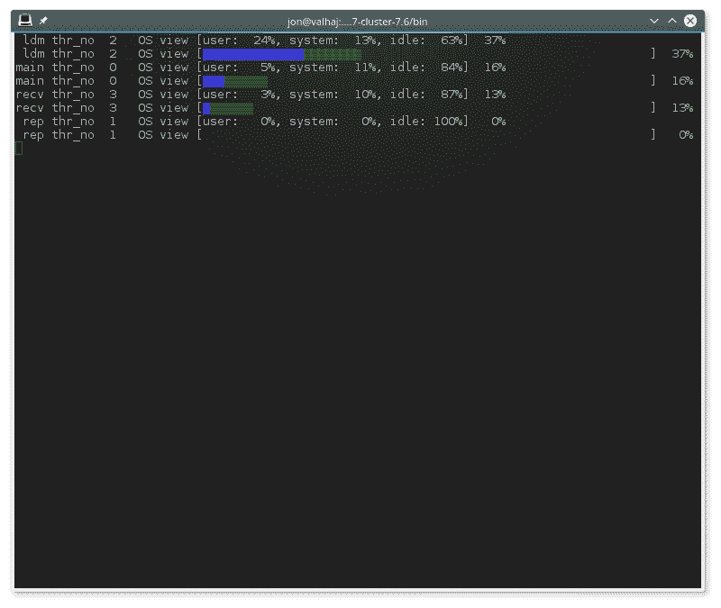

# 25.5.29 ndb_top — 查看 NDB 线程的 CPU 使用信息

> 原文：[`dev.mysql.com/doc/refman/8.0/en/mysql-cluster-programs-ndb-top.html`](https://dev.mysql.com/doc/refman/8.0/en/mysql-cluster-programs-ndb-top.html)

**ndb_top** 在终端中显示有关 NDB 线程在 NDB Cluster 数据节点上的 CPU 使用情况的运行信息。每个线程在输出中由两行表示，第一行显示系统统计信息，第二行显示线程的测量统计信息。

**ndb_top** 从 MySQL NDB Cluster 7.6.3 版本开始提供。

#### 使用方法

```sql
ndb_top [-h *hostname*] [-t *port*] [-u *user*] [-p *pass*] [-n *node_id*]
```

**ndb_top** 连接到作为集群的 SQL 节点运行的 MySQL Server。默认情况下，它尝试连接到在 `localhost` 和端口 3306 上运行的 **mysqld**，作为 MySQL `root` 用户，未指定密码。您可以使用 `--host` (`-h`) 和 `--port` (`-t`) 分别覆盖默认主机和端口。要指定 MySQL 用户和密码，请使用 `--user` (`-u`) 和 `--passwd` (`-p`) 选项。此用户必须能够读取 `ndbinfo` 数据库中的表（**ndb_top** 使用来自 `ndbinfo.cpustat` 和相关表的信息）。

欲了解更多关于 MySQL 用户账户和密码的信息，请参阅 Section 8.2, “访问控制和账户管理”。

输出可作为纯文本或 ASCII 图形获得；您可以使用 `--text` (`-x`) 和 `--graph` (`-g`) 选项分别指定。这两种显示模式提供相同的信息；它们可以同时使用。至少一个显示模式必须在使用中。

图形的彩色显示受支持并默认启用 (`--color` 或 `-c` 选项)。启用彩色支持后，图形显示中显示 OS 用户时间为蓝色，OS 系统时间为绿色，空闲时间为空白。对于测量负载，蓝色用于执行时间，黄色用于发送时间，红色用于在发送缓冲区满等待的时间，空白用于空闲时间。图形显示中显示的百分比是所有非空闲线程的百分比之和。目前无法配置颜色；您可以使用 `--skip-color` 来使用灰度代替。

排序视图 (`--sort`, `-r`) 基于测量负载的最大值和操作系统报告的负载。可以使用 `--measured-load` (`-m`) 和 `--os-load` (`-o`) 选项启用和禁用这些负载的显示。这些负载中至少一个必须启用显示。

程序尝试从具有由`--node-id` (`-n`) 选项给定的节点 ID 的数据节点获取统计信息；如果未指定，则为 1\. **ndb_top** 无法提供关于其他类型节点的信息。

视图会根据终端窗口的高度和宽度自动调整；最小支持宽度为 76 个字符。

一旦启动，**ndb_top** 将持续运行直到强制退出；您可以使用 `Ctrl-C` 退出程序。显示每秒更新一次；要设置不同的延迟间隔，请使用 `--sleep-time` (`-s`)。

注意

**ndb_top** 可在 macOS、Linux 和 Solaris 上使用。目前不支持在 Windows 平台上。

以下表格包含所有特定于 NDB 集群程序 **ndb_top** 的选项。表格后面是附加描述。

**表 25.50 与程序 ndb_top 一起使用的命令行选项**

| 格式 | 描述 | 添加、弃用或移除 |
| --- | --- | --- |
| `--color`,`-c` | 以彩色显示 ASCII 图形；使用 --skip-colors 可以禁用 | (在基于 MySQL 8.0 的所有 NDB 版本中支持) |
| `--defaults-extra-file=path` | 在读取全局文件后读取给定文件 | (在基于 MySQL 8.0 的所有 NDB 版本中支持) |
| `--defaults-file=path` | 仅从给定文件中读取默认选项 | (在基于 MySQL 8.0 的所有 NDB 版本中支持) |
| `--defaults-group-suffix=string` | 还读取具有 concat(group, suffix) 的组 | (在基于 MySQL 8.0 的所有 NDB 版本中支持) |
| `--graph`,`-g` | 使用图表显示数据；使用 --skip-graphs 禁用 | (在基于 MySQL 8.0 的所有 NDB 版本中支持) |
| `--help` | 显示程序使用信息 | (在基于 MySQL 8.0 的所有 NDB 版本中支持) |
| `--host=string`,`-h string` | 要连接的 MySQL 服务器的主机名或 IP 地址 | (在基于 MySQL 8.0 的所有 NDB 版本中支持) |
| `--login-path=path` | 从登录文件中读取给定路径 | (在基于 MySQL 8.0 的所有 NDB 版本中支持) |
| `--measured-load`,`-m` | 按线程显示测量负载 | (在基于 MySQL 8.0 的所有 NDB 版本中支持) |
| `--no-defaults` | 不从登录文件以外的任何选项文件中读取默认选项 | (在基于 MySQL 8.0 的所有 NDB 版本中支持) |
| `--node-id=#`,`-n #` | 查看具有此节点 ID 的节点 | (在基于 MySQL 8.0 的所有 NDB 版本中支持) |
| `--os-load`,`-o` | 操作系统测量的负载显示 | (在基于 MySQL 8.0 的所有 NDB 版本中支持) |
| `--password=password`,`-p password` | 使用此密码连接 | (在基于 MySQL 8.0 的所有 NDB 版本中支持) |
| `--port=#`,`-P #` (>=7.6.6) | 连接到 MySQL 服务器时要使用的端口号 | (在基于 MySQL 8.0 的所有 NDB 版本中支持) |
| `--print-defaults` | 打印程序参数列表并退出 | (在基于 MySQL 8.0 的所有 NDB 版本中支持) |
| `--sleep-time=#`,`-s #` | 显示刷新之间等待的时间，以秒为单位 | (在基于 MySQL 8.0 的所有 NDB 版本中支持) |
| `--socket=path`,`-S path` | 用于连接的套接字文件 | (在基于 MySQL 8.0 的所有 NDB 版本中支持) |
| `--sort`,`-r` | 按使用情况对线程进行排序；使用 --skip-sort 来禁用 | (在基于 MySQL 8.0 的所有 NDB 版本中支持) |
| `--text`,`-t` (>=7.6.6) | 使用文本显示数据 | (在基于 MySQL 8.0 的所有 NDB 版本中支持) |
| `--usage` | 显示程序使用信息；与 --help 相同 | (在基于 MySQL 8.0 的所有 NDB 版本中支持) |
| `--user=name`,`-u name` | 以此 MySQL 用户连接 | (在基于 MySQL 8.0 的所有 NDB 版本中支持) |
| 格式 | 描述 | 添加、弃用或移除 |

#### 附加选项

+   `--color`, `-c`

    | 命令行格式 | `--color` |
    | --- | --- |

    以彩色显示 ASCII 图形；使用 `--skip-colors` 来禁用。

+   `--defaults-extra-file`

    | 命令行格式 | `--defaults-extra-file=path` |
    | --- | --- |
    | 类型 | 字符串 |
    | 默认值 | `[none]` |

    在读取全局文件后读取给定文件。

+   `--defaults-file`

    | 命令行格式 | `--defaults-file=path` |
    | --- | --- |
    | 类型 | 字符串 |
    | 默认值 | `[none]` |

    仅从给定文件中读取默认选项。

+   `--defaults-group-suffix`

    | 命令行格式 | `--defaults-group-suffix=string` |
    | --- | --- |
    | 类型 | 字符串 |
    | 默认值 | `[none]` |

    还读取带有 concat(group, suffix) 的组。

+   `--graph`, `-g`

    | 命令行格式 | `--graph` |
    | --- | --- |

    使用图形显示数据；使用 `--skip-graphs` 来禁用。此选项或 `--text` 必须为真；两个选项都可以为真。

+   `--help`, `-?`

    | 命令行格式 | `--help` |
    | --- | --- |

    显示程序使用信息。

+   `--host[`=*`name]`*, `-h`

    | 命令行格式 | `--host=string` |
    | --- | --- |
    | 类型 | 字符串 |
    | 默认值 | `localhost` |

    要连接到的 MySQL 服务器的主机名或 IP 地址。

+   `--login-path`

    | 命令行格式 | `--login-path=path` |
    | --- | --- |
    | 类型 | 字符串 |
    | 默认值 | `[none]` |

    从登录文件中读取给定路径。

+   `--measured-load`, `-m`

    | 命令行格式 | `--measured-load` |
    | --- | --- |

    显示线程的测量负载。此选项或`--os-load`必须为真；这两个选项都可以为真。

+   `--no-defaults`

    | 命令行格式 | `--no-defaults` |
    | --- | --- |

    不要从登录文件以外的任何选项文件中读取默认选项。

+   `--node-id`=*`#]`*, `-n`

    | 命令行格式 | `--node-id=#` |
    | --- | --- |
    | 类型 | 整数 |
    | 默认值 | `1` |

    观察具有此节点 ID 的数据节点。

+   `--os-load`, `-o`

    | 命令行格式 | `--os-load` |
    | --- | --- |

    显示操作系统测量的负载。此选项或`--measured-load`必须为真；这两个选项都可以为真。

+   `--password`=*`password]`*, `-p`

    | 命令行格式 | `--password=password` |
    | --- | --- |
    | 类型 | 字符串 |
    | 默认值 | `NULL` |

    使用此密码和由`--user`指定的 MySQL 用户连接到 MySQL 服务器。

    此密码仅与 MySQL 用户帐户关联，与用于加密`NDB`备份的密码无关。

+   `--port`=*`#]`*, `-P`

    | 命令行格式 | `--port=#` |
    | --- | --- |
    | 类型 | 整数 |
    | 默认值 | `3306` |

    连接到 MySQL 服务器时要使用的端口号。

    （以前，此选项的简短形式是`-t`，现在已被重新用作`--text`的简短形式。）

+   `--print-defaults`

    | 命令行格式 | `--print-defaults` |
    | --- | --- |

    打印程序参数列表并退出。

+   `--sleep-time`=*`seconds]`*, `-s`

    | 命令行格式 | `--sleep-time=#` |
    | --- | --- |
    | 类型 | 整数 |
    | 默认值 | `1` |

    显示刷新之间的等待时间，以秒为单位。

+   `--socket=*`path/to/file`*`, `-S`

    | 命令行格式 | `--socket=path` |
    | --- | --- |
    | 类型 | 路径名 |
    | 默认值 | `[none]` |

    使用指定的套接字文件进行连接。

+   `--sort`, `-r`

    | 命令行格式 | `--sort` |
    | --- | --- |

    按使用情况对线程进行排序；使用`--skip-sort`来禁用。

+   `--text`, `-t`

    | 命令行格式 | `--text` |
    | --- | --- |

    使用文本显示数据。此选项或`--graph`必须为真；两个选项都可以为真。

    (在之前的 NDB Cluster 版本中，此选项的简写形式为`-x`，但不再支持。)

+   `--usage`

    | 命令行格式 | `--usage` |
    | --- | --- |

    显示帮助文本并退出；与`--help`相同。

+   `--user[`=*`name]`*, `-u`

    | 命令行格式 | `--user=name` |
    | --- | --- |
    | 类型 | 字符串 |
    | 默认值 | `root` |

    连接作为这个 MySQL 用户。通常需要由`--password`选项提供的密码。

**示例输出。** 下图显示了在 Linux 系统上的终端窗口中运行的**ndb_top**在中等负载下的**ndbmtd**数据节点。在这里，程序已经使用**ndb_top** `-n8` `-x` 被调用以提供文本和图形输出：

**图 25.5 ndb_top 在终端中运行**



从 NDB 8.0.20 开始，**ndb_top**还显示线程的自旋时间，显示为绿色。
