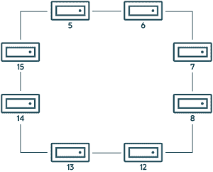

> 原文：[`dev.mysql.com/doc/refman/8.0/en/mysql-cluster-ndbinfo-membership.html`](https://dev.mysql.com/doc/refman/8.0/en/mysql-cluster-ndbinfo-membership.html)

#### 25.6.16.44 ndbinfo membership 表

`membership`表描述了集群中每个数据节点对其他所有节点的视图，包括节点组成员资格、主节点、仲裁者、仲裁者后继、仲裁者连接状态和其他信息。

`membership`表包含以下列：

+   `node_id`

    此节点的节点 ID

+   `group_id`

    此节点所属的节点组

+   `left node`

    前一个节点的节点 ID

+   `right_node`

    下一个节点的节点 ID

+   `president`

    主节点的节点 ID

+   `successor`

    继任主席的节点 ID

+   `succession_order`

    此节点继任主席的顺序

+   `Conf_HB_order`

    -

+   `arbitrator`

    仲裁者的节点 ID

+   `arb_ticket`

    用于跟踪仲裁的内部标识符

+   `arb_state`

    仲裁状态

+   `arb_connected`

    此节点是否连接到仲裁者；`Yes`或`No`中的任意一个

+   `connected_rank1_arbs`

    一级仲裁者连接

+   `connected_rank2_arbs`

    一级仲裁者连接

##### 备注

节点 ID 和节点组 ID 与**ndb_mgm -e "SHOW"**报告的相同。

`left_node`和`right_node`根据连接所有数据节点的模型定义，按照节点 ID 的顺序连接成一个圆圈，类似于时钟表盘上数字的顺序，如下所示：

**图 25.6 NDB 集群节点的循环排列**



在此示例中，我们有 8 个数据节点，编号为 5、6、7、8、12、13、14 和 15，按顺时针顺序排列在一个圆圈中。我们从圆圈的内部确定“左”和“右”。节点 5 左侧的节点是节点 15，节点 5 右侧的节点是节点 6。您可以通过运行以下查询并观察输出来查看所有这些关系： 

```sql
mysql> SELECT node_id,left_node,right_node
 -> FROM ndbinfo.membership;
+---------+-----------+------------+
| node_id | left_node | right_node |
+---------+-----------+------------+
|       5 |        15 |          6 |
|       6 |         5 |          7 |
|       7 |         6 |          8 |
|       8 |         7 |         12 |
|      12 |         8 |         13 |
|      13 |        12 |         14 |
|      14 |        13 |         15 |
|      15 |        14 |          5 |
+---------+-----------+------------+
8 rows in set (0.00 sec)
```

“左”和“右”这些称号在事件日志中以相同方式使用。

`president`节点是当前节点视为负责设置仲裁者的节点（参见 NDB 集群启动阶段）。如果主节点失败或断开连接，当前节点期望显示在`successor`列中的节点 ID 成为新的主节点。`succession_order`列显示当前节点视自己在继任队列中的位置。

在正常的 NDB 集群中，所有数据节点应该将相同的节点视为`president`，并将相同的节点（除了主节点）视为其`successor`。此外，当前主节点应该将自己视为继任顺序中的`1`，`successor`节点应该将自己视为`2`，依此类推。

所有节点应显示相同的`arb_ticket`值以及相同的`arb_state`值。可能的`arb_state`值包括`ARBIT_NULL`、`ARBIT_INIT`、`ARBIT_FIND`、`ARBIT_PREP1`、`ARBIT_PREP2`、`ARBIT_START`、`ARBIT_RUN`、`ARBIT_CHOOSE`、`ARBIT_CRASH`和`UNKNOWN`。

`arb_connected`显示此节点是否连接到显示为此节点的`arbitrator`的节点。

`connected_rank1_arbs`和`connected_rank2_arbs`列分别显示一个或多个仲裁者的列表，这些仲裁者的`ArbitrationRank`分别等于 1 或 2。

注意

管理节点和 API 节点都有资格成为仲裁者。
