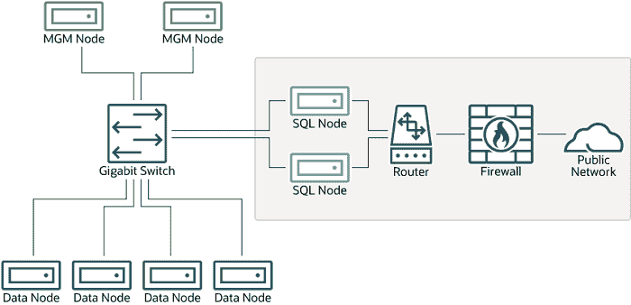
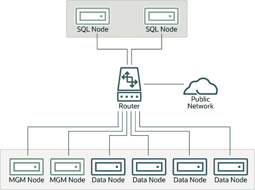
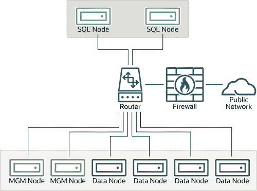

> 原文：[`dev.mysql.com/doc/refman/8.0/en/mysql-cluster-security-networking-issues.html`](https://dev.mysql.com/doc/refman/8.0/en/mysql-cluster-security-networking-issues.html)

#### 25.6.20.1 NDB Cluster 安全性和网络问题

在本节中，我们讨论与 NDB Cluster 相关的基本网络安全问题。非常重要的是要记住，NDB Cluster“开箱即用”并不安全；您或您的网络管理员必须采取适当措施，确保您的集群在网络上不会受到威胁。

集群通信协议本质上是不安全的，在集群节点之间的通信中不使用加密或类似的安全措施。由于网络速度和延迟直接影响集群的效率，因此不建议在节点之间的网络连接中使用 SSL 或其他加密，因为这些方案会导致通信变慢。

同样，对于控制 API 节点访问 NDB Cluster，也不使用任何身份验证。与加密一样，强加身份验证要求的开销会对集群性能产生不利影响。

另外，在访问集群时，以下两者之一的源 IP 地址没有检查：

+   SQL 或 API 节点使用`config.ini`文件中空的`[mysqld]`或`[api]`部分创建的“空闲插槽”

    这意味着，如果`config.ini`文件中有任何空的`[mysqld]`或`[api]`部分，那么任何知道管理服务器主机名（或 IP 地址）和端口的 API 节点（包括 SQL 节点）都可以连接到集群并访问其数据而不受限制。（有关此及相关问题的更多信息，请参阅第 25.6.20.2 节，“NDB Cluster 和 MySQL 权限”。）

    注意

    您可以通过为`config.ini`文件中所有`[mysqld]`和`[api]`部分指定`HostName`参数来对 SQL 和 API 节点访问集群进行一些控制。然而，这也意味着，如果您希望从以前未使用的主机连接 API 节点到集群，您需要在`config.ini`文件中添加一个包含其主机名的`[api]`部分。

    更多信息可在本章的其他地方找到关于`HostName`参数的信息。还请参阅第 25.4.1 节，“NDB Cluster 的快速测试设置”，以获取使用`HostName`与 API 节点的配置示例。

+   任何**ndb_mgm**客户端

    这意味着任何被给予管理服务器主机名（或 IP 地址）和端口（如果不是标准端口）的集群管理客户端都可以连接到集群并执行任何管理客户端命令。这包括`ALL STOP`和`SHUTDOWN`等命令。

出于这些原因，有必要在网络层面保护集群。对于集群来说，最安全的网络配置是将集群节点之间的连接与任何其他网络通信隔离开。可以通过以下任一方法实现这一点：

1.  将集群节点保持在与任何公共网络物理隔离的网络上。这个选项是最可靠的；然而，实施成本最高。

    我们在这里展示了使用这种物理隔离网络的 NDB 集群设置的示例：

    **图 25.7 带有硬件防火墙的 NDB 集群**

    

    这种设置有两个网络，一个私有的（实线框）用于集群管理服务器和数据节点，一个公共的（虚线框）用于 SQL 节点所在。 （我们展示了管理和数据节点使用千兆交换机连接，因为这提供了最佳性能。）两个网络都受到硬件防火墙的保护，有时也称为基于网络的防火墙。

    这种网络设置是最安全的，因为没有数据包可以从网络外部到达集群的管理或数据节点，也没有集群的内部通信可以到达外部，除非通过 SQL 节点，只要 SQL 节点不允许任何数据包被转发。当然，这意味着所有 SQL 节点必须受到黑客攻击的保护。

    重要

    关于潜在的安全漏洞，SQL 节点与任何其他 MySQL 服务器没有区别。请参阅第 8.1.3 节，“使 MySQL 免受攻击者攻击”，了解您可以用来保护 MySQL 服务器的技术描述。

1.  使用一个或多个软件防火墙（也称为主机防火墙）来控制从不需要访问集群的网络部分通过的数据包。在这种设置中，必须在集群中的每台主机上安装软件防火墙，否则可能会从本地网络外部访问。

    基于主机的选项是实施成本最低的，但纯粹依赖软件提供保护，因此最难保持安全。

    这种 NDB 集群的网络设置类型在这里说明： 

    **图 25.8 带有软件防火墙的 NDB 集群**

    

    使用这种类型的网络设置意味着 NDB 集群主机有两个区域。每个集群主机必须能够与集群中的所有其他机器通信，但只有托管 SQL 节点（虚线框）的机器可以与外部进行任何联系，而那些位于包含数据节点和管理节点的区域（实线框）的机器必须与不属于集群的任何机器隔离。使用集群的应用程序和这些应用程序的用户*不*被允许直接访问管理和数据节点主机。

    要实现这一点，您必须设置软件防火墙，根据每个集群主机计算机上运行的节点类型，限制流量到以下表中显示的类型或类型：

    **表 25.68 主机防火墙集群配置中的节点类型**

    | 节点类型 | 允许的流量 |
    | --- | --- |
    | SQL 或 API 节点 |

    +   它源自管理或数据节点的 IP 地址（使用任何 TCP 或 UDP 端口）。

    +   它源自集群所在网络中，并位于应用程序正在使用的端口上。

    |

    | 数据节点或管理节点 |
    | --- |

    +   它源自管理或数据节点的 IP 地址（使用任何 TCP 或 UDP 端口）。

    +   它源自 SQL 或 API 节点的 IP 地址。

    |

    除了给定节点类型表中显示的流量之外的任何流量都应被拒绝。

    配置防火墙的具体细节因防火墙应用程序而异，超出了本手册的范围。**iptables**是一个非常常见和可靠的防火墙应用程序，通常与**APF**一起使用作为前端，以使配置更加简单。如果您选择实施此类 NDB 集群网络设置或在下一项中讨论的“混合”类型，您可以（也应该）查阅所使用软件防火墙的文档。

1.  还可以采用前两种方法的组合，即同时使用网络和主机防火墙来保护集群。这在安全级别和成本方面介于前两种方案之间。这种类型的网络设置将集群置于硬件防火墙后面，但允许传入数据包穿过连接所有集群主机的路由器以到达 SQL 节点。

    一个可能的 NDB 集群网络部署示例，使用硬件和软件防火墙的组合如下所示：

    **图 25.9 NDB 集群与硬件和软件防火墙的组合**

    

    在这种情况下，您可以设置硬件防火墙规则，拒绝除 SQL 节点和 API 节点之外的任何外部流量，然后仅允许它们在应用程序所需的端口上通信。

无论您使用何种网络配置，都要记住，从保持集群安全的角度来看，您的目标始终是一样的——防止任何不必要的流量到达集群，同时确保集群中节点之间的最有效通信。

因为 NDB 集群需要大量端口用于节点之间的通信，推荐的选项是使用隔离网络。这是防止不必要流量到达集群的最简单方式。

注意

如果您希望远程管理 NDB 集群（即从本地网络之外），推荐的方法是使用**ssh**或其他安全登录 shell 访问 SQL 节点主机。从这个主机上，您可以安全地运行管理客户端，从集群自己的本地网络中访问管理服务器。

即使在理论上可以这样做，也*不建议*使用**ndb_mgm**直接从集群所在的本地网络之外管理集群。由于管理客户端和管理服务器之间既没有认证也没有加密，这代表了一种极不安全的管理集群方式，几乎肯定会在早晚被破坏。
