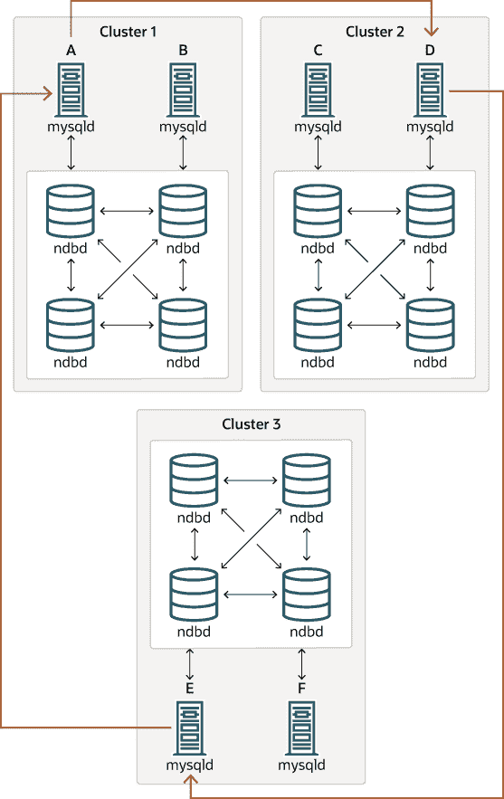

# 25.7.3 NDB 集群复制中已知问题

> 原文：[`dev.mysql.com/doc/refman/8.0/en/mysql-cluster-replication-issues.html`](https://dev.mysql.com/doc/refman/8.0/en/mysql-cluster-replication-issues.html)

本节讨论在使用 NDB 集群复制时可能遇到的已知问题或问题。

**源和复制品之间的连接丢失。** 连接丢失可能发生在源集群 SQL 节点和复制集群 SQL 节点之间，也可能发生在源 SQL 节点和源集群的数据节点之间。在后一种情况下，这不仅可能是由于物理连接丢失（例如，网络电缆断开），还可能是由于数据节点事件缓冲区溢出；如果 SQL 节点响应过慢，可能会被集群丢弃（通过调整`MaxBufferedEpochs`和`TimeBetweenEpochs`配置参数，在一定程度上可以控制这种情况）。如果发生这种情况，*完全有可能在源集群中插入新数据而不记录在源 SQL 节点的二进制日志中*。因此，为了保证高可用性，非常重要的是维护备份复制通道，监视主要通道，并在必要时切换到次要复制通道，以保持复制集群与源的同步。NDB 集群不设计为自行执行此类监控；为此，需要外部应用程序。

当源 SQL 节点连接或重新连接到源集群时，源 SQL 节点会发出“gap”事件。（“gap”事件是一种“事故事件”的一种，表示发生了影响数据库内容但不容易表示为一组更改的事件。事故的例子包括服务器故障、数据库重新同步、某些软件更新和某些硬件更改。）当复制品在复制日志中遇到间隙时，它会停止并显示错误消息。此消息可在`SHOW REPLICA STATUS`的输出中找到（在 NDB 8.0.22 之前，请使用`SHOW SLAVE STATUS`），并指示 SQL 线程由于在复制流中注册的事件而停止，并且需要手动干预。有关在这种情况下应该采取的措施的更多信息，请参见第 25.7.8 节，“使用 NDB 集群复制实现故障转移”。

重要

因为 NDB 集群本身并不设计用于监视复制状态或提供故障转移，如果副本服务器或集群需要高可用性，则必须设置多个复制线路，监视主复制线路上的源**mysqld**，并准备在必要时切换到次要线路。这必须手动完成，或可能通过第三方应用程序完成。有关实施此类设置的信息，请参见第 25.7.7 节，“使用两个复制通道进行 NDB 集群复制”，以及第 25.7.8 节，“使用 NDB 集群复制实现故障转移”。

如果从独立的 MySQL 服务器复制到 NDB 集群，则通常一个通道就足够了。

**循环复制。** NDB 集群复制支持循环复制，如下例所示。复制设置涉及三个 NDB 集群，编号为 1、2 和 3，其中集群 1 充当集群 2 的复制源，集群 2 充当集群 3 的源，集群 3 充当集群 1 的源，从而完成循环。每个 NDB 集群都有两个 SQL 节点，SQL 节点 A 和 B 属于集群 1，SQL 节点 C 和 D 属于集群 2，SQL 节点 E 和 F 属于集群 3。

使用这些集群进行循环复制时，需要满足以下条件：

+   所有源和副本集群上的 SQL 节点都是相同的。

+   所有充当源和副本的 SQL 节点都启用了系统变量`log_replica_updates`（NDB 8.0.26 及更高版本）或`log_slave_updates`（NDB 8.0.26 之前）。

这种循环复制设置类型如下图所示：

**图 25.11 NDB 集群循环复制，所有源均为副本**



在这种情况下，集群 1 中的 SQL 节点 A 复制到集群 2 中的 SQL 节点 C；集群 2 中的 SQL 节点 C 复制到集群 3 中的 SQL 节点 E；SQL 节点 E 复制到 SQL 节点 A。换句话说，复制线路（图表中的曲线箭头表示）直接连接所有用作源和副本的 SQL 节点。

还应该可以设置循环复制，其中并非所有源 SQL 节点也是副本，如下所示：

**图 25.12 NDB 集群循环复制，其中并非所有源均为副本**


在这种情况下，每个集群中的不同 SQL 节点被用作源和副本。但是，您*不*应该启用任何 SQL 节点的`log_replica_updates`或`log_slave_updates`系统变量。对于 NDB Cluster 的这种循环复制方案，其中复制线（在图中由曲线箭头表示）是不连续的，应该是可能的，但必须注意的是，这种方案尚未经过彻底测试，因此仍然被视为实验性。

注意

`NDB` 存储引擎使用幂等执行模式，可以抑制重复键和其他错误，否则会破坏 NDB Cluster 的循环复制。这相当于将系统变量`replica_exec_mode`或`slave_exec_mode`的全局值设置为`IDEMPOTENT`，尽管在 NDB Cluster 复制中这并不是必需的，因为 NDB Cluster 会自动设置此变量并忽略任何显式设置的尝试。

**NDB Cluster 复制和主键。** 在节点故障的情况下，复制没有主键的`NDB`表可能仍会出现错误，因为在这种情况下可能会插入重复行。因此，强烈建议所有被复制的`NDB`表都有明确的主键。

**NDB Cluster 复制和唯一键。** 在较旧版本的 NDB Cluster 中，更新`NDB`表的唯一键列的操作在复制时可能会导致重复键错误。通过将唯一键检查推迟到所有表行更新执行之后，解决了在`NDB`表之间的复制中的此问题。

目前，只有`NDB`支持以这种方式推迟约束。因此，当从`NDB`复制到其他存储引擎（如`InnoDB`或`MyISAM`）时，仍不支持唯一键的更新。

在没有延迟检查唯一键更新的情况下复制时遇到的问题可以使用 `NDB` 表，例如 `t`，在源上创建和填充（并传输到不支持延迟唯一键更新的副本）来说明：

```sql
CREATE TABLE t (
    p INT PRIMARY KEY,
    c INT,
    UNIQUE KEY u (c)
)   ENGINE NDB;

INSERT INTO t
    VALUES (1,1), (2,2), (3,3), (4,4), (5,5);
```

下面的 `UPDATE` 语句在源上成功，因为受影响的行是按照 `ORDER BY` 选项确定的顺序处理的，作用于整个表：

```sql
UPDATE t SET c = c - 1 ORDER BY p;
```

相同的语句在副本上失败，因为行更新的顺序是逐个分区执行的，而不是整个表。

注意

每个 `NDB` 表在创建时都会隐式按键进行分区。有关更多信息，请参见 26.2.5 节“KEY 分区”。

**不支持 GTIDs。** 使用全局事务 ID 进行复制与 `NDB` 存储引擎不兼容，也不受支持。启用 GTIDs 可能会导致 NDB Cluster 复制失败。

**多线程副本。** 以前，NDB Cluster 不支持多线程副本。此限制在 NDB 8.0.33 中已移除。

要在 NDB 8.0.33 及更高版本的副本上启用多线程，需要执行以下步骤：

1.  在启动源 **mysqld** 时，将 `--ndb-log-transaction-dependency` 设置为 `ON`。

1.  同样在源 **mysqld** 上，将 `binlog_transaction_dependency_tracking` 设置为 `WRITESET`。这可以在 **mysqld** 进程运行时完成。

1.  要确保副本使用多个工作线程，将 `replica_parallel_workers` 的值设置大于 1。默认值为 4，可以在运行时更改副本上的值。

在 NDB 8.0.26 之前，设置任何与多线程副本相关的系统变量，如 `replica_parallel_workers` 或 `slave_parallel_workers`，以及 `replica_checkpoint_group` 或 `slave_checkpoint_group`（或等效的 **mysqld** 启动选项）完全被忽略，没有任何效果。

在 NDB 8.0.27 到 NDB 8.0.32 中，`replica_parallel_workers`必须设置为 0。在这些版本中，如果在启动时将其设置为其他任何值，`NDB`会将其更改为 0，并在**mysqld**服务器日志文件中写入一条消息。这个限制在 NDB 8.0.33 中也被解除。

**使用--initial 重新启动。** 使用`--initial`选项重新启动集群会导致 GCI 和时代号的序列从`0`重新开始。（这通常适用于 NDB 集群，不仅限于涉及集群的复制场景。）在这种情况下，涉及复制的 MySQL 服务器应该重新启动。之后，您应该使用`RESET MASTER`和`RESET REPLICA`（在 NDB 8.0.22 之前，使用`RESET SLAVE`）语句清除无效的`ndb_binlog_index`和`ndb_apply_status`表。

**从 NDB 复制到其他存储引擎。** 可以将源上的`NDB`表复制到副本上使用不同存储引擎的表，考虑到这里列出的限制：

+   不支持多源和循环复制（源和副本上的表必须都使用`NDB`存储引擎才能正常工作）。

+   在副本上使用不执行表的二进制日志记录的存储引擎需要特殊处理。

+   在副本上使用非事务性存储引擎处理表格也需要特殊处理。

+   源**mysqld**必须使用`--ndb-log-update-as-write=0`或`--ndb-log-update-as-write=OFF`启动。

接下来的几段提供了关于刚才描述的每个问题的额外信息。

**不支持将 NDB 复制到其他存储引擎的多源。** 对于从`NDB`到不同存储引擎的复制，两个数据库之间的关系必须是一对一。这意味着 NDB 集群和其他存储引擎之间不支持双向或循环复制。

此外，在从 `NDB` 复制到不同存储引擎的副本时，不可能配置多个复制通道。 （NDB 集群数据库 *可以* 同时复制到多个 NDB 集群数据库。）如果源使用 `NDB` 表，则仍然可以让多个 MySQL 服务器维护所有更改的二进制日志，但是对于副本更改源（故障转移），新的源-副本关系必须在副本上明确定义。

**将 NDB 表复制到不执行二进制日志记录的存储引擎。** 如果尝试从 NDB 集群复制到使用不处理自己二进制日志的存储引擎的副本，则复制过程将因错误 Binary logging not possible ... Statement cannot be written atomically since more than one engine involved and at least one engine is self-logging (Error 1595) 而中止。可以通过以下一种方式解决此问题：

+   **在副本上关闭二进制日志记录。** 可以通过设置 `sql_log_bin = 0` 来实现。

+   **更改用于 mysql.ndb_apply_status 表的存储引擎。** 使该表使用一个不处理自己二进制日志的引擎也可以消除冲突。可以通过在副本上发出类似 `ALTER TABLE mysql.ndb_apply_status ENGINE=MyISAM` 的语句来完成此操作。在副本上使用除 `NDB` 之外的存储引擎时，这样做是安全的，因为您不需要担心保持多个副本同步。

+   **在副本上过滤掉对 mysql.ndb_apply_status 表的更改。** 可以通过使用 `--replicate-ignore-table=mysql.ndb_apply_status` 来启动副本来完成此操作。如果需要忽略其他表的复制更改，您可能希望使用适当的 `--replicate-wild-ignore-table` 选项。

重要提示

在从一个 NDB 集群复制到另一个 NDB 集群时，不应禁用 `mysql.ndb_apply_status` 的复制或二进制日志记录，也不应更改此表使用的存储引擎。有关详细信息，请参阅 NDB 集群之间复制和二进制日志过滤规则。

**从 NDB 复制到非事务性存储引擎。** 当从`NDB`复制到非事务性存储引擎（如`MyISAM`）时，当复制`INSERT ... ON DUPLICATE KEY UPDATE`语句时，可能会遇到不必要的重复键错误。您可以通过使用`--ndb-log-update-as-write=0`来抑制这些错误，该选项强制将更新记录为写入，而不是更新。

**NDB 集群之间的复制和二进制日志过滤规则。** 如果您使用任何`--replicate-do-*`、`--replicate-ignore-*`、`--binlog-do-db`或`--binlog-ignore-db`选项来过滤正在复制的数据库或表，您必须注意不要阻止`mysql.ndb_apply_status`的复制或二进制日志记录，这对于 NDB 集群之间的复制正常运行是必需的。特别是，您必须牢记以下内容：

1.  使用`--replicate-do-db=*`db_name`*`（以及没有其他`--replicate-do-*`或`--replicate-ignore-*`选项）意味着只有数据库*`db_name`*中的表会被复制。在这种情况下，您还应该使用`--replicate-do-db=mysql`，`--binlog-do-db=mysql`，或`--replicate-do-table=mysql.ndb_apply_status`来确保在副本上填充`mysql.ndb_apply_status`。

    使用`--binlog-do-db=*`db_name`*`（以及没有其他`--binlog-do-db`选项）意味着只有数据库*`db_name`*中的表的更改会被写入二进制日志。在这种情况下，您还应该使用`--replicate-do-db=mysql`，`--binlog-do-db=mysql`，或`--replicate-do-table=mysql.ndb_apply_status`来确保在副本上填充`mysql.ndb_apply_status`。

1.  使用`--replicate-ignore-db=mysql`意味着`mysql`数据库中的表不会被复制。在这种情况下，您还应该使用`--replicate-do-table=mysql.ndb_apply_status`来确保`mysql.ndb_apply_status`被复制。

    使用`--binlog-ignore-db=mysql`意味着不会将`mysql`数据库中的表更改写入二进制日志。在这种情况下，您还应该使用`--replicate-do-table=mysql.ndb_apply_status`来确保`mysql.ndb_apply_status`被复制。

您还应该记住，每个复制规则都需要以下内容：

1.  自己的`--replicate-do-*`或`--replicate-ignore-*`选项，并且不能在单个复制过滤选项中表示多个规则。有关这些规则的信息，请参见第 19.1.6 节，“复制和二进制日志选项和变量”。

1.  自己的`--binlog-do-db`或`--binlog-ignore-db`选项，并且不能在单个二进制日志过滤选项中表示多个规则。有关这些规则的信息，请参见第 7.4.4 节，“二进制日志”。

如果您将 NDB 集群复制到使用`NDB`之外的存储引擎的副本，则前面提到的考虑可能不适用，如本节其他地方所讨论的。

**NDB 集群复制和 IPv6。** 从 NDB 8.0.22 开始，所有类型的 NDB 集群节点都支持 IPv6；这包括管理节点、数据节点和 API 或 SQL 节点。

在 NDB 8.0.22 之前，NDB API 和 MGM API（因此数据节点和管理节点）不支持 IPv6，尽管 MySQL 服务器（包括在 NDB 集群中充当 SQL 节点的服务器）可以使用 IPv6 与其他 MySQL 服务器联系。在 8.0.22 之前的 NDB 集群版本中，您可以使用 IPv6 在 SQL 节点之间进行复制，连接源和副本的 SQL 节点如下图中的虚线箭头所示：

**图 25.13 SQL 节点之间使用 IPv6 连接的复制**


在 NDB 8.0.22 之前，所有源自 NDB 集群内部的连接——在前面的图表中用实箭头表示——必须使用 IPv4。换句话说，所有 NDB 集群数据节点、管理服务器和管理客户端必须能够使用 IPv4 相互访问。此外，SQL 节点必须使用 IPv4 与集群通信。在 NDB 8.0.22 及更高版本中，这些限制不再适用；此外，任何使用 NDB 和 MGM API 编写的应用程序都可以假定在仅使用 IPv6 的环境中编写和部署。

注意

在版本 8.0.22 至 8.0.33 中，`NDB`需要系统支持 IPv6 才能运行，无论集群是否实际使用任何 IPv6 地址。在 NDB Cluster 8.0.34 及更高版本中，这不再是问题，如果集群未使用 IPv6 寻址，则可以在 Linux 内核中禁用 IPv6。

**属性提升和降级。** NDB 集群复制包括对属性提升和降级的支持。后者的实现区分了有损和无损类型转换，并且可以通过设置系统变量`replica_type_conversions`（NDB 8.0.26 及更高版本）或`slave_type_conversions`（NDB 8.0.26 之前）的全局值来控制在副本上的使用。

有关 NDB 集群中属性提升和降级的更多信息，请参阅基于行的复制：属性提升和降级。

`NDB`，与`InnoDB`或`MyISAM`不同，不会将对虚拟列的更改写入二进制日志；然而，这对于 NDB 集群复制或`NDB`与其他存储引擎之间的复制没有不利影响。存储生成列的更改会被记录。
