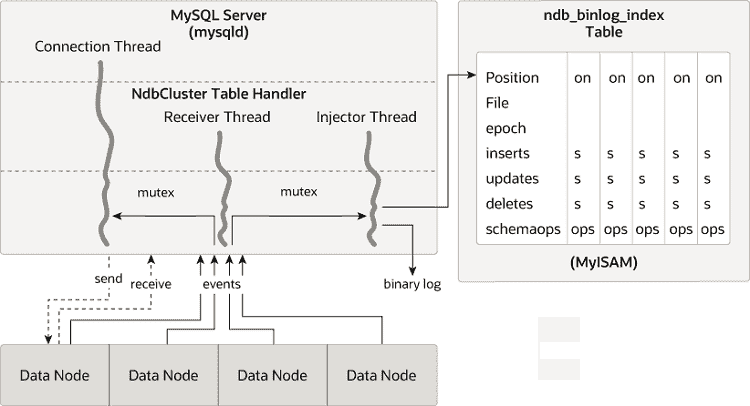

# 25.7.4 NDB 集群复制模式和表

> 原文：[`dev.mysql.com/doc/refman/8.0/en/mysql-cluster-replication-schema.html`](https://dev.mysql.com/doc/refman/8.0/en/mysql-cluster-replication-schema.html)

+   [ndb_apply_status 表](https://dev.mysql.com/doc/refman/8.0/en/mysql-cluster-replication-schema.html#ndb-replication-ndb-apply-status "ndb_apply_status Table")

+   [ndb_binlog_index 表](https://dev.mysql.com/doc/refman/8.0/en/mysql-cluster-replication-schema.html#ndb-replication-ndb-binlog-index "ndb_binlog_index Table")

+   [ndb_replication 表](https://dev.mysql.com/doc/refman/8.0/en/mysql-cluster-replication-schema.html#ndb-replication-ndb-replication "ndb_replication Table")

NDB 集群中的复制利用了在充当被复制集群和副本中的 SQL 节点的每个 MySQL 服务器实例上的`mysql`数据库中的一些专用表。无论副本是单个服务器还是集群，这都是正确的。

`ndb_binlog_index` 和 `ndb_apply_status` 表在 `mysql` 数据库中创建。用户不应明确复制这些表。通常不需要用户干预来创建或维护这两个表，因为两者都由[`NDB`](https://dev.mysql.com/doc/refman/8.0/en/mysql-cluster.html "Chapter 25 MySQL NDB Cluster 8.0")二进制日志（binlog）注入器线程维护。这使得源[**mysqld**](https://dev.mysql.com/doc/refman/8.0/en/mysqld.html "6.3.1 mysqld — The MySQL Server")进程更新到由[`NDB`](https://dev.mysql.com/doc/refman/8.0/en/mysql-cluster.html "Chapter 25 MySQL NDB Cluster 8.0")存储引擎执行的更改。[`NDB`](https://dev.mysql.com/doc/refman/8.0/en/mysql-cluster.html "Chapter 25 MySQL NDB Cluster 8.0") binlog 注入器线程直接从[`NDB`](https://dev.mysql.com/doc/refman/8.0/en/mysql-cluster.html "Chapter 25 MySQL NDB Cluster 8.0")存储引擎接收事件。[`NDB`](https://dev.mysql.com/doc/refman/8.0/en/mysql-cluster.html "Chapter 25 MySQL NDB Cluster 8.0")注入器负责捕获集群中的所有数据事件，并确保所有更改、插入或删除数据的事件都记录在`ndb_binlog_index`表中。复制 I/O（接收器）线程将事件从源的二进制日志传输到复制的中继日志。

`ndb_replication` 表必须手动创建。用户可以更新此表以按数据库或表进行过滤。有关更多信息，请参见[ndb_replication 表](https://dev.mysql.com/doc/refman/8.0/en/mysql-cluster-replication-schema.html#ndb-replication-ndb-replication "ndb_replication Table")。`ndb_replication` 也用于 NDB 复制冲突检测和解决冲突控制；请参见[冲突解决控制](https://dev.mysql.com/doc/refman/8.0/en/mysql-cluster-replication-conflict-resolution.html#conflict-resolution-control "Conflict Resolution Control")。

即使`ndb_binlog_index`和`ndb_apply_status`是自动创建和维护的，建议在为复制准备 NDB 集群时，首先检查这些表的存在和完整性。可以通过直接在源上查询`mysql.ndb_binlog_index`表来查看二进制日志中记录的事件数据。这也可以通过在源或副本 SQL 节点上使用`SHOW BINLOG EVENTS`语句来完成。 (参见第 15.7.7.2 节，“SHOW BINLOG EVENTS Statement”.)

您还可以从`SHOW ENGINE NDB STATUS`的输出中获取有用信息。

注意

在对`NDB`表执行模式更改时，应用程序应等到发出该语句的 MySQL 客户端连接中返回`ALTER TABLE`语句后，再尝试使用表的更新定义。

#### ndb_apply_status 表

`ndb_apply_status`用于记录已从源复制到副本的操作。如果副本上不存在`ndb_apply_status`表，**ndb_restore**会重新创建它。

与`ndb_binlog_index`不同，此表中的数据不针对（副本）集群中的任何一个 SQL 节点，因此`ndb_apply_status`可以使用`NDBCLUSTER`存储引擎，如下所示：

```sql
CREATE TABLE `ndb_apply_status` (
    `server_id`   INT(10) UNSIGNED NOT NULL,
    `epoch`       BIGINT(20) UNSIGNED NOT NULL,
    `log_name`    VARCHAR(255) CHARACTER SET latin1 COLLATE latin1_bin NOT NULL,
    `start_pos`   BIGINT(20) UNSIGNED NOT NULL,
    `end_pos`     BIGINT(20) UNSIGNED NOT NULL,
    PRIMARY KEY (`server_id`) USING HASH
) ENGINE=NDBCLUSTER DEFAULT CHARSET=utf8mb4 COLLATE=utf8mb4_0900_ai_ci;
```

`ndb_apply_status`表仅在副本上填充，这意味着在源上，此表永远不包含任何行；因此，在那里不需要为`ndb_apply_status`分配任何`DataMemory`。

由于此表是从源头数据填充的，因此应允许其进行复制；任何无意中阻止副本更新`ndb_apply_status`或阻止源写入二进制日志的复制过滤或二进制日志过滤规则可能会阻止集群之间的复制正常运行。有关此类过滤规则可能引起的潜在问题的更多信息，请参阅在 NDB 集群之间进行复制时的复制和二进制日志过滤规则。

可以删除此表，但不建议这样做。删除它会使所有 SQL 节点进入只读模式；在 NDB 8.0.24 及更高版本中，`NDB` 检测到该表已被删除，并重新创建它，之后再次执行更新是可能的。删除并重新创建 `ndb_apply_status` 会在二进制日志中创建一个间隙事件；间隙事件会导致副本 SQL 节点停止应用来自源的更改，直到重新启动复制通道。在 NDB 8.0.24 之前，在这种情况下，需要重新启动所有 SQL 节点以使它们退出只读模式，然后手动重新创建 `ndb_apply_status`。

该表的 `epoch` 列中的 `0` 表示来自于 `NDB` 以外的存储引擎的事务。

`ndb_apply_status` 用于记录从上游源复制并应用到副本集群的哪些时代事务。这些信息在 `NDB` 在线备份中被捕获，但（按设计）不会被 **ndb_restore** 恢复。在某些情况下，恢复这些信息以供新设置使用可能会有所帮助；从 NDB 8.0.29 开始，您可以通过使用 `--with-apply-status` 选项调用 **ndb_restore** 来实现这一点。有关该选项的更多信息，请参阅选项的描述。

#### ndb_binlog_index 表

NDB 集群复制使用 `ndb_binlog_index` 表来存储二进制日志的索引数据。由于该表对每个 MySQL 服务器都是本地的，并且不参与集群化，因此它使用 `InnoDB` 存储引擎。这意味着必须在参与源集群的每个 **mysqld** 上单独创建该表。（二进制日志本身包含来自集群中所有 MySQL 服务器的更新。）该表定义如下：

```sql
CREATE TABLE `ndb_binlog_index` (
    `Position` BIGINT(20) UNSIGNED NOT NULL,
    `File` VARCHAR(255) NOT NULL,
    `epoch` BIGINT(20) UNSIGNED NOT NULL,
    `inserts` INT(10) UNSIGNED NOT NULL,
    `updates` INT(10) UNSIGNED NOT NULL,
    `deletes` INT(10) UNSIGNED NOT NULL,
    `schemaops` INT(10) UNSIGNED NOT NULL,
    `orig_server_id` INT(10) UNSIGNED NOT NULL,
    `orig_epoch` BIGINT(20) UNSIGNED NOT NULL,
    `gci` INT(10) UNSIGNED NOT NULL,
    `next_position` bigint(20) unsigned NOT NULL,
    `next_file` varchar(255) NOT NULL,
    PRIMARY KEY (`epoch`,`orig_server_id`,`orig_epoch`)
) ENGINE=InnoDB DEFAULT CHARSET=utf8mb4 COLLATE=utf8mb4_0900_ai_ci;
```

注意

如果您正在从旧版本（NDB 7.5.2 之前）升级，请执行 MySQL 升级过程，并确保通过使用 `--upgrade=FORCE` 选项启动 MySQL 服务器来升级系统表。系统表升级会导致为该表执行 `ALTER TABLE ... ENGINE=INNODB` 语句。继续支持使用 `MyISAM` 存储引擎以实现向后兼容性。

将 `ndb_binlog_index` 转换为 `InnoDB` 后可能需要额外的磁盘空间。如果这成为问题，您可以通过使用 `InnoDB` 表空间来为这个表节省空间，将其 `ROW_FORMAT` 更改为 `COMPRESSED`，或两者兼而有之。有关更多信息，请参见 Section 15.1.21, “CREATE TABLESPACE Statement”，以及 Section 15.1.20, “CREATE TABLE Statement”，以及 Section 17.6.3, “Tablespaces”。

`ndb_binlog_index` 表的大小取决于每个二进制日志文件的时代数和二进制日志文件的数量。每个二进制日志文件的时代数通常取决于每个时代生成的二进制日志量和二进制日志文件的大小，较小的时代会导致每个文件有更多的时代。需要注意的是，即使 `--ndb-log-empty-epochs` 选项为 `OFF`，空时代也会向 `ndb_binlog_index` 表插入记录，这意味着每个文件的条目数量取决于文件的使用时间；这种关系可以用下面的公式表示：

```sql
[number of epochs per file] = [time spent per file] / TimeBetweenEpochs
```

繁忙的 NDB Cluster 定期写入二进制日志，并且可能比安静的集群更快地轮换二进制日志文件。这意味着一个带有 `--ndb-log-empty-epochs=ON` 的“安静” NDB Cluster 实际上可能比活动量大的集群每个文件有更多的 `ndb_binlog_index` 行。

当使用 `--ndb-log-orig` 选项启动 **mysqld** 时，`orig_server_id` 和 `orig_epoch` 列分别存储事件起源服务器的 ID 和事件发生的时代，这在使用多个源的 NDB Cluster 复制设置中非常有用。用于在多源设置中找到最接近副本上最高应用时代的二进制日志位置的 `SELECT` 语句（参见 Section 25.7.10, “NDB Cluster Replication: Bidirectional and Circular Replication”）使用这两列，这两列没有索引。当尝试执行故障切换时，这可能导致性能问题，因为查询必须执行表扫描，特别是当源使用 `--ndb-log-empty-epochs=ON` 运行时。您可以通过为这些列添加索引来提高多源故障切换时间，如下所示：

```sql
ALTER TABLE mysql.ndb_binlog_index
    ADD INDEX orig_lookup USING BTREE (orig_server_id, orig_epoch);
```

在从单个源到单个副本的复制时，添加此索引不会带来任何好处，因为在这种情况下用于获取二进制日志位置的查询不使用 `orig_server_id` 或 `orig_epoch`。

有关使用 `next_position` 和 `next_file` 列的更多信息，请参见第 25.7.8 节，“使用 NDB 集群复制实现故障切换”。

以下图显示了 NDB 集群复制源服务器、其二进制日志注入器线程和 `mysql.ndb_binlog_index` 表之间的关系。

**图 25.14 复制源集群**



#### ndb_replication 表

`ndb_replication` 表用于控制二进制日志记录和冲突解决，并且是基于每个表的基础上操作的。该表中的每一行对应于被复制的表，确定如何记录对表的更改，并且如果指定了冲突解决函数，则确定如何解决该表的冲突。

与 `ndb_apply_status` 和 `ndb_replication` 表不同，`ndb_replication` 表必须手动创建，使用此处显示的 SQL 语句：

```sql
CREATE TABLE mysql.ndb_replication  (
    db VARBINARY(63),
    table_name VARBINARY(63),
    server_id INT UNSIGNED,
    binlog_type INT UNSIGNED,
    conflict_fn VARBINARY(128),
    PRIMARY KEY USING HASH (db, table_name, server_id)
)   ENGINE=NDB
PARTITION BY KEY(db,table_name);
```

此表的列在此处列出，并附有描述：

+   `db` 列

    包含要复制表的数据库的名称���

    您可以在数据库名称中使用下划线 `_` 和百分号 `%` 中的一个或两个通配符。（请参见使用通配符匹配，本节后面有更多信息。）

+   `table_name` 列

    要复制的表的名称。

    表名可以包含下划线 `_` 和百分号 `%` 中的一个或两个通配符。请参见使用通配符匹配，本节后面有更多信息。

+   `server_id` 列

    MySQL 实例（SQL 节点）的唯一服务器 ID，表所在的位置。

    此列中的 `0` 充当通配符，相当于 `%`，匹配任何服务器 ID。（请参见使用通配符匹配，本节后面有更多信息。）

+   `binlog_type` 列

    要使用的二进制日志记录类型。有关值和描述，请参阅文本。

+   `conflict_fn`列

    要应用的冲突解决函数之一是 NDB$OLD()")，NDB$MAX()")，NDB$MAX_DELETE_WIN()")，NDB$EPOCH()")，NDB$EPOCH_TRANS()")，NDB$EPOCH2()")，NDB$EPOCH2_TRANS()")中的一个；`NULL`表示此表不使用冲突解决。NDB 8.0.30 及更高版本支持两个额外的冲突解决函数 NDB$MAX_INS()")和 NDB$MAX_DEL_WIN_INS()")。

    有关这些函数及其在 NDB 复制冲突解决中的用途的更多信息，请参见 Conflict Resolution Functions。

    一些冲突解决函数（`NDB$OLD()`，`NDB$EPOCH()`，`NDB$EPOCH_TRANS()`）需要使用一个或多个用户创建的异常表。请参见 Conflict Resolution Exceptions Table。

要启用与 NDB 复制的冲突解决，需要在 SQL 节点或应解决冲突的节点上创建并填充此表，其中包含有关控制信息。根据要使用的冲突解决类型和方法，这可能是源、副本或两个服务器。在简单的源-副本设置中，数据也可以在副本上本地更改，这通常是副本。在更复杂的复制方案中，例如双向复制，这通常是所有涉及的源。有关更多信息，请参见 Section 25.7.12，“NDB Cluster Replication Conflict Resolution”。

`ndb_replication`表允许在冲突解决范围之外对二进制日志进行表级控制，在这种情况下，`conflict_fn`指定为`NULL`，而其余列值用于控制给定表或与通配符表达式匹配的一组表的二进制日志。通过为`binlog_type`列设置适当的值，您可以使给定表或表使用所需的二进制日志格式进行记录，或完全禁用二进制日志记录。此列的可能值及其描述如下表所示：

**表 25.70 binlog_type 值及其描述**

| 值 | 描述 |
| --- | --- |
| 0 | 使用服务器默认值 |
| 1 | 不在二进制日志中记录此表（与`sql_log_bin = 0`效果相同，但仅适用于一个或多个指定表） |
| 2 | 仅记录更新的属性；将其记录为`WRITE_ROW`事件 |
| 3 | 记录完整行，即使未更新（MySQL 服务器默认行为） |
| 6 | 使用更新的属性，即使值未更改 |
| 7 | 记录完整行，即使没有值更改；将更新记录为`UPDATE_ROW`事件 |
| 8 | 将更新记录为`UPDATE_ROW`；仅记录主键列的前图像，以及更新后图像中的列（与`--ndb-log-update-minimal`效果相同，但仅适用于一个或多个指定表） |
| 9 | 将更新记录为`UPDATE_ROW`；仅记录主键列的前图像，以及除主键列之外的所有列的后图像 |

注意

`binlog_type`值 4 和 5 未被使用，因此未包含在刚刚显示的表中，也未包含在下一个表中。

几个`binlog_type`值等同于各种组合的**mysqld**日志选项`--ndb-log-updated-only`，`--ndb-log-update-as-write`，和`--ndb-log-update-minimal`，如下表所示：

**表 25.71 binlog_type 值与 NDB 日志选项等效组合**

| 值 | `--ndb-log-updated-only`值 | `--ndb-log-update-as-write`值 | `--ndb-log-update-minimal`值 |
| --- | --- | --- | --- |
| 0 | -- | -- | -- |
| 1 | -- | -- | -- |
| 2 | 开 | 开 | 关 |
| 3 | 关 | 开 | 关 |
| 6 | 开 | 关 | 关 |
| 7 | 关 | 关 | 关 |
| 8 | 开 | 关 | 开 |
| 9 | 关 | 关 | 开 |

通过向 `ndb_replication` 表中插入行，可以为不同的表设置不同的二进制日志记录格式，使用适当的 `db`、`table_name` 和 `binlog_type` 列值。在设置二进制日志记录格式时，应使用前面表中显示的内部整数值。以下两个语句将二进制日志记录设置为对表 `test.a` 进行完整行记录（值为 3），以及对表 `test.b` 仅记录更新（值为 2）：

```sql
# Table test.a: Log full rows
INSERT INTO mysql.ndb_replication VALUES("test", "a", 0, 3, NULL);

# Table test.b: log updates only
INSERT INTO mysql.ndb_replication VALUES("test", "b", 0, 2, NULL);
```

要禁用一个或多个表的日志记录，请使用 `binlog_type` 为 1，如下所示：

```sql
# Disable binary logging for table test.t1
INSERT INTO mysql.ndb_replication VALUES("test", "t1", 0, 1, NULL);

# Disable binary logging for any table in 'test' whose name begins with 't'
INSERT INTO mysql.ndb_replication VALUES("test", "t%", 0, 1, NULL);
```

为给定表禁用日志记录相当于设置`sql_log_bin = 0`，只是它适用于一个或多个表。如果 SQL 节点不为给定表执行二进制日志记录，则不会发送这些表的行更改事件。这意味着它不是接收所有更改并丢弃一些，而是不订阅这些更改。

禁用日志记录可能有多种原因，包括以下列出的原因：

+   不将更改发送到网络通常可以节省带宽、缓冲和 CPU 资源。

+   不记录对具有非常频繁更新但价值不大的表的更改非常适合瞬态数据（例如会话数据），在集群完全失败的情况下可能相对不重要。

+   使用会话变量（或 `sql_log_bin`）和应用程序代码，还可以记录（或不记录）某些 SQL 语句或类型的 SQL 语句；例如，在某些情况下，可能不希望记录一个或多个表上的 DDL 语句。

+   将复制流拆分为两个（或更多）二进制日志文件可以出于性能、需要将不同数据库复制到不同位置、使用不同的二进制日志记录类型等原因进行操作。

**使用通配符进行匹配。** 为了不必为复制设置中每个数据库、表和 SQL 节点的每个组合插入一行到 `ndb_replication` 表中，`NDB` 支持在此表的 `db`、`table_name` 和 `server_id` 列上进行通配符匹配。在 `db` 和 `table_name` 中使用的数据库和表名可以包含以下通配符中的一个或两个：

+   `_`（下划线字符）：匹配零个或多个字符

+   `%`（百分号）：匹配一个字符

（这些是 MySQL `LIKE` 操作符支持的相同通配符。）

`server_id` 列支持 `0` 作为 `_` 的通配符等效（匹配任何内容）。这在前面显示的示例中使用。

`ndb_replication`表中的给定行可以使用通配符来匹配任何数据库名称、表名称和服务器 ID 的任意组合。在表中存在多个潜在匹配项的情况下，根据此处显示的表，选择最佳匹配项，其中*W*表示通配符匹配，*E*表示精确匹配，*Quality*列中的值越大，匹配越好：

**表 25.72 不同列的通配符和精确匹配组合的权重**

| `db` | `table_name` | `server_id` | 质量 |
| --- | --- | --- | --- |
| W | W | W | 1 |
| W | W | E | 2 |
| W | E | W | 3 |
| W | E | E | 4 |
| E | W | W | 5 |
| E | W | E | 6 |
| E | E | W | 7 |
| E | E | E | 8 |

因此，数据库名称、表名称和服务器 ID 的精确匹配被认为是最佳（最强），而三个列的通配符匹配被认为是最弱（最差）。在选择应用哪个规则时，只考虑匹配的强度；表中行的顺序对此决定没有影响。

**记录完整或部分行。** 有两种基本记录行的方法，由`--ndb-log-updated-only`选项设置为**mysqld**决定：

+   记录完整行（选项设置为`ON`)

+   仅记录已更新的列数据，即已设置值的列数据，无论该值是否实际更改。这是默认行为（选项设置为`OFF`）。

通常仅记录已更新的列就足够且更有效；但是，如果需要记录完整行，可以通过将`--ndb-log-updated-only`设置为`0`或`OFF`来实现。

**将更改的数据记录为更新。** MySQL 服务器的`--ndb-log-update-as-write`选项的设置确定是否执行记录时是否包含“之前”图像。

因为更新和删除操作的冲突解决是在 MySQL 服务器的更新处理程序中完成的，所以有必要控制复制源执行的日志记录，使更新为更新而不是写入；也就是说，使更新被视为现有行的更改，而不是写入新行，即使这些行替换了现有行。

此选项默认为打开；换句话说，更新被视为写入。也就是说，默认情况下，更新被写入二进制日志中的`write_row`事件，而不是`update_row`事件。

要禁用该选项，请使用`--ndb-log-update-as-write=0`或`--ndb-log-update-as-write=OFF`启动源**mysqld**。当从 NDB 表复制到使用不同存储引擎的表时，您必须执行此操作；请参阅从 NDB 复制到其他存储引擎和从 NDB 复制到非事务性存储引擎以获取更多信息。

重要提示

(*NDB 8.0.30 及更高版本*:) 对于使用`NDB$MAX_INS()`或`NDB$MAX_DEL_WIN_INS()`进行插入冲突解决的情况，一个 SQL 节点（即一个**mysqld**进程）可以记录源集群上的行更新为`WRITE_ROW`事件，并启用`--ndb-log-update-as-write`选项以确保幂等性和最佳大小。这对这些算法有效，因为它们都将`WRITE_ROW`事件映射到插入或更新，具体取决于行是否已经存在，并且所需的元数据（时间戳列的“后”图像）存在于`WRITE_ROW`事件中。
