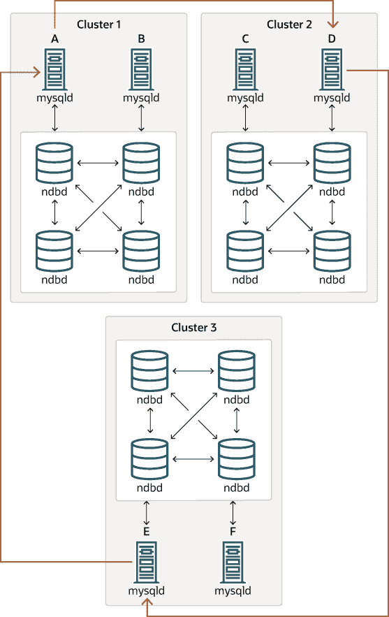
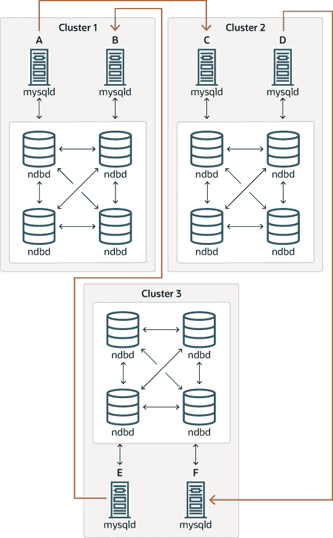
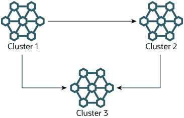

# 25.7.10 NDB 集群复制：双向和循环复制

> 原文：[`dev.mysql.com/doc/refman/8.0/en/mysql-cluster-replication-multi-source.html`](https://dev.mysql.com/doc/refman/8.0/en/mysql-cluster-replication-multi-source.html)

可以使用 NDB 集群在两个集群之间进行双向复制，也可以在任意数量的集群之间进行循环复制。

**循环复制示例。** 在接下来的几段中，我们考虑涉及三个 NDB 集群（编号为 1、2 和 3）的复制设置示例，其中集群 1 充当集群 2 的复制源，集群 2 充当集群 3 的源，集群 3 充当集群 1 的源。每个集群都有两个 SQL 节点，SQL 节点 A 和 B 属于集群 1，SQL 节点 C 和 D 属于集群 2，SQL 节点 E 和 F 属于集群 3。

只要满足以下条件，就支持使用这些集群进行循环复制：

+   所有源和副本上的 SQL 节点都是相同的。

+   所有作为源和副本的 SQL 节点都启用了系统变量`log_replica_updates`（从 NDB 8.0.26 开始）或`log_slave_updates`（NDB 8.0.26 及更早版本）。

这种循环复制设置如下图所示：

**图 25.15 NDB 集群循环复制，所有源均为副本**



在这种情况下，集群 1 中的 SQL 节点 A 复制到集群 2 中的 SQL 节点 C；SQL 节点 C 复制到集群 3 中的 SQL 节点 E；SQL 节点 E 复制到 SQL 节点 A。换句话说，复制线（图表中的曲线箭头表示）直接连接所有用作复制源和副本的 SQL 节点。

也可以设置循环复制，使得并非所有源 SQL 节点也是副本，如下所示：

**图 25.16 NDB 集群循环复制，不是所有源都是副本**



在这种情况下，每个集群中的不同 SQL 节点被用作复制源和副本。您*不*应该启动任何带有系统变量`log_replica_updates`（NDB 8.0.26 及更高版本）或`log_slave_updates`（NDB 8.0.26 之前）的 SQL 节点。NDB 集群的这种循环复制方案，其中复制线路（在图中由曲线箭头表示）是不连续的，应该是可能的，但需要注意的是，这种方案尚未经过彻底测试，因此仍然被视为实验性。

**使用 NDB 本地备份和恢复初始化副本集群。** 在设置循环复制时，可以通过在一个 NDB 集群上使用管理客户端`START BACKUP`命令创建备份，然后在另一个 NDB 集群上使用**ndb_restore**应用此备份来初始化副本集群。这不会自动在充当副本的第二个 NDB 集群的 SQL 节点上创建二进制日志；为了导致创建二进制日志，您必须在该 SQL 节点上发出`SHOW TABLES`语句；在运行`START REPLICA`之前应该这样做。这是一个已知问题。

**多源故障转移示例。** 在本节中，我们讨论了具有服务器 ID 1、2 和 3 的三个 NDB 集群的多源 NDB 集群复制设置中的故障转移。在这种情况下，集群 1 复制到集群 2 和 3；集群 2 也复制到集群 3。这种关系如下所示：

**图 25.17 具有 3 个源的 NDB 集群多主复制**



换句话说，数据通过两种不同的路径从集群 1 复制到集群 3：直接和通过集群 2。

并非所有参与多源复制的 MySQL 服务器都必须同时充当源和副本，给定的 NDB 集群可能会为不同的复制通道使用不同的 SQL 节点。这种情况如下所示：

**图 25.18 具有 MySQL 服务器的 NDB 集群多源复制**


作为副本的 MySQL 服务器必须启用系统变量 `log_replica_updates`（从 NDB 8.0.26 开始）或 `log_slave_updates`（NDB 8.0.26 及更早版本）。在前面的图表中还显示了哪些 **mysqld** 进程需要此选项。

注意

使用 `log_replica_updates` 或 `log_slave_updates` 系统变量对未作为副本运行的服务器没有影响。

当复制集群之一宕机时，就会出现故障切换的需求。在本例中，我们考虑 Cluster 1 丢失服务的情况，因此 Cluster 3 丢失了来自 Cluster 1 的 2 个更新源。由于 NDB 集群之间的复制是异步的，不能保证 Cluster 3 直接源自 Cluster 1 的更新比通过 Cluster 2 接收的更新更近。您可以通过确保 Cluster 3 追赶 Cluster 2 关于来自 Cluster 1 的更新来处理这个问题。在 MySQL 服务器方面，这意味着您需要将 MySQL 服务器 C 的任何未完成更新复制到服务器 F。

在服务器 C 上执行以下查询：

```sql
mysqlC> SELECT @latest:=MAX(epoch)
 ->     FROM mysql.ndb_apply_status
 ->     WHERE server_id=1;

mysqlC> SELECT
 ->     @file:=SUBSTRING_INDEX(File, '/', -1),
 ->     @pos:=Position
 ->     FROM mysql.ndb_binlog_index
 ->     WHERE orig_epoch >= @latest
 ->     AND orig_server_id = 1
 ->     ORDER BY epoch ASC LIMIT 1;
```

注意

您可以通过向 `ndb_binlog_index` 表添加适当的索引来提高此查询的性能，从而显着加快故障切换时间。有关更多信息，请参见 第 25.7.4 节，“NDB Cluster Replication Schema and Tables”。

从服务器 C 手动复制 *`@file`* 和 *`@pos`* 的值到服务器 F（或让您的应用程序执行相应操作）。然后，在服务器 F 上执行以下 `CHANGE REPLICATION SOURCE TO` 语句（NDB 8.0.23 及更高版本）或 `CHANGE MASTER TO` 语句（NDB 8.0.23 之前）：

```sql
mysqlF> CHANGE MASTER TO
 ->     MASTER_HOST = 'serverC'
 ->     MASTER_LOG_FILE='@file',
 ->     MASTER_LOG_POS=@pos;
```

从 NDB 8.0.23 开始，您还可以使用以下语句：

```sql
mysqlF> CHANGE REPLICATION SOURCE TO
 ->     SOURCE_HOST = 'serverC'
 ->     SOURCE_LOG_FILE='@file',
 ->     SOURCE_LOG_POS=@pos;
```

完成后，在 MySQL 服务器 F 上发出 `START REPLICA` 语句；这将导致来自服务器 B 的任何丢失更新被复制到服务器 F。

`CHANGE REPLICATION SOURCE TO` | `CHANGE MASTER TO` 语句还支持一个 `IGNORE_SERVER_IDS` 选项，该选项接受一个逗号分隔的服务器 ID 列表，并导致来自相应服务器的事件被忽略。有关更多信息，请参见 第 15.4.2.1 节，“CHANGE MASTER TO 语句”，以及 第 15.7.7.36 节，“SHOW SLAVE | REPLICA STATUS 语句”。有关此选项如何与 `ndb_log_apply_status` 变量交互的信息，请参见 第 25.7.8 节，“使用 NDB 集群复制实现故障切换”。
