# 关于 SQLite 的书籍

> 原文：[`sqlite.com/books.html`](https://sqlite.com/books.html)

* * *

| 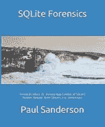 |
| --- |

## 《SQLite 取证》（2018）

作者: Paul Sanderson

出版商: [Amazon](https://www.amazon.com/product/dp/1980293074)此书由著名的数字取证专家 Paul Sanderson 撰写，为调查人员提供了有助于分析 SQLite 数据库文件的低级技术细节。每台计算机和手机都使用数百个 SQLite 数据库，活跃使用的 SQLite 数据库超过一万亿个。因此，在调查中检查这些数据库中存储的数据的重要性，包括在可能的情况下检查已删除的数据，是至关重要的。本书全面解释了 SQLite 数据库文件的格式。它展示了如何编码记录，如何手动解码它们以及如何解码部分被覆盖的记录。此外，它还描述了 SQLite 的工作原理，特别是日志和 WAL，如何用于确定发生了什么，这是单纯从数据本身无法确定的。本书涵盖了基本的 SQL 查询以及如何使用它们创建包含来自不同表的数据的自定义报告，并展示了如何使用 SQL 查询来验证关于不同表中数据关系的假设。本书主要面向取证从业者，假设读者具有一些基本的计算机取证知识；对于一般计算机专业人士，特别是那些对 SQLite 文件格式感兴趣的人士，也会感兴趣。

* * *

| 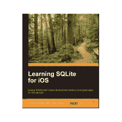 |
| --- |

## 《Learning SQLite for iOS》（2016）

作者: Gene Da Rocha

出版商: [Packt Publishing](https://www.packtpub.com/application-development/learning-sqlite-ios)本书从 SQLite 数据库的架构开始，介绍了 SQL 的概念。您将能够设计自己的数据库系统，管理和维护它。此外，您还将学习如何使用 SQL 命令顺利操作您的 SQLite 数据库。通过使用其丰富的 C API 调用来扩展 SQLite 的功能，您将能够构建一些有趣、激动人心、新颖且智能的数据驱动应用程序。了解如何使用 Xcode、HTML5 和 Phonegap 构建跨平台现代应用程序，这些技术可以为所有这些技术带来好处——通过创建一个完整的、可自定义的应用程序框架，您可以为自己的应用程序进行构建。本书全面描述了 SQLite 数据库系统。它描述了设计原则、工程折衷、实施问题和 SQLite 的操作。 |

* * *

| 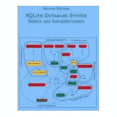 |
| --- |

## 《SQLite 数据库系统设计与实施》（2015）

作者: Sibsankar Haldar

出版商: [`books.google.com/`](https://books.google.com/books?id=OEJ1CQAAQBAJ)

本书全面描述了 SQLite 数据库系统。它描述了设计原则、工程折衷、实现问题和 SQLite 的操作。|

* * *

| 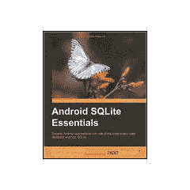 |
| --- |

## Android SQLite 基础（2014）

作者：Sunny Kumar Aditya 和 Vikash Kumar Karn

出版商：[Packt Publishing](https://www.packtpub.com/application-development/android-sqlite-essentials)

《Android SQLite 基础》专注于构建基于数据库的应用程序的核心概念。本书以相同的简单性和详细性涵盖了基本和高级主题，以帮助读者快速理解和实施构建应用程序数据库的概念。本书采用基于示例的实操方法，帮助读者理解 SQLite 和 Android 数据库驱动应用程序的核心主题。本书重点介绍了以易于理解的方式提供潜在和广泛知识的实践和开发方法。|

* * *

| 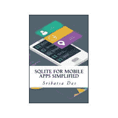 |
| --- |

## 《简化移动应用的 SQLite》（2014）

作者：Sribatsa Das

出版商：Amazon

[亚马逊](https://www.amazon.com/dp/product/B00M3OVSRK)《简化移动应用的 SQLite》致力于展示在移动应用中使用 SQLite 数据库的方法和实现方法。它提供了逐步示例，以创建架构，执行事务并从 Android、BlackBerry 和 iOS 应用程序访问数据。此外，它介绍了 ADB Shell 和来自 ADB Shell 的 SQLite 命令行工具，用于访问 Android 应用程序创建的 SQLite 数据库。对于 BlackBerry 和 iOS 应用程序，本书介绍了使用命令行工具访问数据的方法。|

* * *

| 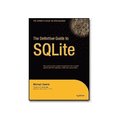 |
| --- |

## SQLite 权威指南（第 2 版，2010）

作者：Mike Owens 和 Grant Allen

出版商：Apress

[Amazon](http://www.amazon.com/gp/product/1430232250)在企业计算领域之外，有一个数据库能够灵活运用关系数据库的功能，而不带上传统数据库管理系统的负担和成本。这个数据库就是 SQLite - 一个可嵌入式的数据库，占用空间极小，但能处理巨大的数据库。SQLite 提供了一系列强大的功能，可以通过多种编程和开发环境使用。它支持诸如 C、Java、Perl、PHP、Python、Ruby、TCL 等多种语言。*《SQLite 权威指南 第二版》* 全面覆盖了这个强大数据库的最新版本。书中详细介绍了 SQLite 的能力和 API。此书以 SQLite 为基础，帮助新手进入数据库开发的世界。你将能够在短时间内编写各种程序，如服务器端浏览器插件或下一个伟大的 iPhone 或 Android 应用程序！ |

* * *

| 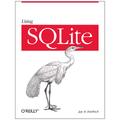 |
| --- |

## 使用 SQLite (2010)

作者：Jay A. Kreibich

出版商：O'Reilly Media

[O'Reilly](http://oreilly.com/catalog/9780596521196/)开发者们，请注意：数据库不再仅仅是信息系统组的专利。你可以为桌面、Web、嵌入式系统或操作系统构建基于数据库的应用程序，而不必依赖像 Oracle 和 MySQL 这样的重型客户端-服务器数据库。本书展示了如何使用 SQLite，这是一个小巧轻量的数据库，可以在开发过程中直接集成到你的应用程序中。如今，处理数据的应用程序具有巨大的优势，而使用 SQLite，你将学会如何开发一个在大小和复杂性上都易于管理的基于数据库的应用程序。本书将引导你完成每一个步骤。你将快速入门数据建模，熟悉 SQLite 的 SQL 数据库语言方言，并学会如何使用脚本语言或基于 C 的语言（如 C#或 Objective C）来操作 SQLite。现在，即使是相对小型和灵活的应用程序也可以成为数据革命的一部分。使用 SQLite 将为你展示如何实现这一点。 |

* * *

| 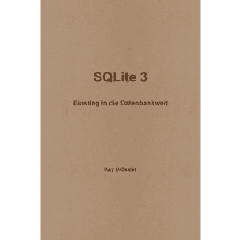 |
| --- |

## SQLite 3 - 进入数据库世界 (2010)

作者：Kay Droessler

出版商：Lulu.com

[Amazon](https://www.amazon.com/product/dp/1445741075) 数据库语言 SQL（结构化查询语言）用于定义、操作和备份数据库，但主要用于从数据库中查询数据。无论操作系统如何或是否采用复杂的用户友好图形界面，其逻辑始终保持不变。SQLite 是一款免费的桌面数据库，无需费用，适用于多种操作系统，下载和安装速度快，并且功能精简。对于初学者来说，这是快速了解数据库和 SQL 语言的最佳条件。完成练习后，如果您对此产生兴趣，那么您已经掌握了大部分数据库和 SQL 知识，因为所讲述的内容适用于众多其他数据库。现在，您可以进入更大的领域，从大型参考书到庞大的数据库系统。

* * *

| 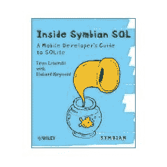 |
| --- |

## 《Symbian SQL 内幕》（2010）

作者：Ivan Litovski & Richard Maynard

出版社：Wiley

[wiley.com](http://www.wiley.com/WileyCDA/WileyTitle/productCd-0470744022.html) 这是关于基于 SQLite 的 Symbian SQL 数据库的权威参考书。作者（均为负责代码实现的 Symbian 工程团队成员）向您展示了如何从内部和外部角度设计代码，并简化迁移过程，此外，他们还揭示了编写高性能数据库应用程序的注意事项和禁忌。本书资源丰富，包含示例代码，揭示了如何设计和调优使用 Symbian SQL 框架的应用程序，最终提升性能。凭借其示例代码和内部专业知识，本书拥有一切您所需的，让您始终领先潮流。

* * *

| 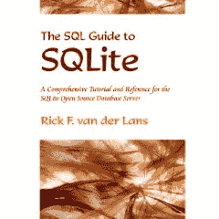 |
| --- |

## 《SQLite SQL 指南》（2009）

作者：Rick F. van der Lans

出版社：Lulu.com

[Amazon](https://www.amazon.com/product/dp/0557076765) SQLite 是一个小巧、快速、可嵌入的基于 SQL 的数据库服务器。它易于安装，无需管理，并且是开源的。本书详细描述了 SQLite。书中包含数百个示例，以及经过验证的方法和结构，教会您如何高效和有效地使用 SQLite。书中完整描述了 SQLite 版本 3.6 中实现的 SQL 方言。本书可视为教程和参考书。您可以从 www.r20.nl 下载本书中包含的大量 SQL 示例和练习的源代码。

* * *

| 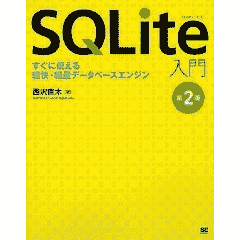 |
| --- |

## 《SQLite 简介 - 第二版》（2009）

作者：Naoki Nishizawa

出版社：Shoeisha

[亚马逊日本](https://www.amazon.co.jp/product/dp/479811944X)这本书是专门为日本读者用流利的日语撰写的。这是该书的第二版，第一版出版于 2005 年。

* * *

| 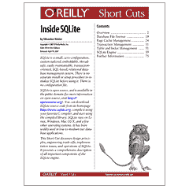 |
| --- |

## Inside SQLite (2007)

作者：西布桑卡尔·哈尔达尔（Sibsankar Haldar）

出版商：O'Reilly Media

[O'Reilly](http://oreilly.com/catalog/9780596550066)SQLite 是一个小型、零配置、定制、可嵌入、线程安全、易于维护、面向事务、基于 SQL 的关系数据库管理系统。在使用 SQLite 之前，无需单独安装或设置过程。也没有配置文件。SQLite 是开源的，属于公共领域（有关开源的更多信息，请访问 http://opensource.org）。你可以从其主页 https://www.sqlite.org 下载 SQLite 的源代码，使用你喜爱的 C 编译器编译它，并开始使用编译后的库。SQLite 运行在 Linux、Windows、Mac OS X 和其他几个操作系统上。它被广泛用于低至中等级别的数据库应用程序。本文介绍了 SQLite 引擎的设计原则、工程折衷、实现问题和操作，全面描述了 SQLite 引擎的所有重要组成部分。

* * *

| 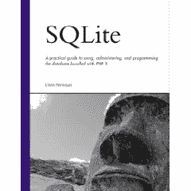 |
| --- |

## SQLite (2004)

作者：克里斯·纽曼（Chris Newman）

出版商：Sams

[亚马逊](https://www.amazon.com/product/dp/067232685X)SQLite 是一个小巧、快速、可嵌入的数据库。它的流行原因在于将数据库引擎和接口结合到单个库中，以及能够将所有数据存储在单个文件中。它的功能介于 MySQL 和 PostgreSQL 之间，但速度比这两个数据库都快。在 *SQLite* 中，作者克里斯·纽曼（Chris Newman）提供了一个详细实用的指南，介绍如何使用、管理和编程这个备受瞩目的数据库。如果你想学习 SQLite 或了解它在 PHP 中的应用，这本书适合你。
