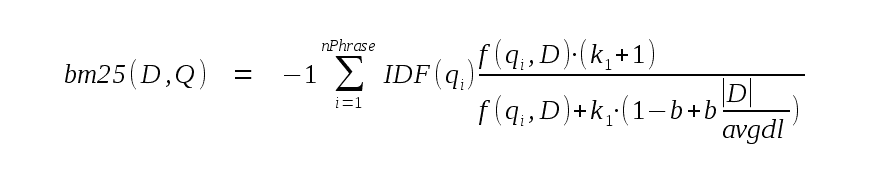

# 1\. FTS5 概述

> 原文：[`sqlite.com/fts5.html`](https://sqlite.com/fts5.html)

FTS5 是 SQLite 提供给数据库应用程序的一个虚拟表模块，提供[全文搜索](https://en.wikipedia.org/wiki/Full_text_search)功能。在其最基本形式中，全文搜索引擎允许用户高效地搜索大量文档，以找到包含一个或多个搜索词实例的子集。例如，全球网络用户通过[Google](https://www.google.com/)提供的搜索功能，可以搜索包含术语“fts5”的所有网络文档。

要使用 FTS5，用户需要使用一个或多个列创建一个 FTS5 虚拟表。例如：

```sql
CREATE VIRTUAL TABLE email USING fts5(sender, title, body);

```

在用于创建 FTS5 表的 CREATE VIRTUAL TABLE 语句中，添加类型、约束或主键声明是错误的。创建完成后，可以像操作任何其他表一样使用 INSERT、UPDATE 或 DELETE 语句填充 FTS5 表。与没有主键声明的任何其他表一样，FTS5 表有一个隐式的 INTEGER PRIMARY KEY 字段，名称为 rowid。

上面示例中未显示的是 FTS5 还可以提供各种选项作为 CREATE VIRTUAL TABLE 语句的一部分，以配置新表的各个方面。这些选项可以用来修改 FTS5 表从文档和查询中提取术语的方式，创建额外的磁盘索引以加速前缀查询，或者创建一个作为存储在其他位置的内容的索引的 FTS5 表。

一旦填充完成，有三种方法可以针对 FTS5 表的内容执行全文查询：

+   在 SELECT 语句的 WHERE 子句中使用 MATCH 运算符，或

+   在 SELECT 语句的 WHERE 子句中使用等号（"="）运算符，或

+   使用 table-valued function 语法。

如果使用 MATCH 或=运算符，MATCH 运算符左侧的表达式通常是 FTS5 表的名称（例外情况是在指定列过滤器时）。右侧的表达式必须是指定要搜索的术语的文本值。对于表值函数语法，要搜索的术语被指定为第一个表参数。例如：

```sql
*-- Query for all rows that contain at least once instance of the term*
*-- "fts5" (in any column). The following three queries are equivalent.*
SELECT * FROM email WHERE email MATCH 'fts5';
SELECT * FROM email WHERE email = 'fts5';
SELECT * FROM email('fts5');

```

默认情况下，FTS5 全文搜索是大小写无关的。与不包含 ORDER BY 子句的任何其他 SQL 查询一样，上述示例以任意顺序返回结果。要按相关性（最相关到最不相关）对结果进行排序，可以在全文查询中添加 ORDER BY 如下：

```sql
*-- Query for all rows that contain at least once instance of the term*
*-- "fts5" (in any column). Return results in order from best to worst*
*-- match.* 
SELECT * FROM email WHERE email MATCH 'fts5' ORDER BY rank;

```

除了匹配行的列值和 rowid 外，应用程序还可以使用 FTS5 辅助函数 检索关于匹配行的额外信息。例如，可以使用辅助函数检索带有所有匹配术语实例的列值副本的匹配行，这些实例周围有 html <b></b> 标记。辅助函数的调用方式与 SQLite 标量函数 相同，唯一的区别是 FTS5 表名作为第一个参数指定。例如：

```sql
*-- Query for rows that match "fts5". Return a copy of the "body" column*
*-- of each row with the matches surrounded by <b></b> tags.*
SELECT highlight(email, 2, '<b>', '</b>') FROM email('fts5');

```

可用的辅助函数的描述，以及有关配置特殊的“rank”列的更多细节，详见 下方可获得。可通过在 C 中实现自定义辅助函数，并与 FTS5 注册，方式与自定义 SQL 函数注册 SQLite 核心相同。

除了搜索包含特定术语的所有行外，FTS5 还允许用户搜索包含以下内容的行：

+   以指定前缀开头的任何术语，

+   "phrases" - 文档中必须包含的术语或前缀术语的序列，以匹配查询，

+   出现在指定的接近程度内的术语集合、前缀术语或短语（称为“NEAR 查询”），

+   上述任意组合的布尔值。

通过提供更复杂的 FTS5 查询字符串作为 MATCH 运算符右侧的文本（或 = 运算符，或作为表值函数语法的第一个参数），可以请求这些高级搜索。完整的查询语法 在此描述。

# 2\. 编译和使用 FTS5

## 2.1\. 构建 FTS5 作为 SQLite 的一部分

截至 版本 3.9.0 (2015-10-14)，FTS5 已作为 SQLite 合并 的一部分包含。如果使用其中一个 autoconf 构建系统，在运行配置脚本时通过指定“--enable-fts5”选项启用 FTS5。（FTS5 目前对于源树配置脚本默认禁用，对于合并配置脚本默认启用，但这些默认值可能在未来更改。）

或者，如果使用其他构建系统编译 sqlite3.c，则通过定义 SQLITE_ENABLE_FTS5 预处理器符号来实现。

## 2.2\. 构建可加载扩展

或者，可以将 FTS5 构建为可加载扩展。

规范的 FTS5 源代码包括 SQLite 源树中“ext/fts5”目录中一系列 *.c 和其他文件。构建过程将这些文件减少到仅两个文件 - "fts5.c" 和 "fts5.h" - 可用于构建 SQLite 可加载扩展。

1.  从 fossil 获取最新的 SQLite 代码。

1.  根据 如何编译 SQLite 创建一个 Makefile。

1.  构建目标为 "fts5.c"。同时创建 fts5.h。

```sql
$ wget -c https://www.sqlite.org/src/tarball/SQLite-trunk.tgz?uuid=trunk -O SQLite-trunk.tgz
.... output ...
$ tar -xzf SQLite-trunk.tgz
$ cd SQLite-trunk
$ ./configure && make fts5.c
... lots of output ...
$ ls fts5.[ch]
fts5.c        fts5.h

```

可以将"fts5.c"中的代码编译为可加载扩展或静态链接到应用程序中，如编译可加载扩展中所述。定义了两个入口点，它们都执行相同的操作：

+   sqlite3_fts_init

+   sqlite3_fts5_init

另一个文件"fts5.h"不需要编译 FTS5 扩展。它由实现自定义 FTS5 分词器或辅助函数的应用程序使用。

# 3\. 全文查询语法

以下块以 BNF 形式总结了 FTS 查询语法。详细解释随后给出。

```sql
<phrase>    := string [*]
<phrase>    := <phrase> + <phrase>
<neargroup> := NEAR ( <phrase> <phrase> ... [, N] )
<query>     := [ [-] <colspec> :] [^] <phrase>
<query>     := [ [-] <colspec> :] <neargroup>
<query>     := [ [-] <colspec> :] ( <query> )
<query>     := <query> AND <query>
<query>     := <query> OR <query>
<query>     := <query> NOT <query>
<colspec>   := colname
<colspec>   := { colname1 colname2 ... }

```

## 3.1\. FTS5 字符串

在 FTS 表达式中，**字符串**可以用两种方式指定：

+   通过双引号（"）将其括起来。在字符串内，可以通过添加第二个双引号字符来转义任何嵌入的双引号字符 SQL 样式。

+   作为 FTS5 裸字，不是"AND"、"OR"或"NOT"（区分大小写）。FTS5 裸字是一个由一个或多个连续字符组成的字符串，这些字符都是：

    +   非 ASCII 范围的字符（即 Unicode 码点大于 127），或

    +   ASCII 字符的 52 个大写和小写字符中的一个，或

    +   十进制数字 ASCII 字符中的一个，或

    +   下划线字符（Unicode 码点 96）。

    +   替代字符（Unicode 码点 26）。包含任何其他字符的字符串必须加引号。目前在 FTS5 查询表达式中不允许的裸字中不是引号字符，并且目前没有任何特殊目的的字符可能在将来的某个时候允许用于裸字或用于实现新的查询功能。这意味着目前由于在引号字符串之外包含这样的字符而导致的语法错误的查询可能会被一些未来版本的 FTS5 解释得不同。

## 3.2\. FTS5 短语

fts5 查询中的每个字符串都由分词器解析（“标记化”），并提取零个或多个**标记**或术语。例如，默认分词器将字符串“alpha beta gamma”分词为三个单独的标记 - “alpha”，“beta”和“gamma”，依次。

FTS 查询由**短语**组成。短语是一个包含一个或多个标记的有序列表。查询中的每个字符串的标记都组成一个单独的短语。可以使用“+”运算符将两个短语连接成一个较大的短语。例如，假设使用的分词器模块将输入“one.two.three”分词为三个单独的标记，那么以下四个查询都指定了相同的短语：

```sql
... MATCH '"one two three"'
... MATCH 'one + two + three'
... MATCH '"one two" + three'
... MATCH 'one.two.three'

```

如果文档包含至少一个与构成短语的标记序列匹配的标记子序列，则短语与文档匹配。

## 3.3\. FTS5 前缀查询

如果在 FTS 表达式中的字符串之后跟随一个 "*" 字符，那么从字符串中提取的最终标记将被标记为**前缀标记**。正如你所预期的那样，前缀标记匹配任何它作为前缀的文档标记。例如，以下代码块中的前两个查询将匹配包含标记"one"紧接着标记"two"并以"thr"开头的任何文档中的标记。

```sql
... MATCH '"one two thr" * '
... MATCH 'one + two + thr*'
... MATCH '"one two thr*"'      -- May not work as expected!

```

以上代码块中的最后一个查询可能不会按预期工作。因为 "*" 字符位于双引号内部，它将被传递给分词器，分词器可能会丢弃它（或者根据使用的具体分词器将其包含为最终标记的一部分），而不是将其识别为特殊的 FTS 字符。

## 3.4\. FTS5 初始标记查询

如果一个 "^" 字符出现在不是 NEAR 查询的短语之前，那么只有该短语仅在列的第一个标记开始时才匹配文档。"^" 语法可以与 列过滤器 结合使用，但不能插入到短语的中间。

```sql
... MATCH '^one'              *-- first token in any column must be "one"*
... MATCH '^ one + two'       *-- phrase "one two" must appear at start of a column*
... MATCH '^ "one two"'       *-- same as previous* 
... MATCH 'a : ^two'          *-- first token of column "a" must be "two"*
... MATCH 'NEAR(^one, two)'   -- syntax error! 
... MATCH 'one + ^two'        -- syntax error! 
... MATCH '"^one two"'        -- May not work as expected!

```

## 3.5\. FTS5 NEAR 查询

两个或更多个短语可以组成**NEAR 组**。NEAR 组由标记"NEAR"（区分大小写）后跟开放括号字符指定，后跟两个或更多个空格分隔的短语，可选地跟随逗号和数字参数 *N*，然后跟闭括号。例如：

```sql
... MATCH 'NEAR("one two" "three four", 10)'
... MATCH 'NEAR("one two" thr* + four)'

```

如果没有提供 *N* 参数，则默认为 10\. NEAR 组在一个文档中匹配至少包含一组标记的情况，其中：

1.  包含至少一个短语的实例，并且

1.  其中第一个短语的结束和最后一个短语的开始之间的标记数量少于或等于 *N*。

例如：

```sql
CREATE VIRTUAL TABLE f USING fts5(x);
INSERT INTO f(rowid, x) VALUES(1, 'A B C D x x x E F x');

... MATCH 'NEAR(e d, 4)';                      *-- Matches!*
... MATCH 'NEAR(e d, 3)';                      *-- Matches!*
... MATCH 'NEAR(e d, 2)';                      *-- Does not match!*

... MATCH 'NEAR("c d" "e f", 3)';              *-- Matches!*
... MATCH 'NEAR("c"   "e f", 3)';              *-- Does not match!*

... MATCH 'NEAR(a d e, 6)';                    *-- Matches!*
... MATCH 'NEAR(a d e, 5)';                    *-- Does not match!*

... MATCH 'NEAR("a b c d" "b c" "e f", 4)';    *-- Matches!*
... MATCH 'NEAR("a b c d" "b c" "e f", 3)';    *-- Does not match!*

```

## 3.6\. FTS5 列过滤器

单个短语或 NEAR 组可以通过在 FTS 表的指定列内加上列名后跟随冒号字符来限定其匹配范围。或者通过在括号（"curly brackets"）内包含列名的空格分隔列表后跟随冒号字符来限定一组列。列名可以使用上述描述的两种形式之一指定。与作为短语一部分的字符串不同，列名不会传递给分词器模块。列名对于 SQLite 列名通常的方式是不区分大小写的 - 仅对 ASCII 范围字符进行大小写等效。

```sql
... MATCH 'colname : NEAR("one two" "three four", 10)'
... MATCH '"colname" : one + two + three'

... MATCH '{col1 col2} : NEAR("one two" "three four", 10)'
... MATCH '{col2 col1 col3} : one + two + three'

```

如果列过滤器规范前面有一个 "-" 字符，则解释为不匹配的列列表。例如：

```sql
*-- Search for matches in all columns except "colname"*
... MATCH '- colname : NEAR("one two" "three four", 10)'

*-- Search for matches in all columns except "col1", "col2" and "col3"*
... MATCH '- {col2 col1 col3} : one + two + three'

```

列过滤器规范也可以应用于括号中的任意表达式。在这种情况下，列过滤器适用于表达式中的所有短语。嵌套的列过滤器操作只能进一步限制匹配的列子集，不能用于重新启用被过滤的列。例如：

```sql
*-- The following are equivalent:*
... MATCH '{a b} : ( {b c} : "hello" AND "world" )'
... MATCH '(b : "hello") AND ({a b} : "world")'

```

最后，可以通过将列名用作 MATCH 运算符的 LHS 来指定单列的列过滤器（而不是通常的表名）。例如：

```sql
*-- Given the following table*
CREATE VIRTUAL TABLE ft USING fts5(a, b, c);

*-- The following are equivalent*
SELECT * FROM ft WHERE b MATCH 'uvw AND xyz';
SELECT * FROM ft WHERE ft MATCH 'b : (uvw AND xyz)';

*-- This query cannot match any rows (since all columns are filtered out):* 
SELECT * FROM ft WHERE b MATCH 'a : xyz';

```

## 3.7\. FTS5 布尔运算符

可以使用**布尔运算符**将短语和 NEAR 组排列成表达式。按优先级从高（最紧密的分组）到低（最松散的分组）的顺序，运算符如下：

| 运算符 | 功能 |
| --- | --- |
| `<query1> NOT <query2>` | 如果 query1 匹配且 query2 不匹配，则匹配。 |
| `<query1> AND <query2>` | 如果 query1 和 query2 都匹配，则匹配。 |
| `<query1> OR <query2>` | 如果 query1 或 query2 匹配，则匹配。 |

可以使用括号来分组表达式，以修改操作符的优先级。例如：

```sql
*-- Because NOT groups more tightly than OR, either of the following may*
*-- be used to match all documents that contain the token "two" but not*
*-- "three", or contain the token "one".* 
... MATCH 'one OR two NOT three'
... MATCH 'one OR (two NOT three)'

*-- Matches documents that contain at least one instance of either "one"*
*-- or "two", but do not contain any instances of token "three".*
... MATCH '(one OR two) NOT three'

```

短语和 NEAR 组也可以由**隐式 AND 运算符**连接。为简单起见，在上述 BNF 语法中未显示。基本上，任何由空白分隔的短语或 NEAR 组序列（包括限定匹配指定列的序列）都会被处理为每对短语或 NEAR 组之间隐式 AND 运算符。在圆括号内的表达式之后或之前不会插入隐式 AND 运算符。隐式 AND 运算符比所有其他运算符（包括 NOT）更紧密地分组。例如：

```sql
... MATCH 'one two three'         *-- 'one AND two AND three'*
... MATCH 'three "one two"'       *-- 'three AND "one two"'*
... MATCH 'NEAR(one two) three'   *-- 'NEAR(one two) AND three'*
... MATCH 'one OR two three'      *-- 'one OR two AND three'*
... MATCH 'one NOT two three'     *-- 'one NOT (two AND three)'*

... MATCH '(one OR two) three'    *-- Syntax error!*
... MATCH 'func(one two)'         *-- Syntax error!*

```

# 4\. FTS5 表的创建和初始化

作为 "CREATE VIRTUAL TABLE ... USING fts5 ..." 语句的一部分指定的每个参数都是列声明或配置选项。**列声明**由一个或多个以空白分隔的 FTS5 裸字或按 SQLite 可接受的任何方式引用的字符串文字组成。

列声明中的第一个字符串或裸字是列名。试图将 fts5 表列命名为 "rowid" 或 "rank"，或者将列名与表本身使用的相同名称分配给列都是错误的。不支持这样做。

列声明中的每个后续字符串或裸字都是修改该列行为的列选项。列选项不区分大小写。与 SQLite 核心不同，FTS5 将无法识别的列选项视为错误。目前，唯一识别的选项是 "UNINDEXED"（见下文）。

**配置选项**由一个 FTS5 裸字（选项名）组成，后跟一个 "=" 字符，再跟一个选项值。选项值可以使用单个 FTS5 裸字或字符串文字指定，这些字符串文字可以按照 SQLite 核心接受的任何方式进行引用。例如：

```sql
CREATE VIRTUAL TABLE mail USING fts5(sender, title, body, tokenize = 'porter ascii');

```

目前有以下配置选项：

+   "tokenize" 选项，用于配置 自定义分词器。

+   "prefix" 选项，用于向 FTS5 表添加 前缀索引。

+   "content" 选项，用于使 FTS5 表成为 外部内容或无内容表。

+   "content_rowid" 选项，用于设置外部内容表的 rowid 字段。

+   "columnsize" 选项，用于配置是否在数据库中单独存储 FTS5 表中每个值的令牌大小。

+   "detail" 选项。此选项可以通过省略一些信息来减小 FTS 索引在磁盘上的大小。

## 4.1\. UNINDEXED 列选项

通过 UNINDEXED 列选项限定的列内容不会添加到 FTS 索引中。这意味着对于 MATCH 查询和 FTS5 辅助函数，该列不包含可匹配的令牌。

例如，为了避免将 "uuid" 字段的内容添加到 FTS 索引中：

```sql
CREATE VIRTUAL TABLE customers USING fts5(name, addr, uuid UNINDEXED);

```

## 4.2\. 前缀索引

默认情况下，FTS5 维护一个单一索引，记录文档集中每个令牌实例的位置。这意味着查询完整令牌很快，因为它只需要一个查找，但查询前缀令牌可能很慢，因为它需要一个范围扫描。例如，查询前缀令牌 "abc*" 需要对大于或等于 "abc" 且小于 "abd" 的所有令牌进行范围扫描。

前缀索引是记录特定长度字符中前缀令牌所有实例位置的单独索引，用于加速前缀令牌的查询。例如，优化查询前缀令牌 "abc*" 需要一个三字符前缀索引。

要向 FTS5 表添加前缀索引，将 "prefix" 选项设置为单个正整数或包含一个或多个正整数值的文本值，以空格分隔。每个指定的整数都创建一个前缀索引。如果在单个 CREATE VIRTUAL TABLE 语句中指定了多个 "prefix" 选项，则全部应用。

```sql
*-- Two ways to create an FTS5 table that maintains prefix indexes for
-- two and three character prefix tokens.*
CREATE VIRTUAL TABLE ft USING fts5(a, b, prefix='2 3');
CREATE VIRTUAL TABLE ft USING fts5(a, b, prefix=2, prefix=3);

```

## 4.3\. 分词器

CREATE VIRTUAL TABLE "tokenize" 选项用于配置 FTS5 表使用的特定分词器。选项参数必须是 FTS5 关键字或 SQL 文本文字。参数的文本本身被视为一个或多个 FTS5 关键字或 SQL 文本文字的空格系列。其中第一个是要使用的分词器的名称。如果存在第二个及更多列表元素，则是传递给分词器实现的参数。

与选项值和列名不同，作为分词器的 SQL 文本文字必须使用单引号字符引用。例如：

```sql
*-- The following are all equivalent*
CREATE VIRTUAL TABLE t1 USING fts5(x, tokenize = 'porter ascii');
CREATE VIRTUAL TABLE t1 USING fts5(x, tokenize = "porter ascii");
CREATE VIRTUAL TABLE t1 USING fts5(x, tokenize = "'porter' 'ascii'");
CREATE VIRTUAL TABLE t1 USING fts5(x, tokenize = '''porter'' ''ascii''');

*-- But this will fail:*
CREATE VIRTUAL TABLE t1 USING fts5(x, tokenize = '"porter" "ascii"');

*-- This will fail too:*
CREATE VIRTUAL TABLE t1 USING fts5(x, tokenize = 'porter' 'ascii');

```

FTS5 具有四个内置的分词器模块，在后续章节中进行描述：

+   **unicode61** 分词器，基于 Unicode 6.1 标准。这是默认设置。

+   **ascii** 分词器，假设 ASCII 代码点范围（0-127）之外的所有字符都是分词字符。

+   **porter** 分词器，实现了[波特词干算法](https://tartarus.org/martin/PorterStemmer)。

+   **三元分词**标记器，将每个连续的三个字符序列视为一个标记，从而使 FTS5 能够支持更一般的子字符串匹配。

也可以为 FTS5 创建自定义标记器。有关如何执行此操作的 API，请参阅此处。

### 4.3.1\. Unicode61 标记器

Unicode 标记器将所有 Unicode 字符分类为“分隔符”或“标记”字符。默认情况下，根据 Unicode 6.1 的定义，所有空格和标点字符都被视为分隔符，而所有其他字符都被视为标记。具体来说，所有分配给以“L”或“N”（即字母和数字）开头的[通用类别](https://en.wikipedia.org/wiki/Unicode_character_property#General_Category)或类别为“Co”（“其他，私有用途”）的所有 Unicode 字符都被视为标记。所有其他字符被视为分隔符。

每个连续的一个或多个标记字符的运行被视为一个标记。标记器是根据 Unicode 6.1 中定义的规则不区分大小写的。

默认情况下，所有拉丁文字符的变音符号都将被移除。这意味着，例如，“A”、“a”、“À”、“à”、“”和“â”都被视为等效。

在标记规范中的“unicode61”后的任何参数都被视为一组交替的选项名称和值的列表。Unicode61 支持以下选项：

| 选项 | 用法 |
| --- | --- |
| remove_diacritics | 此选项应设置为 "0"、"1" 或 "2"。默认值为 "1"。如果设置为 "1" 或 "2"，则从上述描述的拉丁文字符中删除变音符号。但是，如果设置为 "1"，则在表示带有超过一个变音符号的字符的单个 Unicode 代码点的相当罕见的情况下，不会移除变音符号。例如，不会从代码点 0x1ED9（“LATIN SMALL LETTER O WITH CIRCUMFLEX AND DOT BELOW”）中移除变音符号。这在技术上是一个错误，但无法修复而不会产生向后兼容性问题。如果此选项设置为 "2"，则所有拉丁文字符的变音符号将被正确地移除。 |
| categories | 此选项可用于修改应视为对应标记字符的 Unicode 通用类别的集合。参数必须由一个以空格分隔的两字符通用类别缩写列表（例如，“Lu”或“Nd”），或者带有第二个字符替换为星号（“*”）的相同字符串（解释为 glob 模式）组成。默认值为 "L* N* Co"。 |
| tokenchars | 此选项用于指定应将其视为标记字符的其他 Unicode 字符，即使它们根据 Unicode 6.1 中的定义是空格或标点字符。将设置为此选项的字符串中的所有字符都被视为标记字符。 |
| 分隔符 | 此选项用于指定应将其视为分隔符的其他 Unicode 字符，即使根据 Unicode 6.1，它们也是标记字符。将此选项设置为的字符串中的所有字符都被视为分隔符。 |

例如：

```sql
*-- Create an FTS5 table that does not remove diacritics from Latin
-- script characters, and that considers hyphens and underscore characters
-- to be part of tokens.* 
CREATE VIRTUAL TABLE ft USING fts5(a, b,
    tokenize = "unicode61 remove_diacritics 0 tokenchars '-_'"
);

```

或：

```sql
*-- Create an FTS5 table that, as well as the default token character classes,*
*-- considers characters in class "Mn" to be token characters.*
CREATE VIRTUAL TABLE ft USING fts5(a, b,
    tokenize = "unicode61 categories 'L* N* Co Mn'"
);

```

fts5 unicode61 分词器与 fts3/4 unicode61 分词器完全兼容。

### 4.3.2\. Ascii 分词器

Ascii 分词器类似于 Unicode61 分词器，但有一点不同：

+   所有非 ASCII 字符（代码点大于 127 的字符）始终被视为标记字符。如果将任何非 ASCII 字符指定为分隔符选项的一部分，则它们将被忽略。

+   仅对 ASCII 字符执行大小写折叠。因此，“A” 和 “a” 被视为等效，而 “Ô 和 “ã” 是不同的。

+   不支持 remove_diacritics 选项。

例如：

```sql
*-- Create an FTS5 table that uses the ascii tokenizer, but does not
-- consider numeric characters to be part of tokens.*
CREATE VIRTUAL TABLE ft USING fts5(a, b,
    tokenize = "ascii separators '0123456789'"
);

```

### 4.3.3\. Porter 分词器

porter 分词器是一个包装器分词器。它将其他分词器的输出作为输入，并在将其返回到 FTS5 之前对每个标记应用 [porter 词干提取算法](https://tartarus.org/martin/PorterStemmer/)。这允许搜索术语如 “correction” 匹配类似词如 “corrected” 或 “correcting”。porter 词干提取算法仅设计用于英语术语 - 在其他语言中使用它可能或可能不会提高搜索效用。

默认情况下，porter 分词器作为默认分词器（unicode61）的包装器运行。或者，如果在 "porter" 后面的 "tokenize" 选项中添加了一个或多个额外参数，则它们将被视为 porter 词干提取器使用的基础分词器的规范。例如：

```sql
*-- Two ways to create an FTS5 table that uses the porter tokenizer to
-- stem the output of the default tokenizer (unicode61).* 
CREATE VIRTUAL TABLE t1 USING fts5(x, tokenize = porter);
CREATE VIRTUAL TABLE t1 USING fts5(x, tokenize = 'porter unicode61');

*-- A porter tokenizer used to stem the output of the unicode61 tokenizer,
-- with diacritics removed before stemming.*
CREATE VIRTUAL TABLE t1 USING fts5(x, tokenize = 'porter unicode61 remove_diacritics 1');

```

### 4.3.4\. 三元分词器

三元分词器扩展了 FTS5 以支持一般的子字符串匹配，而不是仅限于标记匹配。使用三元分词器时，查询或短语标记可以匹配行内的任何字符序列，而不仅仅是完整的标记。例如：

```sql
CREATE VIRTUAL TABLE tri USING fts5(a, tokenize="trigram");
INSERT INTO tri VALUES('abcdefghij KLMNOPQRST uvwxyz');

*-- The following queries all match the single row in the table*
SELECT * FROM tri('cdefg');
SELECT * FROM tri('cdefg AND pqr');
SELECT * FROM tri('"hij klm" NOT stuv');

```

三元分词器支持以下选项：

| 选项 | 用法 |
| --- | --- |
| case_sensitive | 此值可以设置为 1 或 0（默认值）。如果设置为 1，则匹配区分大小写。否则，如果此选项设置为 0，则匹配不区分大小写。 |
| remove_diacritics | 此值也可以设置为 1 或 0（默认值）。仅当 case_sensitive 选项设置为 0 时，才可以将其设置为 1 - 将这两个选项都设置为 1 是错误的。如果设置了此选项，则在匹配之前会从文本中删除变音符号（例如，“á” 匹配 “a”）。 |

```sql
*-- A case-sensitive trigram index*
CREATE VIRTUAL TABLE tri USING fts5(a, tokenize="trigram case_sensitive 1");

```

除非设置了 remove_diacritics 选项，否则使用三元分词器的 FTS5 表还支持索引化的 GLOB 和 LIKE 模式匹配。例如：

```sql
SELECT * FROM tri WHERE a LIKE '%cdefg%';
SELECT * FROM tri WHERE a GLOB '*ij klm*xyz';

```

如果使用 case_sensitive 选项将 FTS5 三元分词器创建为 1，则仅可以索引 GLOB 查询，而不是 LIKE。

注意：

+   使用少于 3 个 Unicode 字符的子字符串进行全文查询时不会匹配任何行。如果 LIKE 或 GLOB 模式不包含至少一个非通配符 Unicode 字符的序列，FTS5 会回退到对整个表的线性扫描。

+   如果使用 detail=none 或 detail=column 选项创建 FTS5 表，全文查询可能不包含超过 3 个 Unicode 字符长的任何标记。LIKE 和 GLOB 模式匹配可能稍慢，但仍可正常工作。如果索引仅用于 LIKE 和/或 GLOB 模式匹配，这些选项值得尝试，以减少索引大小。

+   如果 LIKE 操作符带有 ESCAPE 子句，则索引不能用于优化 LIKE 模式。

## 4.4\. 外部内容和内容为空的表

通常，向 FTS5 表插入行时，除了构建索引外，FTS5 还会复制原始行内容的副本。当用户或辅助函数实现从 FTS5 表请求列值时，这些值是从该私有内容的副本中读取的。可以使用 "content" 选项创建仅存储 FTS 全文索引条目的 FTS5 表。因为列值本身通常比相关的全文索引条目要大得多，所以这可以节省显著的数据库空间。

有两种方法可以使用 "content" 选项：

+   将其设置为空字符串以创建内容为空的 FTS5 表。在这种情况下，FTS5 假设在处理查询时原始列值对其不可用。仍可使用全文查询和一些辅助函数，但不能从表中读取除 rowid 外的任何列值。

+   将其设置为数据库对象（表、虚拟表或视图）的名称，FTS5 随时可以查询以检索列值。这被称为 "外部内容" 表。在这种情况下，可以使用所有 FTS5 功能，但用户有责任确保全文索引的内容与命名的数据库对象一致。如果不一致，查询结果可能是不可预测的。

### 4.4.1\. 内容为空的表

创建一个内容为空的 FTS5 表，只需将 "content" 选项设置为空字符串即可。例如：

```sql
CREATE VIRTUAL TABLE f1 USING fts5(a, b, c, content='');

```

内容为空的 FTS5 表不支持 UPDATE 或 DELETE 语句，也不支持未为 rowid 字段提供非 NULL 值的 INSERT 语句。内容为空的表不支持 REPLACE 冲突处理。REPLACE 和 INSERT OR REPLACE 语句被视为常规 INSERT 语句处理。可以使用 FTS5 delete command 从内容为空的表中删除行。

尝试从内容为空的 FTS5 表中读取除 rowid 以外的任何列值都会返回 SQL NULL 值。

### 4.4.2\. 内容为空删除表

自版本 3.43.0 起，还可使用无内容删除表。通过将内容选项设置为空字符串并同时将 contentless_delete 选项设置为 1 创建无内容删除表。例如：

```sql
CREATE VIRTUAL TABLE f1 USING fts5(a, b, c, content='', contentless_delete=1);

```

无内容删除表与无内容表的区别在于：

+   Contentless-delete 表支持 DELETE 和 "INSERT OR REPLACE INTO" 语句。

+   Contentless-delete 表支持 UPDATE 语句，但仅当为 fts5 表的所有用户定义列提供新值时。

+   Contentless-delete 表**不**支持 FTS5 delete 命令。

```sql
*-- Supported UPDATE statement:*
UPDATE f1 SET a=?, b=?, c=? WHERE rowid=?;

*-- This UPDATE is not supported, as it does not supply a new value*
*-- for column "c".*
UPDATE f1 SET a=?, b=? WHERE rowid=?;

```

除非需要向后兼容性，新代码应优先选择无内容删除表而不是无内容表。

### 4.4.3\. 外部内容表

通过将内容选项设置为同一数据库中的表、虚拟表或视图的名称（以下简称"内容表"），可以创建外部内容 FTS5 表。每当 FTS5 需要列值时，它按以下方式查询内容表，其中所需值的行 ID 绑定到 SQL 变量：

```sql
SELECT <content_rowid>, <cols> FROM <content> WHERE <content_rowid> = ?;

```

在上述中，<content> 被内容表的名称替换。默认情况下，<content_rowid> 被文本字面值 "rowid" 替换。或者，如果在 CREATE VIRTUAL TABLE 语句中设置了 "content_rowid" 选项，则由该选项的值替换。<cols> 被逗号分隔的 FTS5 表列名替换。例如：

```sql
*-- If the database schema is:* 
CREATE TABLE tbl (a, b, c, d INTEGER PRIMARY KEY);
CREATE VIRTUAL TABLE fts USING fts5(a, c, content=tbl, content_rowid=d);

*-- Fts5 may issue queries such as:*
SELECT d, a, c FROM tbl WHERE d = ?;

```

也可以按以下方式查询内容表：

```sql
SELECT <content_rowid>, <cols> FROM <content> ORDER BY <content_rowid> ASC;
SELECT <content_rowid>, <cols> FROM <content> ORDER BY <content_rowid> DESC;

```

仍然由用户负责确保外部内容 FTS5 表的内容与内容表保持同步。一种方法是使用触发器。例如：

```sql
*-- Create a table. And an external content fts5 table to index it.*
CREATE TABLE tbl(a INTEGER PRIMARY KEY, b, c);
CREATE VIRTUAL TABLE fts_idx USING fts5(b, c, content='tbl', content_rowid='a');

*-- Triggers to keep the FTS index up to date.*
CREATE TRIGGER tbl_ai AFTER INSERT ON tbl BEGIN
  INSERT INTO fts_idx(rowid, b, c) VALUES (new.a, new.b, new.c);
END;
CREATE TRIGGER tbl_ad AFTER DELETE ON tbl BEGIN
  INSERT INTO fts_idx(fts_idx, rowid, b, c) VALUES('delete', old.a, old.b, old.c);
END;
CREATE TRIGGER tbl_au AFTER UPDATE ON tbl BEGIN
  INSERT INTO fts_idx(fts_idx, rowid, b, c) VALUES('delete', old.a, old.b, old.c);
  INSERT INTO fts_idx(rowid, b, c) VALUES (new.a, new.b, new.c);
END;

```

类似无内容删除表，外部内容表不支持 REPLACE 冲突处理。任何指定 REPLACE 冲突处理的操作都使用 ABORT 处理。

### 4.4.4\. 外部内容表的陷阱

用户有责任确保 FTS5 外部内容表（具有非空内容选项的表）与内容表本身保持一致（由内容选项指定的表）。如果允许它们变得不一致，则对 FTS5 表的查询结果可能会变得不直观且看似不一致。

在这些情况下，针对 FTS5 外部内容表的查询产生的表面上不一致的结果可以理解如下：

+   如果查询不使用全文索引 - 不包含 MATCH 操作符或等效的表值函数语法 - 则查询有效地传递给外部内容表。在这种情况下，FTS 索引的内容对查询结果没有影响。

+   如果查询确实使用全文索引，则 FTS5 模块将查询与查询匹配的文档对应的 rowid 值集合。对于每个这样的 rowid，然后运行类似以下的查询来检索任何所需的列值，其中 '?' 被 rowid 值替换，<content> 和 <content_rowid> 被指定为 content= 和 content_rowid= 选项的值：

```sql
SELECT <content_rowid>, <cols> FROM <content> WHERE <content_rowid> = ?;

```

例如，如果使用以下脚本创建数据库：

```sql
*-- Create and populate a table.* 
CREATE TABLE tbl(a INTEGER PRIMARY KEY, t TEXT);
INSERT INTO tbl VALUES(1, 'all that glitters');
INSERT INTO tbl VALUES(2, 'is not gold');

*-- Create an external content FTS5 table* 
CREATE VIRTUAL TABLE ft USING fts5(t, content='tbl', content_rowid='a');

```

那么内容表包含两行，但是 FTS 索引不包含与它们对应的任何条目。在这种情况下，以下查询将返回不一致的结果如下：

```sql
*-- Returns 2 rows.  Because the query does not use the FTS index, it is*
*-- effectively executed against table 'tbl' directly, and so returns*
*-- both rows.*
SELECT * FROM t1;

*-- Returns 0 rows.  This query does use the FTS index, which currently*
*-- contains no entries. So it returns 0 rows.*
SELECT rowid, t FROM t1('gold')

```

或者，如果数据库是按以下方式创建和填充的：

```sql
*-- Create and populate a table.* 
CREATE TABLE tbl(a INTEGER PRIMARY KEY, t TEXT);

*-- Create an external content FTS5 table* 
CREATE VIRTUAL TABLE ft USING fts5(t, content='tbl', content_rowid='a');
INSERT INTO ft(rowid, t) VALUES(1, 'all that glitters');
INSERT INTO ft(rowid, t) VALUES(2, 'is not gold');

```

那么内容表是空的，但是 FTS 索引包含了 6 个不同标记的条目。在这种情况下，以下查询将返回不一致的结果如下：

```sql
*-- Returns 0 rows.  Since it does not use the FTS index, the query is*
*-- passed directly through to table 'tbl', which contains no data.*
SELECT * FROM t1;

*-- Returns 1 row. The "rowid" field of the returned row is 2, and*
*-- the "t" field set to NULL. "t" is set to NULL because when the external*
*-- content table "tbl" was queried for the data associated with the row*
*-- with a=2 ("a" is the content_rowid column), none could be found.*
SELECT rowid, t FROM t1('gold')

```

如前一节所述，对内容表的触发器是确保 FTS5 外部内容表保持一致的良好方法。然而，触发器仅在内容表中插入、更新或删除行时触发。这意味着，例如，如果数据库是按以下方式创建的：

```sql
*-- Create and populate a table.* 
CREATE TABLE tbl(a INTEGER PRIMARY KEY, t TEXT);
INSERT INTO tbl VALUES(1, 'all that glitters');
INSERT INTO tbl VALUES(2, 'is not gold');

*-- Create an external content FTS5 table* 
CREATE VIRTUAL TABLE ft USING fts5(t, content='tbl', content_rowid='a');

*-- Create triggers to keep the FTS5 table up to date*
CREATE TRIGGER tbl_ai AFTER INSERT ON tbl BEGIN
  INSERT INTO ft(rowid, t) VALUES (new.a, new.t);
END;
<similar triggers for update + delete>

```

那么内容表和外部内容 FTS5 表不一致，因为创建触发器不会将内容表中的现有行复制到 FTS 索引中。触发器只能确保创建后对内容表进行的更新会反映在 FTS 索引中。

在此以及任何 FTS 索引和其内容表不一致的情况下，可以使用 'rebuild' 命令完全丢弃 FTS 索引的内容，并基于内容表的当前内容重建它。

## 4.5\. `columnsize` 选项

通常情况下，FTS5 在数据库中维护一个特殊的后备表，该表存储插入到主 FTS5 表中的每个列值的令牌大小。这个后备表被 xColumnSize API 函数使用，后者又被内置的 bm25 ranking function 使用（并且可能对其他排名函数也有用）。

为了节省空间，可以通过将 columnsize 选项设置为零来省略此后备表。例如：

```sql
*-- A table without the xColumnSize() values stored on disk:*
CREATE VIRTUAL TABLE ft USING fts5(a, b, c, columnsize=0);

*-- Three equivalent ways of creating a table that does store the*
*-- xColumnSize() values on disk:*
CREATE VIRTUAL TABLE ft USING fts5(a, b, c);
CREATE VIRTUAL TABLE ft USING fts5(a, b, c, columnsize=1);
CREATE VIRTUAL TABLE ft USING fts5(a, b, columnsize='1', c);

```

设置 `columnsize` 选项为除 `0` 或 `1` 以外的任何值都是错误的。

如果配置了 columnsize=0 的 FTS5 表，但它不是无内容表，则 xColumnSize API 函数仍然有效，但运行速度要慢得多。在这种情况下，它不是直接从数据库读取返回值，而是根据需要读取文本值本身，并计算其中的令牌数。

或者，如果表也是无内容表，则适用以下规定：

+   xColumnSize API 总是返回 -1。无法确定配置为 columnsize=0 的内容为空的 FTS5 表中存储的值中有多少个令牌。

+   每插入一行必须伴随显式指定的行号值。如果尝试将 NULL 值插入到列大小为 0 的内容为空的表格的行号中，则会出现 SQLITE_MISMATCH 错误。

+   表上的所有查询必须是全文查询。换句话说，它们必须使用 MATCH 或 = 运算符，并以表名列作为左操作数，否则使用表值函数语法。任何不是全文查询的查询都会导致错误。

xColumnSize 值存储的表的名称（除非指定了 columnsize=0）为 "<name>_docsize"，其中 <name> 是 FTS5 表的名称本身。可以在现有数据库上使用 [sqlite3_analyzer](https://www.sqlite.org/download.html) 工具来确定通过使用 columnsize=0 重新创建 FTS5 表可以节省多少空间。

## 4.6\. 详细选项

对于文档中的每个术语，由 FTS5 维护的 FTS 索引存储文档的行号，包含术语的列号以及术语在列值中的偏移量。"详细" 选项可用于省略部分信息。这减少了索引在数据库文件中占用的空间，但也降低了系统的功能和效率。

详细选项可以设置为 "full"（默认值），"column" 或 "none"。例如：

```sql
*-- The following two lines are equivalent (because the default value*
*-- of "detail" is "full".* 
CREATE VIRTUAL TABLE ft1 USING fts5(a, b, c);
CREATE VIRTUAL TABLE ft1 USING fts5(a, b, c, detail=full);

CREATE VIRTUAL TABLE ft2 USING fts5(a, b, c, detail=column);
CREATE VIRTUAL TABLE ft3 USING fts5(a, b, c, detail=none);

```

如果详细选项设置为 **column**，那么对于每个术语，FTS 索引仅记录行号和列号，省略了术语偏移信息。这导致以下限制：

+   NEAR 查询不可用。

+   短语查询不可用。

+   假设表格不是内容为空的 表格，xInstCount、xInst、xPhraseFirst 和 xPhraseNext 的速度比平常慢。这是因为它们不直接从 FTS 索引中读取所需数据，而是按需加载和标记化文档文本。

+   如果表格也是内容为空的表格，xInstCount、xInst、xPhraseFirst 和 xPhraseNext API 的行为就像当前行根本没有短语匹配一样（即 xInstCount() 返回 0）。

如果详细选项设置为 **none**，那么对于每个术语，FTS 索引仅记录行号，列号和偏移信息都被省略。除了详细=column 模式的上述限制外，还增加以下额外限制：

+   列过滤查询不可用。

+   假设表格不是内容为空的表格，xPhraseFirstColumn 和 xPhraseNextColumn 的速度比平常慢。

+   如果表格也是一个无内容的表格，那么 xPhraseFirstColumn 和 xPhraseNextColumn API 的行为就像当前行根本没有短语匹配一样（即 xPhraseFirstColumn() 将迭代器设置为 EOF）。

在一个测试中，对一组大量电子邮件进行索引（磁盘上的 1636 MiB），FTS 索引为 743 MiB（detail=full）、340 MiB（detail=column）和 134 MiB（detail=none）。

## 4.7\. The Tokendata Option

此选项仅对实现自定义分词器的应用程序有用。通常，分词器可以返回由任意字节序列组成的标记，包括 0x00 字节。但是，如果表格指定了 tokendata=1 选项，那么 fts5 将忽略标记中的第一个 0x00 字节和任何尾随数据以进行匹配。它仍然按照分词器返回的整个标记进行存储，但 fts5 核心将其忽略。

完整版本的标记，包括任何 0x00 字节和尾随数据，可以通过 xQueryToken 和 xInstToken API 提供给自定义辅助函数使用。

这可能对排名函数很有用。自定义分词器可以向一些文档标记添加额外的数据，允许排名函数给某些标记的击中增加权重（例如，那些在文档标题中的标记）。

或者，可以使用自定义分词器和自定义辅助函数的组合来实现[非对称搜索](https://www.unicode.org/reports/tr10/tr10-41.html#Asymmetric_Search)。分词器可以（比如）针对每个文档标记返回标准化的且未标记的版本，后跟一个 0x00 字节，再跟文档中标记的完整文本。当进行查询时，fts5 将根据查询中的所有字符都进行标准化和未标记化的处理来提供结果。然后可以在查询的 WHERE 子句中使用自定义辅助函数来基于文档或查询术语中的次要或三级标记来过滤不匹配的行。

# 5\. 辅助函数

辅助函数类似于 SQL 标量函数，但它们只能在全文查询中使用（使用 MATCH 运算符的查询或使用 trigram 分词器的 LIKE/GLOB 查询）的 FTS5 表中使用。它们的结果不仅基于传递给它们的参数，还基于当前匹配和匹配的行。例如，辅助函数可以返回指示匹配准确度的数值（参见 bm25()函数），或者匹配行中包含一个或多个搜索术语实例的文本片段（参见 snippet()函数）。

要调用辅助函数，应将 FTS5 表的名称指定为第一个参数。根据具体调用的辅助函数，可能会跟随第一个参数的其他参数。例如，要调用 "highlight" 函数：

```sql
SELECT highlight(email, 2, '<b>', '</b>') FROM email WHERE email MATCH 'fts5'

```

FTS5 提供了以下部分描述的内置辅助函数。应用程序也可以在 C 中实现自定义辅助函数。

## 5.1\. 内置辅助函数

FTS5 提供了三个内置辅助函数：

+   bm25() 辅助函数 返回一个实数值，反映当前匹配的准确度。匹配越好，分配的数值越低。

+   highlight() 辅助函数 返回当前匹配中一列文本的副本，其中每个查询词条实例都被指定的标记包围（例如 "<b>" 和 "</b>"）。

+   snippet() 辅助函数 从匹配行的一列文本中选择一个短片段，并以与 highlight() 函数相同的方式返回，其中每个查询词条的实例都被标记包围。所选的文本片段被选择为最大化其包含的不同查询词条的数量。对于出现在列值开头或紧随 "." 或 ":" 字符后的片段，给予更高的权重。

### 5.1.1\. bm25() 函数

内置辅助函数 bm25() 返回一个实数值，指示当前行与全文查询的匹配程度。匹配越好，返回的值越小。可以使用以下查询按照从最佳到最差的顺序返回匹配项：

```sql
SELECT * FROM fts WHERE fts MATCH ? ORDER BY bm25(fts)

```

为了计算文档的得分，全文查询被分解为其组成短语。然后计算文档 *D* 和查询 *Q* 的 bm25 分数如下：



在上述内容中，*nPhrase* 是查询中短语的数量。*|D|* 是当前文档中的标记数，*avgdl* 是 FTS5 表中所有文档的平均标记数。*k[1]* 和 *b* 都是常数，分别为 1.2 和 0.75。

公式开头的 "-1" 项在大多数 BM25 算法的实现中是不存在的。没有这个项，一个更好的匹配将被分配一个数值较高的 BM25 分数。由于默认的排序顺序是 "升序"，因此将 "ORDER BY bm25(fts)" 附加到查询中将导致按照从最差到最佳的顺序返回结果。为了避免这种陷阱，FTS5 实现的 BM25 在返回结果之前将结果乘以 -1，确保更好的匹配被分配数值较低的分数。

*IDF(q[i])* 是查询短语 *i* 的逆文档频率。计算方法如下，其中 *N* 是 FTS5 表中的总行数，*n(q[i])* 是至少包含一个短语 *i* 实例的行数总和：


最后，*f(q[i],D)* 是短语 *i* 的短语频率。默认情况下，这仅仅是当前行中短语出现的次数。然而，通过向 bm25() SQL 函数传递额外的实数参数，可以为表的每一列分配不同的权重，并按如下方式计算短语频率：


其中 *w[c]* 是分配给列 *c* 的权重，*n(q[i],c)* 是当前行列 *c* 中短语 *i* 的出现次数。传递给 bm25() 的第一个参数是分配给 FTS5 表最左侧列的权重。第二个参数是分配给第二个最左侧列的权重，依此类推。如果所有表列的参数不足，则剩余列被分配权重 1.0。如果有太多的尾随参数，则多余的参数将被忽略。例如：

```sql
*-- Assuming the following schema:*
CREATE VIRTUAL TABLE email USING fts5(sender, title, body);

*-- Return results in bm25 order, with each phrase hit in the "sender"*
*-- column considered the equal of 10 hits in the "body" column, and*
*-- each hit in the "title" column considered as valuable as 5 hits in*
*-- the "body" column.*
SELECT * FROM email WHERE email MATCH ? ORDER BY bm25(email, 10.0, 5.0);

```

参考维基百科了解关于 [BM25 的更多信息](https://en.wikipedia.org/wiki/Okapi_BM25) 及其变体。

### 5.1.2\. highlight() 函数

highlight() 函数返回从当前行指定列中的文本副本，并插入额外的标记文本以标记短语匹配的开始和结束。

highlight() 必须在表名后紧接着传递三个参数来调用。解释如下：

1.  指示从 FTS 表中读取文本的列的索引整数。列从左到右编号，从零开始。

1.  每个短语匹配前在返回文本中插入的文本。

1.  每个短语匹配后在返回文本中插入的文本。

例如：

```sql
*-- Return a copy of the text from the leftmost column of the current*
*-- row, with phrase matches marked using html "b" tags.*
SELECT highlight(fts, 0, '<b>', '</b>') FROM fts WHERE fts MATCH ?

```

在两个或更多短语实例重叠的情况下（共享一个或多个标记），将为每组重叠的短语插入单个开放和关闭标记。例如：

```sql
*-- Assuming this:*
CREATE VIRTUAL TABLE ft USING fts5(a);
INSERT INTO ft VALUES('a b c x c d e');
INSERT INTO ft VALUES('a b c c d e');
INSERT INTO ft VALUES('a b c d e');

*-- The following SELECT statement returns these three rows:*
*--   '[a b c] x [c d e]'*
*--   '[a b c] [c d e]'*
*--   '[a b c d e]'*
SELECT highlight(ft, 0, '[', ']') FROM ft WHERE ft MATCH 'a+b+c AND c+d+e';

```

### 5.1.3\. snippet() 函数

snippet() 函数类似于 highlight()，但不返回整个列值，它自动选择和提取文档文本的短片以处理和返回。在表名参数后必须传递五个参数给 snippet() 函数：

1.  指示从 FTS 表中选择返回文本的列的索引整数。列从左到右编号，从零开始。负值表示应自动选择该列。

1.  每个短语匹配前在返回文本中插入的文本。

1.  每个短语匹配后在返回文本中插入的文本。

1.  添加到选定文本的开头或结尾的文本，以指示返回文本不在其列的开头或结尾。

1.  返回文本中的最大标记数量。这必须大于零且小于或等于 64。

## 5.2\. 按辅助函数结果排序

所有 FTS5 表都有一个名为"rank"的特殊隐藏列。如果当前查询不是全文查询（即不包括 MATCH 操作符），则"rank"列的值始终为 NULL。否则，在全文查询中，默认情况下，列 rank 包含与执行 bm25()辅助函数不带尾随参数返回的相同值。

从排名列中读取和在查询中直接使用 bm25()函数的唯一显著区别是在按返回值排序时。在这种情况下，使用"rank"要比使用 bm25()更快。

```sql
*-- The following queries are logically equivalent. But the second may*
*-- be faster, particularly if the caller abandons the query before*
*-- all rows have been returned (or if the queries were modified to* 
*-- include LIMIT clauses).*
SELECT * FROM fts WHERE fts MATCH ? ORDER BY bm25(fts);
SELECT * FROM fts WHERE fts MATCH ? ORDER BY rank;

```

不使用不带尾随参数的 bm25()，可以在每次查询的基础上配置映射到排名列的特定辅助函数，也可以通过设置 FTS 表的不同持久默认值进行配置。

为了改变一次查询的排名列映射，应向查询的 WHERE 子句添加类似于以下的术语：

```sql
rank MATCH 'auxiliary-function-name(arg1, arg2, ...)'
rank = 'auxiliary-function-name(arg1, arg2, ...)'

```

MATCH 或=操作符的右侧必须是一个评估为括号内的零个或多个逗号分隔参数的字符串的常量表达式，后面跟零个或多个逗号分隔参数。参数必须是 SQL 文本。例如：

```sql
*-- The following queries are logically equivalent. But the second may*
*-- be faster. See above.* 
SELECT * FROM fts WHERE fts MATCH ? ORDER BY bm25(fts, 10.0, 5.0);
SELECT * FROM fts WHERE fts MATCH ? AND rank MATCH 'bm25(10.0, 5.0)' ORDER BY rank;

```

表值函数语法也可以用于指定替代排序函数。在这种情况下，描述排序功能的文本应指定为第二个表值函数参数。以下三个查询是等价的：

```sql
SELECT * FROM fts WHERE fts MATCH ? AND rank MATCH 'bm25(10.0, 5.0)' ORDER BY rank;
SELECT * FROM fts WHERE fts = ? AND rank = 'bm25(10.0, 5.0)' ORDER BY rank;
SELECT * FROM fts WHERE fts(?, 'bm25(10.0, 5.0)') ORDER BY rank;

```

对于一个表的排名列的默认映射可以使用 FTS5 排名配置选项进行修改。

# 6\. 特殊的 INSERT 命令

## 6.1 \. 'automerge'配置选项

FTS5 不使用单个磁盘上的数据结构存储全文索引，而是使用一系列 b 树。每次提交新事务时，都会将包含已提交事务内容的新 b 树写入数据库文件中。当查询全文索引时，必须单独查询每个 b 树，并在返回给用户之前合并结果。

为了防止数据库中的 b 树数量变得太大（导致查询变慢），较小的 b 树会周期性地合并成包含相同数据的单个更大的 b 树。默认情况下，这是在修改全文索引的 INSERT、UPDATE 或 DELETE 语句中自动发生的。'automerge'参数确定一次合并多少个较小的 b 树。将其设置为一个较小的值可以加快查询（因为它们必须查询并合并来自更少 b 树的结果），但也可能减慢写入数据库的速度（因为每个 INSERT、UPDATE 或 DELETE 语句都必须作为自动合并过程的一部分做更多工作）。

组成全文索引的每个 B 树根据其大小分配到一个“级别”。级别-0 的 B 树最小，因为它们包含单个事务的内容。更高级别的 B 树是将两个或更多级别-0 的 B 树合并在一起的结果，因此它们更大。一旦在相同级别上存在*M*个或更多的 B 树，其中*M*是'automerge'参数的值，FTS5 就开始合并 B 树。

'automerge'参数的最大允许值为 16。默认值为 4。将'automerge'参数设置为 0 会完全禁用 B 树的自动增量合并。

```sql
INSERT INTO ft(ft, rank) VALUES('automerge', 8);

```

## 6.2\. 'crisismerge'配置选项

'crisismerge'选项类似于'automerge'，因为它确定组成全文索引的组件 B 树如何以及多久合并在一起。一旦在全文索引的单个级别上存在*C*个或更多的 B 树，其中*C*是'crisismerge'选项的值，则该级别上的所有 B 树将立即合并为单个 B 树。

此选项与'automerge'选项的区别在于，当达到'automerge'限制时，FTS5 仅开始将 B 树合并在一起。大部分工作是作为后续的 INSERT、UPDATE 或 DELETE 操作的一部分执行的。而当达到'crisismerge'限制时，有问题的 B 树会立即全部合并。这意味着触发危机合并的 INSERT、UPDATE 或 DELETE 可能需要很长时间才能完成。

默认的'crisismerge'值为 16。没有最大限制。尝试将'crisismerge'参数设置为 0 或 1 等同于将其设置为默认值（16）。试图将'crisismerge'选项设置为负值是错误的。

```sql
INSERT INTO ft(ft, rank) VALUES('crisismerge', 16);

```

## 6.3\. 'delete'命令

此命令仅适用于外部内容和无内容表。它用于从无内容表的全文索引中删除与单个行关联的索引条目。此命令和 delete-all 命令是从无内容表的全文索引中删除条目的唯一方式。

为了使用此命令删除一行，必须将文本值'delete'插入到与表同名的特殊列中。要删除的行的 rowid 插入到 rowid 列中。插入到其他列中的值必须与当前存储在表中的值匹配。例如：

```sql
*-- Insert a row with rowid=14 into the fts5 table.*
INSERT INTO ft(rowid, a, b, c) VALUES(14, $a, $b, $c);

*-- Remove the same row from the fts5 table.*
INSERT INTO ft(ft, rowid, a, b, c) VALUES('delete', 14, $a, $b, $c);

```

如果作为'delete'命令的一部分插入到文本列中的值与当前存储在表中的值不同，则结果可能是不可预测的。

其原因很容易理解：当将文档插入 FTS5 表时，将添加一个条目到全文索引中，以记录每个令牌在新文档中的位置。删除文档时，需要原始数据以确定需要从全文索引中删除的条目集。因此，如果用于删除行时提供给 FTS5 的数据与插入时用于确定令牌实例集的数据不同，可能会导致一些全文索引条目无法正确删除，或者 FTS5 可能尝试删除不存在的索引条目。这可能会使全文索引处于不可预测的状态，从而导致未来的查询结果不可靠。

## 6.4\. 'delete-all' 命令

此命令仅适用于外部内容和无内容表（包括无内容删除表）。它删除全文索引中的所有条目。

```sql
INSERT INTO ft(ft) VALUES('delete-all');

```

## 6.5\. 'deletemerge' 配置选项

'deletemerge' 选项仅由无内容删除表使用。

当从一个无内容删除表中删除一行时，与其标记的令牌相关联的条目不会立即从 FTS 索引中移除。相反，将包含已删除行的行标识符的“墓碑”标记附加到包含行的 FTS 索引条目的 B 树上。当查询 B 树时，任何存在墓碑标记的查询结果行都将从结果中省略。当 B 树与其他 B 树合并时，已删除的行及其墓碑标记都将被丢弃。

此选项指定 B 树中必须具有墓碑标记的最小行百分比，以便使其有资格进行合并 - 无论是通过自动合并还是显式用户'merge'命令 - 即使不符合'automerge'和'usermerge'选项确定的通常标准。

例如，要指定 FTS5 在其组件 B 树的 15%行具有相关联的墓碑标记后考虑合并：

```sql
INSERT INTO ft(ft, rank) VALUES('deletemerge', 15);

```

此选项的默认值为 10。尝试将其设置为小于零会恢复默认值。将此选项设置为 0 或大于 100 可确保 B 树永远不会因为墓碑标记而合并。

## 6.6\. 'integrity-check' 命令

这个命令用于验证全文索引的内部一致性，并可选地验证其与任何外部内容表的一致性。

调用完整性检查命令是通过将文本值'integrity-check'插入与 FTS5 表同名的特殊列中来完成的。如果为"rank"列提供了值，则必须是 0 或 1。例如：

```sql
INSERT INTO ft(ft) VALUES('integrity-check');
INSERT INTO ft(ft, rank) VALUES('integrity-check', 0);
INSERT INTO ft(ft, rank) VALUES('integrity-check', 1);

```

上述三种形式对于所有非外部内容表的 FTS 表都是等效的。它们检查索引数据结构是否损坏，并且如果 FTS 表不是无内容的，则检查索引的内容是否与表本身的内容匹配。

对于外部内容表，仅当为 rank 列指定的值为 1 时，才会将索引的内容与外部内容表的内容进行比较。

在所有情况下，如果发现任何差异，则命令将以 SQLITE_CORRUPT_VTAB 错误失败。

## 6.7\. 'merge' 命令

```sql
INSERT INTO ft(ft, rank) VALUES('merge', 500);

```

此命令将合并 b 树结构，直到将大约 N 页合并数据写入数据库为止，其中 N 是作为 'merge' 命令的一部分指定的参数的绝对值。每页的大小由 FTS5 pgsz option 配置。

如果参数为正值，则只有在以下情况之一成立时才有资格将 B 树结构合并在一起：

+   在单个级别上存在 U 或更多此类 B 树（参见 FTS5 automerge option 的文档以了解 B 树级别的说明），其中 U 是分配给 FTS5 usermerge option 选项的值。

+   已经开始了合并操作（可能是通过指定负参数的 'merge' 命令）。

可以通过在执行命令之前和之后检查 sqlite3_total_changes() API 返回的值来判断 'merge' 命令是否找到了任何需要合并的 B 树。如果两个值之间的差异大于等于 2，则表示进行了合并操作。如果差异小于 2，则 'merge' 命令是无效的。在这种情况下，至少在下次更新 FTS 表之前，无需再次执行相同的 'merge' 命令。

如果参数为负，并且在 FTS 索引中存在多级别的 B 树结构，则在开始合并操作之前将所有 B 树结构分配到同一级别。此外，如果参数为负，则不会尊重 usermerge 配置选项的值 - 可能会将来自同一级别的至少两个 B 树合并在一起。

上述意味着，在执行带有负参数的“merge”命令，直到 sqlite3_total_changes()的返回值前后差异小于两者之间，以与 FTS5 优化命令相同的方式优化 FTS 索引。然而，如果在此过程进行时向 FTS 索引添加新的 B 树，则 FTS5 会将新的 B 树移动到与现有 B 树相同的级别并重新启动合并。为了避免这种情况，只有第一次调用“merge”时应指定负参数。每次随后的“merge”调用都应指定正值，以便即使在 FTS 索引中添加了新的 B 树，也能完成由第一次调用开始的合并过程。

## 6.8\. '优化' 命令

此命令将当前组成全文索引的所有单独 B 树合并为单个大型 B 树结构。这确保全文索引在数据库中占用的空间最小，并且在查询时速度最快。

有关全文索引和其组件 B 树之间关系的更多详细信息，请参阅 FTS5 automerge option 的文档。

```sql
INSERT INTO ft(ft) VALUES('optimize');

```

因为它重新组织整个 FTS 索引，所以优化命令可能需要很长时间才能运行。可以使用 FTS5 merge command 将优化 FTS 索引的工作分成多个步骤来完成。要做到这一点：

+   将参数设置为-N，然后调用“merge”命令一次。

+   将参数设置为 N，然后调用“merge”命令零次或更多次。

其中 N 是在每次调用合并命令时要合并的数据页数。当调用合并命令前后 sqlite3_total_changes()函数返回值的差异降低到低于两者时，应用程序应停止调用合并。合并命令可以作为同一事务或分开的事务的一部分发出，并由同一或不同的数据库客户端发出。有关更多详细信息，请参阅 merge command 的文档。

## 6.9\. 'pgsz' 配置选项

此命令用于设置持久的“pgsz”选项。

FTS5 维护的全文索引存储为数据库表中一系列固定大小的 blob。所有组成全文索引的 blob 不一定非得是相同大小。pgsz 选项确定后续索引写入器创建的所有 blob 的大小。默认值为 1000。

```sql
INSERT INTO ft(ft, rank) VALUES('pgsz', 4072);

```

## 6.10\. 'rank' 配置选项

此命令用于设置持久的“rank”选项。

'rank' 选项用于更改 rank 列的默认辅助函数映射。选项应设置为与上述"rank MATCH ?"描述的格式相同的文本值。例如：

```sql
INSERT INTO ft(ft, rank) VALUES('rank', 'bm25(10.0, 5.0)');

```

## 6.11\. '重建' 命令

此命令首先删除整个全文索引，然后根据表或 内容表 的内容重建它。它不适用于 无内容表。

```sql
INSERT INTO ft(ft) VALUES('rebuild');

```

## 6.12\. 'secure-delete' 配置选项

此命令用于设置持久的布尔型 "secure-delete" 选项。例如：

```sql
INSERT INTO ft(ft, rank) VALUES('secure-delete', 1);

```

通常情况下，当更新或删除 fts5 表中的条目时，会在事务创建的新 B 树中添加删除键，而不是从全文索引中移除条目。这样做虽然高效，但意味着旧的全文索引条目会一直保留在数据库文件中，直到它们最终被全文索引的合并操作移除。任何有权访问数据库的人都可以使用这些条目轻松重建已删除的 FTS5 表行的内容。然而，如果将 'secure-delete' 选项设置为 1，则在更新或删除现有的 FTS5 表行时，实际上会将全文条目从数据库中删除。这样做虽然较慢，但可以防止旧的全文条目被用来重建已删除的表行。

此选项确保旧的全文条目对于具有对数据库的 SQL 访问权限的攻击者不可用。为了确保它们也不能被访问 SQLite 数据库文件本身的攻击者恢复，应用程序还必须使用命令如 "PRAGMA secure_delete = 1" 启用 SQLite 核心 secure-delete 选项。

**警告：** 一旦使用此选项更新或删除了一个或多个表行，则不能再使用任何早于 3.42.0 版本的 FTS5 读取或写入该 FTS5 表（这是该选项首次可用的版本）。尝试这样做会导致错误，并显示错误消息如“无效的 fts5 文件格式（找到 5，预期 4） - 运行 'rebuild'”。可以通过在版本 3.42.0 或更高版本上运行 'rebuild' 命令 来回滚 FTS5 文件格式，使其可以被早期版本的 FTS5 读取。

secure-delete 选项的默认值为 0。

## 6.13\. 'usermerge' 配置选项

此命令用于设置持久的 "usermerge" 选项。

usermerge 选项类似于 automerge 和 crisismerge 选项。它是通过具有正参数的 'merge' 命令将一定数量的 B 树段合并在一起的最小数量。例如：

```sql
INSERT INTO ft(ft, rank) VALUES('usermerge', 4);

```

usermerge 选项的默认值为 4\. 允许的最小值为 2，最大值为 16。

# 7\. 扩展 FTS5

FTS5 提供了一些 API 来允许通过以下方式进行扩展：

+   添加新的由 C 实现的辅助函数，以及

+   添加新的分词器，也由 C 实现。

本文档描述的内置分词器和辅助函数均使用下面公开 API 实现。

在应用程序能够向 FTS5 注册新的辅助函数或分词器实现之前，必须获取到“fts5_api”结构的指针。对于每个注册了 FTS5 扩展的数据库连接，都有一个 fts5_api 结构。应用程序通过调用 SQL 用户定义函数 fts5()并将一个参数设置为指向 fts5_api 对象的指针来获取该指针，使用 sqlite3_bind_pointer()接口。以下示例代码演示了该技术：

```sql
*/*
** Return a pointer to the fts5_api pointer for database connection db.
** If an error occurs, return NULL and leave an error in the database
** handle (accessible using sqlite3_errcode()/errmsg()).
*/*
fts5_api *fts5_api_from_db(sqlite3 *db){
  fts5_api *pRet = 0;
  sqlite3_stmt *pStmt = 0;

  if( SQLITE_OK==sqlite3_prepare(db, "SELECT fts5(?1)", -1, &pStmt, 0) ){
    sqlite3_bind_pointer(pStmt, 1, (void*)&pRet, "fts5_api_ptr", NULL);
    sqlite3_step(pStmt);
  }
  sqlite3_finalize(pStmt);
  return pRet;
}

```

**向后兼容性警告：** 在 SQLite 版本 3.20.0（2017-08-01）之前，fts5()的工作方式略有不同。扩展 FTS5 的旧应用程序必须修改为使用上述新技术。

fts5_api 结构定义如下。它公开了三种方法，分别用于注册新的辅助函数和分词器，以及用于检索现有分词器的方法。后者旨在便于实现类似内置波特分词器的“分词器包装器”。

```sql
typedef struct fts5_api fts5_api;
struct fts5_api {
  int iVersion;                   */* Currently always set to 2 */*

  */* Create a new tokenizer */*
  int (*xCreateTokenizer)(
    fts5_api *pApi,
    const char *zName,
    void *pUserData,
    fts5_tokenizer *pTokenizer,
    void (*xDestroy)(void*)
  );

  */* Find an existing tokenizer */*
  int (*xFindTokenizer)(
    fts5_api *pApi,
    const char *zName,
    void **ppUserData,
    fts5_tokenizer *pTokenizer
  );

  */* Create a new auxiliary function */*
  int (*xCreateFunction)(
    fts5_api *pApi,
    const char *zName,
    void *pUserData,
    fts5_extension_function xFunction,
    void (*xDestroy)(void*)
  );
};

```

要调用 fts5_api 对象的方法，应将 fts5_api 指针本身作为方法的第一个参数传递，后跟其他特定于方法的参数。例如：

```sql
rc = pFts5Api->xCreateTokenizer(pFts5Api, ... other args ...);

```

fts5_api 结构的方法在以下各节中分别描述。

## 7.1\. 自定义分词器

要创建自定义分词器，应用程序必须实现三个函数：一个分词器构造函数（xCreate），一个析构函数（xDelete）和一个执行实际分词化的函数（xTokenize）。每个函数的类型与 fts5_tokenizer 结构的成员变量一样：

```sql
typedef struct Fts5Tokenizer Fts5Tokenizer;
typedef struct fts5_tokenizer fts5_tokenizer;
struct fts5_tokenizer {
  int (*xCreate)(void*, const char **azArg, int nArg, Fts5Tokenizer **ppOut);
  void (*xDelete)(Fts5Tokenizer*);
  int (*xTokenize)(Fts5Tokenizer*, 
      void *pCtx,
      int flags,            */* Mask of FTS5_TOKENIZE_* flags */*
      const char *pText, int nText, 
      int (*xToken)(
        void *pCtx,         */* Copy of 2nd argument to xTokenize() */*
        int tflags,         */* Mask of FTS5_TOKEN_* flags */*
        const char *pToken, */* Pointer to buffer containing token */*
        int nToken,         */* Size of token in bytes */*
        int iStart,         */* Byte offset of token within input text */*
        int iEnd            */* Byte offset of end of token within input text */*
      )
  );
};

*/* Flags that may be passed as the third argument to xTokenize() */*
#define FTS5_TOKENIZE_QUERY     0x0001
#define FTS5_TOKENIZE_PREFIX    0x0002
#define FTS5_TOKENIZE_DOCUMENT  0x0004
#define FTS5_TOKENIZE_AUX       0x0008

*/* Flags that may be passed by the tokenizer implementation back to FTS5
** as the third argument to the supplied xToken callback. */*
#define FTS5_TOKEN_COLOCATED    0x0001      */* Same position as prev. token */*

```

通过调用 fts5_api 对象的 xCreateTokenizer()方法，将实现注册到 FTS5 模块中。如果已经存在同名的分词器，则会替换它。如果将非空的 xDestroy 参数传递给 xCreateTokenizer()，则在关闭数据库句柄或替换分词器时，将使用传递的 pUserData 指针的副本调用它作为唯一参数。

如果成功，xCreateTokenizer()将返回 SQLITE_OK。否则，它将返回 SQLite 错误代码。在这种情况下，xDestroy 函数**不**会被调用。

当 FTS5 表使用自定义分词器时，FTS5 核心首先调用 xCreate()一次以创建分词器，然后零次或多次调用 xTokenize()对字符串进行分词化，最后调用 xDelete()释放 xCreate()分配的任何资源。具体来说：

**xCreate:**

此函数用于分配和初始化分词器实例。实际上，需要分词器实例来对文本进行分词。

传递给此函数的第一个参数是应用程序在使用 CREATE VIRTUAL TABLE 语句创建 FTS5 表时，作为 fts5_tokenizer 对象注册到 FTS5 时提供的（void*）指针的副本（即 xCreateTokenizer() 的第三个参数）。第二和第三个参数是一个以空字符结尾的字符串数组，包含作为 CREATE VIRTUAL TABLE 语句的一部分，在标记器名称之后指定的任何标记器参数（如果有）。

最后一个参数是一个输出变量。如果成功，(*ppOut) 应设置为指向新标记器句柄并返回 SQLITE_OK。如果发生错误，则应返回除 SQLITE_OK 之外的某个值。在这种情况下，fts5 假定 *ppOut 的最终值是未定义的。

**xDelete:**

调用此函数来删除先前使用 xCreate() 分配的标记器句柄。Fts5 保证将为每个成功调用 xCreate() 的调用确切调用此函数一次。

**xTokenize:**

此函数预期对由参数 pText 指示的 nText 字节字符串进行分词。pText 可能有可能没有以空字符结尾。传递给此函数的第一个参数是一个指向由先前调用 xCreate() 返回的 Fts5Tokenizer 对象的指针。

第二个参数指示 FTS5 请求令牌化提供的文本的原因。这始终是以下四个值之一：

+   **FTS5_TOKENIZE_DOCUMENT** - 正在向 FTS 表中插入或删除文档。调用标记器以确定要添加到（或从中删除）FTS 索引的令牌集。

+   **FTS5_TOKENIZE_QUERY** - 正在对 FTS 索引执行 MATCH 查询。调用标记器以对作为查询的一部分指定的裸词或带引号的字符串进行标记化。

+   **(FTS5_TOKENIZE_QUERY | FTS5_TOKENIZE_PREFIX)** - 与 FTS5_TOKENIZE_QUERY 相同，但是裸词或带引号的字符串后跟 "*" 字符，表示标记器返回的最后一个令牌将被视为令牌前缀。

+   **FTS5_TOKENIZE_AUX** - 调用标记器以满足由辅助函数发出的 fts5_api.xTokenize() 请求。或由相同函数对列大小为 0 的数据库发出的 fts5_api.xColumnSize() 请求。

对于输入字符串中的每个令牌，必须调用提供的回调 xToken()。其第一个参数应为作为 xTokenize() 第二个参数传递的指针的副本。第三和第四个参数是指向包含令牌文本的缓冲区以及令牌大小（以字节为单位）的指针。第四和第五个参数是令牌从输入文本中派生的文本的第一个字节和紧随其后的第一个字节的字节偏移量。

传递给 xToken() 回调的第二个参数（"tflags"）通常应设置为 0。例外情况是如果标记器支持同义词。在这种情况下，请参阅下面的讨论以获取详细信息。

FTS5 假定按照它们在输入文本中出现的顺序为每个令牌调用 xToken() 回调。

如果 xToken()回调返回除 SQLITE_OK 以外的任何值，则应放弃分词并且 xTokenize()方法应立即返回 xToken()返回值的副本。或者，如果输入缓冲区耗尽，xTokenize()应返回 SQLITE_OK。最后，如果 xTokenize()实现本身出现错误，则可以放弃分词并返回除 SQLITE_OK 或 SQLITE_DONE 之外的任何错误代码。

### 7.1.1\. 同义词支持

自定义分词器也可以支持同义词。考虑一个用户希望查询短语"first place"的情况。使用内置分词器，FTS5 查询'first + place'将匹配文档集中的"first place"实例，但不匹配"1st place"等替代形式。在某些应用中，最好匹配用户在 MATCH 查询文本中指定的所有"first place"或"1st place"的实例。

在 FTS5 中有几种方法可以解决这个问题：

1.  将所有同义词映射到一个单一的标记。在这种情况下，使用上述示例，这意味着分词器对输入的"first"和"1st"返回相同的标记。假设该标记实际上是"first"，因此当用户插入文档"I won 1st place"时，会为标记"i"、"won"、"first"和"place"添加条目到索引中。如果用户查询'1st + place'，分词器会将"1st"替换为"first"，查询将按预期工作。

1.  通过为每个查询项的所有同义词单独查询索引。在这种情况下，在对查询文本进行标记化时，分词器可能为文档内单个术语提供多个同义词。然后，FTS5 为每个同义词单独查询索引。例如，面对查询时：

    ```sql
    ... MATCH 'first place'

    ```

    分词器为 MATCH 查询中的第一个标记提供"1st"和"first"作为同义词，而 FTS5 有效地运行类似于以下查询：

    ```sql
    ... MATCH '(first OR 1st) place'

    ```

    但是，对于辅助函数的目的，查询仍然看起来只包含两个短语——"(first OR 1st)"被视为单个短语。

1.  通过向 FTS 索引添加单个术语的多个同义词。使用这种方法，在对文档文本进行标记化时，分词器为每个标记提供多个同义词。因此，当文档如"I won first place"被标记化时，为"i"、"won"、"first"、"1st"和"place"在 FTS 索引中添加条目。

    因此，即使分词器在解析查询文本时不提供同义词（它不应该这样做——这样做效率低下），用户查询'first + place'或'1st + place'都不重要，因为 FTS 索引中存在与第一个标记的两种形式对应的条目。

无论是解析文档还是查询文本，在调用带有 FTS5_TOKEN_COLOCATED 位的*tflags*参数的 xToken 时，都被视为为前一个标记提供同义词。例如，在解析文档"I won first place"时，支持同义词的分词器将调用 xToken() 5 次，如下所示：

```sql
xToken(pCtx, 0, "i",                      1,  0,  1);
xToken(pCtx, 0, "won",                    3,  2,  5);
xToken(pCtx, 0, "first",                  5,  6, 11);
xToken(pCtx, FTS5_TOKEN_COLOCATED, "1st", 3,  6, 11);
xToken(pCtx, 0, "place",                  5, 12, 17);

```

在第一次调用 xToken()时指定 FTS5_TOKEN_COLOCATED 标志是一个错误。通过连续多次调用 xToken(FTS5_TOKEN_COLOCATED)可以为单个标记指定多个同义词。对于单个标记可以提供的同义词数量没有限制。

在许多情况下，方法（1）是最佳选择。它不会向 FTS 索引中添加额外的数据，也不需要 FTS5 来查询多个项，因此在磁盘空间和查询速度方面非常高效。然而，它对前缀查询的支持并不是很好。如果像上述建议那样，分词器用"first"替换"1st"，那么查询：

```sql
... MATCH '1s*'

```

将不会匹配包含标记"1st"的文档（因为分词器可能不会将"1s"映射到"first"的任何前缀）。

对于完全支持前缀的方法（3），可能更加推荐。在这种情况下，由于索引包含"first"和"1st"两个条目，前缀查询如'fi*'或'1s*'将能正确匹配。然而，由于额外的条目被添加到 FTS 索引中，这种方法在数据库中使用了更多的空间。

方法（2）在（1）和（3）之间提供了一个折中方案。使用此方法，像'1s*'这样的查询将匹配包含字面标记"1st"的文档，但不会匹配"first"（假设分词器不能为前缀提供同义词）。然而，像'1st'这样的非前缀查询将匹配"1st"和"first"。这种方法不需要额外的磁盘空间，因为不会向 FTS 索引中添加额外的条目。但是，运行 MATCH 查询可能需要更多的 CPU 周期，因为每个同义词都需要单独查询 FTS 索引。

当使用方法（2）或（3）时，重要的是分词器在标记文档文本（方法（3））或查询文本（方法（2））时仅提供同义词，而不是两者兼顾。这样做不会引起任何错误，但效率低下。

## 7.2\. 自定义辅助函数

实现自定义辅助函数类似于实现标量 SQL 函数。实现应该是 fts5_extension_function 类型的 C 函数，定义如下：

```sql
typedef struct Fts5ExtensionApi Fts5ExtensionApi;
typedef struct Fts5Context Fts5Context;
typedef struct Fts5PhraseIter Fts5PhraseIter;

typedef void (*fts5_extension_function)(
  const Fts5ExtensionApi *pApi,   */* API offered by current FTS version */*
  Fts5Context *pFts,              */* First arg to pass to pApi functions */*
  sqlite3_context *pCtx,          */* Context for returning result/error */*
  int nVal,                       */* Number of values in apVal[] array */*
  sqlite3_value **apVal           */* Array of trailing arguments */*
);

```

通过调用 fts5_api 对象的 xCreateFunction()方法将实现注册到 FTS5 模块。如果同名的辅助函数已经存在，将会被新函数替换。如果将 xCreateFunction()传递非 NULL 的 xDestroy 参数，则在关闭数据库句柄或替换已注册的辅助函数时，会调用具有 pUserData 指针副本的 xDestroy。

如果成功，xCreateFunction()返回 SQLITE_OK。否则，返回一个 SQLite 错误代码。在这种情况下，xDestroy 函数**不会**被调用。

辅助函数回调函数的最后三个参数（pCtx、nVal 和 apVal 如上所述）与标量 SQL 函数的实现传递的三个参数类似。apVal[] 数组包含除辅助函数第一个参数之外的所有 SQL 参数。实现应通过内容句柄 pCtx 返回结果或错误。

辅助函数回调函数的第一个参数是一个指向包含方法的结构体的指针（如上所示的 pApi），可以调用这些方法以获取关于当前查询或行的信息。第二个参数是一个不透明句柄（如上所示的 pFts），应作为任何此类方法调用的第一个参数传递。例如，以下辅助函数返回当前行所有列中的令牌总数：

```sql
*/*
** Implementation of an auxiliary function that returns the number
** of tokens in the current row (including all columns).
*/*
static void column_size_imp(
  const Fts5ExtensionApi *pApi,
  Fts5Context *pFts,
  sqlite3_context *pCtx,
  int nVal,
  sqlite3_value **apVal
){
  int rc;
  int nToken;
  rc = pApi->xColumnSize(pFts, -1, &nToken);
  if( rc==SQLITE_OK ){
    sqlite3_result_int(pCtx, nToken);
  }else{
    sqlite3_result_error_code(pCtx, rc);
  }
}

```

下一节详细描述了提供给辅助函数实现的 API。在源代码的"fts5_aux.c"文件中可以找到更多示例。

### 7.2.1\. 自定义辅助函数 API 概述

本节概述了辅助函数 API 的功能。它不描述每个函数。详细描述请参阅下面的参考文本。

当调用时，辅助函数实现可以访问允许其查询 FTS5 的各种信息的 API。其中一些 API 返回与正在访问的 FTS5 表的当前行相关的信息，一些与将由 FTS5 查询访问的整个行集相关，而一些与 FTS5 表相关。给定如下填充的 FTS5 表：

```sql
CREATE VIRTUAL TABLE ft USING fts5(a, b);
INSERT INTO ft(rowid, a, b) VALUES
        (1, 'ab cd', 'cd de one'),
        (2, 'de fg', 'fg gh'),
        (3, 'gh ij', 'ij ab three four');

```

和查询：

```sql
SELECT my_aux_function(ft) FROM ft('ab')

```

然后将为行 1 和 3 调用自定义辅助函数（所有包含令牌"ab"的行，因此与查询匹配）。

**表中的行/列数：xRowCount, xColumnCount**

可以使用 xRowCount API 查询 FTS5 表中的总行数。这提供了表中的总行数，而不是与当前查询匹配的行数。

表列从左到右从 0 开始编号。"rowid" 列不计数 - 只有用户声明的列 - 因此在上述示例中，列"a" 是列 0，列"b" 是列 1。在辅助函数实现中，可以使用 xColumnCount API 来确定正在查询的表具有多少列。如果在上述示例中辅助函数 my_aux_function 的实现中调用 xColumnCount() API，则返回 2。

**当前行的数据：xColumnText, xRowid**

xRowid API 可用于查找当前行的 rowid 值。xColumnText 可用于获取当前行指定列中存储的文本。

**令牌计数：xColumnSize, xColumnTotalSize**

FTS5 将插入到 fts 表中的文档分割为标记。这些通常只是单词，可能会折叠为大写或小写，并且去除任何标点符号。例如，默认的 unicode61 tokenizer 将文本 "The tokenizer is case-insensitive" 分词为 5 个标记 - "the", "tokenizer", is", "case" 和 "insensitive"。从文本中提取标记的确切方式由 tokenizer 决定。

辅助函数 API 提供了查询当前行指定列中标记数量的函数（xColumnSize API），或者查询表中所有行指定列中标记总数的函数（xColumnTotalSize API）。例如，在本节顶部的示例中，访问第 1 行时，xColumnSize 返回列 0 的 2 个标记和列 1 的 3 个标记。xColumnTotalSize 返回列 0 的 6 个标记和列 1 的 9 个标记，而不管当前行如何。

**当前全文查询: xPhraseCount, xPhraseSize, xQueryToken**

FTS5 查询包含一个或多个 短语。xPhraseCount, xPhraseSize 和 xQueryToken APIs 允许辅助函数实现查询当前查询的详细信息。xPhraseCount API 返回当前查询中的短语数量。例如，如果查询一个 FTS5 表格如下:

```sql
SELECT my_aux_function(ft) FROM ft('ab AND "cd ef gh" OR ij + kl')

```

并且在辅助函数的实现中调用 xPhraseCount() API，它会返回 3（三个短语分别为 "ab", "ce ef gh" 和 "ij kl"）。

短语按照在查询中出现的顺序编号，从 0 开始。xPhraseSize() API 可用于查询查询中指定短语的标记数。在上面的示例中，短语 0 包含 1 个标记，短语 1 包含 3 个标记，短语 2 包含 2 个标记。

xQueryToken API 可用于访问查询中指定短语的指定标记的文本。标记在其短语内从左到右从 0 开始编号。例如，如果在上述示例中使用 xQueryToken API 请求短语 2 的标记 1，则返回文本 "kl"。短语 0 的标记 0 是 "ab"。

当前行中的短语命中: xPhraseFirst, xPhraseNext**

这两个 API 函数可用于迭代查询中指定短语在当前行中的匹配项。短语匹配由当前行中的列和标记偏移量确定。例如，假设以下示例表格:

```sql
CREATE VIRTUAL TABLE ft2 USING fts5(x, y);
INSERT INTO ft2(rowid, x, y) VALUES
        (1, 'xxx one two xxx five xxx six', 'seven four'),
        (2, 'five four four xxx six', 'three four five six four five six');

```

被查询的是:

```sql
SELECT my_aux_function(ft2) FROM ft2(
    '("one two" OR "three") AND y:four NEAR(five six, 2)'
);

```

上述查询包含 5 个短语 - "one two", "three", "four", "five" 和 "six"。它匹配表格的所有行，因此辅助函数在每行中都会被调用。

在第一行，对于短语 0，“one two”，有一次精确匹配需要遍历 - 在列 0 的标记偏移为 1。列数是 0，因为匹配出现在最左边的列。标记偏移为 1，因为在列值中短语匹配前恰好有一个标记（"xxx"）。对于短语 1，“three”，没有匹配。短语 2，“four”，在列 1 有一次匹配，标记偏移为 0。短语 3，“five”，在列 0 有一次匹配，标记偏移为 4，而短语 4，“six”，在列 0 的标记偏移为 6 有一次匹配。

在示例表中，每行中每个短语的匹配集合如下所示。每个匹配均标注为 (列号，标记偏移)：

| 行 | 短语 0 | 短语 1 | 短语 2 | 短语 3 | 短语 4 |
| --- | --- | --- | --- | --- | --- |
| 1 | (0, 1) |  | (1, 1) | (0, 4) | (0, 6) |
| 2 |  | (1,0) | (1, 1), (1,4) | (1, 2), (1, 5) | (1, 3), (1, 6) |

第二行稍微复杂些。短语 0 没有出现。短语 1（"three"）在列 1 的标记偏移为 0 处出现一次。虽然短语 2（"four"）在列 0 中有实例，但 API 未报告任何实例，因为短语 4 有一个列过滤器 - "y:"。通过列过滤器过滤掉的匹配不计入内。同样，虽然短语 3 和短语 4 出现在第 2 行的列 "x" 中，但它们被 NEAR 过滤器过滤掉。通过 NEAR 过滤器过滤掉的匹配也不计入内。

**当前行中的短语命中（2）：xInstCount，xInst**

xInstCount 和 xInst API 提供对与上述 xPhraseFirst/xPhraseNext 相同的信息的访问。不同之处在于，xInstCount/xInst API 将所有匹配整合到一个单一的平面数组中，按当前行中出现顺序排序。可以随机访问此数组的元素。

每个数组元素包括三个值：

+   短语编号，

+   列数，以及

+   一个标记偏移

使用与上述 xPhraseFirst/xPhraseNext 相同的示例数据和查询，通过 xInstCount/xInst 可访问的数组包括每行的以下条目：

| 行 | xInstCount/xInst 数组 |
| --- | --- |
| 1 | (0, 0, 1), (3, 0, 4), (4, 0, 6), (2, 1, 1) |
| 2 | (1, 1, 0), (2, 1, 1), (3, 1, 2), (4, 1, 3), (2, 1, 4), (3, 1, 5), (4, 1, 6) |

数组的每个条目称为短语匹配。短语匹配按顺序编号，从 0 开始。因此，在上面的例子中，第 2 行中的短语匹配 3 是 (4, 1, 3) - 查询的第 4 个短语在列 1，标记偏移 3 处匹配。

### 7.2.2. 自定义辅助功能 API 参考

```sql
struct Fts5ExtensionApi {
  int iVersion;                   */* Currently always set to 3 */*

  void *(*xUserData)(Fts5Context*);

  int (*xColumnCount)(Fts5Context*);
  int (*xRowCount)(Fts5Context*, sqlite3_int64 *pnRow);
  int (*xColumnTotalSize)(Fts5Context*, int iCol, sqlite3_int64 *pnToken);

  int (*xTokenize)(Fts5Context*, 
    const char *pText, int nText, */* Text to tokenize */*
    void *pCtx,                   */* Context passed to xToken() */*
    int (*xToken)(void*, int, const char*, int, int, int)       */* Callback */*
  );

  int (*xPhraseCount)(Fts5Context*);
  int (*xPhraseSize)(Fts5Context*, int iPhrase);

  int (*xInstCount)(Fts5Context*, int *pnInst);
  int (*xInst)(Fts5Context*, int iIdx, int *piPhrase, int *piCol, int *piOff);

  sqlite3_int64 (*xRowid)(Fts5Context*);
  int (*xColumnText)(Fts5Context*, int iCol, const char **pz, int *pn);
  int (*xColumnSize)(Fts5Context*, int iCol, int *pnToken);

  int (*xQueryPhrase)(Fts5Context*, int iPhrase, void *pUserData,
    int(*)(const Fts5ExtensionApi*,Fts5Context*,void*)
  );
  int (*xSetAuxdata)(Fts5Context*, void *pAux, void(*xDelete)(void*));
  void *(*xGetAuxdata)(Fts5Context*, int bClear);

  int (*xPhraseFirst)(Fts5Context*, int iPhrase, Fts5PhraseIter*, int*, int*);
  void (*xPhraseNext)(Fts5Context*, Fts5PhraseIter*, int *piCol, int *piOff);

  int (*xPhraseFirstColumn)(Fts5Context*, int iPhrase, Fts5PhraseIter*, int*);
  void (*xPhraseNextColumn)(Fts5Context*, Fts5PhraseIter*, int *piCol);

  */* Below this point are iVersion>=3 only */*
  int (*xQueryToken)(Fts5Context*, 
      int iPhrase, int iToken, 
      const char **ppToken, int *pnToken
  );
  int (*xInstToken)(Fts5Context*, int iIdx, int iToken, const char**, int*);
};

```

**void *(*xUserData)(Fts5Context*)**

返回在注册扩展函数时通过 xCreateFunction() API 传递的 pUserData 指针的副本。

**int (*xColumnTotalSize)(Fts5Context*, int iCol, sqlite3_int64 *pnToken)**

如果参数 iCol 小于零，则将输出变量 *pnToken 设置为 FTS5 表中所有标记的总数。或者，如果 iCol 是非负数但小于表中列的数量，则返回考虑 FTS5 表中所有行的第 iCol 列中的标记总数。

如果参数 iCol 大于或等于表中的列数，则返回 SQLITE_RANGE。或者，如果发生错误（例如 OOM 条件或 IO 错误），则返回适当的 SQLite 错误代码。

**int (*xColumnCount)(Fts5Context*)**

返回表中的列数。

**int (*xColumnSize)(Fts5Context*, int iCol, int *pnToken)**

如果参数 iCol 小于零，则将输出变量 *pnToken 设置为当前行中所有标记的总数。或者，如果 iCol 是非负数但小于表中列的数量，则将 *pnToken 设置为当前行中第 iCol 列的标记数量。

如果参数 iCol 大于或等于表中的列数，则返回 SQLITE_RANGE。或者，如果发生错误（例如 OOM 条件或 IO 错误），则返回适当的 SQLite 错误代码。

如果与 "columnsize=0" 选项创建的 FTS5 表一起使用，此函数可能非常低效。

**int (*xColumnText)(Fts5Context*, int iCol, const char **pz, int *pn)**

如果参数 iCol 小于零，或大于或等于表中的列数，则返回 SQLITE_RANGE。

否则，此函数尝试检索当前文档的第 iCol 列的文本。如果成功，(*pz) 被设置为指向包含 utf-8 编码文本的缓冲区，(*pn) 被设置为缓冲区的字节大小（而不是字符数），并返回 SQLITE_OK。否则，如果发生错误，则返回 SQLite 错误代码，并且 (*pz) 和 (*pn) 的最终值是未定义的。

**int (*xPhraseCount)(Fts5Context*)**

返回当前查询表达式中的短语数。

**int (*xPhraseSize)(Fts5Context*, int iPhrase)**

如果参数 iCol 小于零，或大于或等于由 xPhraseCount 返回的当前查询中的短语数，则返回 0。否则，返回查询中第 iPhrase 短语的标记数。短语编号从零开始。

**int (*xInstCount)(Fts5Context*, int *pnInst)**

将 *pnInst 设置为查询中当前行内所有短语出现的总次数。如果成功，返回 SQLITE_OK；如果发生错误（即 SQLITE_NOMEM），则返回错误代码。

如果与 "detail=none" 或 "detail=column" 选项创建的 FTS5 表一起使用，此 API 可能非常慢。如果 FTS5 表使用 "detail=none" 或 "detail=column" 和 "content=" 选项创建（即为无内容表），则此 API 总是返回 0。

**int (*xInst)(Fts5Context*, int iIdx, int *piPhrase, int *piCol, int *piOff)**

查询当前行中短语匹配 iIdx 的详细信息。短语匹配从零开始编号，因此 iIdx 参数应大于或等于零，并且小于 xInstCount() 输出的值。如果 iIdx 小于零或大于或等于 xInstCount() 返回的值，返回 SQLITE_RANGE。

否则，输出参数 *piPhrase 被设定为短语编号，*piCol 被设定为其所在的列，*piOff 被设定为短语第一个标记的标记偏移量。如果成功，返回 SQLITE_OK；如果出现错误，返回错误代码（例如 SQLITE_NOMEM）。

如果与使用 "detail=none" 或 "detail=column" 选项创建的 FTS5 表一起使用，则此 API 可能非常慢。

**sqlite3_int64 (*xRowid)(Fts5Context*)**

返回当前行的 rowid。

**int (*xTokenize)(Fts5Context*, const char *pText, int nText, void *pCtx, int (*xToken)(void*, int, const char*, int, int, int) )**

使用属于 FTS5 表的标记器对文本进行标记化。

**int (*xQueryPhrase)(Fts5Context*, int iPhrase, void *pUserData, int(*)(const Fts5ExtensionApi*,Fts5Context*,void*) )**

此 API 函数用于查询当前查询的 FTS 表中的短语 iPhrase。具体来说，等效于以下查询：

```sql
... FROM ftstable WHERE ftstable MATCH $p ORDER BY rowid

```

执行与当前查询的短语 iPhrase 等效的短语。适用于当前查询的任何列过滤器都包含在 $p 中。访问每个已匹配行的属性时，会调用作为第四个参数传递的回调函数。传递给回调函数的上下文和 API 对象可用于访问每行的属性。调用 Api.xUserData() 返回传递给 pUserData 的指针的副本。

如果参数 iPhrase 小于零，或大于查询中的短语数（由 xPhraseCount() 返回），此函数返回 SQLITE_RANGE。

如果回调函数返回除 SQLITE_OK 之外的任何值，则放弃查询，并立即返回 xQueryPhrase 函数。如果返回值为 SQLITE_DONE，则 xQueryPhrase 返回 SQLITE_OK。否则，错误代码向上传播。

如果查询在没有问题的情况下完成，返回 SQLITE_OK。或者，如果在查询完成之前发生错误，或者被回调中止，则返回 SQLite 错误代码。

**int (*xSetAuxdata)(Fts5Context*, void *pAux, void(*xDelete)(void*))**

将传递的第二个参数保存为扩展函数的“辅助数据”。然后，可以使用 xGetAuxdata() API 在同一 MATCH 查询的当前或任何将来的调用中检索指针。

每个扩展函数为每个 FTS 查询（MATCH 表达式）分配一个辅助数据槽。如果扩展函数在单个 FTS 查询中被调用多次，则所有调用共享一个辅助数据上下文。

如果在调用此函数时已经有辅助数据指针，则将其替换为新指针。 如果在原始指针的同时指定了 xDelete 回调，则在此时调用它。

在完成 FTS5 查询后，还会在辅助数据指针上调用 xDelete 回调（如果指定了回调）。

如果在此函数中发生错误（例如 OOM 条件），则辅助数据设置为 NULL，并返回错误代码。 如果 xDelete 参数不为 NULL，则在返回之前调用辅助数据指针。

**void *(*xGetAuxdata)(Fts5Context*, int bClear)**

返回 fts5 扩展函数的当前辅助数据指针。 有关详细信息，请参阅 xSetAuxdata()方法。

如果 bClear 参数非零，则在此函数返回之前清除（设置为 NULL）辅助数据。 在这种情况下，不调用 xDelete（如果有）。

**int (*xRowCount)(Fts5Context*, sqlite3_int64 *pnRow)**

此函数用于检索表中的总行数。 换句话说，与以下内容返回的相同值：

```sql
SELECT count(*) FROM ftstable;

```

**int (*xPhraseFirst)(Fts5Context*, int iPhrase, Fts5PhraseIter*, int*, int*)**

此函数与类型 Fts5PhraseIter 和 xPhraseNext 方法一起使用，用于在当前行内迭代单个查询短语的所有实例。 这与通过 xInstCount/xInst API 可访问的信息相同。 虽然 xInstCount/xInst API 更方便使用，但在某些情况下，此 API 可能更快。 要迭代短语 iPhrase 的实例，请使用以下代码：

```sql
Fts5PhraseIter iter;
int iCol, iOff;
for(pApi->xPhraseFirst(pFts, iPhrase, &iter, &iCol, &iOff);
    iCol>=0;
    pApi->xPhraseNext(pFts, &iter, &iCol, &iOff)
){
  // An instance of phrase iPhrase at offset iOff of column iCol
}

```

Fts5PhraseIter 结构如上所述。 应用程序不应直接修改此结构 - 它应仅如上所示与 xPhraseFirst()和 xPhraseNext() API 方法（以及下面说明的 xPhraseFirstColumn()和 xPhraseNextColumn()）一起使用。

如果与使用"detail=none"或"detail=column"选项创建的 FTS5 表一起使用，则此 API 可能非常慢。 如果使用"detail=none"或"detail=column"和"content="选项创建了 FTS5 表（即如果它是一个无内容的表），则此 API 总是遍历一个空集（所有调用 xPhraseFirst()都将 iCol 设置为-1）。

**void (*xPhraseNext)(Fts5Context*, Fts5PhraseIter*, int *piCol, int *piOff)**

查看上面的 xPhraseFirst。

**int (*xPhraseFirstColumn)(Fts5Context*, int iPhrase, Fts5PhraseIter*, int*)**

此函数和 xPhraseNextColumn()类似于上述 xPhraseFirst()和 xPhraseNext() API。 不同之处在于，这些 API 用于迭代当前行中包含指定短语的一个或多个列的集合。 例如：

```sql
Fts5PhraseIter iter;
int iCol;
for(pApi->xPhraseFirstColumn(pFts, iPhrase, &iter, &iCol);
    iCol>=0;
    pApi->xPhraseNextColumn(pFts, &iter, &iCol)
){
  // Column iCol contains at least one instance of phrase iPhrase
}

```

如果与 "detail=none" 选项一起使用 FTS5 表，则此 API 可能非常慢。如果 FTS5 表使用 "detail=none" "content=" 选项之一创建（即它是一个无内容的表），则此 API 总是通过空集迭代（所有对 xPhraseFirstColumn() 的调用将 iCol 设置为 -1）。

使用此 API 和其配对的 xPhraseFirstColumn() 可以获取的信息也可以通过 xPhraseFirst/xPhraseNext（或 xInst/xInstCount）获得。此 API 的主要优势在于在与 "detail=column" 表一起使用时比这些替代方法效率显著更高。

**void (*xPhraseNextColumn)(Fts5Context*, Fts5PhraseIter*, int *piCol)**

参见上文的 xPhraseFirstColumn。

**int (*xQueryToken)(Fts5Context*, int iPhrase, int iToken, const char **ppToken, int *pnToken )**

这用于访问当前查询的短语 iPhrase 的令牌 iToken。在返回之前，输出参数 *ppToken 被设置为指向包含请求的令牌的缓冲区，并且 *pnToken 被设置为此缓冲区的字节数。

如果 iPhrase 或者 iToken 小于零，或者 iPhrase 大于或等于由 xPhraseCount() 报告的查询中短语的数量，或者 iToken 等于或大于短语中令牌的数量，则返回 SQLITE_RANGE，并将 *ppToken 和 *pnToken 均归零。

输出文本不是指定令牌的查询文本的副本。它是标记器模块的输出。对于 tokendata=1 的表，这包括任何嵌入的 0x00 和尾随数据。

**int (*xInstToken)(Fts5Context*, int iIdx, int iToken, const char**, int*)**

这用于访问当前行中短语命中 iIdx 的令牌 iToken。如果 iIdx 小于零或大于等于由 xInstCount() 返回的值，将返回 SQLITE_RANGE。否则，输出变量 (*ppToken) 被设置为指向包含匹配文档令牌的缓冲区，并且 (*pnToken) 设置为该缓冲区的字节数。如果指定的令牌匹配前缀查询项，则此 API 不可用。在这种情况下，两个输出变量总是设置为 0。

输出文本不是标记化的文档文本的副本。它是标记器模块的输出。对于 tokendata=1 的表，这包括任何嵌入的 0x00 和尾随数据。

如果与 "detail=none" 或 "detail=column" 选项一起使用 FTS5 表，则此 API 可能非常慢。

# 8\. fts5vocab 虚拟表模块

fts5vocab 虚拟表模块允许用户直接从 FTS5 全文索引中提取信息。 fts5vocab 模块是 FTS5 的一部分 - 在任何情况下都可用。

每个 fts5vocab 表与单个 FTS5 表关联。通常通过在 CREATE VIRTUAL TABLE 语句中的列名位置指定两个参数来创建 fts5vocab 表 - 关联 FTS5 表的名称和 fts5vocab 表的类型。目前有三种类型的 fts5vocab 表；"row"、"col" 和 "instance"。除非 fts5vocab 表在 "temp" 数据库内创建，否则它必须是与关联的 FTS5 表同一数据库的一部分。

```sql
*-- Create an fts5vocab "row" table to query the full-text index belonging
-- to FTS5 table "ft1".*
CREATE VIRTUAL TABLE ft1_v USING fts5vocab('ft1', 'row');

*-- Create an fts5vocab "col" table to query the full-text index belonging
-- to FTS5 table "ft2".*
CREATE VIRTUAL TABLE ft2_v USING fts5vocab(ft2, col);

*-- Create an fts5vocab "instance" table to query the full-text index
-- belonging to FTS5 table "ft3".*
CREATE VIRTUAL TABLE ft3_v USING fts5vocab(ft3, instance);

```

如果在临时数据库中创建了一个 fts5vocab 表，则可以将其与任何附加数据库中的 FTS5 表关联起来。为了将 fts5vocab 表附加到位于 "temp" 之外的数据库中的 FTS5 表，必须在 CREATE VIRTUAL TABLE 参数中的 FTS5 表名之前插入数据库名称。例如：

```sql
*-- Create an fts5vocab "row" table to query the full-text index belonging
-- to FTS5 table "ft1" in database "main".*
CREATE VIRTUAL TABLE temp.ft1_v USING fts5vocab(main, 'ft1', 'row');

*-- Create an fts5vocab "col" table to query the full-text index belonging
-- to FTS5 table "ft2" in attached database "aux".*
CREATE VIRTUAL TABLE temp.ft2_v USING fts5vocab('aux', ft2, col);

*-- Create an fts5vocab "instance" table to query the full-text index
-- belonging to FTS5 table "ft3" in attached database "other".*
CREATE VIRTUAL TABLE temp.ft2_v USING fts5vocab('aux', ft3, 'instance');

```

在除了 "temp" 之外的任何数据库中创建 fts5vocab 表时指定三个参数将导致错误。

类型为 "row" 的 fts5vocab 表包含关联 FTS5 表中每个不同术语的一行。表列如下：

| Column | 内容 |
| --- | --- |
| term | 存储在 FTS5 索引中的术语。 |
| doc | 包含至少一个术语实例的行数。 |
| cnt | 整个 FTS5 表中术语实例的总数。 |

类型为 "col" 的 fts5vocab 表包含关联 FTS5 表中每个不同术语/列组合的一行。表列如下：

| Column | 内容 |
| --- | --- |
| term | 存储在 FTS5 索引中的术语。 |
| col | 包含术语的 FTS5 表列名。 |
| doc | FTS5 表中列 $col 包含至少一个术语实例的行数。 |
| cnt | FTS5 表列 $col 中出现的术语实例的总数（考虑所有行）。 |

类型为 "instance" 的 fts5vocab 表包含与关联的 FTS 索引中存储的每个术语实例对应的一行。假设 FTS5 表创建时选项 'detail' 设置为 'full'，表列如下：

| Column | 内容 |
| --- | --- |
| term | 存储在 FTS5 索引中的术语。 |
| doc | 包含术语实例的文档的 rowid。 |
| col | 包含术语实例的列的名称。 |
| offset | 术语实例在其列中的索引。术语按出现顺序编号，从 0 开始。 |

如果 FTS5 表创建时选项 'detail' 设置为 'col'，则实例虚拟表的 *offset* 列始终包含 NULL。在这种情况下，对于每个唯一的术语/文档/列组合，表中有一行。或者，如果 FTS5 表的 'detail' 设置为 'none'，则 *offset* 和 *col* 始终包含 NULL 值。对于 detail=none 的 FTS5 表，fts5vocab 表中每个唯一的术语/文档组合都有一行。

示例：

```sql
*-- Assuming a database created using:*
CREATE VIRTUAL TABLE ft1 USING fts5(c1, c2);
INSERT INTO ft1 VALUES('apple banana cherry', 'banana banana cherry');
INSERT INTO ft1 VALUES('cherry cherry cherry', 'date date date');

*-- Then querying the following fts5vocab table (type "col") returns:
--
--    apple  | c1 | 1 | 1
--    banana | c1 | 1 | 1
--    banana | c2 | 1 | 2
--    cherry | c1 | 2 | 4
--    cherry | c2 | 1 | 1
--    date   | c3 | 1 | 3
--*
CREATE VIRTUAL TABLE ft1_v_col USING fts5vocab(ft1, col);

*-- Querying an fts5vocab table of type "row" returns:
--
--    apple  | 1 | 1
--    banana | 1 | 3
--    cherry | 2 | 5
--    date   | 1 | 3
--*
CREATE VIRTUAL TABLE ft1_v_row USING fts5vocab(ft1, row);

*-- And, for type "instance"
INSERT INTO ft1 VALUES('apple banana cherry', 'banana banana cherry');
INSERT INTO ft1 VALUES('cherry cherry cherry', 'date date date');
--
--    apple  | 1 | c1 | 0
--    banana | 1 | c1 | 1
--    banana | 1 | c2 | 0
--    banana | 1 | c2 | 1
--    cherry | 1 | c1 | 2
--    cherry | 1 | c2 | 2
--    cherry | 2 | c1 | 0
--    cherry | 2 | c1 | 1
--    cherry | 2 | c1 | 2
--    date   | 2 | c2 | 0
--    date   | 2 | c2 | 1
--    date   | 2 | c2 | 2
--*
CREATE VIRTUAL TABLE ft1_v_instance USING fts5vocab(ft1, instance);

```

# 9\. FTS5 数据结构

本节概述了 FTS 模块如何在数据库中存储其索引和内容的高级方式。并非使用 FTS 在应用程序中必须阅读或理解的材料。但对于试图分析和理解 FTS 性能特性的应用程序开发人员，或者考虑增强现有 FTS 功能集的开发人员可能是有用的。

当数据库中创建了 FTS5 虚拟表时，会创建 3 到 5 个真实表。这些被称为“影子表”，由虚拟表模块用于存储持久化数据。用户不应直接访问这些表。许多其他虚拟表模块，包括 FTS3 和 rtree，也创建和使用影子表。

FTS5 创建以下影子表。在每种情况下，实际表名基于 FTS5 虚拟表的名称（在下文中，用虚拟表的名称替换 % 来找到实际影子表名称）。

```sql
*-- This table contains most of the full-text index data.* 
CREATE TABLE %_data(id INTEGER PRIMARY KEY, block BLOB);

*-- This table contains the remainder of the full-text index data.* 
*-- It is almost always much smaller than the %_data table.* 
CREATE TABLE %_idx(segid, term, pgno, PRIMARY KEY(segid, term)) WITHOUT ROWID;

*-- Contains the values of persistent configuration parameters.*
CREATE TABLE %_config(k PRIMARY KEY, v) WITHOUT ROWID;

*-- Contains the size of each column of each row in the virtual table*
*-- in tokens. This shadow table is not present if the "columnsize"*
*-- option is set to 0.*
CREATE TABLE %_docsize(id INTEGER PRIMARY KEY, sz BLOB);

*-- Contains the actual data inserted into the FTS5 table. There*
*-- is one "cN" column for each indexed column in the FTS5 table.*
*-- This shadow table is not present for contentless or external* 
*-- content FTS5 tables.* 
CREATE TABLE %_content(id INTEGER PRIMARY KEY, c0, c1...);

```

下面的章节更详细地描述了这五个表如何用于存储 FTS5 数据。

## 9.1\. 变长整数格式

下面的章节提到以“变长整数”形式存储的 64 位有符号整数。FTS5 使用与 SQLite 核心中各处使用的相同变长整数格式。

变长整数的长度在 1 到 9 字节之间。变长整数由设置了高位的零个或多个字节，后跟一个高位清除的单个字节，或九个字节（以较短者为准）组成。前八个字节的低七位和第九个字节的所有 8 位用于重构 64 位二进制补码整数。变长整数是大端序的：从变长整数的早期字节中获取的位比后续字节中获取的位更重要。

## 9.2\. FTS 索引（%_idx 和 %_data 表）

FTS 索引是一个有序的键-值存储，其中键是文档术语或术语前缀，相关的值是“文档列表”。文档列表是一个编码了每个术语实例在 FTS5 表内位置的紧凑数组的变长整数。单个术语实例的位置定义为以下组合：

+   出现在 FTS5 表行中的 rowid，

+   术语实例出现的列的索引（列从左到右编号，从零开始），以及

+   术语在列值中的偏移（即在此之前列值中出现的标记数）。

FTS 索引对于数据集中的每个标记最多包含（nPrefix+1）个条目，其中 nPrefix 是定义的 前缀索引 的数量。

与主 FTS 索引关联的键（不是前缀索引的那个）以字符“0”作为前缀。第一个前缀索引的键以“1”作为前缀，第二个前缀索引的键以“2”作为前缀，依此类推。例如，如果将“document”令牌插入具有指定前缀索引的 FTS5 表，前缀为“2 4”，则添加到 FTS 索引的键将是“0document”、“1do”和“2docu”。

FTS 索引条目未存储在单一的树或哈希表结构中。相反，它们存储在一系列不可变的类似 b 树的结构中，称为“段 b 树”。每当提交对 FTS5 表的写入时，会添加一个或多个（通常只有一个）新的段 b 树，其中包含新条目以及任何已删除条目的墓碑。查询 FTS 索引时，阅读器依次查询每个段 b 树并合并结果，优先考虑较新的数据。

每个段 b 树被分配一个数值级别。当作为提交事务的一部分将新的段 b 树写入数据库时，它被分配到级别 0\. 属于单个级别的段 b 树会定期合并在一起，形成一个更大的段 b 树，分配到下一个级别（即级别 0 的段 b 树会合并成一个单一的级别 1 段 b 树）。因此，数值较大的级别包含较旧的数据，通常是较大的段 b 树。详细信息请参考'automerge'、'crisismerge'和'usermerge'选项，以及'merge'和'optimize'命令，了解如何控制合并操作。

在与术语或术语前缀关联的 doclist 非常大的情况下，可能会存在关联的 doclist 索引。doclist 索引类似于 b 树的内部节点集合。它允许有效地查询包含所需范围内的 rowid 或 rowid 范围的大 doclist。例如，在处理像以下查询时：

```sql
SELECT ... FROM fts_table('term') WHERE rowid BETWEEN ? AND ?

```

FTS5 使用段 b 树索引定位术语“term”的 doclist，然后使用其 doclist 索引（假设存在）高效识别子集，其 rowid 在所需范围内。

### 9.2.1\. %_data 表 Rowid 空间

```sql
CREATE TABLE %_data(
  id INTEGER PRIMARY KEY,
  block BLOB
);

```

%_data 表用于存储三种类型的记录：

+   特殊的结构记录，存储在 id=10。

+   特殊的平均记录，存储在 id=1。

+   记录用于存储每个段 b 树叶子和 doclist 索引叶子和内部节点。有关如何为这些记录计算 id 值，请参见下文。

系统中的每个段 B 树都被分配一个唯一的 16 位段 ID。只有在原始所有者段 B 树完全合并到更高级别段 B 树之后，才能重新使用段 ID。在段 B 树内部，每个叶页分配一个唯一的页号 - 第一个叶页为 1，第二个为 2，依此类推。

每个 doclist 索引叶页也分配一个页号。在 doclist 索引中，第一个（最左边的）叶页分配与其术语出现的段 B 树叶页相同的页号（因为仅为具有非常长 doclist 的术语创建 doclist 索引，每个段 B 树叶最多有一个相关联的 doclist 索引）。将此页号称为 P。如果 doclist 太大，需要第二个叶页，则第二个叶页分配页号 P+1。第三个叶页分配页号 P+2。每个 doclist 索引 B 树层级（叶页、叶页的父节点、祖父节点等）都以此方式分配页号，从页号 P 开始。

在%_data 表中用于存储任何给定段 B 树叶或 doclist 索引叶或节点的“id”值如下组成：

| Rowid Bits | 内容 |
| --- | --- |
| 38..43 | （16 位）段 B 树 ID 值。 |
| 37 | （1 位）Doclist 索引标志。对于 doclist 索引页面设置，对于段 B 树叶清除。 |
| 32..36 | （5 位）树高度。对于段 B 树和 doclist 索引叶，此值设置为 0，对于 doclist 索引叶的父节点设置为 1，对于祖父节点设置为 2，依此类推。 |
| 0..31 | （32 位）页号 |

### 9.2.2\. 结构记录格式

结构记录标识组成当前 FTS 索引的段 B 树集合，以及任何正在进行的增量合并操作的详细信息。它存储在带有 id=10 的%_data 表中。结构记录以单个 32 位无符号值 - cookie 值开始。每次修改结构时，此值递增。接下来是三个 varint 值，如下所示：

+   索引中的级别数（即与任何段 B 树相关联的最大级别加一）。

+   索引中段 B 树的总数。

+   自 FTS5 表创建以来写入到 0 级树的段 B 树叶的总数。

然后，对于从 0 到 nLevel 的每个级别：

+   来自前一级别的输入段数，作为当前增量合并的输入，如果没有正在进行的增量合并来为此级别创建新的段 B 树，则为零。

+   此级别上段 B 树的总数。

+   然后，对于每个段 B 树，从最老到最新：

    +   段 ID。

    +   第一个叶页的页号（通常为 1，始终 >0）。

    +   最后一个叶页的页号（始终 >0）。

### 9.2.3\. 平均记录格式

平均记录始终存储在%_data 表中的 id=1 中，并不存储任何内容的平均值。相反，它包含一个（nCol+1）个打包变长整数值的向量，其中 nCol 是 FTS5 表中的列数，包括未索引的列。第一个变长整数包含 FTS5 表中的总行数。第二个包含左侧 FTS5 表列中存储的所有值的总标记数。第三个包含下一个左侧列中所有值的标记数，依此类推。未索引列的值始终为零。

### 9.2.4\. 段 B-Tree 格式

#### 9.2.4.1\. 键/文档列表格式

键/文档列表格式是用于按排序顺序存储一系列键（文档术语或术语前缀，由单个字符前缀标识其所属的特定索引）及其关联文档列表的格式。该格式由紧密打包的交替键和文档列表组成。

第一个键存储为：

+   表示键中字节数（N）的变长整数（varint），接着是

+   键数据本身（N 字节）。

每个后续键存储为：

+   表示与前一个键具有共同前缀的前缀大小的变长整数（varint）（以字节为单位），

+   表示在共同前缀后的键字节数（N）的变长整数（varint），接着是

+   键后缀数据本身（N 字节）。

例如，如果 FTS5 键/文档列表记录中的前两个键是"0challenger"和"0chandelier"，则第一个键存储为变长整数 11，后跟 11 字节的"0challenger"，第二个键存储为变长整数 4 和 7，后跟 7 字节的"ndelier"。

<svg class="pikchr" viewBox="0 0 956.102 126.72"><text x="293" y="63" text-anchor="middle" fill="rgb(0,0,0)" dominant-baseline="central">文档列表 0</text> <text x="682" y="63" text-anchor="middle" fill="rgb(0,0,0)" dominant-baseline="central">文档列表 1</text> <text x="892" y="63" text-anchor="middle" fill="rgb(0,0,0)" dominant-baseline="central">键/文档列表 2...</text> <text x="120" y="114" text-anchor="middle" fill="rgb(0,0,0)" dominant-baseline="central">键 0 数据</text> <text x="77" y="12" text-anchor="middle" fill="rgb(0,0,0)" dominant-baseline="central">键 0 大小（变长整数）</text> <text x="358" y="114" text-anchor="middle" fill="rgb(0,0,0)" dominant-baseline="central">键 1 前缀大小（变长整数）</text> <text x="480" y="12" text-anchor="middle" fill="rgb(0,0,0)" dominant-baseline="central">键 1 后缀大小（变长整数）</text> <text x="585" y="114" text-anchor="middle" fill="rgb(0,0,0)" dominant-baseline="central">键 1 前缀数据</text></svg>

*图 1 - 术语/文档列表格式*

每个文档列表标识包含术语或术语前缀的至少一个实例的行（通过其 rowid 值），以及一个名为"poslist"的关联位置列表，列出每个术语实例在行内的位置。在这种情况下，“位置”定义为列号和列值内术语的偏移量。

在文档列表中，文档始终按照 rowid 排序存储。文档列表中的第一个 rowid 按原样存储，作为一个 varint。紧接着存储其关联的位置列表。随后，以 varint 形式存储第一个 rowid 与第二个 rowid 之间的差值，然后是文档列表中第二个 rowid 的相关文档。依此类推。

无法通过解析来确定文档列表的大小。这必须以外部方式存储。详见下文关于如何在 FTS5 中实现的部分。

<svg class="pikchr" viewBox="0 0 889.459 79.92"><text x="233" y="63" text-anchor="middle" fill="rgb(0,0,0)" dominant-baseline="central">位置列表 0</text> <text x="564" y="63" text-anchor="middle" fill="rgb(0,0,0)" dominant-baseline="central">位置列表 1</text> <text x="822" y="63" text-anchor="middle" fill="rgb(0,0,0)" dominant-baseline="central">位置列表 2...</text> <text x="67" y="12" text-anchor="middle" fill="rgb(0,0,0)" dominant-baseline="central">rowid 0 (varint)</text> <text x="398" y="12" text-anchor="middle" fill="rgb(0,0,0)" dominant-baseline="central">rowid 1 (变量编码的 varint)</text> <text x="730" y="12" text-anchor="middle" fill="rgb(0,0,0)" dominant-baseline="central">rowid 3 (变量编码的 varint)</text></svg>

*图 2 - 文档列表格式*

一个位置列表（通常简称为“poslist”），用于标识所讨论标记的每个实例在行内的列和标记偏移量。位置列表的格式如下：

+   设置为 poslist 大小的两倍，不包括此字段，如果条目上设置了“删除”标志，再加一。

+   列 0（最左列）的偏移列表（可能为空）。每个偏移都存储为 varint。第一个 varint 包含第一个偏移值加 2。第二个 varint 包含第二个和第一个偏移之间的差值加 2。例如，如果偏移列表包含偏移 0、10、15 和 16，则编码为连续的 varint 值：

    ```sql
               2, 12, 7, 3

    ```

+   对于除列 0 之外的每列包含标记的列：

    +   字节值 0x01。

    +   列号，作为 varint。

    +   一个与列 0 的偏移列表格式相同的偏移列表。

<svg class="pikchr" viewBox="0 0 785.606 133.92"><text x="265" y="63" text-anchor="middle" fill="rgb(0,0,0)" dominant-baseline="central">col 0 offset-list</text> <text x="430" y="63" text-anchor="middle" fill="rgb(0,0,0)" dominant-baseline="central">0x01</text> <text x="639" y="63" text-anchor="middle" fill="rgb(0,0,0)" dominant-baseline="central">col i offset-list</text> <text x="99" y="12" text-anchor="middle" fill="rgb(0,0,0)" dominant-baseline="central">nSize*2 + bDel (varint)</text> <text x="473" y="12" text-anchor="middle" fill="rgb(0,0,0)" dominant-baseline="central">第 i 列偏移列表</text> <text x="452" y="121" text-anchor="middle" fill="rgb(0,0,0)" dominant-baseline="central">nSize 字节</text></svg>

*图 3 - 带有列 0 和 i 中的偏移量的位置列表（poslist）*

#### 9.2.4.2\. 分页

如果大小足够小（默认情况下意味着小于 4000 字节），则段 B 树的整个内容可以作为单个 Blob 存储在前一节描述的关键字/文档列表格式中。否则，关键字/文档列表将被分割成页面（默认情况下每个页面约 4000 字节），并存储在%_data 表的连续条目中（详见上述“数据结构”部分）。

当关键字/文档列表被分割成页面时，将对格式进行以下修改：

+   单个变长整数或关键数据字段不会跨越两个页面。

+   每个页面上的第一个关键字不进行前缀压缩。它按照上述文档列表第一个关键字的格式进行存储 - 作为一个变长整数后跟关键字数据的大小。

+   如果页面上第一个关键字之前存在一个或多个行标识值，则其中的第一个不会进行增量压缩。它会按原样存储，就好像它是其文档列表中的第一个行标识值（这可能是或可能不是）。

每个页面还有固定大小的 4 字节头和可变大小的页脚。头部分为 2 个 16 位大端整数字段。它们包含：

+   页面上第一个行标识值的字节偏移量（如果出现在第一个关键字之前），否则为 0。

+   页面页脚的字节偏移量。

页面页脚由一系列包含页面上每个关键字的字节偏移量的变长整数组成。如果页面上没有关键字，则页面页脚的大小为零字节。

<svg class="pikchr" viewBox="0 0 721.267 79.92"><text x="32" y="16" text-anchor="middle" fill="rgb(0,0,0)" dominant-baseline="central">hdr</text> <text x="342" y="16" text-anchor="middle" fill="rgb(0,0,0)" dominant-baseline="central">修改后的关键字/文档列表数据</text> <text x="666" y="16" text-anchor="middle" fill="rgb(0,0,0)" dominant-baseline="central">footer</text> <text x="32" y="67" text-anchor="middle" fill="rgb(0,0,0)" dominant-baseline="central">4 字节</text> <text x="666" y="67" text-anchor="middle" fill="rgb(0,0,0)" dominant-baseline="central">可变大小</text></svg>

*图 4 - 页面格式*

#### 9.2.4.3\. 段索引格式

将段 B 树的内容按关键字/文档列表格式进行格式化，然后分割成页面的结果，与 B+树的叶子非常相似。而不是为这个 B+树的内部节点创建格式，并将它们与叶子一起存储在%_data 表中，应将本来将存储在这些节点上的关键字添加到%_idx 表中，定义如下：

```sql
CREATE TABLE %_idx(
  segid INTEGER,              *-- segment id*
  term TEXT,                  *-- prefix of first key on page*
  pgno INTEGER,               *-- (2*pgno + bDoclistIndex)*
  PRIMARY KEY(segid, term)
);

```

对于每个包含至少一个关键字的“叶子”页面，将向%_idx 表添加一条条目。字段设置如下：

| Column | 内容 |
| --- | --- |
| segid | 整数段标识。 |
| term | 页面上第一个关键字的最小前缀，该前缀比前一页上的所有关键字都大。对于段中的第一页，此前缀的大小为零字节。 |

文档列表索引叶子和内部节点使用相同的页面格式。第一个字节是“标志”字节。对于文档列表索引 B 树的根页面，设置为 0x00，对于所有其他页面，设置为 0x01。页面的其余部分是一系列紧密打包的变长整数，如下所示：

```sql
       (pgno*2 + bDoclistIndexFlag)

```

许多常见的搜索结果排名函数需要作为输入的结果文档中的令牌大小（因为在短文档中作为搜索词的命中被认为比长文档中的命中更重要）。为了提供对此信息的快速访问，在 FTS5 表中的每一行都存在一个相应的记录（具有相同的 rowid），在%_docsize 阴影表中包含该行中每个列值的令牌大小。

因此，为了找到可能包含术语 t 的段 i 的叶子页，而不是通过内部节点搜索，FTS5 运行查询：

```sql
SELECT pgno FROM %_idx WHERE segid=$i AND term>=$t ORDER BY term LIMIT 1

```

#### 如果子页面上没有 rowid（这只能发生在“子”页面实际上是段 B 树叶页时），则为 0x00，或

在上一节中描述的段索引允许段 B 树通过术语或前提条件索引高效查询。本节描述的数据结构，文档列表索引，允许 FTS5 高效地搜索与单个术语或术语前缀相关联的文档列表内的 rowid 或 rowid 范围。

并非所有键都有相关的文档列表索引。默认情况下，只有当键的文档列表跨越超过 4 个段 B 树叶页时，才会添加文档列表索引。文档列表索引本身是 B 树，其叶子和内部节点均存储在%_data 表中的条目中，但实际上大多数文档列表都足够小，可以适应单个叶子。

FTS5 使用与段 B 树叶子相同的粗略大小来存储文档列表索引节点和叶子（默认为 4000 字节）。

+   9.3\. 文档大小表（%_docsize 表）

+   最左子页面的页号，其后是

+   |

    +   对于文档列表索引中的最左叶子，在包含键本身的段 B 树叶页之后的第一个段 B 树叶是最左子页面。

    +   9.2.4.4\. 文档列表索引格式

最左子页面上的最小 rowid 值，其后是

## 后续每个子页面的一个变长整数，包含以下值：

```sql
CREATE TABLE %_docsize(
    id INTEGER PRIMARY KEY,   -- id of FTS5 row this record pertains to
    sz BLOB                   -- blob containing nCol packed varints
);

```

| pgno | 此字段同时编码页面号（在段内从 1 开始）和文档列表索引标志。如果页面上的最终键具有相关的文档列表索引，则设置文档列表索引标志。该字段的值为：

存储在一个包含每个 FTS5 表列的打包变长整数的 blob 中，从左到右。变长整数当然包含相应列值中的令牌总数。未索引的列也包括在这些变长整数的向量中；对于它们，值始终设置为零。

该表由 xColumnSize API 使用。可以通过指定 columnsize=0 选项来完全省略它。在这种情况下，xColumnSize API 仍然可用于辅助函数，但运行速度会慢得多。

## 9.4\. 表内容（%_content 表）

```sql
CREATE TABLE %_content(id INTEGER PRIMARY KEY, c0, c1...);

```

实际表内容 - 插入到 FTS5 表中的值，存储在 `%_content` 表中。该表创建时包含一个"c*"列，每个 FTS5 表的列都有，包括任何未索引的列。最左边的 FTS5 表列的值存储在 `%_content` 表的 "c0" 列中，接下来的 FTS5 表列的值存储在 "c1" 列中，依此类推。

对于外部内容或无内容的 FTS5 表，该表完全被省略。表格。

## 9.5\. 配置选项（%_config 表）

```sql
CREATE TABLE %_config(k PRIMARY KEY, v) WITHOUT ROWID;

```

该表存储任何持久配置选项的值。列 "k" 存储选项的名称（文本），列 "v" 存储其值。示例内容：

```sql
sqlite> SELECT * FROM fts_tbl_config;
┌─────────────┬──────┐
│      k      │  v   │
├─────────────┼──────┤
│ crisismerge │ 8    │
│ pgsz        │ 8000 │
│ usermerge   │ 4    │
│ version     │ 4    │
└─────────────┴──────┘

```

# 附录 A：与 FTS3/4 的比较

还提供类似但更成熟的 FTS3/4 模块。FTS5 是 FTS4 的新版本，包括各种修复和解决方案，这些问题在不损害向后兼容性的情况下无法在 FTS4 中修复。其中一些问题在下文中有所描述。

## 应用程序迁移指南

要使用 FTS5 替代 FTS3 或 FTS4，应用程序通常需要进行最少的修改。这些修改大部分属于三类 - 修改用于创建 FTS 表的 CREATE VIRTUAL TABLE 语句所需的内容，修改用于执行针对表的 SELECT 查询的内容，以及修改使用 FTS 辅助函数 的应用程序。

### 修改 CREATE VIRTUAL TABLE 语句

1.  模块名称必须从 "fts3" 或 "fts4" 更改为 "fts5"。

1.  所有类型信息或约束规范必须从列定义中移除。FTS3/4 忽略列定义中列名后的所有内容，FTS5 尝试解析它（如果解析失败则报错）。

1.  "matchinfo=fts3" 选项不可用。"columnsize=0" 选项是等效的。

1.  notindexed= 选项不可用。在列定义中添加 UNINDEXED 是等效的。

1.  ICU 分词器不可用。

1.  `compress=`, `uncompress=` 和 `languageid=` 选项不可用。目前还没有它们功能的等效替代方案。

```sql
 *-- FTS3/4 statement* 
CREATE VIRTUAL TABLE t1 USING fts4(
  linkid INTEGER,
  header CHAR(20),
  text VARCHAR,
  notindexed=linkid,
  matchinfo=fts3,
  tokenizer=unicode61
);

 *-- FTS5 equivalent (note - the "tokenizer=unicode61" option is not*
 *-- required as this is the default for FTS5 anyway)*
CREATE VIRTUAL TABLE t1 USING fts5(
  linkid UNINDEXED,
  header,
  text,
  columnsize=0
);

```

### SELECT 语句的更改

1.  "docid" 别名不存在。应用程序必须使用 "rowid" 代替。

1.  在 FTS 查询的一部分以及使用列作为 MATCH 运算符的 LHS 指定列过滤器时，查询行为稍有不同。对于具有列 "a" 和 "b" 的表和类似的查询：

    ```sql
    ... a MATCH 'b: string'

    ```

    FTS3/4 在列 "b" 中搜索匹配项。然而，FTS5 总是返回零行，因为首先对列 "b" 进行结果过滤，然后对列 "a" 进行过滤，导致无结果。换句话说，在 FTS3/4 中，内部过滤器覆盖外部过滤器，而在 FTS5 中，两个过滤器都被应用。

1.  FTS 查询语法（MATCH 操作符的右侧）在某些方面发生了变化。FTS5 语法与 FTS4 的 "增强语法" 非常接近。主要区别在于 FTS5 对于未识别的标点符号和类似字符在查询字符串中更为挑剔。大多数在 FTS3/4 中有效的查询也应该在 FTS5 中有效，不过无法的查询应返回解析错误。

### 辅助函数变更

FTS5 没有 `matchinfo()` 或 `offsets()` 函数，而 `snippet()` 函数不如 FTS3/4 那样功能完善。但是，由于 FTS5 提供了允许应用程序创建自定义辅助函数的 API，因此可以在应用程序代码中实现任何所需功能。

FTS5 提供的内置辅助函数集合可能会在将来得到改进。

### 其他问题

1.  fts4aux 模块提供的功能现在由 fts5vocab 提供。这两个表的模式略有不同。

1.  FTS3/4 中的 "merge=X,Y" 命令已被 FTS5 merge 命令替换。

1.  FTS3/4 中的 "automerge=X" 命令已被 FTS5 automerge 选项替换。

## 技术差异总结

FTS5 类似于 FTS3/4，每个的主要任务是维护一个索引映射，将每个唯一标记映射到文档集合中该标记的实例列表，其中每个实例由其出现的文档和其在该文档中的位置标识。例如：

```sql
*-- Given the following SQL:*
CREATE VIRTUAL TABLE ft USING fts5(a, b);
INSERT INTO ft(rowid, a, b) VALUES(1, 'X Y', 'Y Z');
INSERT INTO ft(rowid, a, b) VALUES(2, 'A Z', 'Y Y');

*-- The FTS5 module creates the following mapping on disk:*
A --> (2, 0, 0)
X --> (1, 0, 0)
Y --> (1, 0, 1) (1, 1, 0) (2, 1, 0) (2, 1, 1)
Z --> (1, 1, 1) (2, 0, 1)

```

在上述示例中，每个三元组通过 rowid、列号（列从左到右顺序编号，从 0 开始）和列值内位置（列值的第一个标记为 0，第二个为 1，依此类推）标识标记实例的位置。利用此索引，FTS5 能够及时地回答诸如 "包含标记 'A' 的所有文档集合" 或 "包含序列 'Y Z' 的所有文档集合" 的查询。与单个标记关联的实例列表称为 "实例列表"。

FTS3/4 和 FTS5 的主要区别在于，在 FTS3/4 中，每个实例列表存储为单个大型数据库记录，而在 FTS5 中，大型实例列表分为多个数据库记录。这对处理包含大型列表的大型数据库具有以下影响：

+   FTS5 能够逐步将实例列表加载到内存中，以减少内存使用和峰值分配大小。FTS3/4 往往会将整个实例列表加载到内存中。

+   处理包含多个标记的查询时，FTS5 有时能够确定可以通过检查大实例列表的子集来回答查询。FTS3/4 几乎总是需要遍历整个实例列表。

+   如果一个实例列表增长得太大以至超过 SQLITE_MAX_LENGTH 限制，FTS3/4 将无法处理。FTS5 不会出现这个问题。

因此，许多复杂查询可能使用更少的内存，并且使用 FTS5 运行速度更快。

FTS5 与 FTS3/4 的一些其他区别包括：

+   FTS5 支持通过“ORDER BY rank”按减少相关性的顺序返回结果。

+   FTS5 提供了一个 API，允许用户为高级排名和文本处理应用程序创建自定义辅助函数。特殊的“rank”列可以映射到自定义辅助函数，以便在查询中添加“ORDER BY rank”时按预期工作。

+   默认情况下，FTS5 识别 Unicode 分隔符和大小写等价性。这在 FTS3/4 中也是可能的，但必须显式启用。

+   查询语法已经根据需要进行了修订，以消除歧义，并使得在查询术语中转义特殊字符成为可能。

+   默认情况下，FTS3/4 偶尔会在用户执行的 INSERT、UPDATE 或 DELETE 语句中合并两个或多个组成其全文索引的 b-tree。这意味着对 FTS3/4 表的任何操作可能会出奇地慢，因为 FTS3/4 可能会不可预测地选择在其中合并两个或多个大的 b-tree。FTS5 默认使用增量合并，限制了在任何给定的 INSERT、UPDATE 或 DELETE 操作中可能发生的处理量。
