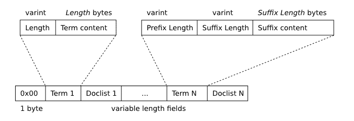
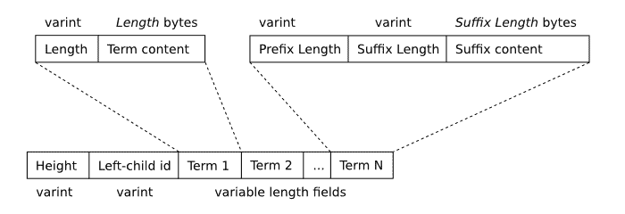
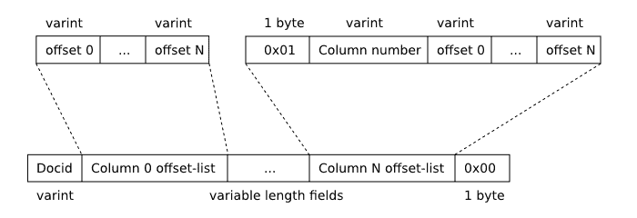

# 1\. FTS3 和 FTS4 简介

> 原文：[`sqlite.com/fts3.html`](https://sqlite.com/fts3.html)

## 概述

FTS3 和 FTS4 是 SQLite 虚拟表模块，允许用户在一组文档上执行全文搜索。描述全文搜索最常见（也是最有效）的方式是"Google、Yahoo 和 Bing 对放置在万维网上的文档所做的事情"。用户输入一个术语或一系列术语，可能由二元操作符连接或组合成一个短语，全文查询系统将找到最符合用户指定的操作符和组合的文档集合。本文描述了 FTS3 和 FTS4 的部署和使用。

FTS1 和 FTS2 是 SQLite 的过时全文搜索模块。已知这些旧模块存在问题，应避免使用。原始 FTS3 代码的部分是由 [Google](http://www.google.com) 的 Scott Hess 贡献给 SQLite 项目的。现在它作为 SQLite 的一部分进行开发和维护。

FTS3 和 FTS4 扩展模块允许用户创建具有内置全文索引的特殊表（以下简称为 "FTS 表"）。全文索引允许用户高效地查询数据库中包含一个或多个单词（以下简称为 "标记"）的所有行，即使表中包含许多大型文档。

例如，如果将 "[Enron 电子邮件数据集](http://www.cs.cmu.edu/~enron/)" 中的 517430 个文档中的每个文档都插入到 FTS 表和使用以下 SQL 脚本创建的普通 SQLite 表中：

```sql
CREATE VIRTUAL TABLE enrondata1 USING fts3(content TEXT);     /* FTS3 table */
CREATE TABLE enrondata2(content TEXT);                        /* Ordinary table */

```

接下来可以执行以下两个查询之一来查找数据库中包含单词 "linux" 的文档数目（351）。在使用一台台式 PC 硬件配置时，对 FTS3 表的查询返回时间约为 0.03 秒，而对普通表的查询时间为 22.5 秒。

```sql
SELECT count(*) FROM enrondata1 WHERE content MATCH 'linux';  /* 0.03 seconds */
SELECT count(*) FROM enrondata2 WHERE content LIKE '%linux%'; /* 22.5 seconds */

```

当然，上述两个查询并不完全相同。例如，LIKE 查询匹配包含诸如 "linuxophobe" 或 "EnterpriseLinux" 这样的术语的行（事实上，Enron 电子邮件数据集实际上并不包含任何这类术语），而在 FTS3 表上的 MATCH 查询仅选择包含 "linux" 作为离散标记的行。两种搜索都是大小写不敏感的。与普通表相比，FTS3 表在磁盘上占用约 2006 MB，而普通表仅占 1453 MB。在使用执行上述 SELECT 查询的相同硬件配置时，FTS3 表的填充时间略低于 31 分钟，而普通表则为 25 分钟。

## 1.1\. FTS3 和 FTS4 的区别

FTS3 和 FTS4 几乎是相同的。它们大部分代码是共享的，接口也相同。它们的区别在于：

+   FTS4 包含查询性能优化，可以显著提高包含非常常见术语（存在于大多数表行中）的全文查询的性能。

+   FTS4 支持一些额外选项，这些选项可以与 [matchinfo()](https://sqlite.com/fts3.html#matchinfo) 函数一起使用。

+   因为它在磁盘上存储额外的信息在两个新的 影子表 中，以支持性能优化和额外的 matchinfo() 选项，FTS4 表可能会比使用 FTS3 创建的等效表占用更多的磁盘空间。通常情况下，额外开销为 1-2% 或更少，但如果存储在 FTS 表中的文档非常小，则可能高达 10%。可以通过在 FTS4 表声明中指定指令 "matchinfo=fts3" 来减少额外开销，但这会以牺牲一些额外支持的 matchinfo() 选项为代价。

+   FTS4 提供了钩子（压缩和解压缩 选项），允许数据以压缩形式存储，从而减少磁盘使用和 IO。

FTS4 是 FTS3 的增强版。FTS3 自从 SQLite 版本 3.5.0（2007-09-04）起就已经可用了。FTS4 的增强功能是在 SQLite 版本 3.7.4（2010-12-07）中添加的。

在你的应用程序中应该使用哪个模块，FTS3 还是 FTS4？FTS4 有时比 FTS3 快得多，甚至根据查询可能快几个数量级，尽管在常见情况下，两个模块的性能相似。FTS4 还提供了增强的 matchinfo() 输出，可以在排名 MATCH 操作的结果时非常有用。另一方面，在缺少 matchinfo=fts3 指令的情况下，FTS4 需要比 FTS3 多一些磁盘空间，尽管在大多数情况下只有百分之一或两。

对于更新的应用程序，推荐使用 FTS4；尽管如果兼容性与旧版本的 SQLite 重要，则 FTS3 通常也能很好地服务。

## 1.2\. 创建和销毁 FTS 表

像其他虚拟表类型一样，可以使用 CREATE VIRTUAL TABLE 语句创建新的 FTS 表。模块名称跟在 USING 关键字之后，可以是 "fts3" 或 "fts4"。虚拟表模块参数可以留空，这样就创建了一个带有单个用户定义列名为 "content" 的 FTS 表。另外，模块参数也可以传递一个逗号分隔的列名列表。

如果在 CREATE VIRTUAL TABLE 语句中明确提供了 FTS 表的列名，则可以为每列可选地指定数据类型名称。这仅仅是语法糖，提供的类型名称不会被 FTS 或 SQLite 核心用于任何目的。同样适用于与 FTS 列名一起指定的任何约束 - 它们被解析但不以任何方式被系统使用或记录。

```sql
*-- Create an FTS table named "data" with one column - "content":*
CREATE VIRTUAL TABLE data USING fts3();

*-- Create an FTS table named "pages" with three columns:*
CREATE VIRTUAL TABLE pages USING fts4(title, keywords, body);

*-- Create an FTS table named "mail" with two columns. Datatypes
-- and column constraints are specified along with each column. These
-- are completely ignored by FTS and SQLite.* 
CREATE VIRTUAL TABLE mail USING fts3(
  subject VARCHAR(256) NOT NULL,
  body TEXT CHECK(length(body)<10240)
);

```

除了列列表外，传递给用于创建 FTS 表的 CREATE VIRTUAL TABLE 语句的模块参数还可以用于指定 tokenizer。 这通过在列名的位置指定形式为 "tokenize=<tokenizer name> <tokenizer args>" 的字符串来完成，其中 <tokenizer name> 是要使用的分词器的名称，<tokenizer args> 是要传递给分词器实现的可选的空格分隔的限定符列表。 分词器规范可以放置在列列表的任何位置，但每个 CREATE VIRTUAL TABLE 语句最多只允许一个分词器声明。 有关使用（和必要时实现）分词器的详细描述，请参见下文。

```sql
*-- Create an FTS table named "papers" with two columns that uses*
*-- the tokenizer "porter".*
CREATE VIRTUAL TABLE papers USING fts3(author, document, tokenize=porter);

*-- Create an FTS table with a single column - "content" - that uses*
*-- the "simple" tokenizer.*
CREATE VIRTUAL TABLE data USING fts4(tokenize=simple);

*-- Create an FTS table with two columns that uses the "icu" tokenizer.*
*-- The qualifier "en_AU" is passed to the tokenizer implementation*
CREATE VIRTUAL TABLE names USING fts3(a, b, tokenize=icu en_AU);

```

FTS 表可以使用普通的 DROP TABLE 语句从数据库中删除。例如：

```sql
*-- Create, then immediately drop, an FTS4 table.*
CREATE VIRTUAL TABLE data USING fts4();
DROP TABLE data;

```

## 1.3\. 填充 FTS 表

FTS 表使用 INSERT、UPDATE 和 DELETE 语句填充，与普通的 SQLite 表相同。

除了用户指定的列（或者在 CREATE VIRTUAL TABLE 语句中未指定模块参数的情况下的 "content" 列），每个 FTS 表还有一个 "rowid" 列。 FTS 表的 rowid 的行为方式与普通 SQLite 表的 rowid 列相同，唯一不同的是，如果使用 VACUUM 命令重建数据库，则 FTS 表的 rowid 列中存储的值保持不变。 对于 FTS 表，“docid” 与通常的 “rowid”、“oid” 和 “_oid_” 标识符一样被允许作为别名。 尝试插入或更新表中已存在的 docid 值的行是一个错误，就像在普通 SQLite 表中一样。

还有一个 "docid" 和普通 SQLite 列的 rowid 别名之间的微妙差别。 通常，如果 INSERT 或 UPDATE 语句为 rowid 列的两个或多个别名分配不同的值，SQLite 将这些值中指定的最右边的值写入数据库。 然而，在插入或更新 FTS 表时，如果将非 NULL 值分配给 "docid" 和一个或多个 SQLite rowid 别名，将被视为错误。 请参见下面的例子。

```sql
*-- Create an FTS table*
CREATE VIRTUAL TABLE pages USING fts4(title, body);

*-- Insert a row with a specific docid value.*
INSERT INTO pages(docid, title, body) VALUES(53, 'Home Page', 'SQLite is a software...');

*-- Insert a row and allow FTS to assign a docid value using the same algorithm as*
*-- SQLite uses for ordinary tables. In this case the new docid will be 54,*
*-- one greater than the largest docid currently present in the table.*
INSERT INTO pages(title, body) VALUES('Download', 'All SQLite source code...');

*-- Change the title of the row just inserted.*
UPDATE pages SET title = 'Download SQLite' WHERE rowid = 54;

*-- Delete the entire table contents.*
DELETE FROM pages;

*-- The following is an error. It is not possible to assign non-NULL values to both*
*-- the rowid and docid columns of an FTS table.*
INSERT INTO pages(rowid, docid, title, body) VALUES(1, 2, 'A title', 'A document body');

```

为了支持全文查询，FTS 维护了一个反向索引，将数据集中出现的每个唯一术语或单词映射到表内容中出现的位置。对于那些好奇的人，有关用于在数据库文件中存储此索引的数据结构的完整描述如下。这种数据结构的一个特点是，在任何时候，数据库可能包含不止一个索引 b 树，而是几个不同的 b 树，随着行的插入、更新和删除而逐步合并。这种技术提高了写入 FTS 表时的性能，但对使用索引的全文查询造成了一些开销。评估特殊的"optimize" 命令，一个形如 "INSERT INTO <fts-table>(<fts-table>) VALUES('optimize')" 的 SQL 语句，会导致 FTS 将所有现有的索引 b 树合并为一个包含整个索引的单个大 b 树。这可能是一项昂贵的操作，但可以加快未来的查询速度。

例如，要优化名为 "docs" 的 FTS 表的全文索引：

```sql
*-- Optimize the internal structure of FTS table "docs".*
INSERT INTO docs(docs) VALUES('optimize');

```

对于某些人来说，上述语句在语法上可能是不正确的。参考描述简单 FTS 查询的部分以获取解释。

还有另一种已弃用的方法，可以使用 SELECT 语句来调用优化操作。新代码应该使用类似上面 INSERT 的语句来优化 FTS 结构。

## 1.4\. 简单 FTS 查询

与所有其他 SQLite 表一样，无论是虚拟的还是其他类型的表，都可以使用 SELECT 语句从 FTS 表中检索数据。

可以使用两种不同形式的 SELECT 语句有效地查询 FTS 表：

+   **按 rowid 查询**。如果 SELECT 语句的 WHERE 子句包含形式为 "rowid = ?" 的子句，其中 ? 是一个 SQL 表达式，则 FTS 能够直接检索请求的行，使用相当于 SQLite INTEGER PRIMARY KEY 索引。

+   **全文查询**。如果 SELECT 语句的 WHERE 子句包含形式为 "<column> MATCH ?" 的子句，则 FTS 能够使用内置的全文索引将搜索限制为与 MATCH 子句指定的全文查询字符串匹配的那些文档。

如果这两种查询策略都不能使用，所有 FTS 表上的查询都将使用对整个表进行线性扫描的方式来实现。如果表包含大量数据，这可能是一种不切实际的方法（本页上的第一个示例显示，使用现代 PC 对 1.5 GB 数据进行线性扫描大约需要 30 秒）。

```sql
*-- The examples in this block assume the following FTS table:*
CREATE VIRTUAL TABLE mail USING fts3(subject, body);

SELECT * FROM mail WHERE rowid = 15;                *-- Fast. Rowid lookup.*
SELECT * FROM mail WHERE body MATCH 'sqlite';       *-- Fast. Full-text query.*
SELECT * FROM mail WHERE mail MATCH 'search';       *-- Fast. Full-text query.*
SELECT * FROM mail WHERE rowid BETWEEN 15 AND 20;   *-- Fast. Rowid lookup.*
SELECT * FROM mail WHERE subject = 'database';      *-- Slow. Linear scan.*
SELECT * FROM mail WHERE subject MATCH 'database';  *-- Fast. Full-text query.*

```

在上述所有的全文查询中，MATCH 操作符的右操作数是一个由单个术语组成的字符串。在这种情况下，MATCH 表达式对所有包含指定单词（"sqlite"、"search" 或 "database"，取决于您查看的示例）的文档都会评估为 true。将单个术语指定为 MATCH 操作符的右操作数会导致可能的最简单和最常见类型的全文查询。但是，还可以执行更复杂的查询，包括短语搜索、术语前缀搜索以及搜索包含在指定距离内的术语组合的文档。可以在下面的描述中找到可以查询全文索引的各种方式。

通常，全文查询是不区分大小写的。但是，这取决于正在查询的 FTS 表使用的具体分词器。有关详细信息，请参阅关于分词器的部分。

上文指出，将一个简单术语作为右操作数的 MATCH 操作符评估为 true 的所有包含指定术语的文档。在此上下文中，“文档”可以是指存储在 FTS 表的行的单个列中的数据，也可以是指单个行中所有列的内容，这取决于作为 MATCH 操作符左操作数的标识符。如果指定为 MATCH 操作符左操作数的标识符是 FTS 表列名，则搜索术语必须包含在指定列中存储的值中的文档。但是，如果标识符是 FTS *表*本身的名称，则 MATCH 操作符对 FTS 表的每一行评估为 true，只要任何列包含搜索术语。下面的示例演示了这一点：

```sql
*-- Example schema*
CREATE VIRTUAL TABLE mail USING fts3(subject, body);

*-- Example table population*
INSERT INTO mail(docid, subject, body) VALUES(1, 'software feedback', 'found it too slow');
INSERT INTO mail(docid, subject, body) VALUES(2, 'software feedback', 'no feedback');
INSERT INTO mail(docid, subject, body) VALUES(3, 'slow lunch order',  'was a software problem');

*-- Example queries*
SELECT * FROM mail WHERE subject MATCH 'software';    *-- Selects rows 1 and 2*
SELECT * FROM mail WHERE body    MATCH 'feedback';    *-- Selects row 2*
SELECT * FROM mail WHERE mail    MATCH 'software';    *-- Selects rows 1, 2 and 3*
SELECT * FROM mail WHERE mail    MATCH 'slow';        *-- Selects rows 1 and 3*

```

乍一看，上面示例中的最后两个全文查询似乎在语法上是不正确的，因为存在作为 SQL 表达式使用的表名 ("mail")。之所以可以接受这种情况是因为每个 FTS 表实际上都有一个与表本身相同的 HIDDEN 列（在本例中为 "mail"）。存储在此列中的值对应用程序无意义，但可以用作 MATCH 操作符的左操作数。此特殊列也可以作为 FTS 辅助函数的参数传递。

下面的示例说明了上述内容。表达式 "docs"、"docs.docs" 和 "main.docs.docs" 都指代列 "docs"。但是，表达式 "main.docs" 并不指代任何列。它可以用来指代表，但是在下文使用的上下文中不允许使用表名。

```sql
*-- Example schema*
CREATE VIRTUAL TABLE docs USING fts4(content);

*-- Example queries*
SELECT * FROM docs WHERE docs MATCH 'sqlite';              *-- OK.*
SELECT * FROM docs WHERE docs.docs MATCH 'sqlite';         *-- OK.*
SELECT * FROM docs WHERE main.docs.docs MATCH 'sqlite';    *-- OK.*
SELECT * FROM docs WHERE main.docs MATCH 'sqlite';         *-- Error.*

```

## 1.5\. 摘要

从用户角度看，FTS 表在许多方面与普通 SQLite 表类似。数据可以通过 INSERT、UPDATE 和 DELETE 命令添加到 FTS 表中，也可以从中修改和删除，就像操作普通表一样。类似地，可以使用 SELECT 命令查询数据。以下列表总结了 FTS 和普通表之间的区别：

1.  与所有虚拟表类型一样，不可能为 FTS 表创建索引或触发器。也不可能使用 ALTER TABLE 命令向 FTS 表添加额外的列（尽管可以使用 ALTER TABLE 命令重命名 FTS 表）。

1.  在用于创建 FTS 表的"CREATE VIRTUAL TABLE"语句中指定的数据类型完全被忽略。与将类型亲和性应用于插入值的常规规则不同，所有插入到 FTS 表列中的值（除了特殊的 rowid 列）在存储之前都会被转换为 TEXT 类型。

1.  FTS 表允许使用特殊的别名"docid"来引用所有虚拟表支持的 rowid 列。

1.  内置全文索引支持基于 FTS MATCH 运算符的查询。

1.  支持全文查询的辅助函数 FTS 辅助功能，snippet()，offsets()和 matchinfo()可用于支持全文查询。

1.  每个 FTS 表都有一个隐藏列，其列名与表名相同。每行隐藏列中包含的值是一个 blob，仅在作为 MATCH 运算符的左操作数或作为 FTS 辅助功能的最左参数时才有用。

# 2\. 编译和启用 FTS3 和 FTS4

虽然 FTS3 和 FTS4 包含在 SQLite 核心源代码中，但它们默认未启用。要构建启用 FTS 功能的 SQLite，请在编译时定义预处理器宏 SQLITE_ENABLE_FTS3。新应用程序还应定义 SQLITE_ENABLE_FTS3_PARENTHESIS 宏以启用增强的查询语法（见下文）。通常，通过将以下两个开关添加到编译器命令行来完成此操作：

```sql
-DSQLITE_ENABLE_FTS3
-DSQLITE_ENABLE_FTS3_PARENTHESIS

```

请注意，启用 FTS3 也会使 FTS4 可用。没有单独的 SQLITE_ENABLE_FTS4 编译时选项。SQLite 的构建要么同时支持 FTS3 和 FTS4，要么两者都不支持。

如果使用集成的基于 autoconf 的构建系统，可以在运行'configure'脚本时通过设置 CPPFLAGS 环境变量来轻松设置这些宏。例如，以下命令：

```sql
CPPFLAGS="-DSQLITE_ENABLE_FTS3 -DSQLITE_ENABLE_FTS3_PARENTHESIS" ./configure <configure options>

```

其中*<configure options>*是通常传递给配置脚本的选项（如果有）。

因为 FTS3 和 FTS4 是虚拟表，因此 SQLITE_ENABLE_FTS3 编译时选项与 SQLITE_OMIT_VIRTUALTABLE 选项不兼容。

如果 SQLite 的构建不包括 FTS 模块，则任何尝试准备 SQL 语句来创建 FTS3 或 FTS4 表，或者以任何方式删除或访问现有 FTS 表都将失败。返回的错误消息将类似于 "no such module: ftsN"（其中 N 为 3 或 4）。

如果 C 版本的 [ICU 库](https://icu.unicode.org) 可用，则 FTS 也可以编译时使用定义了 SQLITE_ENABLE_ICU 预处理宏。使用此宏编译可以启用使用 ICU 库将文档拆分为术语（单词）的 FTS 分词器，使用指定语言和区域设置的约定。

```sql
-DSQLITE_ENABLE_ICU

```

# 3\. 全文索引查询

FTS 表最有用的是可以使用内置全文索引执行的查询。通过在 SELECT 语句的 WHERE 子句中作为 "<column> MATCH <full-text query expression>" 形式的子句指定来执行全文查询，该子句从 FTS 表中读取数据。如上述简单 FTS 查询返回包含给定术语的所有文档。在该讨论中，MATCH 运算符的右操作数假定为由单个术语组成的字符串。本节描述了 FTS 表支持的更复杂查询类型，并说明可以通过将更复杂的查询表达式指定为 MATCH 运算符的右操作数来利用它们。

FTS 表支持三种基本的查询类型：

+   **令牌或令牌前缀查询**。可以查询 FTS 表以获取包含指定术语的所有文档（如上述的简单情况所述），或者包含具有指定前缀的术语的所有文档。正如我们所见，用于特定术语的查询表达式只是术语本身。用于搜索术语前缀的查询表达式是前缀本身，并附加 '*' 字符。例如：

```sql
*-- Virtual table declaration*
CREATE VIRTUAL TABLE docs USING fts3(title, body);

*-- Query for all documents containing the term "linux":*
SELECT * FROM docs WHERE docs MATCH 'linux';

*-- Query for all documents containing a term with the prefix "lin". This will match*
*-- all documents that contain "linux", but also those that contain terms "linear",*
*--"linker", "linguistic" and so on.*
SELECT * FROM docs WHERE docs MATCH 'lin*';

```

+   通常，令牌或令牌前缀查询与 MATCH 运算符的左侧指定的 FTS 表列匹配。或者，如果指定了具有与 FTS 表本身相同名称的特殊列，则与所有列匹配。这可以通过在基本术语查询之前指定列名后跟 ":" 字符来覆盖。可以在 ":" 和要查询的术语之间留有空格，但不能在列名和 ":" 字符之间留有空格。例如：

```sql
*-- Query the database for documents for which the term "linux" appears in*
*-- the document title, and the term "problems" appears in either the title*
*-- or body of the document.*
SELECT * FROM docs WHERE docs MATCH 'title:linux problems';

*-- Query the database for documents for which the term "linux" appears in*
*-- the document title, and the term "driver" appears in the body of the document*
*-- ("driver" may also appear in the title, but this alone will not satisfy the*
*-- query criteria).*
SELECT * FROM docs WHERE body MATCH 'title:linux driver';

```

+   如果 FTS 表是 FTS4 表（而非 FTS3），则令牌还可以以 "^" 字符为前缀。在这种情况下，为了匹配，令牌必须作为匹配行中任何列的第一个令牌出现。示例：

```sql
*-- All documents for which "linux" is the first token of at least one*
*-- column.*
SELECT * FROM docs WHERE docs MATCH '^linux';

*-- All documents for which the first token in column "title" begins with "lin".*
SELECT * FROM docs WHERE body MATCH 'title: ^lin*';

```

+   **短语查询**。短语查询是一种检索包含指定顺序中没有介入标记的所有术语或术语前缀集合的文档的查询。短语查询通过在双引号（"）中包含以空格分隔的术语或术语前缀序列来指定。例如：

```sql
*-- Query for all documents that contain the phrase "linux applications".*
SELECT * FROM docs WHERE docs MATCH '"linux applications"';

*-- Query for all documents that contain a phrase that matches "lin* app*". As well as*
*-- "linux applications", this will match common phrases such as "linoleum appliances"*
*-- or "link apprentice".*
SELECT * FROM docs WHERE docs MATCH '"lin* app*"';

```

+   **NEAR 查询**。NEAR 查询是一种查询，返回包含在指定接近范围内（默认为 10 个或更少的间隔项）的两个或多个指定术语或短语的文档。通过在两个短语、标记或标记前缀查询之间放置关键词“NEAR”来指定 NEAR 查询。要指定除默认值以外的接近度，可以使用形式为“NEAR/*<N>*”的操作符，其中 *<N>* 是允许的最大间隔项数。例如：

```sql
*-- Virtual table declaration.*
CREATE VIRTUAL TABLE docs USING fts4();

*-- Virtual table data.*
INSERT INTO docs VALUES('SQLite is an ACID compliant embedded relational database management system');

*-- Search for a document that contains the terms "sqlite" and "database" with*
*-- not more than 10 intervening terms. This matches the only document in*
*-- table docs (since there are only six terms between "SQLite" and "database"*
*-- in the document)*.
SELECT * FROM docs WHERE docs MATCH 'sqlite NEAR database';

*-- Search for a document that contains the terms "sqlite" and "database" with*
*-- not more than 6 intervening terms. This also matches the only document in*
*-- table docs. Note that the order in which the terms appear in the document*
*-- does not have to be the same as the order in which they appear in the query.*
SELECT * FROM docs WHERE docs MATCH 'database NEAR/6 sqlite';

*-- Search for a document that contains the terms "sqlite" and "database" with*
*-- not more than 5 intervening terms. This query matches no documents.*
SELECT * FROM docs WHERE docs MATCH 'database NEAR/5 sqlite';

*-- Search for a document that contains the phrase "ACID compliant" and the term*
*-- "database" with not more than 2 terms separating the two. This matches the*
*-- document stored in table docs.*
SELECT * FROM docs WHERE docs MATCH 'database NEAR/2 "ACID compliant"';

*-- Search for a document that contains the phrase "ACID compliant" and the term*
*-- "sqlite" with not more than 2 terms separating the two. This also matches*
*-- the only document stored in table docs.*
SELECT * FROM docs WHERE docs MATCH '"ACID compliant" NEAR/2 sqlite';

```

+   一个查询中可以出现多个 NEAR 操作符。在这种情况下，由 NEAR 操作符分隔的每对术语或短语必须在文档中指定的接近范围内出现。与上面示例块中的相同表格和数据一样：

```sql
*-- The following query selects documents that contains an instance of the term* 
*-- "sqlite" separated by two or fewer terms from an instance of the term "acid",*
*-- which is in turn separated by two or fewer terms from an instance of the term*
*-- "relational".*
SELECT * FROM docs WHERE docs MATCH 'sqlite NEAR/2 acid NEAR/2 relational';

*-- This query matches no documents. There is an instance of the term "sqlite" with*
*-- sufficient proximity to an instance of "acid" but it is not sufficiently close*
*-- to an instance of the term "relational".*
SELECT * FROM docs WHERE docs MATCH 'acid NEAR/2 sqlite NEAR/2 relational';

```

短语和 NEAR 查询不能跨越行中的多个列。

上述描述的三种基本查询类型可用于查询满足指定条件的全文索引文档集合。使用 FTS 查询表达语言，可以对基本查询结果执行各种集合操作。目前支持三种操作：

+   AND 操作符确定两个文档集合的**交集**。

+   OR 操作符计算两个文档集合的**并集**。

+   使用标准语法，NOT 操作符（或者使用一元"-"运算符）可以计算一个文档集合对另一个文档集合的**相对补集**。

FTS 模块可以编译成使用两种稍微不同的全文查询语法版本之一，即“标准”查询语法和“增强”查询语法。上述的基本术语、术语前缀、短语和 NEAR 查询在这两个版本中都是相同的。指定集合操作的方式略有不同。下面的两个子部分描述了与集合操作相关的两个查询语法部分。有关如何编译 FTS 的详细说明，请参考编译注意事项。

## 3.1\. 使用增强查询语法进行集合操作

增强查询语法支持 AND、OR 和 NOT 二元集合操作符。操作符的每个操作数可以是基本的 FTS 查询，或者是另一个 AND、OR 或 NOT 集合操作的结果。操作符必须使用大写字母输入，否则它们将被解释为基本术语查询，而不是集合操作符。

AND 操作符可以隐式指定。如果两个基本查询在 FTS 查询字符串中没有分隔符分隔，结果与两个基本查询之间隔开的 AND 操作符一样。例如，查询表达式 "implicit operator" 是 "implicit AND operator" 的更简洁版本。

```sql
*-- Virtual table declaration*
CREATE VIRTUAL TABLE docs USING fts3();

*-- Virtual table data*
INSERT INTO docs(docid, content) VALUES(1, 'a database is a software system');
INSERT INTO docs(docid, content) VALUES(2, 'sqlite is a software system');
INSERT INTO docs(docid, content) VALUES(3, 'sqlite is a database');

*-- Return the set of documents that contain the term "sqlite", and the*
*-- term "database". This query will return the document with docid 3 only.*
SELECT * FROM docs WHERE docs MATCH 'sqlite AND database';

*-- Again, return the set of documents that contain both "sqlite" and*
*-- "database". This time, use an implicit AND operator. Again, document*
*-- 3 is the only document matched by this query.* 
SELECT * FROM docs WHERE docs MATCH 'database sqlite';

*-- Query for the set of documents that contains either "sqlite" or "database".*
*-- All three documents in the database are matched by this query.*
SELECT * FROM docs WHERE docs MATCH 'sqlite OR database';

*-- Query for all documents that contain the term "database", but do not contain*
*-- the term "sqlite". Document 1 is the only document that matches this criteria.*
SELECT * FROM docs WHERE docs MATCH 'database NOT sqlite';

*-- The following query matches no documents. Because "and" is in lowercase letters,*
*-- it is interpreted as a basic term query instead of an operator. Operators must*
*-- be specified using capital letters. In practice, this query will match any documents*
*-- that contain each of the three terms "database", "and" and "sqlite" at least once.*
*-- No documents in the example data above match this criteria.*
SELECT * FROM docs WHERE docs MATCH 'database and sqlite';

```

上述示例中均使用基本的全文术语查询作为展示集合操作的操作数。还可以使用短语查询和 NEAR 查询，以及其他集合操作的结果。在一个 FTS 查询中存在多个集合操作时，操作符的优先级如下：

| 操作符 | 增强查询语法优先级 |
| --- | --- |
| NOT | 最高优先级（最紧密分组）。 |
| AND |  |
| OR | 最低优先级（最宽松分组）。 |

在使用增强查询语法时，括号可以用来覆盖各种操作符的默认优先级。例如：

```sql
*-- Return the docid values associated with all documents that contain the*
*-- two terms "sqlite" and "database", and/or contain the term "library".*
SELECT docid FROM docs WHERE docs MATCH 'sqlite AND database OR library';

*-- This query is equivalent to the above.*
SELECT docid FROM docs WHERE docs MATCH 'sqlite AND database'
  UNION
SELECT docid FROM docs WHERE docs MATCH 'library';

*-- Query for the set of documents that contains the term "linux", and at least*
*-- one of the phrases "sqlite database" and "sqlite library".*
SELECT docid FROM docs WHERE docs MATCH '("sqlite database" OR "sqlite library") AND linux';

*-- This query is equivalent to the above.*
SELECT docid FROM docs WHERE docs MATCH 'linux'
  INTERSECT
SELECT docid FROM (
  SELECT docid FROM docs WHERE docs MATCH '"sqlite library"'
    UNION
  SELECT docid FROM docs WHERE docs MATCH '"sqlite database"'
);

```

## 3.2\. 使用标准查询语法进行集合操作

使用标准查询语法的 FTS 查询集合操作与增强查询语法的集合操作类似，但不完全相同。以下有四个差异：

1.  仅支持 AND 操作符的隐式版本。在标准查询语法查询中，指定字符串 "AND" 作为文档集合中包含术语 "and" 的术语查询的解释是一个术语查询。

1.  不支持括号。

1.  不支持 NOT 操作符。标准查询语法支持一个一元 "-" 操作符，可以应用于基本术语和术语前缀查询（但不能应用于短语或 NEAR 查询）。附有一元 "-" 操作符的术语或术语前缀不能作为 OR 操作符的操作数。FTS 查询不能完全由附有一元 "-" 操作符的术语或术语前缀查询组成。

```sql
*-- Search for the set of documents that contain the term "sqlite" but do*
*-- not contain the term "database".*
SELECT * FROM docs WHERE docs MATCH 'sqlite -database';

```

1.  集合操作的相对优先级不同。特别是使用标准查询语法时，"OR" 操作符的优先级高于 "AND"。在使用标准查询语法时，操作符的优先级如下：

| 操作符 | 标准查询语法优先级 |
| --- | --- |
| Unary "-" | 最高优先级（最紧密分组）。 |
| OR |  |
| AND | 最低优先级（最宽松分组）。 |

1.  以下示例说明了使用标准查询语法的操作符优先级：

```sql
*-- Search for documents that contain at least one of the terms "database"*
*-- and "sqlite", and also contain the term "library". Because of the differences*
*-- in operator precedences, this query would have a different interpretation using*
*-- the enhanced query syntax.*
SELECT * FROM docs WHERE docs MATCH 'sqlite OR database library';

```

# 4\. 辅助函数 - Snippet、Offsets 和 Matchinfo

FTS3 和 FTS4 模块提供了三个特殊的 SQL 标量函数，对于全文查询系统的开发者可能会很有用："snippet"、"offsets" 和 "matchinfo"。"snippet" 和 "offsets" 函数的目的是允许用户确定返回文档中查询词的位置。"matchinfo" 函数提供了一些指标，这些指标可能对根据相关性过滤或排序查询结果很有用。

所有三个特殊的 SQL 标量函数的第一个参数必须是适用于该函数的 FTS 表的 FTS 隐藏列。FTS 隐藏列是在所有 FTS 表上找到的一个自动生成的列，其名称与 FTS 表本身相同。例如，给定一个名为“mail”的 FTS 表：

```sql
SELECT offsets(mail) FROM mail WHERE mail MATCH <full-text query expression>;
SELECT snippet(mail) FROM mail WHERE mail MATCH <full-text query expression>;
SELECT matchinfo(mail) FROM mail WHERE mail MATCH <full-text query expression>;

```

三个辅助函数仅在使用了 FTS 表的全文索引的 SELECT 语句内有用。如果在使用了“按行号查询”或“线性扫描”策略的 SELECT 中使用，则片段和偏移都返回一个空字符串，并且 matchinfo 函数返回一个大小为零字节的 blob 值。

所有三个辅助函数从 FTS 查询表达式中提取一组“可匹配短语”以便处理。对于给定查询的可匹配短语集合包括表达式中所有短语（包括未引用的标记和标记前缀），除了那些以一元“-”运算符作为前缀（标准语法）或者是作为 NOT 运算符的右操作数使用的子表达式的部分。

在以下情况下，FTS 表中与查询表达式中的可匹配短语之一匹配的一系列标记被称为“短语匹配”：

1.  如果可匹配短语是 FTS 查询表达式中由 NEAR 运算符连接的一系列短语的一部分，那么每个短语匹配都必须与相关类型的其他短语匹配足够接近以满足 NEAR 条件。

1.  如果 FTS 查询中的可匹配短语受限于匹配特定 FTS 表列中的数据，则只有出现在该列中的短语匹配会被考虑。

## 4.1\. 偏移函数

对于使用全文索引的 SELECT 查询，offsets()函数返回一个包含一系列以空格分隔的整数的文本值。对于当前行的每个短语匹配中的每个项，返回的列表中有四个整数。每组四个整数的解释如下：

| 整数 | 解释 |
| --- | --- |
| 0 | 项实例出现的列编号（FTS 表最左边的列为 0，依次类推）。 |
| 1 | 完整文本查询表达式中匹配项的项编号。查询表达式中的项按它们出现的顺序从 0 开始编号。 |
| 2 | 列中匹配项的字节偏移。 |
| 3 | 匹配项的字节大小。 |

以下块包含使用 offsets 函数的示例。

```sql
CREATE VIRTUAL TABLE mail USING fts3(subject, body);
INSERT INTO mail VALUES('hello world', 'This message is a hello world message.');
INSERT INTO mail VALUES('urgent: serious', 'This mail is seen as a more serious mail');

*-- The following query returns a single row (as it matches only the first*
*-- entry in table "mail". The text returned by the offsets function is*
*-- "0 0 6 5 1 0 24 5".*
*--*
*-- The first set of four integers in the result indicate that column 0*
*-- contains an instance of term 0 ("world") at byte offset 6\. The term instance*
*-- is 5 bytes in size. The second set of four integers shows that column 1*
*-- of the matched row contains an instance of term 0 ("world") at byte offset*
*-- 24\. Again, the term instance is 5 bytes in size.*
SELECT offsets(mail) FROM mail WHERE mail MATCH 'world';

*-- The following query returns also matches only the first row in table "mail".*
*-- In this case the returned text is "1 0 5 7 1 0 30 7".*
SELECT offsets(mail) FROM mail WHERE mail MATCH 'message';

*-- The following query matches the second row in table "mail". It returns the*
*-- text "1 0 28 7 1 1 36 4". Only those occurrences of terms "serious" and "mail"*
*-- that are part of an instance of the phrase "serious mail" are identified; the*
*-- other occurrences of "serious" and "mail" are ignored.*
SELECT offsets(mail) FROM mail WHERE mail MATCH '"serious mail"';

```

## 4.2\. 片段函数

片段函数用于为全文查询结果报告的显示创建格式化的文档文本片段。片段函数可以传递一个到六个参数，如下：

| 参数 | 默认值 | 描述 |
| --- | --- | --- |
| 0 | N/A | 碎片函数的第一个参数必须始终是查询的 FTS 隐藏列，并且从中获取碎片的 FTS 表。FTS 隐藏列 是一个与 FTS 表同名的自动生成列。  |
| 1 | "<b>" | "开始匹配" 文本。  |
| 2 | "</b>" | "结束匹配" 文本。  |
| 3 | "<b>...</b>" | "省略号" 文本。  |
| 4 | -1 | 要从中提取返回文本片段的 FTS 表列号。列从左到右编号，从零开始。负值表示文本可能从任意列提取。  |
| 5 | -15 | 此整数参数的绝对值用作返回文本值中包含的标记数（大约）。允许的最大绝对值为 64。在下面的讨论中，此参数的值称为 *N*。 |

碎片函数首先尝试在当前行内找到由 *|N|* 个标记组成的文本片段，该片段至少包含当前行某处匹配的每个可匹配短语。这里的 *|N|* 是传递给碎片函数的第六个参数的绝对值。如果存储在单列中的文本包含的标记少于 *|N|*，则整个列值被视为一个文本片段。文本片段不可跨越多列。

如果找到这样的文本片段，则会返回带有以下修改的文本：

+   如果文本片段不是从列值的开头开始，则将 "省略号" 文本前置到其前面。

+   如果文本片段未在列值结束时完成，则将 "省略号" 文本附加到其后。

+   对于文本片段中的每个作为短语匹配一部分的标记，在该标记之前插入 "开始匹配" 文本，并在其后立即插入 "结束匹配" 文本。

如果可以找到多个这样的片段，则优先选择包含较多 "额外" 短语匹配的片段。所选文本片段的开始可能向前或向后移动几个标记，以尝试将短语匹配集中在片段的中心。

假设 *N* 是正值，如果找不到包含每个可匹配短语的短语匹配的文本片段，则碎片函数尝试找到大约 *N*/2 个标记的两个文本片段，它们之间至少包含当前行匹配的每个可匹配短语的一个短语匹配。如果失败，则尝试找到三个 *N*/3 标记的文本片段，最后四个 *N*/4 标记的文本片段。如果找不到包含所需短语匹配的四个片段，则选择提供最佳覆盖率的四个 *N*/4 标记片段。

如果*N*是负值，并且找不到包含所需短语匹配的单个片段，则 snippet 函数搜索两个每个有*N*标记的片段，然后三个，然后四个。换句话说，如果指定的*N*值是负数，则如果需要多个片段来提供所需的短语匹配覆盖范围，则片段的大小不会减小。

在*找到*的*M*片段之后，其中*M*介于两个和四个之间，正如前面的段落所描述的，它们按照排序顺序连接在一起，用"省略号"文本分隔它们。在返回之前，执行前面列举的三种修改。

```sql
Note: In this block of examples, newlines and whitespace characters have
been inserted into the document inserted into the FTS table, and the expected
results described in SQL comments. This is done to enhance readability only,
they would not be present in actual SQLite commands or output.

*-- Create and populate an FTS table.*
CREATE VIRTUAL TABLE text USING fts4();
INSERT INTO text VALUES('
  During 30 Nov-1 Dec, 2-3oC drops. Cool in the upper portion, minimum temperature 14-16oC
  and cool elsewhere, minimum temperature 17-20oC. Cold to very cold on mountaintops,
  minimum temperature 6-12oC. Northeasterly winds 15-30 km/hr. After that, temperature
  increases. Northeasterly winds 15-30 km/hr.
');

*-- The following query returns the text value:*
*--*
*--   "<b>...</b>cool elsewhere, minimum temperature 17-20oC. <b>Cold</b> to very* 
*--    <b>cold</b> on mountaintops, minimum temperature 6<b>...</b>".*
*--*
SELECT snippet(text) FROM text WHERE text MATCH 'cold';

*-- The following query returns the text value:*
*--*
*--   "...the upper portion, [minimum] [temperature] 14-16oC and cool elsewhere,*
*--    [minimum] [temperature] 17-20oC. Cold..."*
*--*
SELECT snippet(text, '[', ']', '...') FROM text WHERE text MATCH '"min* tem*"'

```

## 4.3\. 匹配信息函数

matchinfo 函数返回一个 blob 值。如果它用于一个不使用全文本索引的查询（"按行 id 查询"或"线性扫描"），那么 blob 的大小为零字节。否则，该 blob 由零个或多个机器字节顺序的 32 位无符号整数组成。返回的数组中确切的整数数量取决于查询和传递给 matchinfo 函数的第二个参数（如果有的话）的值。

matchinfo 函数被调用时，参数可以是一个或两个。和其他所有辅助函数一样，第一个参数必须是特殊的 FTS 隐藏列。如果指定了第二个参数，它必须是一个仅由字符'p'、'c'、'n'、'a'、'l'、's'、'x'、'y'和'b'组成的文本值。如果没有显式提供第二个参数，则默认为"pcx"。下面我们称第二个参数为"格式字符串"。

matchinfo 格式字符串中的字符从左到右进行处理。格式字符串中的每个字符会导致一个或多个 32 位无符号整数值被添加到返回的数组中。下表中的"值"列包含了对每个支持的格式字符串字符追加到输出缓冲区的整数值的数量。在给定的公式中，*cols*是 FTS 表中的列数，*phrases*是查询中的可匹配短语的数量。

| 字符 | 值 | 描述 |
| --- | --- | --- |
| p | 1 | 查询中可匹配短语的数量。 |
| c | 1 | FTS 表中用户定义列的数量（即不包括 docid 或 FTS 隐藏列）。 |

| x | 3 * *cols* * *phrases* | 对于每个短语和表列的不同组合，以下三个值：

+   在当前行，短语在列中出现的次数。

+   在 FTS 表中，短语在所有行中出现的总次数。

+   FTS 表中的行数的总和，其中该列至少包含短语的一个实例。

第一组三个值对应表的最左列（列 0）和查询中最左可匹配短语（短语 0）。如果表有多个列，则输出数组中的第二组三个值对应短语 0 和列 1。然后是短语 0，列 2，依此类推直至表的所有列。以此类推，对于短语 1，列 0，然后是短语 1，列 1 等。换句话说，可在以下公式中找到列*c*中短语*p*出现的数据：

```sql
          hits_this_row  = array[3 * (c + p*cols) + 0]
          hits_all_rows  = array[3 * (c + p*cols) + 1]
          docs_with_hits = array[3 * (c + p*cols) + 2]

```

|

| y | *列* * *短语* | 对于短语和表列的每个不同组合，出现在该列中的可用短语匹配数量。这通常与匹配信息 'x' 标志返回的每组三个值的第一个值相同。然而，对于任何短语是不匹配当前行的子表达式的情况，'y'标志报告的命中次数为零。这对包含 AND 运算符的表达式产生差异，这些 AND 运算符是 OR 运算符的后代。例如，考虑以下表达式：

```sql
          a OR (b AND c)

```

和文档：

```sql
          "a c d"

```

匹配信息 'x' 标志会报告短语"a"和"c"的一次命中。然而，'y'指令报告"c"的命中次数为零，因为它是一个不匹配文档的子表达式的一部分 - (b AND c)。对于不包含从 OR 运算符派生的 AND 运算符的查询，'y'返回的结果值始终与'x'返回的结果值相同。整数值数组中的第一个值对应表的最左列（列 0）和查询中的第一个短语（短语 0）。可使用以下公式找到对应于其他列/短语组合的值：

```sql
          hits_for_phrase_p_column_c  = array[c + p*cols]

```

对于使用 OR 表达式的查询，或者使用 LIMIT 或返回许多行的查询，'y'匹配信息选项可能比'x'更快。 |

| b | *((cols+31)/32)* * *phrases* | matchinfo 中的'b'标志提供与 matchinfo 中的'y'标志类似的信息，但形式更紧凑。与精确的命中次数不同，'b'为每个短语/列组合提供单一的布尔标志。如果短语至少在列中出现一次（即'y'的相应整数输出非零），则设置相应的标志，否则清除。如果表具有 32 列或更少，则每个查询短语的输出都是一个无符号整数。整数的最低有效位设置为短语至少出现在列 0 中一次。第二最低有效位设置为短语在列 1 中至少出现一次，依此类推。如果表的列数超过 32，则为每 32 列或其部分额外添加一个整数到每个短语的输出中。相同短语的整数被聚合在一起。例如，如果查询具有 45 列的表中的两个短语，则会输出 4 个整数。第一个对应于短语 0 和表的列 0-31。第二个整数包含短语 0 和列 32-44 的数据，依此类推。例如，如果 nCol 是表中列的数量，则要确定短语 p 是否存在于列 c 中：

```sql
    p_is_in_c = array[p * ((nCol+31)/32)] & (1 << (c % 32))

```

|

| n | 1 | FTS4 表中的行数。仅当查询 FTS4 表时才可用此值，而不是 FTS3。 |
| --- | --- | --- |
| a | *cols* | 对于每一列，在存储在列中的文本值中的标记平均数量（考虑 FTS4 表中的所有行）。仅当查询 FTS4 表时才可用此值，而不是 FTS3。 |
| l | *cols* | 对于每一列，在当前行的 FTS4 表中存储的值的长度，以标记为单位。仅当查询 FTS4 表时才可用此值，而不是 FTS3。只有在创建 FTS4 表的"CREATE VIRTUAL TABLE"语句中未指定"matchinfo=fts3"指令时才可用。 |
| s | *cols* | 对于每一列，与查询文本共享的短语匹配的最长子序列的长度。例如，如果表列包含文本'a b c d e'，并且查询是'a c "d e"'，则最长公共子序列的长度为 2（短语"c"后跟短语"d e"）。 |

例如：

```sql
*-- Create and populate an FTS4 table with two columns:*
CREATE VIRTUAL TABLE t1 USING fts4(a, b);
INSERT INTO t1 VALUES('transaction default models default', 'Non transaction reads');
INSERT INTO t1 VALUES('the default transaction', 'these semantics present');
INSERT INTO t1 VALUES('single request', 'default data');

*-- In the following query, no format string is specified and so it defaults*
*-- to "pcx". It therefore returns a single row consisting of a single blob*
*-- value 80 bytes in size (20 32-bit integers - 1 for "p", 1 for "c" and*
*-- 3*2*3 for "x"). If each block of 4 bytes in* the blob is interpreted
*-- as an unsigned integer in machine byte-order, the values will be:*
*--*
*--     3 2  1 3 2  0 1 1  1 2 2  0 1 1  0 0 0  1 1 1*
*--*
*-- The row returned corresponds to the second entry inserted into table t1.*
*-- The first two integers in the blob show that the query contained three*
*-- phrases and the table being queried has two columns. The next block of*
*-- three integers describes column 0 (in this case column "a") and phrase*
*-- 0 (in this case "default"). The current row contains 1 hit for "default"*
*-- in column 0, of a total of 3 hits for "default" that occur in column*
*-- 0 of any table row. The 3 hits are spread across 2 different rows.*
*--*
*-- The next set of three integers (0 1 1) pertain to the hits for "default"*
*-- in column 1 of the table (0 in this row, 1 in all rows, spread across* 
*-- 1 rows).*
*--*
SELECT matchinfo(t1) FROM t1 WHERE t1 MATCH 'default transaction "these semantics"';

*-- The format string for this query is "ns". The output array will therefore*
*-- contain 3 integer values - 1 for "n" and 2 for "s". The query returns*
*-- two rows (the first two rows in the table match). The values returned are:*
*--*
*--     3  1 1*
*--     3  2 0*
*--*
*-- The first value in the matchinfo array returned for both rows is 3 (the* 
*-- number of rows in the table). The following two values are the lengths* 
*-- of the longest common subsequence of phrase matches in each column.*
SELECT matchinfo(t1, 'ns') FROM t1 WHERE t1 MATCH 'default transaction';

```

matchinfo 函数比摘要或偏移函数快得多。这是因为必须从磁盘检索进行分析的文档来实现摘要和偏移的实现，而 matchinfo 所需的所有数据都作为全文索引的一部分可用，这些全文索引必须实现全文查询本身。这意味着在以下两个查询中，第一个查询可能比第二个查询快一个数量级：

```sql
SELECT docid, matchinfo(tbl) FROM tbl WHERE tbl MATCH <query expression>;
SELECT docid, offsets(tbl) FROM tbl WHERE tbl MATCH <query expression>;

```

matchinfo 函数提供了计算概率“词袋”相关性分数（例如 [Okapi BM25/BM25F](http://en.wikipedia.org/wiki/Okapi_BM25)）所需的所有信息，这些分数可用于在全文搜索应用程序中排序结果。本文档的附录 A，“搜索应用程序提示”包含了有效使用 matchinfo() 函数的示例。

# 5\. Fts4aux - 直接访问全文索引

从 3.7.6 版本（2011-04-12）开始，SQLite 包含一个名为“fts4aux”的新虚拟表模块，可直接用于检查现有 FTS 表的全文索引。尽管其名称如此，fts4aux 在 FTS3 表和 FTS4 表上同样有效。fts4aux 表是只读的。修改 fts4aux 表内容的唯一方式是修改关联的 FTS 表内容。fts4aux 模块自动包含在所有包含 FTS 的构建中。

fts4aux 虚拟表由一个或两个参数构建。当使用单个参数时，该参数是将用于访问的 FTS 表的未限定名称。要访问不同数据库中的表（例如，创建将访问 MAIN 数据库中 FTS3 表的 TEMP fts4aux 表），请使用两参数形式，第一个参数中给出目标数据库的名称（例如“main”），第二个参数给出 FTS3/4 表的名称。（fts4aux 的两参数形式添加于 SQLite 3.7.17 版本（2013-05-20），在此之前的版本中会抛出错误。）例如：

```sql
*-- Create an FTS4 table*
CREATE VIRTUAL TABLE ft USING fts4(x, y);

*-- Create an fts4aux table to access the full-text index for table "ft"*
CREATE VIRTUAL TABLE ft_terms USING fts4aux(ft);

*-- Create a TEMP fts4aux table accessing the "ft" table in "main"*
CREATE VIRTUAL TABLE temp.ft_terms_2 USING fts4aux(main,ft);

```

对于每个出现在 FTS 表中的术语，在 fts4aux 表中都会有 2 到 N+1 行，其中 N 是关联 FTS 表中用户定义列的数量。fts4aux 表始终具有相同的四列，从左到右如下：

| Column Name | Column Contents |
| --- | --- |
| term | 包含此行的术语文本。 |
| col | 此列可能包含文本值 '*'（即一个字符，U+002a）或介于 0 和 N-1 之间的整数，其中 N 再次是对应 FTS 表中用户定义列的数量。 |

| documents | 此列始终包含大于零的整数值。 |

如果“col”列包含值 '*'，则此列包含至少在一个列中包含该术语实例的 FTS 表行数。如果 col 包含整数值，则此列包含在由 col 值标识的列中包含该术语实例的 FTS 表行数。通常情况下，FTS 表的列从左到右编号，从零开始。

| occurrences | 此列始终包含大于零的整数值。 |

如果“col”列包含值‘*’，则该列包含 FTS 表所有行中术语实例的总数（在任何列中）。否则，如果 col 包含整数值，则该列包含出现在由 col 值标识的 FTS 表列中的术语实例的总数。

| languageid *(hidden)* | 该列确定从 FTS3/4 表中提取词汇时使用的 languageid。

languageid 的默认值为 0。如果在 WHERE 子句约束中指定了替代语言，则将使用该替代语言而不是 0。每个查询只能有一个 languageid。换句话说，WHERE 子句不能在 languageid 上包含范围约束或 IN 操作符。

例如，使用上面创建的表格：

```sql
INSERT INTO ft(x, y) VALUES('Apple banana', 'Cherry');
INSERT INTO ft(x, y) VALUES('Banana Date Date', 'cherry');
INSERT INTO ft(x, y) VALUES('Cherry Elderberry', 'Elderberry');

*-- The following query returns this data:*
*--*
*--     apple       |  *  |  1  |  1*
*--     apple       |  0  |  1  |  1*
*--     banana      |  *  |  2  |  2*
*--     banana      |  0  |  2  |  2*
*--     cherry      |  *  |  3  |  3*
*--     cherry      |  0  |  1  |  1*
*--     cherry      |  1  |  2  |  2*
*--     date        |  *  |  1  |  2*
*--     date        |  0  |  1  |  2*
*--     elderberry  |  *  |  1  |  2*
*--     elderberry  |  0  |  1  |  1*
*--     elderberry  |  1  |  1  |  1*
*--*
SELECT term, col, documents, occurrences FROM ft_terms;

```

在例子中，“term”列中的值全为小写，尽管它们在混合大小写插入到“ft”表中。这是因为 fts4aux 表包含从文档文本中由分词器提取的术语。在这种情况下，由于“ft”表使用简单分词器，这意味着所有术语都已折叠为小写。此外，例如，在列“term”设置为“apple”且列“col”设置为 1 的行不存在。由于在列 1 中没有术语“apple”的实例，fts4aux 表中也不存在相应的行。

在事务期间，写入 FTS 表的某些数据可能会被缓存在内存中，并且只有在提交事务时才会写入数据库。但是，fts4aux 模块的实现仅能从数据库中读取数据。实际上，这意味着如果在已修改相关 FTS 表的事务中查询 fts4aux 表，则查询的结果可能仅反映所做更改的（可能为空的）子集。

# 6\. FTS4 选项

如果“CREATE VIRTUAL TABLE”语句指定了 FTS4 模块（而不是 FTS3），那么类似于“tokenize=*”选项的特殊指令 - FTS4 选项 - 也可能出现在列名的位置。FTS4 选项由选项名称、后跟“=”字符、后跟选项值组成。选项值可以选择用单引号或双引号括起来，并且可以像 SQL 文字值一样转义嵌入的引号字符。在“=”字符两侧不能有空格。例如，要创建一个 FTS4 表，其中选项“matchinfo”的值设置为“fts3”：

```sql
*-- Create a reduced-footprint FTS4 table.*
CREATE VIRTUAL TABLE papers USING fts4(author, document, matchinfo=fts3);

```

目前 FTS4 支持以下选项：

| Option | 解释 |
| --- | --- |
| compress | compress 选项用于指定压缩函数。未指定解压函数的情况下指定压缩函数将引发错误。有关详细信息，请参见下文。 |
| content | content 允许索引的文本存储在与 FTS4 表不同的单独表中，甚至可以存储在 SQLite 之外。 |
| languageid | languageid 选项使 FTS4 表具有额外的隐藏整数列，用于标识每行中包含的文本的语言。使用 languageid 选项允许同一个 FTS4 表中包含多种语言或脚本的文本，每种语言使用不同的分词器规则进行查询。 |
| matchinfo | 当设置为值 "fts3" 时，matchinfo 选项减少了 FTS4 存储的信息量，导致 matchinfo()的 "l" 选项不再可用。 |
| notindexed | 这个选项用于指定不索引数据的列名。未索引的列中存储的值不会被 MATCH 查询匹配，也不会被辅助函数识别。一个 CREATE VIRTUAL TABLE 语句可以有任意数量的 notindexed 选项。 |
| order | "order" 选项可以设置为 "DESC" 或 "ASC"（不区分大小写）。如果设置为 "DESC"，则 FTS4 存储数据以优化按 docid 降序返回结果。如果设置为 "ASC"（默认值），则数据结构优化为按 docid 升序返回结果。换句话说，如果针对 FTS4 表的查询中有很多使用 "ORDER BY docid DESC"，则将 "order=desc" 选项添加到 CREATE VIRTUAL TABLE 语句中可能会提高性能。 |
| prefix | 这个选项可以设置为正整数的逗号分隔列表。列表中的每个整数 N 都会在数据库文件中创建一个单独的索引，以优化前缀查询，其中查询项长度为 N 个字节（不包括 '*' 字符），使用 UTF-8 编码。详细信息请参见下文。 |
| uncompress | 这个选项用于指定解压函数。指定解压函数而没有指定压缩函数是错误的。详细信息请参见下文。 |

使用 FTS4 时，指定包含 "=" 字符且不是 "tokenize=*" 规范或已识别的 FTS4 选项的列名是错误的。对于 FTS3，未识别指令中的第一个标记被解释为列名。类似地，当使用 FTS4 时，在单个表声明中指定多个 "tokenize=*" 指令是错误的，而第二个及后续的 "tokenize=*" 指令被 FTS3 解释为列名。例如：

```sql
*-- An error. FTS4 does not recognize the directive "xyz=abc".*
CREATE VIRTUAL TABLE papers USING fts4(author, document, xyz=abc);

*-- Create an FTS3 table with three columns - "author", "document"*
*-- and "xyz".*
CREATE VIRTUAL TABLE papers USING fts3(author, document, xyz=abc);

*-- An error. FTS4 does not allow multiple tokenize=* directives*
CREATE VIRTUAL TABLE papers USING fts4(tokenize=porter, tokenize=simple);

*-- Create an FTS3 table with a single column named "tokenize". The*
*-- table uses the "porter" tokenizer.*
CREATE VIRTUAL TABLE papers USING fts3(tokenize=porter, tokenize=simple);

*-- An error. Cannot create a table with two columns named "tokenize".*
CREATE VIRTUAL TABLE papers USING fts3(tokenize=porter, tokenize=simple, tokenize=icu);

```

## 6.1\. 压缩（compress=）和解压缩（uncompress=）选项

压缩和解压缩选项允许以压缩形式存储在数据库中的 FTS4 内容。两个选项都应设置为使用 sqlite3_create_function()注册的单参数 SQL 标量函数的名称。

compress 函数应返回传递给它的值的压缩版本。每次向 FTS4 表写入数据时，将每个列值传递给 compress 函数，并将结果值存储在数据库中。compress 函数可以返回任何类型的 SQLite 值（blob、text、real、integer 或 null）。

uncompress 函数应该解压之前由 compress 函数压缩的数据。换句话说，对于所有的 SQLite 值 X，uncompress(compress(X)) 应该等于 X。当由 FTS4 从数据库读取由 compress 函数压缩过的数据时，在使用之前会先经过 uncompress 函数处理。

如果指定的 compress 或 uncompress 函数不存在，表仍然可以创建。直到读取 FTS4 表时（如果 uncompress 函数不存在），或者写入时（如果 compress 函数不存在），才会返回错误。

```sql
*-- Create an FTS4 table that stores data in compressed form. This*
*-- assumes that the scalar functions zip() and unzip() have been (or*
*-- will be) added to the database handle.*
CREATE VIRTUAL TABLE papers USING fts4(author, document, compress=zip, uncompress=unzip);

```

在实现 compress 和 uncompress 函数时，重要的是要注意数据类型。特别是当用户从压缩的 FTS 表读取值时，FTS 返回的值与 uncompress 函数返回的值完全相同，包括数据类型。如果该数据类型与最初传递给 compress 函数的原始值的数据类型不同（例如，如果 uncompress 函数返回的是 BLOB，而最初传递给 compress 的是 TEXT），则用户的查询可能不会按预期工作。

## 6.2\. content= 选项

content 选项允许 FTS4 不存储正在索引的文本。content 选项可以以两种方式使用：

+   索引文档根本不存储在 SQLite 数据库中（一个“无内容” FTS4 表），或者

+   索引文档存储在用户创建和管理的数据库表中（一个“外部内容” FTS4 表）。

因为索引文档本身通常比全文索引要大得多，所以 content 选项可以用来实现显著的空间节省。

### 6.2.1\. 无内容的 FTS4 表

为了创建一个完全不存储索引文档副本的 FTS4 表，content 选项应设置为空字符串。例如，以下 SQL 创建了一个具有三列 - "a"、"b" 和 "c" 的这样的 FTS4 表：

```sql
CREATE VIRTUAL TABLE t1 USING fts4(content="", a, b, c);

```

可以使用 INSERT 语句将数据插入这样的 FTS4 表。但与普通的 FTS4 表不同，用户必须提供显式的整数 docid 值。例如：

```sql
*-- This statement is Ok:*
INSERT INTO t1(docid, a, b, c) VALUES(1, 'a b c', 'd e f', 'g h i');

*-- This statement causes an error, as no docid value has been provided:*
INSERT INTO t1(a, b, c) VALUES('j k l', 'm n o', 'p q r');

```

不可能更新或删除存储在无内容的 FTS4 表中的行。试图这样做会导致错误。

无内容的 FTS4 表也支持 SELECT 语句。但是，试图检索除 docid 列之外的任何表列的值是错误的。辅助函数 matchinfo() 可以使用，但 snippet() 和 offsets() 不行。例如：

```sql
*-- The following statements are Ok:*
SELECT docid FROM t1 WHERE t1 MATCH 'xxx';
SELECT docid FROM t1 WHERE a MATCH 'xxx';
SELECT matchinfo(t1) FROM t1 WHERE t1 MATCH 'xxx';

*-- The following statements all cause errors, as the value of columns*
*-- other than docid are required to evaluate them.*
SELECT * FROM t1;
SELECT a, b FROM t1 WHERE t1 MATCH 'xxx';
SELECT docid FROM t1 WHERE a LIKE 'xxx%';
SELECT snippet(t1) FROM t1 WHERE t1 MATCH 'xxx';

```

尝试检索除 docid 外的列值相关的错误是运行时错误，发生在 sqlite3_step() 内。在某些情况下，例如如果 SELECT 查询中的 MATCH 表达式不匹配任何行，则可能根本没有错误，即使语句确实引用了除 docid 外的列值。

### 6.2.2\. 外部内容 FTS4 表

"外部内容" FTS4 表类似于无内容表，不同之处在于，如果查询需要除 docid 外的列的值，FTS4 尝试从用户指定的表（或视图、虚拟表，以下简称为“内容表”）中检索该值。FTS4 模块从不向内容表写入，并且向内容表写入不会影响全文索引。用户有责任确保内容表和全文索引保持一致。

通过将 content 选项设置为在需要时 FTS4 可以查询以检索列值的表（或视图、虚拟表）的名称来创建外部内容 FTS4 表。如果提名的表不存在，则外部内容表的行为与无内容表相同。例如：

```sql
CREATE TABLE t2(id INTEGER PRIMARY KEY, a, b, c);
CREATE VIRTUAL TABLE t3 USING fts4(content="t2", a, c);

```

假设提名的表确实存在，则其列必须与为 FTS 表定义的列相同或是其超集。外部表还必须位于与 FTS 表相同的数据库文件中。换句话说，当一个是持久数据库文件（如 MAIN）中的 FTS 表时，外部表不能位于使用 ATTACH 连接的不同数据库文件中，也不能位于 TEMP 数据库中。

当用户在 FTS 表上查询时，如果需要除 docid 外的列值，FTS 尝试从内容表中的与当前 FTS docid 相等的行的对应列中读取请求的值。只能查询在 FTS/34 表声明中重复的内容表列的子集，要从其他列检索值，必须直接查询内容表。或者，如果在内容表中找不到这样的行，则使用 NULL 值。例如：

```sql
CREATE TABLE t2(id INTEGER PRIMARY KEY, a, b, c);
CREATE VIRTUAL TABLE t3 USING fts4(content="t2", b, c);

INSERT INTO t2 VALUES(2, 'a b', 'c d', 'e f');
INSERT INTO t2 VALUES(3, 'g h', 'i j', 'k l');
INSERT INTO t3(docid, b, c) SELECT id, b, c FROM t2;
*-- The following query returns a single row with two columns containing
-- the text values "i j" and "k l".
--
-- The query uses the full-text index to discover that the MATCH
-- term matches the row with docid=3\. It then retrieves the values
-- of columns b and c from the row with rowid=3 in the content table
-- to return.
--*
SELECT * FROM t3 WHERE t3 MATCH 'k';

*-- Following the UPDATE, the query still returns a single row, this
-- time containing the text values "xxx" and "yyy". This is because the
-- full-text index still indicates that the row with docid=3 matches
-- the FTS4 query 'k', even though the documents stored in the content
-- table have been modified.
--*
UPDATE t2 SET b = 'xxx', c = 'yyy' WHERE rowid = 3;
SELECT * FROM t3 WHERE t3 MATCH 'k';

*-- Following the DELETE below, the query returns one row containing two
-- NULL values. NULL values are returned because FTS is unable to find
-- a row with rowid=3 within the content table.
--*
DELETE FROM t2;
SELECT * FROM t3 WHERE t3 MATCH 'k';

```

当从外部内容 FTS4 表中删除行时，FTS4 需要从内容表中检索正在删除的行的列值。这样，FTS4 可以更新每个出现在删除行内的标记的全文索引条目，以指示该行已删除。如果找不到内容表行，或者它包含与 FTS 索引内容不一致的值，则结果可能难以预测。FTS 索引可能保留与已删除行对应的条目，这可能导致后续 SELECT 查询返回看似荒谬的结果。在更新行时情况类似，因为在内部，UPDATE 与 DELETE 后跟 INSERT 是相同的。

这意味着为了使 FTS 与外部内容表保持同步，任何 UPDATE 或 DELETE 操作必须首先应用于 FTS 表，然后再应用于外部内容表。例如：

```sql
CREATE TABLE t1_real(id INTEGER PRIMARY KEY, a, b, c, d);
CREATE VIRTUAL TABLE t1_fts USING fts4(content="t1_real", b, c);

*-- This works. When the row is removed from the FTS table, FTS retrieves
-- the row with rowid=123 and tokenizes it in order to determine the entries
-- that must be removed from the full-text index.
--*
DELETE FROM t1_fts WHERE rowid = 123;
DELETE FROM t1_real WHERE rowid = 123;

-- *This **does not work**. By the time the FTS table is updated, the row
-- has already been deleted from the underlying content table. As a result
-- FTS is unable to determine the entries to remove from the FTS index and
-- so the index and content table are left out of sync.
--*
DELETE FROM t1_real WHERE rowid = 123;
DELETE FROM t1_fts WHERE rowid = 123;

```

有些用户可能希望使用数据库触发器，而不是分别向全文索引和内容表写入，以便将全文索引与存储在内容表中的文档集合保持最新。例如，使用之前的表：

```sql
CREATE TRIGGER t2_bu BEFORE UPDATE ON t2 BEGIN
  DELETE FROM t3 WHERE docid=old.rowid;
END;
CREATE TRIGGER t2_bd BEFORE DELETE ON t2 BEGIN
  DELETE FROM t3 WHERE docid=old.rowid;
END;

CREATE TRIGGER t2_au AFTER UPDATE ON t2 BEGIN
  INSERT INTO t3(docid, b, c) VALUES(new.rowid, new.b, new.c);
END;
CREATE TRIGGER t2_ai AFTER INSERT ON t2 BEGIN
  INSERT INTO t3(docid, b, c) VALUES(new.rowid, new.b, new.c);
END;

```

DELETE 触发器必须在内容表上实际执行删除操作之前触发。这样 FTS4 才能仍然检索到原始值，以便更新全文索引。INSERT 触发器必须在插入新行后触发，以处理系统内自动分配行 ID 的情况。UPDATE 触发器必须分为两部分，一部分在内容表更新之前触发，另一部分在更新之后触发，原因相同。

FTS4 "rebuild" command 会删除整个全文索引，并基于内容表中当前文档集重新构建。再次假设"t3"是外部内容 FTS4 表的名称，则重建命令如下：

```sql
INSERT INTO t3(t3) VALUES('rebuild');

```

如果令牌化器的实现更改，则此命令也可以用于普通的 FTS4 表。尝试重新构建由无内容 FTS4 表维护的全文索引是错误的，因为没有可用的内容来进行重建。

## 6.3\. languageid= 选项

当存在 languageid 选项时，它指定要添加到 FTS4 表中的另一个隐藏列，该列用于指定 FTS4 表中每行存储的语言。languageid 隐藏列的名称必须与 FTS4 表中的所有其他列名称不同。例如：

```sql
CREATE VIRTUAL TABLE t1 USING fts4(x, y, languageid="lid")

```

默认的语言 ID 列的值是 0。任何插入语言 ID 列的值都会转换为 32 位（而非 64 位）有符号整数。

默认情况下，FTS 查询（使用 MATCH 操作符的查询）仅考虑 languageid 列设置为 0 的行。要查询具有其他 languageid 值的行，需要使用形式为"

必须在查询的 WHERE 子句中添加"<language-id>= <integer>"。例如：

```sql
SELECT * FROM t1 WHERE t1 MATCH 'abc' AND lid=5;

```

一个单独的 FTS 查询不可能返回具有不同 languageid 值的行。使用其他操作符（例如 lid!=5 或 lid<=5）添加 WHERE 子句的结果是未定义的。

如果在 content 选项与 languageid 选项一起使用，则内容表中必须存在名为 languageid 的列（受常规规则约束 - 如果查询从不需要读取内容表，则此限制不适用）。

使用 languageid 选项时，SQLite 在创建 sqlite3_tokenizer_module 对象后立即调用 xLanguageid()方法，以传递分词器应使用的语言 ID。对于任何单个分词器对象，xLanguageid()方法最多只会调用一次。不同语言可能以不同方式进行标记化是为什么没有单个 FTS 查询可以返回具有不同 languageid 值的行的一个原因。

## 6.4\. matchinfo=选项

选项`matchinfo`只能设置为值"fts3"。尝试将 matchinfo 设置为除"fts3"以外的任何值都会引发错误。如果指定了此选项，则 FTS4 存储的一些额外信息会被省略。这样可以减少 FTS4 表占用的磁盘空间，使其几乎与等效的 FTS3 表使用的空间相同。但这也意味着通过将'l'标志传递给 matchinfo()函数访问的数据不可用。

## 6.5\. notindexed=选项

通常，FTS 模块会维护表的所有列中所有术语的倒排索引。此选项用于指定不应将条目添加到索引中的列的名称。可以使用多个"notindexed"选项来指定应从索引中省略的多个列。例如：

```sql
*-- Create an FTS4 table for which only the contents of columns c2 and c4*
*-- are tokenized and added to the inverted index.*
CREATE VIRTUAL TABLE t1 USING fts4(c1, c2, c3, c4, notindexed=c1, notindexed=c3);

```

存储在未索引列中的值不符合 MATCH 运算符的条件。它们不影响 offsets()或 matchinfo()辅助函数的结果。也不会有 snippet()函数基于存储在未索引列中的值返回片段。

## 6.6\. prefix=选项

FTS4 前缀选项使 FTS 以与始终索引完整术语相同的方式索引术语前缀。前缀选项必须设置为逗号分隔的正整数列表。对于列表中的每个值 N，将编码为 UTF-8 时长度为 N 字节的前缀被索引。FTS4 使用术语前缀索引加速前缀查询。当然，代价是索引术语前缀以及完整术语会增加数据库大小，并减慢对 FTS4 表的写入操作。

前缀索引可以用来优化前缀查询的两种情况。如果查询是 N 字节的前缀，则使用"prefix=N"创建的前缀索引提供最佳优化。或者，如果没有可用的"prefix=N"索引，则可以改用"prefix=N+1"索引。使用"prefix=N+1"索引比"prefix=N"索引效率低，但比根本没有前缀索引要好。

```sql
*-- Create an FTS4 table with indexes to optimize 2 and 4 byte prefix queries.*
CREATE VIRTUAL TABLE t1 USING fts4(c1, c2, prefix="2,4");

*-- The following two queries are both optimized using the prefix indexes.*
SELECT * FROM t1 WHERE t1 MATCH 'ab*';
SELECT * FROM t1 WHERE t1 MATCH 'abcd*';

*-- The following two queries are both partially optimized using the prefix*
*-- indexes. The optimization is not as pronounced as it is for the queries*
*-- above, but still an improvement over no prefix indexes at all.*
SELECT * FROM t1 WHERE t1 MATCH 'a*';
SELECT * FROM t1 WHERE t1 MATCH 'abc*';

```

# 7\. FTS3 和 FTS4 的特殊命令

可以使用特殊的 INSERT 操作来向 FTS3 和 FTS4 表发出命令。每个 FTS3 和 FTS4 都有一个隐藏的只读列，其名称与表本身相同。对此隐藏列的 INSERT 被解释为 FTS3/4 表的命令。对于名称为"xyz"的表，支持以下命令：

+   INSERT INTO xyz(xyz) VALUES('optimize');

+   INSERT INTO xyz(xyz) VALUES('rebuild');

+   INSERT INTO xyz(xyz) VALUES('integrity-check');

+   INSERT INTO xyz(xyz) VALUES('merge=X,Y');

+   INSERT INTO xyz(xyz) VALUES('automerge=N');

## 7.1\. "optimize" 命令

"optimize" 命令使 FTS3/4 将其所有反向索引 B 树合并为一个大而完整的 B 树。优化将使后续查询运行更快，因为需要搜索的 B 树更少，并且通过合并冗余条目可以减少磁盘使用量。然而，对于大型 FTS 表，运行 optimize 可能会与运行 VACUUM 一样昂贵。optimize 命令本质上需要读取和写入整个 FTS 表，导致大型事务。

在批处理模式下，首先使用大量 INSERT 操作构建 FTS 表，然后在没有进一步更改的情况下重复查询时，建议在最后一次 INSERT 之后和第一次查询之前运行 "optimize"。

## 7.2\. "rebuild" 命令

"rebuild" 命令导致 SQLite 丢弃整个 FTS3/4 表，然后从原始文本重新构建它。这个概念类似于 REINDEX，只是它适用于 FTS3/4 表而不是普通索引。

当自定义分词器的实现发生更改时，应运行 "rebuild" 命令，以便重新标记所有内容。当使用 FTS4 content option 并在原始内容表进行更改后，"rebuild" 命令也很有用。

## 7.3\. "integrity-check" 命令

"integrity-check" 命令导致 SQLite 通过将反向索引与原始内容进行比较来读取和验证 FTS3/4 表中所有反向索引的准确性。如果所有反向索引都正常，"integrity-check" 命令将默默成功，但如果发现任何问题，将会失败并显示 SQLITE_CORRUPT 错误。

"integrity-check" 命令在概念上类似于 PRAGMA integrity_check。在工作系统中，"integrity-command" 应始终成功。导致 integrity-check 失败的可能原因包括：

+   应用程序直接对 FTS shadow tables 进行更改，而不使用 FTS3/4 虚拟表，导致影子表与彼此不同步。

+   使用 FTS4 content option 并未手动保持内容与 FTS4 反向索引同步。

+   FTS3/4 虚拟表中的错误。（"integrity-check" 命令最初是作为 FTS3/4 的测试套件的一部分提出的。）

+   底层 SQLite 数据库文件损坏。（有关如何损坏和 SQLite 数据库的额外信息，请参阅 how to corrupt 文档。）

## 7.4\. "merge=X,Y" 命令

"merge=X,Y" 命令（其中 X 和 Y 是整数）导致 SQLite 对 FTS3/4 表的各种倒排索引 b 树进行有限量的合并工作，将它们合并为一个大的 b 树。X 值是要合并的"块"的目标数，Y 是必须具有的级别上的最小 b 树段数，在该级别上才会应用合并。Y 的值应该在 2 到 16 之间，推荐值为 8。X 的值可以是任何正整数，但推荐值约为 100 到 300。

当一个 FTS 表在同一级别上积累了 16 个 b 树段时，下一个插入操作将导致所有 16 个段被合并成一个大的 b 树段，位于下一个更高的级别。这些级别合并的效果是，大多数插入操作到 FTS 表都非常快速且占用很少的内存，但由于需要进行合并，偶尔的插入操作会变慢并生成一个大的事务。这导致插入操作的性能出现"波动"。

为了避免突发的插入性能下降，应用程序可以定期运行"merge=X,Y"命令，可能在空闲线程或空闲进程中运行，以确保 FTS 表在同一级别上不会积累过多的 b 树段。通常可以通过每隔几千次文档插入后运行"merge=X,Y"来避免插入性能的波动，并最大化 FTS3/4 的性能。每个"merge=X,Y"命令将在单独的事务中运行（当然，如果它们使用 BEGIN...COMMIT 进行了分组的话）。事务可以通过在范围为 100 到 300 的 X 值中选择一个来保持较小。运行 merge 命令的空闲线程可以通过检查每个"merge=X,Y"命令前后的 sqlite3_total_changes() 的差异来知道何时完成，当差异减少到两个以下时停止循环。

## 7.5\. "automerge=N" 命令

"automerge=N" 命令（其中 N 是一个介于 0 到 15 之间的整数）用于配置 FTS3/4 表的"automerge"参数，该参数控制自动增量倒排索引合并。新表的默认 automerge 值为 0，意味着完全禁用自动增量合并。如果使用"automerge=N"命令修改 automerge 参数的值，则新参数值将持久存储在数据库中，并被所有随后建立的数据库连接使用。

将 automerge 参数设置为非零值可以启用自动增量合并。这会导致 SQLite 在每次插入操作后执行少量的倒排索引合并。执行的合并量设计得使得 FTS3/4 表永远不会达到一个有 16 个段的级别，因此必须进行大规模合并才能完成插入操作。换句话说，自动增量合并旨在防止插入性能的突发波动。

自动增量合并的缺点是使得对 FTS3/4 表上的每个 INSERT、UPDATE 和 DELETE 操作稍微变慢，因为必须使用额外的时间来进行增量合并。为了最大性能，建议应用程序禁用自动增量合并，而是在空闲进程中使用"merge"命令来保持反向索引的良好合并状态。但是，如果应用程序的结构不容易允许空闲进程，则使用自动增量合并是一个非常合理的后备解决方案。

自动合并参数的实际值确定了自动反向索引合并同时合并的索引段数。如果将该值设置为 N，则系统将等待单个级别上至少有 N 个段，然后开始逐步合并它们。将 N 的值设置得较低会导致段更快地合并，这可能加快全文查询速度，并且如果工作量同时包含 UPDATE 或 DELETE 操作以及 INSERT，还会减少磁盘上消耗的全文索引空间。但是，这也会增加写入磁盘的数据量。

当工作量中包含较少的 UPDATE 或 DELETE 操作时，自动合并的良好选择是 8。如果工作量包含许多 UPDATE 或 DELETE 命令，或者如果查询速度是一个问题，减少自动合并到 2 可能是有利的。

为了向后兼容的原因，“automerge=1”命令将自动合并参数设置为 8，而不是 1（值为 1 的设置实际上没有意义，因为从单个段合并数据是一个无操作）。

# 8\. 分词器

FTS 分词器是从文档或基本 FTS 全文查询中提取术语的一组规则。

除非在用于创建 FTS 表的 CREATE VIRTUAL TABLE 语句的一部分中明确指定了特定的分词器，否则将使用默认分词器“simple”。简单分词器根据以下规则从文档或基本 FTS 全文查询中提取标记。

+   术语是一系列符合条件的连续字符，其中符合条件的字符包括所有字母数字字符和所有 Unicode 码点值大于或等于 128 的字符。在将文档拆分为术语时，所有其他字符都将被丢弃。它们的唯一贡献是分隔相邻的术语。

+   在 ASCII 范围内的所有大写字符（Unicode 码点小于 128）在标记化过程中都转换为它们的小写等效字符。因此，使用简单分词器时，全文查询是不区分大小写的。

例如，当文档包含文本“Right now, they're very frustrated.”时，从文档中提取的术语并添加到全文索引中的顺序为“right now they re very frustrated”。这样的文档将匹配全文查询，例如“MATCH 'Frustrated'”，因为简单分词器在搜索全文索引之前会将查询中的术语转换为小写。

除了“简单”分词器外，FTS 源代码还包括使用[波特词干算法](http://tartarus.org/~martin/PorterStemmer/)的分词器。该分词器使用相同的规则将输入文档分割为术语，包括将所有术语折叠为小写，但还使用波特词干算法将相关的英语单词减少到共同的根。例如，使用与上文段落中相同的输入文档，波特分词器提取以下标记：“right now thei veri frustrat”。尽管其中一些术语甚至不是英语单词，在某些情况下，使用它们构建全文索引比简单分词器产生的更易理解的输出更有用。使用波特分词器时，文档不仅匹配全文查询，例如“MATCH 'Frustrated'”，还匹配诸如“MATCH 'Frustration'”之类的查询，因为波特词干算法将术语“Frustration”减少为“frustrat”，就像“Frustrated”一样。因此，使用波特分词器时，FTS 不仅能找到查询术语的精确匹配，还能匹配类似的英语术语。有关波特词干算法的更多信息，请参阅上面链接的页面。

以下是说明“简单”和“波特”分词器差异的示例：

```sql
*-- Create a table using the simple tokenizer. Insert a document into it.*
CREATE VIRTUAL TABLE simple USING fts3(tokenize=simple);
INSERT INTO simple VALUES('Right now they''re very frustrated');

*-- The first of the following two queries matches the document stored in*
*-- table "simple". The second does not.*
SELECT * FROM simple WHERE simple MATCH 'Frustrated';
SELECT * FROM simple WHERE simple MATCH 'Frustration';

*-- Create a table using the porter tokenizer. Insert the same document into it*
CREATE VIRTUAL TABLE porter USING fts3(tokenize=porter);
INSERT INTO porter VALUES('Right now they''re very frustrated');

*-- Both of the following queries match the document stored in table "porter".*
SELECT * FROM porter WHERE porter MATCH 'Frustrated';
SELECT * FROM porter WHERE porter MATCH 'Frustration';

```

如果此扩展使用已定义 SQLITE_ENABLE_ICU 预处理器符号进行编译，则存在一个名为“icu”的内置分词器，使用 ICU 库实现。传递给此分词器的 xCreate()方法的第一个参数（参见 fts3_tokenizer.h）可以是 ICU 语言环境标识符。例如，“tr_TR”表示土耳其语，用于土耳其，或“en_AU”表示英语，用于澳大利亚。例如：

```sql
CREATE VIRTUAL TABLE thai_text USING fts3(text, tokenize=icu th_TH)

```

ICU 分词器的实现非常简单。它根据 ICU 的单词边界查找规则拆分输入文本，并丢弃任何完全由空白字符组成的标记。这可能适合某些地区的某些应用程序，但并非所有应用程序都适用。如果需要更复杂的处理，例如实现词干化或丢弃标点符号，则可以创建使用 ICU 分词器作为其实现一部分的分词器实现。

“unicode61”分词器从 SQLite 版本 3.7.13（2012-06-11）开始提供。Unicode61 的工作方式类似于“simple”，但根据 Unicode 版本 6.1 中的规则进行简单的 Unicode 大小写折叠，并识别 Unicode 空格和标点字符，并使用它们来分隔标记。简单分词器仅对 ASCII 字符进行大小写折叠，并仅识别 ASCII 空格和标点字符作为标记分隔符。

默认情况下，“unicode61”尝试从拉丁文字母中删除变音符号。可以通过添加分词器参数“remove_diacritics=0”来覆盖此行为。例如：

```sql
*-- Create tables that remove **all**diacritics from Latin script characters*
*-- as part of tokenization.*
CREATE VIRTUAL TABLE txt1 USING fts4(tokenize=unicode61);
CREATE VIRTUAL TABLE txt2 USING fts4(tokenize=unicode61 "remove_diacritics=2");

*-- Create a table that does not remove diacritics from Latin script*
*-- characters as part of tokenization.*
CREATE VIRTUAL TABLE txt3 USING fts4(tokenize=unicode61 "remove_diacritics=0");

```

可以将 remove_diacritics 选项设置为"0"、"1"或"2"。默认值为"1"。如果设置为"1"或"2"，则从拉丁文字母中删除变音符，如上所述。但是，如果设置为"1"，则在使用单个 unicode 代码点表示具有多个变音符的字符的相当罕见情况下，不会删除变音符。例如，不会从代码点 0x1ED9（"带有环折和下圆点的小写拉丁字母 O"）中删除变音符。这在技术上是一个错误，但不能修复而不会造成向后兼容性问题。如果将此选项设置为"2"，则所有拉丁字符的变音符都将被正确地删除。

还可以自定义 unicode61 将作为分隔符字符对待的代码点集合。"separators="选项可用于指定应作为分隔符字符处理的一个或多个额外字符，而"tokenchars="选项可用于指定应作为标记的一部分而不是作为分隔符字符处理的一个或多个额外字符。例如：

```sql
*-- Create a table that uses the unicode61 tokenizer, but considers "."*
*-- and "=" characters to be part of tokens, and capital "X" characters to*
*-- function as separators.*
CREATE VIRTUAL TABLE txt3 USING fts4(tokenize=unicode61 "tokenchars=.=" "separators=X");

*-- Create a table that considers space characters (codepoint 32) to be*
*-- a token character*
CREATE VIRTUAL TABLE txt4 USING fts4(tokenize=unicode61 "tokenchars= ");

```

如果作为"tokenchars="参数的一部分指定的字符默认被视为默认的标记字符，则会被忽略。即使它已被较早的"separators="选项标记为分隔符也是如此。同样，如果作为"separators="选项的一部分指定的字符默认被视为默认的分隔符字符，则会被忽略。如果指定了多个"tokenchars="或"separators="选项，则会全部处理。例如：

```sql
*-- Create a table that uses the unicode61 tokenizer, but considers "."*
*-- and "=" characters to be part of tokens, and capital "X" characters to*
*-- function as separators. Both of the "tokenchars=" options are processed*
*-- The "separators=" option ignores the "." passed to it, as "." is by*
*-- default a separator character, even though it has been marked as a token*
*-- character by an earlier "tokenchars=" option.*
CREATE VIRTUAL TABLE txt5 USING fts4(
    tokenize=unicode61 "tokenchars=." "separators=X." "tokenchars=="
);

```

传递给"tokenchars="或"separators="选项的参数是区分大小写的。在上述示例中，指定"X"是分隔符字符不会影响处理"x"的方式。

## 8.1\. 自定义（应用程序定义）分词器

除了提供内置的"simple"、"porter"和（可能的）"icu"和"unicode61"分词器外，FTS 还提供了一个接口，供应用程序编写的自定义分词器在 C 语言中实现并注册。创建新分词器的接口在 fts3_tokenizer.h 源文件中定义和描述。

注册新的 FTS 分词器类似于在 SQLite 中注册新的虚拟表模块。用户传递一个指向包含组成新分词器类型实现的各种回调函数指针的结构体指针。对于分词器，结构体（在 fts3_tokenizer.h 中定义）称为"sqlite3_tokenizer_module"。

FTS 不会公开一个用户调用的 C 函数来注册带有数据库句柄的新分词器类型。而是，必须将指针编码为 SQL blob 值并通过评估特殊标量函数"fts3_tokenizer()"将其传递给 FTS 通过 SQL 引擎。fts3_tokenizer()函数可以带有一个或两个参数，如下所示：

```sql
SELECT fts3_tokenizer(<tokenizer-name>);
SELECT fts3_tokenizer(<tokenizer-name>, <sqlite3_tokenizer_module ptr>);

```

Where `<tokenizer-name>` 是使用 sqlite3_bind_text() 绑定字符串的参数，该字符串标识分词器，而 `<sqlite3_tokenizer_module ptr>` 是使用 sqlite3_bind_blob() 绑定 BLOB 的参数，BLOB 的值是指向 sqlite3_tokenizer_module 结构体的指针。如果第二个参数存在，则将其注册为分词器 `<tokenizer-name>` 并返回其副本。如果只传递一个参数，则返回当前注册为 `<tokenizer-name>` 的分词器实现的指针，以 BLOB 编码。如果不存在这样的分词器，则会引发 SQL 异常（错误）。

在 SQLite 版本 3.11.0（2016-02-15）之前，fts3_tokenizer() 的参数可以是字面字符串或 BLOB。它们不必是 绑定参数。但这可能会在发生 SQL 注入时导致安全问题。因此，默认情况下禁用了旧的遗留行为。但可以通过调用 sqlite3_db_config(db, SQLITE_DBCONFIG_ENABLE_FTS3_TOKENIZER, 1, 0) 来启用旧的遗留行为，以便在确实需要时向后兼容应用程序。

以下代码块展示了如何从 C 代码中调用 fts3_tokenizer() 函数的示例：

```sql
*/*
** Register a tokenizer implementation with FTS3 or FTS4.
*/*
int registerTokenizer(
  sqlite3 *db,
  char *zName,
  const sqlite3_tokenizer_module *p
){
  int rc;
  sqlite3_stmt *pStmt;
  const char *zSql = "SELECT fts3_tokenizer(?1, ?2)";

  rc = sqlite3_prepare_v2(db, zSql, -1, &pStmt, 0);
  if( rc!=SQLITE_OK ){
    return rc;
  }

  sqlite3_bind_text(pStmt, 1, zName, -1, SQLITE_STATIC);
  sqlite3_bind_blob(pStmt, 2, &p, sizeof(p), SQLITE_STATIC);
  sqlite3_step(pStmt);

  return sqlite3_finalize(pStmt);
}

*/*
** Query FTS for the tokenizer implementation named zName.
*/*
int queryTokenizer(
  sqlite3 *db,
  char *zName,
  const sqlite3_tokenizer_module **pp
){
  int rc;
  sqlite3_stmt *pStmt;
  const char *zSql = "SELECT fts3_tokenizer(?)";

  *pp = 0;
  rc = sqlite3_prepare_v2(db, zSql, -1, &pStmt, 0);
  if( rc!=SQLITE_OK ){
    return rc;
  }

  sqlite3_bind_text(pStmt, 1, zName, -1, SQLITE_STATIC);
  if( SQLITE_ROW==sqlite3_step(pStmt) ){
    if( sqlite3_column_type(pStmt, 0)==SQLITE_BLOB ){
      memcpy(pp, sqlite3_column_blob(pStmt, 0), sizeof(*pp));
    }
  }

  return sqlite3_finalize(pStmt);
}

```

## 8.2\. 查询分词器

"fts3tokenize" 虚拟表可用于直接访问任何分词器。以下 SQL 示范如何创建 fts3tokenize 虚拟表的实例：

```sql
CREATE VIRTUAL TABLE tok1 USING fts3tokenize('porter');

```

在示例中，“porter”的位置应替换为所需分词器的名称。如果分词器需要一个或多个参数，则应在 fts3tokenize 声明中用逗号分隔它们（即使在常规 fts4 表的声明中它们用空格分隔）。以下创建了使用相同分词器的 fts4 和 fts3tokenize 表：

```sql
CREATE VIRTUAL TABLE text1 USING fts4(tokenize=icu en_AU);
CREATE VIRTUAL TABLE tokens1 USING fts3tokenize(icu, en_AU);

CREATE VIRTUAL TABLE text2 USING fts4(tokenize=unicode61 "tokenchars=@." "separators=123");
CREATE VIRTUAL TABLE tokens2 USING fts3tokenize(unicode61, "tokenchars=@.", "separators=123");

```

创建虚拟表后，可以按以下方式查询它：

```sql
SELECT token, start, end, position
  FROM tok1
 WHERE input='This is a test sentence.';

```

虚拟表将为输入字符串中的每个标记返回一行输出。"token" 列是标记的文本。"start" 和 "end" 列是标记在原始输入字符串中的起始和结束字节偏移量。"position" 列是标记在原始输入字符串中的序列号。还有一个 "input" 列，它只是 WHERE 子句中指定的输入字符串的副本。请注意，WHERE 子句必须出现形如 "input=?" 的约束，否则虚拟表将没有输入可分词并返回零行。上面的示例生成以下输出：

```sql
thi|0|4|0
is|5|7|1
a|8|9|2
test|10|14|3
sentenc|15|23|4

```

请注意，从 fts3tokenize 虚拟表结果集中的标记已根据标记化器的规则进行了转换。由于此示例使用了 "porter" 标记化器，"This" 标记被转换为 "thi"。如果需要标记的原始文本，则可以使用 "start" 和 "end" 列与 substr() 函数检索。例如：

```sql
SELECT substr(input, start+1, end-start), token, position
  FROM tok1
 WHERE input='This is a test sentence.';

```

fts3tokenize 虚拟表可以在任何标记化器上使用，无论是否存在实际使用该标记化器的 FTS3 或 FTS4 表。

# 9\. 数据结构

此部分概述了 FTS 模块在数据库中存储其索引和内容的方式。**阅读或理解本节的材料对于在应用中使用 FTS 是不必要的**。然而，对于试图分析和理解 FTS 性能特征的应用程序开发人员，或者考虑增强现有 FTS 功能集的开发人员来说，可能是有用的。

## 9.1\. 影子表

对于数据库中的每个 FTS 虚拟表，会创建三到五个真实（非虚拟）表来存储底层数据。这些真实表称为 "影子表"。这些真实表的名称分别为 "%_content"、"%_segdir"、"%_segments"、"%_stat" 和 "%_docsize"，其中 "%" 被替换为 FTS 虚拟表的名称。

"%_content" 表的最左列是一个 INTEGER PRIMARY KEY 字段，命名为 "docid"。随后是由用户声明的 FTS 虚拟表的每一列，列名为用户提供的列名前加上 "c*N*"，其中 *N* 是列在表中的索引，从左到右依次从 0 开始编号。虚拟表声明中提供的数据类型不作为 %_content 表声明的一部分。例如：

```sql
*-- Virtual table declaration*
CREATE VIRTUAL TABLE abc USING fts4(a NUMBER, b TEXT, c);

*-- Corresponding %_content table declaration*
CREATE TABLE abc_content(docid INTEGER PRIMARY KEY, c0a, c1b, c2c);

```

%_content 表包含用户插入到 FTS 虚拟表中的未经修改的数据。如果用户在插入记录时没有显式提供 "docid" 值，则系统会自动选择一个。

只有 FTS 表使用 FTS4 模块时才会创建 %_stat 和 %_docsize 表，而不是 FTS3。此外，如果创建 FTS4 表时指定了 "matchinfo=fts3" 指令作为 CREATE VIRTUAL TABLE 语句的一部分，则会省略 %_docsize 表。如果创建了这些表，则两个表的模式如下：

```sql
CREATE TABLE %_stat(
  id INTEGER PRIMARY KEY,
  value BLOB
);

CREATE TABLE %_docsize(
  docid INTEGER PRIMARY KEY,
  size BLOB
);

```

对于 FTS 表中的每一行，%_docsize 表包含一个具有相同“docid”值的对应行。字段“size”包含一个由*N*个 FTS varints 组成的 blob，其中*N*是表中用户定义列的数量。在“size” blob 中的每个 varint 是 FTS 表中相应行的每列中的令牌数。%_stat 表始终包含一个将“id”列设置为 0 的单行。字段“value”包含一个由*N+1*个 FTS varints 组成的 blob，其中*N*再次是 FTS 表中用户定义列的数量。blob 中的第一个 varint 设置为 FTS 表中的总行数。blob 中的第二个及后续 varint 包含 FTS 表中所有行的相应列中存储的令牌总数。

余下的两个表，%_segments 和 %_segdir，用于存储全文索引。从概念上讲，此索引是一个查找表，将每个术语（单词）映射到包含该术语一次或多次出现的%_content 表中记录的文档 ID 值集合。为了检索包含指定术语的所有文档，FTS 模块查询此索引以确定包含该术语的记录的文档 ID 值集合，然后从%_content 表中检索所需文档。无论 FTS 虚拟表的架构如何，%_segments 和 %_segdir 表始终按以下方式创建：

```sql
CREATE TABLE %_segments(
  blockid INTEGER PRIMARY KEY,       *-- B-tree node id*
  block blob                         *-- B-tree node data*
);

CREATE TABLE %_segdir(
  level INTEGER,
  idx INTEGER,
  start_block INTEGER,               *-- Blockid of first node in %_segments*
  leaves_end_block INTEGER,          *-- Blockid of last leaf node in %_segments*
  end_block INTEGER,                 *-- Blockid of last node in %_segments*
  root BLOB,                         *-- B-tree root node*
  PRIMARY KEY(level, idx)
);

```

上述所示的模式并非旨在直接存储全文索引。相反，它用于存储一个或多个 B 树结构。每个%_segdir 表中的行对应一个 B 树，该行包含根节点和与 B 树结构相关的各种元数据，而%_segments 表则包含所有其他（非根）B 树节点。每个 B 树称为“段”。创建后，段 B 树永不更新（尽管可以完全删除）。

每个段 B 树使用的键是术语（单词）。除了键外，每个段 B 树条目还有一个关联的“文档列表”（document list）。文档列表由零个或多个条目组成，每个条目包含：

+   文档 ID（文档 ID），以及

+   一个术语偏移列表，每个术语在文档内出现一次。术语偏移指示在问题术语之前出现的令牌（单词）数，而不是字符或字节数。例如，在短语“祖先的声音预言战争！”中术语“战争”的术语偏移为 3。

文档列表中的条目按照文档 ID 排序。文档列表条目内部按升序存储位置。

逻辑全文索引的内容通过合并所有段 B 树的内容来找到。如果一个术语出现在多个段 B 树中，则将其映射到每个单独文档列表的并集。如果对于单个术语，同一文档 ID 出现在多个文档列表中，则仅考虑最近创建的段 B 树的文档列表为有效。

为了减少向 FTS 表中插入记录的成本，使用多个 b 树结构而不是单个 b 树。当向已包含大量数据的 FTS 表插入新记录时，新记录中的许多术语可能已经存在于大量现有记录中。如果使用单个 b 树，则必须从数据库加载大型文档列表结构，修改以包含新的文档标识符和术语偏移列表，然后将其写回到数据库中。使用多个 b 树表可以避免这种情况，方法是创建一个新的 b 树，稍后可以与现有的 b 树（或多个 b 树）合并。可以将 b 树结构的合并作为后台任务执行，或者在累积了一定数量的单独 b 树结构后执行。当然，这种方案会使查询变得更加昂贵（因为 FTS 代码可能需要在多个 b 树中查找单个术语并合并结果），但实践中发现，这种额外开销通常是可以忽略的。

## 9.2\. 变长整数（varint）格式

作为段 b 树节点的一部分存储的整数值使用 FTS 变长整数格式进行编码。此编码与 SQLite 变长整数格式 类似，但**并非完全相同**。

FTS 变长整数编码使用一到十个字节的空间。编码所需的字节数取决于所编码整数值的符号和大小。更准确地说，存储编码整数所需的字节数取决于整数值在 64 位二进制补码表示中最高有效位的位置。负值总是具有最高有效位设置（符号位），因此总是使用全部十个字节进行存储。正整数值可能使用更少的空间进行存储。

编码 FTS 变长整数的最后一个字节其最高有效位被清除。所有前导字节的最高有效位被设置。数据存储在每个字节的剩余七个最低有效位中。编码表示的第一个字节包含编码整数值的最低有效七位。如果存在第二个字节，则该字节包含整数值的接下来七个次低有效位，依此类推。以下表格包含编码整数值的示例：

| 十进制 | 十六进制 | 编码表示 |
| --- | --- | --- |
| 43 | 0x000000000000002B | 0x2B |
| 200815 | 0x000000000003106F | 0xEF 0xA0 0x0C |
| -1 | 0xFFFFFFFFFFFFFFFF | 0xFF 0xFF 0xFF 0xFF 0xFF 0xFF 0xFF 0xFF 0xFF 0x01 |

## 9.3\. 段 b 树格式

段 B 树是前缀压缩的 B+树。每个%_segdir 表中的行对应一个段 B 树（见上文）。段 B 树的根节点存储为%_segdir 表相应行的“root”字段中的 Blob。所有其他节点（如果存在）存储在%_segments 表的“blob”列中。%_segments 表中的节点由相应行的 blockid 字段中的整数值标识。以下表格描述了%_segdir 表的字段：

| 列 | 解释 |
| --- | --- |
| level | 在“level”和“idx”字段的内容之间，定义段 B 树的相对年龄。存储在“level”字段中的值越小，段 B 树创建时间越近。如果两个段 B 树的“level”相同，则在“idx”列中存储的较大值的段更近。%_segdir 表上的 PRIMARY KEY 约束阻止任何两个段具有相同的“level”和“idx”字段值。 |
| idx | 见上文。 |
| start_block | 对应于属于该段 B 树的具有最小块 ID 的节点的块 ID。如果整个段 B 树适合根节点，则为零。如果存在，此节点始终为叶节点。 |
| leaves_end_block | 对应于具有属于该段 B 树的最大块 ID 的叶节点的块 ID。如果整个段 B 树适合根节点，则为零。 |
| end_block | 该字段可以包含整数或由空格字符（unicode codepoint 0x20）分隔的两个整数组成的文本字段。第一个或唯一的整数是对应于属于该段 B 树的具有最大块 ID 的内部节点的块 ID。如果整个段 B 树适合根节点，则为零。如果存在，此节点始终为内部节点。第二个整数（如果存在）是以字节为单位存储在叶页上的所有数据的聚合大小。如果该值为负数，则段是未完成的增量合并操作的输出，其绝对值为当前以字节为单位的大小。 |
| root | 包含段 B 树根节点的 Blob。 |

除了根节点外，组成单个段 B 树的节点始终使用连续的块 ID 序列存储。此外，组成 B 树单个级别的节点本身按 B 树顺序存储为连续块。用于存储 B 树叶子的连续块 ID 序列是从相应%_segdir 行的“start_block”列中存储的块 ID 值开始分配的，并在同一行的“leaves_end_block”字段中存储的块 ID 值结束。因此，通过按块 ID 顺序从“start_block”到“leaves_end_block”遍历%_segments 表，可以按键顺序迭代访问段 B 树的所有叶子。

### 9.3.1\. 段 B 树叶节点

下图描述了段落 B 树叶节点的格式。



段落 B 树叶节点格式

每个节点上存储的第一个术语（上图中的 "术语 1"）保持原样。每个后续术语都相对于其前任进行了前缀压缩。术语按照页面内的排序（memcmp）存储。

### 9.3.2\. 段落 B 树内部节点

下图描述了段落 B 树内部（非叶子）节点的格式。



段落 B 树内部节点格式

## 9.4\. 文档列表格式

文档列表由使用 FTS 变长整数格式序列化的 64 位有符号整数数组组成。每个文档列表条目由两个或更多整数组成，如下所示：

1.  文档 ID 值。文档列表中的第一条目包含字面上的文档 ID 值。每个后续文档列表条目的第一个字段包含新文档 ID 与前一个文档 ID 的差值（始终为正数）。

1.  FTS 虚拟表中每列包含一个术语时，会有零个或多个术语偏移列表。每个术语偏移列表包括以下内容：

    1.  常量值 1。对于与列 0 关联的任何术语偏移列表，此字段被省略。

    1.  列号（第二左起的列为 1，依此类推）。对于与列 0 关联的任何术语偏移列表，此字段被省略。

    1.  术语偏移列表，从最小到最大排序。而不是直接存储术语偏移值，每个存储的整数是当前术语偏移与前一个术语偏移之间的差值（如果当前术语偏移是第一个，则为零），再加 2。

1.  常量值 0。


FTS3 文档列表格式



FTS 文档列表条目格式

对于术语同时出现在 FTS 虚拟表的多个列中的文档列表，文档列表中的术语偏移列表按列号顺序存储。这确保了与列 0 关联的术语偏移列表（如果有）始终位于首位，在这种情况下可以省略术语偏移列表的前两个字段。

# 10\. 限制

## 10.1\. UTF-16 字节顺序标记问题

对于 UTF-16 数据库，使用 "simple" 分词器时，可以使用格式不正确的 Unicode 字符串来导致 integrity-check 特殊命令 错误报告损坏，或者导致 辅助函数 返回不正确的结果。具体来说，此错误可能由以下任一情况触发：

+   在插入到 FTS3 表中的 SQL 字符串文字值的开头嵌入了一个 UTF-16 字节顺序标记（BOM）。例如：

    ```sql
    INSERT INTO fts_table(col) VALUES(char(0xfeff)||'text...');

    ```

+   SQLite 转换为 UTF-16 字节顺序标记的格式不正确的 UTF-8 嵌入在插入到 FTS3 表中的 SQL 字符串文字值的开头。

+   通过将以 0xFF 和 0xFE 开头的 blob 转换为文本值，将其插入到 FTS3 表中。例如：

    ```sql
    INSERT INTO fts_table(col) VALUES(CAST(X'FEFF' AS TEXT));

    ```

如果以下任一条件为真，则一切正常运行：

+   数据库编码为 UTF-8。

+   所有文本字符串都是使用 sqlite3_bind_text()函数族中的一个插入的。

+   字面字符串不包含字节顺序标记。

+   使用一个能识别字节顺序标记作为空格的分词器。（默认的 FTS3/4 的“simple”分词器认为 BOM 不是空格，但 unicode 分词器认为是。）

所有上述条件必须为假，才会出现问题。即使所有上述条件都为假，大多数情况仍将正常运行。只有 integrity-check 命令和辅助功能可能会导致意外结果。

# 附录 A：搜索应用技巧

FTS 主要设计用于支持布尔全文查询 - 即查找与指定条件匹配的文档集。然而，许多（大多数？）搜索应用程序要求结果以“相关性”排序，其中“相关性”定义为执行搜索的用户对返回的文档集中特定元素感兴趣的可能性。当使用搜索引擎在全球网络上查找文档时，用户期望最有用或“相关”的文档将作为结果的第一页返回，而每个后续页面包含的结果则越来越不相关。如何根据用户查询确定文档相关性是一个复杂的问题，并且是许多正在进行研究的主题。

一个非常简单的方案是计算每个结果文档中用户搜索词实例的数量。包含许多搜索词实例的文档比每个搜索词实例数量较少的文档被认为更相关。在一个 FTS 应用程序中，可以通过计算 offsets 函数返回值中整数的数量来确定每个结果中的词项实例数。以下示例显示了一个可以用来获取用户输入查询的十个最相关结果的查询：

```sql
*-- This example (and all others in this section) assumes the following schema*
CREATE VIRTUAL TABLE documents USING fts3(title, content);

*-- Assuming the application has supplied an SQLite user function named "countintegers"*
*-- that returns the number of space-separated integers contained in its only argument,*
*-- the following query could be used to return the titles of the 10 documents that contain*
*-- the greatest number of instances of the users query terms. Hopefully, these 10*
*-- documents will be those that the users considers more or less the most "relevant".*
SELECT title FROM documents
  WHERE documents MATCH <query>
  ORDER BY countintegers(offsets(documents)) DESC
  LIMIT 10 OFFSET 0

```

通过使用 FTS 的 matchinfo 函数确定每个结果中出现的查询项实例数量，可以使上述查询运行得更快。matchinfo 函数比 offsets 函数更有效率。此外，matchinfo 函数提供额外的信息，包括每个查询项在整个文档集中（而不仅仅是当前行）的总出现次数以及每个查询项出现在多少个文档中。这些信息可以（例如）用于给较不常见的项附加更高的权重，从而增加用户认为更有趣的结果的整体计算相关性。

```sql
*-- If the application supplies an SQLite user function called "rank" that*
*-- interprets the blob of data returned by matchinfo and returns a numeric*
*-- relevancy based on it, then the following SQL may be used to return the*
*-- titles of the 10 most relevant documents in the dataset for a users query.*
SELECT title FROM documents
  WHERE documents MATCH <query>
  ORDER BY rank(matchinfo(documents)) DESC
  LIMIT 10 OFFSET 0

```

上面示例中的 SQL 查询比本节第一个示例使用的 CPU 更少，但仍存在一个不明显的性能问题。SQLite 通过检索与用户查询匹配的每一行的“title”列的值和 FTS 模块的 matchinfo 数据来满足此查询，然后对结果进行排序和限制。由于 SQLite 虚拟表接口的工作方式，检索“title”列的值需要从磁盘加载整行（包括可能非常大的“content”字段）。这意味着，如果用户查询匹配数千个文档，那么可能会从磁盘加载许多兆字节的“title”和“content”数据到内存中，尽管它们将永远不会被用于任何目的。

下面示例块中的 SQL 查询是这个问题的一个解决方案。在 SQLite 中，当一个 join 中使用的子查询包含一个 LIMIT 子句时，子查询的结果会被计算并存储在临时表中，然后再执行主查询。这意味着 SQLite 仅会将与用户查询匹配的每一行的 docid 和 matchinfo 数据加载到内存中，确定对应于十个最相关文档的 docid 值，然后仅加载这 10 个文档的 title 和 content 信息。由于 matchinfo 和 docid 值完全来自全文索引，这导致从数据库加载到内存中的数据大大减少。

```sql
SELECT title FROM documents JOIN (
    SELECT docid, rank(matchinfo(documents)) AS rank
    FROM documents
    WHERE documents MATCH <query>
    ORDER BY rank DESC
    LIMIT 10 OFFSET 0
) AS ranktable USING(docid)
ORDER BY ranktable.rank DESC

```

下一个 SQL 块通过解决两个可能在开发使用 FTS 的搜索应用程序时出现的问题，增强了查询功能：

1.  函数片段不能与上述查询一起使用。因为外部查询不包括“WHERE ... MATCH”子句，片段函数无法与之一起使用。一种解决方法是在外部查询中复制子查询中使用的 WHERE 子句。通常情况下，与此相关的开销是可以忽略不计的。

1.  文档的相关性可能不仅仅取决于返回的 matchinfo 数据中可用的数据。例如，数据库中的每个文档可以根据与其内容无关的因素（来源、作者、年龄、引用数量等）被分配一个静态权重。这些值可以由应用程序存储在一个单独的表中，并在子查询中与文档表连接，以便 rank 函数可以访问它们。

此查询版本与[sqlite.org 文档搜索](https://www.sqlite.org/search?q=fts3)应用程序使用的查询非常相似。

```sql
*-- This table stores the static weight assigned to each document in FTS table*
*-- "documents". For each row in the documents table there is a corresponding row*
*-- with the same docid value in this table.*
CREATE TABLE documents_data(docid INTEGER PRIMARY KEY, weight);

*-- This query is similar to the one in the block above, except that:*
*--*
*--   1\. It returns a "snippet" of text along with the document title for display. So*
*--      that the snippet function may be used, the "WHERE ... MATCH ..." clause from*
*--      the sub-query is duplicated in the outer query.*
*--*
*--   2\. The sub-query joins the documents table with the document_data table, so that*
*--      implementation of the rank function has access to the static weight assigned*
*--      to each document.*
SELECT title, snippet(documents) FROM documents JOIN (
    SELECT docid, rank(matchinfo(documents), documents_data.weight) AS rank
    FROM documents JOIN documents_data USING(docid)
    WHERE documents MATCH <query>
    ORDER BY rank DESC
    LIMIT 10 OFFSET 0
) AS ranktable USING(docid)
WHERE documents MATCH <query>
ORDER BY ranktable.rank DESC

```

上面所有示例查询都返回十个最相关的查询结果。通过修改与 OFFSET 和 LIMIT 子句一起使用的值，可以轻松构建一个返回（例如）下一个十个最相关结果的查询。这可以用于获取搜索应用程序第二页及以后页面所需的数据。

下一个区块包含一个使用在 C 语言中实现的 matchinfo 数据的示例排名函数。与单一权重不同的是，它允许为每个文档的每列外部分配一个权重。它可以像任何其他用户函数一样通过 sqlite3_create_function 在 SQLite 中注册。

**安全警告：** 由于它只是一个普通的 SQL 函数，rank()可以作为任何上下文中任何 SQL 查询的一部分调用。这意味着传递的第一个参数可能不是有效的 matchinfo blob。实现者应当小心处理这种情况，以避免引发缓冲区溢出或其他潜在的安全问题。

```sql
*/**
*** SQLite user defined function to use with matchinfo() to calculate the*
*** relevancy of an FTS match. The value returned is the relevancy score*
*** (a real value greater than or equal to zero). A larger value indicates* 
*** a more relevant document.*
****
*** The overall relevancy returned is the sum of the relevancies of each* 
*** column value in the FTS table. The relevancy of a column value is the*
*** sum of the following for each reportable phrase in the FTS query:*
****
***   (<hit count> / <global hit count>) * <column weight>*
****
*** where <hit count> is the number of instances of the phrase in the*
*** column value of the current row and <global hit count> is the number*
*** of instances of the phrase in the same column of all rows in the FTS*
*** table. The <column weight> is a weighting factor assigned to each*
*** column by the caller (see below).*
****
*** The first argument to this function must be the return value of the FTS* 
*** matchinfo() function. Following this must be one argument for each column* 
*** of the FTS table containing a numeric weight factor for the corresponding* 
*** column. Example:*
****
***     CREATE VIRTUAL TABLE documents USING fts3(title, content)*
****
*** The following query returns the docids of documents that match the full-text*
*** query <query> sorted from most to least relevant. When calculating*
*** relevance, query term instances in the 'title' column are given twice the*
*** weighting of those in the 'content' column.*
****
***     SELECT docid FROM documents* 
***     WHERE documents MATCH <query>* 
***     ORDER BY rank(matchinfo(documents), 1.0, 0.5) DESC*
**/*
static void rankfunc(sqlite3_context *pCtx, int nVal, sqlite3_value **apVal){
  int *aMatchinfo;                */* Return value of matchinfo() */*
  int nMatchinfo;                 */* Number of elements in aMatchinfo[] */*
  int nCol = 0;                   */* Number of columns in the table */*
  int nPhrase = 0;                */* Number of phrases in the query */*
  int iPhrase;                    */* Current phrase */*
  double score = 0.0;             */* Value to return */*

  assert( sizeof(int)==4 );

 */* Check that the number of arguments passed to this function is correct.*
 *** If not, jump to wrong_number_args. Set aMatchinfo to point to the array*
 *** of unsigned integer values returned by FTS function matchinfo. Set*
 *** nPhrase to contain the number of reportable phrases in the users full-text*
 *** query, and nCol to the number of columns in the table. Then check that the*
 *** size of the matchinfo blob is as expected. Return an error if it is not.*
 **/*
  if( nVal<1 ) goto wrong_number_args;
  aMatchinfo = (unsigned int *)sqlite3_value_blob(apVal[0]);
  nMatchinfo = sqlite3_value_bytes(apVal[0]) / sizeof(int);
  if( nMatchinfo>=2 ){
    nPhrase = aMatchinfo[0];
    nCol = aMatchinfo[1];
  }
  if( nMatchinfo!=(2+3*nCol*nPhrase) ){
    sqlite3_result_error(pCtx,
      "invalid matchinfo blob passed to function rank()", -1);
    return;
  }
  if( nVal!=(1+nCol) ) goto wrong_number_args;

 */* Iterate through each phrase in the users query. */*
  for(iPhrase=0; iPhrase<nPhrase; iPhrase++){
    int iCol;                     */* Current column */*

 */* Now iterate through each column in the users query. For each column,*
 *** increment the relevancy score by:*
 ****
 ***   (<hit count> / <global hit count>) * <column weight>*
 ****
 *** aPhraseinfo[] points to the start of the data for phrase iPhrase. So*
 *** the hit count and global hit counts for each column are found in* 
 *** aPhraseinfo[iCol*3] and aPhraseinfo[iCol*3+1], respectively.*
 **/*
    int *aPhraseinfo = &aMatchinfo[2 + iPhrase*nCol*3];
    for(iCol=0; iCol<nCol; iCol++){
      int nHitCount = aPhraseinfo[3*iCol];
      int nGlobalHitCount = aPhraseinfo[3*iCol+1];
      double weight = sqlite3_value_double(apVal[iCol+1]);
      if( nHitCount>0 ){
        score += ((double)nHitCount / (double)nGlobalHitCount) * weight;
      }
    }
  }

  sqlite3_result_double(pCtx, score);
  return;

 */* Jump here if the wrong number of arguments are passed to this function */*
wrong_number_args:
  sqlite3_result_error(pCtx, "wrong number of arguments to function rank()", -1);
}

```</integer></language-id>
