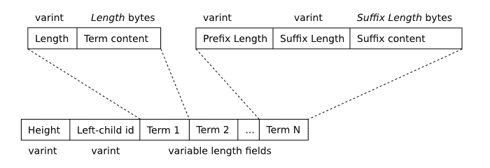
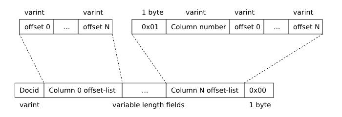

# 1\. FTS3 和 FTS4 简介

> 原文：[`sqlite.com/fts3.html`](https://sqlite.com/fts3.html)

## 概述

FTS3 和 FTS4 是 SQLite 虚拟表模块，允许用户在一组文档上执行全文搜索。描述全文搜索最常见（也是最有效）的方式是"Google、Yahoo 和 Bing 如何处理放置在万维网上的文档"。用户输入一个术语或一系列术语，可能由二进制运算符连接或组合成一个短语，全文查询系统找到最符合用户指定的操作符和分组的文档集。本文描述了 FTS3 和 FTS4 的部署和使用。

FTS1 和 FTS2 是过时的 SQLite 全文搜索模块。这些旧模块存在已知问题，应避免使用。FTS3 的部分原始代码由[Google](http://www.google.com)的 Scott Hess 贡献给 SQLite 项目。现在它作为 SQLite 的一部分进行开发和维护。

FTS3 和 FTS4 扩展模块允许用户创建具有内置全文索引（以下简称"FTS 表"）的特殊表。全文索引允许用户高效地查询数据库中包含一个或多个单词（以下简称"标记"）的所有行，即使表中包含许多大型文档。

例如，如果"[Enron 电子邮件数据集](http://www.cs.cmu.edu/~enron/)"中的每个 517430 个文档都插入到 FTS 表和使用以下 SQL 脚本创建的普通 SQLite 表中：

```sql
CREATE VIRTUAL TABLE enrondata1 USING fts3(content TEXT);     /* FTS3 table */
CREATE TABLE enrondata2(content TEXT);                        /* Ordinary table */

```

然后可以执行以下两个查询中的任一个来查找数据库中包含单词"linux"的文档数量（351）。在一个桌面 PC 硬件配置上，对 FTS3 表的查询大约需要 0.03 秒，而对普通表的查询则需要 22.5 秒。

```sql
SELECT count(*) FROM enrondata1 WHERE content MATCH 'linux';  /* 0.03 seconds */
SELECT count(*) FROM enrondata2 WHERE content LIKE '%linux%'; /* 22.5 seconds */

```

当然，上述两个查询并不完全相同。例如，LIKE 查询会匹配包含诸如"linuxophobe"或"EnterpriseLinux"等术语的行（事实上，Enron 电子邮件数据集实际上并不包含任何此类术语），而 FTS3 表上的 MATCH 查询只选择包含"linux"作为离散标记的行。两种搜索均不区分大小写。与普通表相比，FTS3 表在磁盘上占用大约 2006 MB，而普通表只占用 1453 MB。使用执行上述 SELECT 查询的相同硬件配置，FTS3 表的填充时间略低于 31 分钟，而普通表为 25 分钟。

## 1.1\. FTS3 和 FTS4 的区别

FTS3 和 FTS4 几乎相同。它们大部分代码共享，接口也相同。它们的区别在于：

+   FTS4 包含查询性能优化，可以显著改善包含非常常见术语（存在于大部分表行中）的全文查询的性能。

+   FTS4 支持一些额外的选项，可以与 matchinfo()函数一起使用。

+   因为它在磁盘上存储了额外的信息，用于支持性能优化和额外的 matchinfo()选项，所以 FTS4 表可能比使用 FTS3 创建的等效表占用更多的磁盘空间。 通常，开销只有 1-2％或更少，但如果存储在 FTS 表中的文档非常小，则可能高达 10％。 通过在 FTS4 表声明的一部分指定指令"matchinfo=fts3"可以减少开销，但这会牺牲一些额外支持的 matchinfo()选项。

+   FTS4 提供了钩子（压缩和解压缩选项），允许数据以压缩形式存储，减少磁盘使用和 IO。

FTS4 是 FTS3 的增强版。 FTS3 自版本 3.5.0 以来一直可用（2007-09-04）。 FTS4 的增强功能是在 SQLite 版本 3.7.4（2010-12-07）中添加的。

在您的应用程序中应该使用哪个模块，FTS3 还是 FTS4？ FTS4 有时比 FTS3 快得多，查询速度甚至可以快几个数量级，尽管在常见情况下，这两个模块的性能相似。 FTS4 还提供了增强的 matchinfo()输出，可以在排列匹配操作的结果时非常有用。 另一方面，在没有 matchinfo=fts3 指令的情况下，FTS4 对比 FTS3 需要更多的磁盘空间，尽管在大多数情况下只有 1-2％。

对于较新的应用程序，建议使用 FTS4；尽管如果兼容性与旧版本的 SQLite 重要，那么 FTS3 通常也可以很好地满足需求。

## 1.2\. 创建和销毁 FTS 表

与其他虚拟表类型一样，可以使用 CREATE VIRTUAL TABLE 语句创建新的 FTS 表。 遵循 USING 关键字的模块名称要么是"fts3"要么是"fts4"。 虚拟表模块参数可以为空，这样就创建了一个具有名为"content"的单个用户定义列的 FTS 表。 或者，模块参数可以传递逗号分隔的列名列表。

如果在 CREATE VIRTUAL TABLE 语句的一部分作为 FTS 表明确提供列名，则可以为每列可选择地指定数据类型。 这只是纯语法糖，提供的类型名称不会被 FTS 或 SQLite 核心用于任何目的。 同样适用于与 FTS 列名一起指定的任何约束 - 它们被解析，但系统不以任何方式使用或记录它们。

```sql
*-- Create an FTS table named "data" with one column - "content":*
CREATE VIRTUAL TABLE data USING fts3();

*-- Create an FTS table named "pages" with three columns:*
CREATE VIRTUAL TABLE pages USING fts4(title, keywords, body);

*-- Create an FTS table named "mail" with two columns. Datatypes
-- and column constraints are specified along with each column. These
-- are completely ignored by FTS and SQLite.* 
CREATE VIRTUAL TABLE mail USING fts3(
  subject VARCHAR(256) NOT NULL,
  body TEXT CHECK(length(body)<10240)
);

```

除了列的列表外，在用于创建 FTS 表的 CREATE VIRTUAL TABLE 语句中传递的模块参数也可以用于指定分词器。这可以通过在列名的位置指定形如“tokenize=<tokenizer name> <tokenizer args>”的字符串来完成，其中<tokenizer name>是要使用的分词器的名称，<tokenizer args>是要传递给分词器实现的可选的以空格分隔的限定符列表。分词器规范可以放置在列列表的任何位置，但每个 CREATE VIRTUAL TABLE 语句只允许最多一个分词器声明。有关使用（以及必要时实现）分词器的详细描述，请参见下文 fts3.html#tokenizer。

```sql
*-- Create an FTS table named "papers" with two columns that uses*
*-- the tokenizer "porter".*
CREATE VIRTUAL TABLE papers USING fts3(author, document, tokenize=porter);

*-- Create an FTS table with a single column - "content" - that uses*
*-- the "simple" tokenizer.*
CREATE VIRTUAL TABLE data USING fts4(tokenize=simple);

*-- Create an FTS table with two columns that uses the "icu" tokenizer.*
*-- The qualifier "en_AU" is passed to the tokenizer implementation*
CREATE VIRTUAL TABLE names USING fts3(a, b, tokenize=icu en_AU);

```

FTS 表可以使用普通的 DROP TABLE 语句从数据库中删除。例如：

```sql
*-- Create, then immediately drop, an FTS4 table.*
CREATE VIRTUAL TABLE data USING fts4();
DROP TABLE data;

```

## 1.3\. 填充 FTS 表

FTS 表可以使用与普通 SQLite 表相同的方式使用 INSERT、UPDATE 和 DELETE 语句进行填充。

除了用户命名的列（或者如果 CREATE VIRTUAL TABLE 语句中未指定模块参数作为一部分，则为“content”列），每个 FTS 表还有一个“rowid”列。FTS 表的 rowid 的行为与普通 SQLite 表的 rowid 列相同，不同之处在于，在使用 VACUUM 命令重建数据库时，FTS 表的 rowid 列中存储的值保持不变。对于 FTS 表，除了通常的“rowid”、“oid”和“_oid_”标识符外，“docid”也被允许作为别名。尝试插入或更新表中已存在的 docid 值将被视为错误，就像在普通的 SQLite 表中一样。

"docid"和普通的 SQLite 行 ID 列的别名之间还有一个细微的区别。通常情况下，如果 INSERT 或 UPDATE 语句将离散值分配给两个或多个行 ID 列的别名，SQLite 会将指定在 INSERT 或 UPDATE 语句中的最右边的这些值写入数据库。然而，在插入或更新 FTS 表时，如果同时给"docid"和一个或多个 SQLite 行 ID 列的别名分配非 NULL 值，则会被视为错误。请参见下文的示例。

```sql
*-- Create an FTS table*
CREATE VIRTUAL TABLE pages USING fts4(title, body);

*-- Insert a row with a specific docid value.*
INSERT INTO pages(docid, title, body) VALUES(53, 'Home Page', 'SQLite is a software...');

*-- Insert a row and allow FTS to assign a docid value using the same algorithm as*
*-- SQLite uses for ordinary tables. In this case the new docid will be 54,*
*-- one greater than the largest docid currently present in the table.*
INSERT INTO pages(title, body) VALUES('Download', 'All SQLite source code...');

*-- Change the title of the row just inserted.*
UPDATE pages SET title = 'Download SQLite' WHERE rowid = 54;

*-- Delete the entire table contents.*
DELETE FROM pages;

*-- The following is an error. It is not possible to assign non-NULL values to both*
*-- the rowid and docid columns of an FTS table.*
INSERT INTO pages(rowid, docid, title, body) VALUES(1, 2, 'A title', 'A document body');

```

为了支持全文查询，FTS 维护一个倒排索引，将数据集中每个唯一术语或单词映射到其出现在表内容中的位置。对于好奇的人，数据库文件中用于存储该索引的数据结构的完整描述如下。该数据结构的一个特点是，数据库可能在任何时候包含不止一个索引 B 树，而是几个增量合并的 B 树，随着行的插入、更新和删除而增加。这种技术在写入 FTS 表时提高了性能，但对使用索引的全文查询造成了一些开销。评估特殊的"optimize"命令，一个形如"INSERT INTO <fts-table>(<fts-table>) VALUES('optimize')"的 SQL 语句，使 FTS 将所有现有的索引 B 树合并为一个包含整个索引的单个大 B 树。这可能是一个昂贵的操作，但可以加快未来的查询速度。

例如，要优化名为"docs"的 FTS 表的全文索引：

```sql
*-- Optimize the internal structure of FTS table "docs".*
INSERT INTO docs(docs) VALUES('optimize');

```

上述语句可能在语法上对某些人来说看起来不正确。请参阅描述简单 fts 查询的部分以获取解释。

使用 SELECT 语句调用优化操作的另一种已废弃方法。新代码应该使用类似上面的 INSERT 语句来优化 FTS 结构。

## 1.4\. 简单的 FTS 查询

对于所有其他 SQLite 表，无论是虚拟的还是其他类型的表，都可以使用 SELECT 语句从 FTS 表中检索数据。

FTS 表可以通过两种不同形式的 SELECT 语句进行有效查询：

+   **按 rowid 查询**。如果 SELECT 语句的 WHERE 子句包含形式为"rowid = ?"的子句，其中？是一个 SQL 表达式，FTS 能够使用类似 SQLite 的 INTEGER PRIMARY KEY 索引直接检索请求的行。

+   **全文查询**。如果 SELECT 语句的 WHERE 子句包含形式为"<column> MATCH ?"的子句，FTS 能够使用内置的全文索引来限制搜索，以匹配作为 MATCH 子句右操作数指定的全文查询字符串的文档。

如果这两种查询策略都不能使用，则对 FTS 表的所有查询都使用整个表的线性扫描实现。如果表中包含大量数据，这可能是一种不实际的方法（本页第一个示例显示，使用现代 PC 对 1.5GB 数据进行线性扫描大约需要 30 秒）。

```sql
*-- The examples in this block assume the following FTS table:*
CREATE VIRTUAL TABLE mail USING fts3(subject, body);

SELECT * FROM mail WHERE rowid = 15;                *-- Fast. Rowid lookup.*
SELECT * FROM mail WHERE body MATCH 'sqlite';       *-- Fast. Full-text query.*
SELECT * FROM mail WHERE mail MATCH 'search';       *-- Fast. Full-text query.*
SELECT * FROM mail WHERE rowid BETWEEN 15 AND 20;   *-- Fast. Rowid lookup.*
SELECT * FROM mail WHERE subject = 'database';      *-- Slow. Linear scan.*
SELECT * FROM mail WHERE subject MATCH 'database';  *-- Fast. Full-text query.*

```

在上述所有全文查询中，MATCH 运算符的右操作数是由单个术语组成的字符串。在这种情况下，MATCH 表达式对包含指定词汇（“sqlite”、“search”或“database”，具体取决于查看的示例）的所有文档求值为 true。将单个术语指定为 MATCH 运算符的右操作数导致了可能的最简单和最常见的全文查询类型。然而，可能存在更复杂的查询，包括短语搜索、术语前缀搜索以及搜索包含在定义的接近性内部的术语组合的文档。可以通过以下描述了解全文索引可查询的各种方式。

通常情况下，全文查询是不区分大小写的。然而，这取决于查询的 FTS 表所使用的具体标记器。有关详细信息，请参阅标记器部分。

上面的段落指出，带有简单术语作为右操作数的 MATCH 运算符对包含指定术语的所有文档求值为 true。在此上下文中，“文档”可以指代 FTS 表行的单列中存储的数据，或者指代单行中所有列的内容，具体取决于作为 MATCH 运算符左操作数使用的标识符。如果作为 MATCH 运算符左操作数指定的标识符是 FTS 表列名，则搜索术语必须包含在指定列中存储的值中的文档。然而，如果标识符是 FTS *表* 自身的名称，则 MATCH 运算符对 FTS 表的每一行求值为 true，只要任何列包含搜索术语即可。以下示例演示了这一点：

```sql
*-- Example schema*
CREATE VIRTUAL TABLE mail USING fts3(subject, body);

*-- Example table population*
INSERT INTO mail(docid, subject, body) VALUES(1, 'software feedback', 'found it too slow');
INSERT INTO mail(docid, subject, body) VALUES(2, 'software feedback', 'no feedback');
INSERT INTO mail(docid, subject, body) VALUES(3, 'slow lunch order',  'was a software problem');

*-- Example queries*
SELECT * FROM mail WHERE subject MATCH 'software';    *-- Selects rows 1 and 2*
SELECT * FROM mail WHERE body    MATCH 'feedback';    *-- Selects row 2*
SELECT * FROM mail WHERE mail    MATCH 'software';    *-- Selects rows 1, 2 and 3*
SELECT * FROM mail WHERE mail    MATCH 'slow';        *-- Selects rows 1 and 3*

```

乍一看，上面示例中的最后两个全文查询似乎在语法上不正确，因为作为 SQL 表达式使用了表名（“mail”）。之所以可以接受这种情况，是因为每个 FTS 表实际上都有一个与表本身相同名称的 HIDDEN 列（在本例中为“mail”）。存储在此列中的值对应用程序没有意义，但可以用作 MATCH 运算符的左操作数。这个特殊列也可以作为 FTS 辅助函数的参数传递。

以下示例说明了上述内容。表达式“docs”、“docs.docs”和“main.docs.docs”都指向列“docs”。然而，“main.docs”表达式并不指向任何列。它可能用于引用表，但是在下文中使用时，上下文不允许使用表名。

```sql
*-- Example schema*
CREATE VIRTUAL TABLE docs USING fts4(content);

*-- Example queries*
SELECT * FROM docs WHERE docs MATCH 'sqlite';              *-- OK.*
SELECT * FROM docs WHERE docs.docs MATCH 'sqlite';         *-- OK.*
SELECT * FROM docs WHERE main.docs.docs MATCH 'sqlite';    *-- OK.*
SELECT * FROM docs WHERE main.docs MATCH 'sqlite';         *-- Error.*

```

## 1.5\. 总结

从用户的角度来看，FTS 表在许多方面与普通的 SQLite 表类似。数据可以像操作普通表一样使用 INSERT、UPDATE 和 DELETE 命令添加、修改和删除 FTS 表中的数据。同样地，SELECT 命令可以用于查询数据。以下列表总结了 FTS 表与普通表之间的区别：

1.  与所有虚拟表类型一样，不可能为 FTS 表创建索引或触发器。也不可能使用 ALTER TABLE 命令向 FTS 表添加额外的列（尽管可以使用 ALTER TABLE 命令来重命名 FTS 表）。

1.  "CREATE VIRTUAL TABLE" 语句中指定的数据类型将完全被忽略。与插入值应用类型 亲和性 的常规规则不同，插入到 FTS 表列（除了特殊的 rowid 列外）的所有值在存储之前都会转换为 TEXT 类型。

1.  FTS 表允许使用特殊别名 "docid" 来引用所有 虚拟表 支持的 rowid 列。

1.  FTS MATCH 运算符支持基于内置全文索引的查询。

1.  FTS 辅助函数，snippet()，offsets() 和 matchinfo() 可用于支持全文查询。

1.  每个 FTS 表都有一个与表名相同的 隐藏列。每行中隐藏列包含的值是一个 blob，只能作为 MATCH 运算符的左操作数，或作为 FTS 辅助函数 的最左参数使用。

# 2\. 编译和启用 FTS3 和 FTS4

虽然 FTS3 和 FTS4 包含在 SQLite 核心源代码中，但它们默认未启用。要在编译时启用带 FTS 功能的 SQLite，需在编译时定义预处理宏 SQLITE_ENABLE_FTS3。新应用程序还应定义 SQLITE_ENABLE_FTS3_PARENTHESIS 宏以启用 增强的查询语法（见下文）。通常情况下，可以通过在编译器命令行中添加以下两个开关来完成这一设置：

```sql
-DSQLITE_ENABLE_FTS3
-DSQLITE_ENABLE_FTS3_PARENTHESIS

```

注意，启用 FTS3 也会使 FTS4 可用。没有单独的 SQLITE_ENABLE_FTS4 编译选项。SQLite 的构建要么同时支持 FTS3 和 FTS4，要么两者都不支持。

如果使用自动配置的混合编译系统，可以在运行 'configure' 脚本时设置 CPPFLAGS 环境变量是设置这些宏的简便方法。例如，以下命令：

```sql
CPPFLAGS="-DSQLITE_ENABLE_FTS3 -DSQLITE_ENABLE_FTS3_PARENTHESIS" ./configure <configure options>

```

其中 *<configure options>* 是通常传递给配置脚本的选项（如果有的话）。

由于 FTS3 和 FTS4 是虚拟表，编译时选项 SQLITE_ENABLE_FTS3 与 SQLITE_OMIT_VIRTUALTABLE 不兼容。

如果 SQLite 的编译中不包括 FTS 模块，则任何尝试准备 SQL 语句以创建 FTS3 或 FTS4 表格，或以任何方式删除或访问现有 FTS 表格的操作都将失败。返回的错误消息将类似于 "no such module: ftsN"（其中 N 是 3 或 4）。

如果可用 C 版本的 [ICU 库](https://icu.unicode.org)，则 FTS 也可以使用 SQLITE_ENABLE_ICU 预处理宏定义编译。使用此宏编译时启用 FTS 分词器，该分词器使用 ICU 库按照指定语言和区域设置的约定将文档分割为术语（单词）。

```sql
-DSQLITE_ENABLE_ICU

```

# 3\. 全文索引查询

FTS 表格最有用的地方在于可以使用内置的全文索引进行查询。全文查询通过在 SELECT 语句的 WHERE 子句中指定形如 "<column> MATCH <full-text query expression>" 的子句来执行，该子句读取来自 FTS 表格的数据。在上述讨论中，假定 MATCH 操作符的右操作数是由单个术语组成的字符串。本节描述了由 FTS 表格支持的更复杂的查询类型，并且通过指定更复杂的查询表达式作为 MATCH 操作符的右操作数来利用这些查询。

FTS 表格支持三种基本的查询类型：

+   **标记或标记前缀查询**。可以查询 FTS 表格以获取包含指定术语的所有文档（如上所述的简单情况），或者包含具有指定前缀的术语的所有文档。正如我们所见，用于特定术语的查询表达式就是术语本身。用于搜索术语前缀的查询表达式是将前缀本身与 '*' 字符附加到术语后面。例如：

```sql
*-- Virtual table declaration*
CREATE VIRTUAL TABLE docs USING fts3(title, body);

*-- Query for all documents containing the term "linux":*
SELECT * FROM docs WHERE docs MATCH 'linux';

*-- Query for all documents containing a term with the prefix "lin". This will match*
*-- all documents that contain "linux", but also those that contain terms "linear",*
*--"linker", "linguistic" and so on.*
SELECT * FROM docs WHERE docs MATCH 'lin*';

```

+   通常，标记或标记前缀查询与作为 MATCH 操作符左操作数指定的 FTS 表格列匹配。或者，如果指定了与 FTS 表格本身同名的特殊列，则匹配所有列。这可以通过在基本术语查询之前指定列名后跟 ":" 字符来覆盖。在 ":" 字符和查询术语之间可能有空格，但列名和 ":" 字符之间不允许有空格。例如：

```sql
*-- Query the database for documents for which the term "linux" appears in*
*-- the document title, and the term "problems" appears in either the title*
*-- or body of the document.*
SELECT * FROM docs WHERE docs MATCH 'title:linux problems';

*-- Query the database for documents for which the term "linux" appears in*
*-- the document title, and the term "driver" appears in the body of the document*
*-- ("driver" may also appear in the title, but this alone will not satisfy the*
*-- query criteria).*
SELECT * FROM docs WHERE body MATCH 'title:linux driver';

```

+   如果 FTS 表格是 FTS4 表格（而不是 FTS3），则标记还可以以 "^" 字符为前缀。在这种情况下，为了匹配，标记必须出现在匹配行的任何列的第一个标记位置。例如：

```sql
*-- All documents for which "linux" is the first token of at least one*
*-- column.*
SELECT * FROM docs WHERE docs MATCH '^linux';

*-- All documents for which the first token in column "title" begins with "lin".*
SELECT * FROM docs WHERE body MATCH 'title: ^lin*';

```

+   **短语查询**。短语查询是一种检索所有包含指定顺序的一组术语或术语前缀的文档的查询，中间没有其他标记。短语查询通过在双引号（"）中包围一个空格分隔的术语或术语前缀序列来指定。例如：

```sql
*-- Query for all documents that contain the phrase "linux applications".*
SELECT * FROM docs WHERE docs MATCH '"linux applications"';

*-- Query for all documents that contain a phrase that matches "lin* app*". As well as*
*-- "linux applications", this will match common phrases such as "linoleum appliances"*
*-- or "link apprentice".*
SELECT * FROM docs WHERE docs MATCH '"lin* app*"';

```

+   **NEAR 查询**。NEAR 查询是一种查询，返回包含在指定接近程度内（默认情况下为 10 个或更少的中间术语）的两个或多个指定术语或短语的文档。NEAR 查询通过在两个短语、令牌或令牌前缀查询之间放置关键字“NEAR”来指定。要指定除默认值外的接近程度，可以使用形式为“NEAR/*<N>*”的操作符，其中*<N>*是允许的最大中间术语数。例如：

```sql
*-- Virtual table declaration.*
CREATE VIRTUAL TABLE docs USING fts4();

*-- Virtual table data.*
INSERT INTO docs VALUES('SQLite is an ACID compliant embedded relational database management system');

*-- Search for a document that contains the terms "sqlite" and "database" with*
*-- not more than 10 intervening terms. This matches the only document in*
*-- table docs (since there are only six terms between "SQLite" and "database"*
*-- in the document)*.
SELECT * FROM docs WHERE docs MATCH 'sqlite NEAR database';

*-- Search for a document that contains the terms "sqlite" and "database" with*
*-- not more than 6 intervening terms. This also matches the only document in*
*-- table docs. Note that the order in which the terms appear in the document*
*-- does not have to be the same as the order in which they appear in the query.*
SELECT * FROM docs WHERE docs MATCH 'database NEAR/6 sqlite';

*-- Search for a document that contains the terms "sqlite" and "database" with*
*-- not more than 5 intervening terms. This query matches no documents.*
SELECT * FROM docs WHERE docs MATCH 'database NEAR/5 sqlite';

*-- Search for a document that contains the phrase "ACID compliant" and the term*
*-- "database" with not more than 2 terms separating the two. This matches the*
*-- document stored in table docs.*
SELECT * FROM docs WHERE docs MATCH 'database NEAR/2 "ACID compliant"';

*-- Search for a document that contains the phrase "ACID compliant" and the term*
*-- "sqlite" with not more than 2 terms separating the two. This also matches*
*-- the only document stored in table docs.*
SELECT * FROM docs WHERE docs MATCH '"ACID compliant" NEAR/2 sqlite';

```

+   一个查询中可以出现多个 NEAR 运算符。在这种情况下，每对通过 NEAR 运算符分隔的术语或短语必须在文档中以指定的接近程度出现。使用与上述示例块中相同的表格和数据：

```sql
*-- The following query selects documents that contains an instance of the term* 
*-- "sqlite" separated by two or fewer terms from an instance of the term "acid",*
*-- which is in turn separated by two or fewer terms from an instance of the term*
*-- "relational".*
SELECT * FROM docs WHERE docs MATCH 'sqlite NEAR/2 acid NEAR/2 relational';

*-- This query matches no documents. There is an instance of the term "sqlite" with*
*-- sufficient proximity to an instance of "acid" but it is not sufficiently close*
*-- to an instance of the term "relational".*
SELECT * FROM docs WHERE docs MATCH 'acid NEAR/2 sqlite NEAR/2 relational';

```

短语和 NEAR 查询不能跨越行内的多个列。

上述三种基本查询类型可用于查询符合指定条件的全文索引文档集。使用 FTS 查询表达语言可以对基本查询结果执行各种集合操作。当前支持三种操作：

+   AND 运算符确定两组文档的**交集**。

+   OR 运算符计算两组文档的**并集**。

+   NOT 运算符（或者如果使用标准语法，则为一元“-”运算符）可用于计算一个文档集相对于另一个文档集的**相对补集**。

FTS 模块可以编译为使用两个略有不同的全文查询语法版本之一，即“标准”查询语法和“增强”查询语法。上述的基本术语、术语前缀、短语和 NEAR 查询在这两个语法版本中都是相同的。指定集合操作的方式略有不同。下面的两个子部分描述了涉及集合操作的这两个查询语法的部分。有关如何编译 fts 的编译说明，请参阅。

## 3.1\. 使用增强查询语法进行集合操作

增强查询语法支持 AND、OR 和 NOT 二进制集运算符。每个运算符的两个操作数可以是基本的 FTS 查询，或另一个 AND、OR 或 NOT 集合操作的结果。操作符必须使用大写字母输入，否则它们将被解释为基本的术语查询，而不是集合操作。

可以隐式指定 AND 运算符。如果在 FTS 查询字符串中两个基本查询出现且没有操作符将它们分隔开，则结果与将这两个基本查询分隔开的 AND 运算符的结果相同。例如，查询表达式“implicit operator”是“implicit AND operator”的更简洁版本。

```sql
*-- Virtual table declaration*
CREATE VIRTUAL TABLE docs USING fts3();

*-- Virtual table data*
INSERT INTO docs(docid, content) VALUES(1, 'a database is a software system');
INSERT INTO docs(docid, content) VALUES(2, 'sqlite is a software system');
INSERT INTO docs(docid, content) VALUES(3, 'sqlite is a database');

*-- Return the set of documents that contain the term "sqlite", and the*
*-- term "database". This query will return the document with docid 3 only.*
SELECT * FROM docs WHERE docs MATCH 'sqlite AND database';

*-- Again, return the set of documents that contain both "sqlite" and*
*-- "database". This time, use an implicit AND operator. Again, document*
*-- 3 is the only document matched by this query.* 
SELECT * FROM docs WHERE docs MATCH 'database sqlite';

*-- Query for the set of documents that contains either "sqlite" or "database".*
*-- All three documents in the database are matched by this query.*
SELECT * FROM docs WHERE docs MATCH 'sqlite OR database';

*-- Query for all documents that contain the term "database", but do not contain*
*-- the term "sqlite". Document 1 is the only document that matches this criteria.*
SELECT * FROM docs WHERE docs MATCH 'database NOT sqlite';

*-- The following query matches no documents. Because "and" is in lowercase letters,*
*-- it is interpreted as a basic term query instead of an operator. Operators must*
*-- be specified using capital letters. In practice, this query will match any documents*
*-- that contain each of the three terms "database", "and" and "sqlite" at least once.*
*-- No documents in the example data above match this criteria.*
SELECT * FROM docs WHERE docs MATCH 'database and sqlite';

```

上述示例都使用基本全文项查询作为所演示的集合操作的两个操作数。也可以使用短语和 NEAR 查询，以及其他集合操作的结果。在 FTS 查询中存在多个集合操作时，运算符的优先级如下：

| 运算符 | 增强查询语法优先级 |
| --- | --- |
| NOT | 最高优先级（分组最紧密）。 |
| AND |  |
| OR | 优先级最低（分组最宽）。 |

在使用增强查询语法时，可以使用括号来覆盖各种运算符的默认优先级。例如：

```sql
*-- Return the docid values associated with all documents that contain the*
*-- two terms "sqlite" and "database", and/or contain the term "library".*
SELECT docid FROM docs WHERE docs MATCH 'sqlite AND database OR library';

*-- This query is equivalent to the above.*
SELECT docid FROM docs WHERE docs MATCH 'sqlite AND database'
  UNION
SELECT docid FROM docs WHERE docs MATCH 'library';

*-- Query for the set of documents that contains the term "linux", and at least*
*-- one of the phrases "sqlite database" and "sqlite library".*
SELECT docid FROM docs WHERE docs MATCH '("sqlite database" OR "sqlite library") AND linux';

*-- This query is equivalent to the above.*
SELECT docid FROM docs WHERE docs MATCH 'linux'
  INTERSECT
SELECT docid FROM (
  SELECT docid FROM docs WHERE docs MATCH '"sqlite library"'
    UNION
  SELECT docid FROM docs WHERE docs MATCH '"sqlite database"'
);

```

## 3.2\. 使用标准查询语法进行集合操作

使用标准查询语法的 FTS 查询集合操作与增强查询语法的集合操作类似但不完全相同，存在四个差异，如下：

1.  仅支持 AND 运算符的隐式版本。将字符串“AND”作为标准查询语法查询的一部分指定时，将解释为包含术语“and”的文档集的术语查询。

1.  不支持括号。

1.  不支持 NOT 运算符。标准查询语法支持一元“-”运算符，可应用于基本项和项前缀查询（但不能应用于短语或 NEAR 查询）。带有一元“-”运算符的项或项前缀不能作为 OR 运算符的操作数。FTS 查询不能完全由带有一元“-”运算符的项或项前缀查询组成。

```sql
*-- Search for the set of documents that contain the term "sqlite" but do*
*-- not contain the term "database".*
SELECT * FROM docs WHERE docs MATCH 'sqlite -database';

```

1.  集合操作的相对优先级不同。特别是，使用标准查询语法，“OR”运算符的优先级高于“AND”。使用标准查询语法时运算符的优先级为：

| 运算符 | 标准查询语法优先级 |
| --- | --- |
| 一元“-” | 最高优先级（分组最紧密）。 |
| OR |  |
| AND | 优先级最低（分组最宽）。 |

1.  以下示例说明了使用标准查询语法运算符的优先级：

```sql
*-- Search for documents that contain at least one of the terms "database"*
*-- and "sqlite", and also contain the term "library". Because of the differences*
*-- in operator precedences, this query would have a different interpretation using*
*-- the enhanced query syntax.*
SELECT * FROM docs WHERE docs MATCH 'sqlite OR database library';

```

# 4\. 辅助函数 - 片段、偏移和匹配信息

FTS3 和 FTS4 模块提供了三个特殊的 SQL 标量函数，对于开发全文查询系统的开发人员可能会有用：“snippet”、“offsets”和“matchinfo”。 “snippet”和“offsets”函数的目的是允许用户在返回的文档中标识查询词的位置。“matchinfo”函数提供的指标可能对根据相关性对查询结果进行过滤或排序很有用。

所有三个特殊的 SQL 标量函数的第一个参数必须是应用该函数的 FTS 表的 FTS 隐藏列。FTS 隐藏列是在所有 FTS 表上找到的自动生成列，其名称与 FTS 表本身相同。例如，给定名为“mail”的 FTS 表：

```sql
SELECT offsets(mail) FROM mail WHERE mail MATCH <full-text query expression>;
SELECT snippet(mail) FROM mail WHERE mail MATCH <full-text query expression>;
SELECT matchinfo(mail) FROM mail WHERE mail MATCH <full-text query expression>;

```

三个辅助函数仅在使用 FTS 表的全文索引的 SELECT 语句中有用。如果在使用“按行 ID 查询”或“线性扫描”策略的 SELECT 语句中使用，则 snippet 和 offsets 都返回空字符串，并且 matchinfo 函数返回大小为零字节的 blob 值。

所有三个辅助函数从 FTS 查询表达式中提取一组“可匹配短语”以进行处理。给定查询的可匹配短语集包括表达式中的所有短语（包括未引用的标记和标记前缀），但不包括那些带有一元“-”运算符前缀的短语（标准语法）或用作 NOT 运算符右操作数的子表达式的一部分。

在以下条件下，FTS 表中与查询表达式中的可匹配短语之一匹配的每个标记系列称为“短语匹配”：

1.  如果可匹配短语是 FTS 查询表达式中由 NEAR 操作符连接的一系列短语的一部分，则每个短语匹配必须足够接近相关类型的其他短语匹配，以满足 NEAR 条件。

1.  如果 FTS 查询中的可匹配短语仅限于匹配指定 FTS 表列中的数据，则仅考虑出现在该列中的短语匹配。

## 4.1\. offsets 函数

对于使用全文索引的 SELECT 查询，offsets()函数返回一个包含一系列以空格分隔的整数的文本值。对于当前行的每个短语匹配，返回的列表中有四个整数。每组四个整数的解释如下：

| 整数 | 解释 |
| --- | --- |
| 0 | 项实例出现的列编号（FTS 表的最左列为 0，其次为 1，依此类推）。 |
| 1 | 完全文本查询表达式中匹配项的项编号。查询表达式中的项从 0 开始编号，按其出现顺序排列。 |
| 2 | 匹配项在列内的字节偏移量。 |
| 3 | 匹配项的字节大小。 |

下面的块包含使用 offsets 函数的示例。

```sql
CREATE VIRTUAL TABLE mail USING fts3(subject, body);
INSERT INTO mail VALUES('hello world', 'This message is a hello world message.');
INSERT INTO mail VALUES('urgent: serious', 'This mail is seen as a more serious mail');

*-- The following query returns a single row (as it matches only the first*
*-- entry in table "mail". The text returned by the offsets function is*
*-- "0 0 6 5 1 0 24 5".*
*--*
*-- The first set of four integers in the result indicate that column 0*
*-- contains an instance of term 0 ("world") at byte offset 6\. The term instance*
*-- is 5 bytes in size. The second set of four integers shows that column 1*
*-- of the matched row contains an instance of term 0 ("world") at byte offset*
*-- 24\. Again, the term instance is 5 bytes in size.*
SELECT offsets(mail) FROM mail WHERE mail MATCH 'world';

*-- The following query returns also matches only the first row in table "mail".*
*-- In this case the returned text is "1 0 5 7 1 0 30 7".*
SELECT offsets(mail) FROM mail WHERE mail MATCH 'message';

*-- The following query matches the second row in table "mail". It returns the*
*-- text "1 0 28 7 1 1 36 4". Only those occurrences of terms "serious" and "mail"*
*-- that are part of an instance of the phrase "serious mail" are identified; the*
*-- other occurrences of "serious" and "mail" are ignored.*
SELECT offsets(mail) FROM mail WHERE mail MATCH '"serious mail"';

```

## 4.2\. 片段函数

snippet 函数用于创建文档文本的格式化片段，以便作为全文查询结果报告的一部分显示。 snippet 函数可以传递一个到六个参数，如下：

| 参数 | 默认值 | 描述 |
| --- | --- | --- |
| 0 | N/A | 代码片段函数的第一个参数必须始终是正在查询的 FTS 表的 FTS 隐藏列，并从中提取片段。FTS 隐藏列是一个与 FTS 表本身同名的自动生成列。 |
| 1 | "<b>" | "开始匹配"文本。 |
| 2 | "</b>" | "结束匹配"文本。 |
| 3 | "<b>...</b>" | "省略"文本。 |
| 4 | -1 | 从中提取返回文本片段的 FTS 表列号。列从左到右编号，从零开始。负值表示文本可以从任何列提取。 |
| 5 | -15 | 这个整数参数的绝对值用作返回的文本值中包含的（近似）标记数。允许的最大绝对值为 64。该参数的值在下文中称为*N*。 |

代码片段函数首先尝试在当前行内找到由*|N|*标记组成的文本片段，该片段至少包含当前行某处匹配的每个可匹配短语。其中*|N|*是传递给片段函数的第六个参数的绝对值。如果单列存储的文本少于*|N|*个标记，则整个列值被视为文本片段。文本片段不能跨越多列。

如果找到这样的文本片段，则返回它并进行以下修改：

+   如果文本片段不是从列值的开头开始的，则在其前面加上"省略"文本。

+   如果文本片段不是以列值的末尾结束的，则在其后追加"省略"文本。

+   对于文本片段中的每个属于短语匹配的标记，在该标记之前插入"开始匹配"文本，并在其后立即插入"结束匹配"文本。

如果可以找到多个这样的片段，则优先选择包含较多“额外”短语匹配的片段。所选文本片段的开始可能向前或向后移动几个标记，以集中短语匹配于片段中心。

假设*N*为正值，则如果找不到包含每个可匹配短语的短语匹配的片段，则代码片段函数尝试找到大约*N*/2 个标记的两个片段，这两个片段之间包含当前行匹配的每个可匹配短语的至少一个短语匹配。如果失败，则尝试找到三个*N*/3 标记的片段，最后是四个*N*/4 标记的片段。如果找不到涵盖所需短语匹配的四个片段，则选择提供最佳覆盖率的四个*N*/4 标记片段。

如果 * N * 是负值，并且找不到包含所需短语匹配的单个片段，则 snippet 函数将搜索每个 * | N | * 个标记的两个片段，然后三个片段，然后四个片段。换句话说，如果指定的 * N * 值为负，则如果需要多个片段来提供所需的短语匹配覆盖，则不会减少片段的大小。

在已定位* M *片段后，其中 * M * 介于上述段落中描述的两到四之间，它们按排序顺序连接在一起，并用“省略号”文本分隔。在返回文本之前，执行了前面列举的三个修改。

```sql
Note: In this block of examples, newlines and whitespace characters have
been inserted into the document inserted into the FTS table, and the expected
results described in SQL comments. This is done to enhance readability only,
they would not be present in actual SQLite commands or output.

*-- Create and populate an FTS table.*
CREATE VIRTUAL TABLE text USING fts4();
INSERT INTO text VALUES('
  During 30 Nov-1 Dec, 2-3oC drops. Cool in the upper portion, minimum temperature 14-16oC
  and cool elsewhere, minimum temperature 17-20oC. Cold to very cold on mountaintops,
  minimum temperature 6-12oC. Northeasterly winds 15-30 km/hr. After that, temperature
  increases. Northeasterly winds 15-30 km/hr.
');

*-- The following query returns the text value:*
*--*
*--   "<b>...</b>cool elsewhere, minimum temperature 17-20oC. <b>Cold</b> to very* 
*--    <b>cold</b> on mountaintops, minimum temperature 6<b>...</b>".*
*--*
SELECT snippet(text) FROM text WHERE text MATCH 'cold';

*-- The following query returns the text value:*
*--*
*--   "...the upper portion, [minimum] [temperature] 14-16oC and cool elsewhere,*
*--    [minimum] [temperature] 17-20oC. Cold..."*
*--*
SELECT snippet(text, '[', ']', '...') FROM text WHERE text MATCH '"min* tem*"'

```

## 4.3\. matchinfo 函数

matchinfo 函数返回一个 blob 值。如果它在不使用全文索引的查询中使用（即“按行号查询”或“线性扫描”），则 blob 的大小为零字节。否则，blob 包含机器字节顺序中的零个或多个 32 位无符号整数。返回数组中确切的整数数量取决于查询和传递给 matchinfo 函数的第二个参数（如果有的话）的值。

matchinfo 函数被调用时可以有一个或两个参数。与所有辅助函数一样，第一个参数必须是特殊的 FTS 隐藏列。如果指定了第二个参数，则必须是仅包含字符 'p'、'c'、'n'、'a'、'l'、's'、'x'、'y' 和 'b' 的文本值。如果没有显式提供第二个参数，则默认为 "pcx"。以下将第二个参数称为“格式字符串”。

matchinfo 格式字符串中的字符是从左到右处理的。格式字符串中的每个字符会导致一个或多个 32 位无符号整数值被添加到返回的数组中。以下表中的“值”列包含了每个支持的格式字符串字符附加到输出缓冲区的整数值的数量。在给定的公式中，*cols* 是 FTS 表中的列数，而 *phrases* 是查询中的可匹配短语的数量。

| 字符 | 值 | 描述 |
| --- | --- | --- |
| p | 1 | 查询中可匹配短语的数量。 |
| c | 1 | FTS 表中的用户定义列的数量（即不包括 docid 或 FTS 隐藏列）。 |

| x | 3 * *cols* * *phrases* | 对于每个短语和表列的不同组合，以下三个值：

+   在当前行中，短语在列中出现的次数。

+   短语在所有 FTS 表中所有行中出现的总次数。

+   FTS 表中包含至少一个短语实例的行的总数。

第一组三个值对应表的最左列（列 0）和查询中可匹配的最左短语（短语 0）。如果表有多列，则输出数组中的第二组三个值对应短语 0 和列 1。随后是短语 0，列 2 等等，适用于表的所有列。同样适用于短语 1，列 0，然后短语 1，列 1 等等。换句话说，可以使用以下公式找到在列 *c* 中发生的短语 *p* 的数据：

```sql
          hits_this_row  = array[3 * (c + p*cols) + 0]
          hits_all_rows  = array[3 * (c + p*cols) + 1]
          docs_with_hits = array[3 * (c + p*cols) + 2]

```

|

| y | *cols* * *phrases* | 对于每个独特的短语和表列的组合，显示在列中出现的可用短语匹配的数量。这通常与由[matchinfo 'x' flag](https://fts3.html#matchinfo-x)返回的三个值中的第一个值相同。然而，对于任何作为不匹配当前行的子表达式一部分的短语，'y'标志报告的命中次数为零。这对于包含 OR 运算符的后代 AND 运算符的表达式有影响。例如，考虑以下表达式：

```sql
          a OR (b AND c)

```

和文档

```sql
          "a c d"

```

[matchinfo 'x' flag](https://fts3.html#matchinfo-x)报告短语"a"和"c"各自的单次命中。然而，'y'指令报告"c"的命中次数为零，因为它是一个与文档不匹配的子表达式的一部分 - (b AND c)。对于不包含从 OR 运算符衍生的 AND 运算符的查询，'y'返回的结果值始终与'x'返回的结果值相同。整数值数组中的第一个值对应表的最左列（列 0）和查询的第一个短语（短语 0）。可以使用以下公式找到对应于其他列/短语组合的值：

```sql
          hits_for_phrase_p_column_c  = array[c + p*cols]

```

对于使用 OR 表达式的查询或使用 LIMIT 或返回多行的查询，'y' matchinfo 选项可能比'x'更快。 |

| b | *((cols+31)/32)* * *phrases* | matchinfo 'b' 标志提供类似于 matchinfo 'y' 标志 的信息，但以更紧凑的形式呈现。与精确的命中次数不同，'b' 为每个短语/列组合提供单一的布尔标志。如果短语至少出现在列中一次（即 'y' 的相应整数输出为非零），则设置相应的标志。否则清除。如果表格有 32 列或更少，对于查询中的每个短语，将输出一个单一的无符号整数。整数的最低有效位设置为如果短语在列 0 中至少出现一次。第二个最低有效位设置为如果短语在列 1 中出现一次或更多，依此类推。如果表格有超过 32 列，将为每个超过的 32 列或其一部分在每个短语的输出中添加一个额外的整数。对应于相同短语的整数被分组在一起。例如，如果查询具有 45 列的表格中的两个短语，将输出 4 个整数。第一个对应于短语 0 和表的列 0-31。第二个整数包含短语 0 和列 32-44 的数据，依此类推。例如，如果 nCol 是表中的列数，要确定短语 p 是否存在于列 c 中：

```sql
    p_is_in_c = array[p * ((nCol+31)/32)] & (1 << (c % 32))

```

|

| n | 1 | FTS4 表中的行数。此值仅在查询 FTS4 表时可用，不适用于 FTS3。 |
| --- | --- | --- |
| a | *cols* | 对于每一列，存储在列中的文本值的平均标记数（考虑 FTS4 表中的所有行）。此值仅在查询 FTS4 表时可用，不适用于 FTS3。 |
| l | *cols* | 对于每一列，当前行中存储的 FTS4 表的值的长度（以标记计算）。此值仅在查询 FTS4 表时可用，不适用于 FTS3。并且仅当未在用于创建 FTS4 表的 "CREATE VIRTUAL TABLE" 语句中指定 "matchinfo=fts3" 指令时。 |
| s | *cols* | 对于每一列，最长子序列的长度是该列值与查询文本共有的短语匹配。例如，如果表列包含文本 'a b c d e'，查询是 'a c "d e"'，则最长公共子序列的长度为 2（短语 "c" 后跟短语 "d e"）。 |

例如：

```sql
*-- Create and populate an FTS4 table with two columns:*
CREATE VIRTUAL TABLE t1 USING fts4(a, b);
INSERT INTO t1 VALUES('transaction default models default', 'Non transaction reads');
INSERT INTO t1 VALUES('the default transaction', 'these semantics present');
INSERT INTO t1 VALUES('single request', 'default data');

*-- In the following query, no format string is specified and so it defaults*
*-- to "pcx". It therefore returns a single row consisting of a single blob*
*-- value 80 bytes in size (20 32-bit integers - 1 for "p", 1 for "c" and*
*-- 3*2*3 for "x"). If each block of 4 bytes in* the blob is interpreted
*-- as an unsigned integer in machine byte-order, the values will be:*
*--*
*--     3 2  1 3 2  0 1 1  1 2 2  0 1 1  0 0 0  1 1 1*
*--*
*-- The row returned corresponds to the second entry inserted into table t1.*
*-- The first two integers in the blob show that the query contained three*
*-- phrases and the table being queried has two columns. The next block of*
*-- three integers describes column 0 (in this case column "a") and phrase*
*-- 0 (in this case "default"). The current row contains 1 hit for "default"*
*-- in column 0, of a total of 3 hits for "default" that occur in column*
*-- 0 of any table row. The 3 hits are spread across 2 different rows.*
*--*
*-- The next set of three integers (0 1 1) pertain to the hits for "default"*
*-- in column 1 of the table (0 in this row, 1 in all rows, spread across* 
*-- 1 rows).*
*--*
SELECT matchinfo(t1) FROM t1 WHERE t1 MATCH 'default transaction "these semantics"';

*-- The format string for this query is "ns". The output array will therefore*
*-- contain 3 integer values - 1 for "n" and 2 for "s". The query returns*
*-- two rows (the first two rows in the table match). The values returned are:*
*--*
*--     3  1 1*
*--     3  2 0*
*--*
*-- The first value in the matchinfo array returned for both rows is 3 (the* 
*-- number of rows in the table). The following two values are the lengths* 
*-- of the longest common subsequence of phrase matches in each column.*
SELECT matchinfo(t1, 'ns') FROM t1 WHERE t1 MATCH 'default transaction';

```

matchinfo 函数比片段或偏移函数快得多。这是因为片段和偏移的实现需要从磁盘检索正在分析的文档，而 matchinfo 所需的所有数据都作为完全文本索引的一部分而可用，这些数据还需要实现全文查询本身。这意味着在以下两个查询中，第一个查询可能比第二个查询快一个数量级：

```sql
SELECT docid, matchinfo(tbl) FROM tbl WHERE tbl MATCH <query expression>;
SELECT docid, offsets(tbl) FROM tbl WHERE tbl MATCH <query expression>;

```

matchinfo 函数提供了计算概率“词袋”相关性分数所需的所有信息，例如 [Okapi BM25/BM25F](http://en.wikipedia.org/wiki/Okapi_BM25)，可用于在全文搜索应用程序中排序结果。本文的附录 A，“搜索应用程序提示”，包含了有效使用 matchinfo()函数的示例。

# 5\. Fts4aux - 直接访问全文索引

截至 版本 3.7.6（2011-04-12），SQLite 包含一个名为 "fts4aux" 的新虚拟表模块，可直接用于检查现有 FTS 表的全文索引。尽管名称如此，fts4aux 与 FTS3 表和 FTS4 表一样有效。fts4aux 表是只读的。修改 fts4aux 表内容的唯一方法是修改关联的 FTS 表的内容。fts4aux 模块会自动包含在所有包含 FTS 的 构建版本 中。

fts4aux 虚拟表可以用一个或两个参数构建。使用单个参数时，该参数是将用于访问的 FTS 表的未限定名称。要访问不同数据库中的表（例如，创建一个将访问 MAIN 数据库中的 FTS3 表的 TEMP fts4aux 表），请使用两参数形式，并在第一个参数中给出目标数据库的名称（例如，“main”），在第二个参数中给出 FTS3/4 表的名称。（fts4aux 的两参数形式添加于 SQLite 版本 3.7.17（2013-05-20），在之前的版本中将引发错误。）例如：

```sql
*-- Create an FTS4 table*
CREATE VIRTUAL TABLE ft USING fts4(x, y);

*-- Create an fts4aux table to access the full-text index for table "ft"*
CREATE VIRTUAL TABLE ft_terms USING fts4aux(ft);

*-- Create a TEMP fts4aux table accessing the "ft" table in "main"*
CREATE VIRTUAL TABLE temp.ft_terms_2 USING fts4aux(main,ft);

```

每个出现在 FTS 表中的术语，在 fts4aux 表中都会有 2 到 N+1 行，其中 N 是关联的 FTS 表中用户定义列的数量。fts4aux 表始终具有相同的四列，从左到右如下：

| 列名 | 列内容 |
| --- | --- |
| 术语 | 包含此行术语的文本。 |
| col | 此列可以包含文本值 '*'（即一个字符，U+002a）或介于 0 和 N-1 之间的整数，其中 N 再次是对应 FTS 表中用户定义列的数量。 |

| 文档 | 此列始终包含大于零的整数值。

如果“col”列包含值 '*'，则该列包含 FTS 表中至少包含一个该术语实例的行数（在任何列中）。如果 col 包含整数值，则该列包含 FTS 表中在由 col 值标识的列中至少包含一个术语实例的行数。与往常一样，FTS 表的列从左到右编号，从零开始。

| 发生次数 | 此列同样始终包含大于零的整数值。

如果“col”列包含值‘*’，则该列包含 FTS 表所有行中术语实例的总数（无论在哪一列）。否则，如果 col 包含整数值，则该列包含在由 col 值标识的 FTS 表列中出现的术语实例的总数。

| languageid *(隐藏)* | 此列决定从 FTS3/4 表中提取词汇所使用的 languageid。

languageid 的默认值为 0。如果在 WHERE 子句约束中指定了替代语言，则使用该替代语言而不是 0。每个查询只能有一个 languageid。换句话说，WHERE 子句不能在 languageid 上包含范围约束或 IN 运算符。

例如，使用上面创建的表：

```sql
INSERT INTO ft(x, y) VALUES('Apple banana', 'Cherry');
INSERT INTO ft(x, y) VALUES('Banana Date Date', 'cherry');
INSERT INTO ft(x, y) VALUES('Cherry Elderberry', 'Elderberry');

*-- The following query returns this data:*
*--*
*--     apple       |  *  |  1  |  1*
*--     apple       |  0  |  1  |  1*
*--     banana      |  *  |  2  |  2*
*--     banana      |  0  |  2  |  2*
*--     cherry      |  *  |  3  |  3*
*--     cherry      |  0  |  1  |  1*
*--     cherry      |  1  |  2  |  2*
*--     date        |  *  |  1  |  2*
*--     date        |  0  |  1  |  2*
*--     elderberry  |  *  |  1  |  2*
*--     elderberry  |  0  |  1  |  1*
*--     elderberry  |  1  |  1  |  1*
*--*
SELECT term, col, documents, occurrences FROM ft_terms;

```

例如，在“term”列中的值全为小写，即使它们以混合大小写插入到“ft”表中。这是因为 fts4aux 表包含了通过分词器从文档文本中提取的术语。在这种情况下，由于“ft”表使用了简单分词器，这意味着所有术语都已折叠为小写。此外，例如，“term”列设置为“apple”并且“col”列设置为 1 的行不存在。由于在列 1 中没有术语“apple”的实例，fts4aux 表中也没有对应的行。

在事务期间，写入 FTS 表的某些数据可能会被缓存在内存中，并且只有在提交事务时才会写入数据库。但是，fts4aux 模块的实现只能从数据库中读取数据。实际上，这意味着如果在修改了关联的 FTS 表的事务中查询 fts4aux 表，查询结果可能仅反映所做更改的（可能为空的）子集。

# 6\. FTS4 选项

如果“CREATE VIRTUAL TABLE”语句指定模块为 FTS4（而不是 FTS3），那么特殊指令——FTS4 选项——类似于“tokenize=*”选项也可能出现在列名的位置。FTS4 选项由选项名称、后跟“=”字符、后跟选项值组成。选项值可以选择性地用单引号或双引号括起来，并且嵌入的引号字符需要像 SQL 文本字面量一样进行转义。在“=”字符两侧不能有空白字符。例如，要创建一个 FTS4 表，使选项“matchinfo”的值设置为“fts3”：

```sql
*-- Create a reduced-footprint FTS4 table.*
CREATE VIRTUAL TABLE papers USING fts4(author, document, matchinfo=fts3);

```

FTS4 目前支持以下选项：

| Option | Interpretation |
| --- | --- |
| compress | compress 选项用于指定压缩函数。如果指定了压缩函数而没有指定解压函数，则会出错。详细信息请参见下文。 |
| content | content 允许将被索引的文本存储在与 FTS4 表不同的单独表中，甚至在 SQLite 之外。 |
| languageid | languageid 选项会导致 FTS4 表有一个额外的隐藏整数列，用于标识每行文本的语言。使用 languageid 选项允许同一个 FTS4 表存储多种语言或脚本的文本，每种语言使用不同的分词规则，并且可以独立查询每种语言的内容。 |
| matchinfo | 当设置为值 "fts3" 时，matchinfo 选项会减少 FTS4 存储的信息量，因此 matchinfo() 的 "l" 选项不再可用。 |
| notindexed | 这个选项用于指定一个列名，该列的数据不会被索引。未索引的列存储的值不会被 MATCH 查询匹配，也不会被辅助函数识别。单个 CREATE VIRTUAL TABLE 语句可以有任意数量的 notindexed 选项。 |
| order | "order" 选项可以设置为 "DESC" 或 "ASC"（不区分大小写）。如果设置为 "DESC"，那么 FTS4 将数据存储以优化按 docid 降序返回结果。如果设置为 "ASC"（默认值），则数据结构优化用于按 docid 升序返回结果。换句话说，如果针对 FTS4 表运行的查询中有很多使用 "ORDER BY docid DESC"，则在 CREATE VIRTUAL TABLE 语句中添加 "order=desc" 选项可能会提高性能。 |
| prefix | 这个选项可以设置为正整数的逗号分隔列表。列表中的每个整数 N，都会在数据库文件中创建一个单独的索引，用于优化 前缀查询，其中查询项长度为 N 字节（不包括 '*' 字符），使用 UTF-8 编码。详细信息请参见 下文。 |
| uncompress | 这个选项用于指定解压函数。指定解压函数而不同时指定压缩函数是错误的。详细信息请参见 下文。 |

在使用 FTS4 时，指定包含 "=" 字符且不是 "tokenize=*" 规范或已识别的 FTS4 选项的列名是错误的。对于 FTS3，未识别指令中的第一个标记会被解释为列名。类似地，当使用 FTS4 时，在单个表声明中指定多个 "tokenize=*" 规范是错误的，而在 FTS3 中，第二个及后续的 "tokenize=*" 规范会被解释为列名。例如：

```sql
*-- An error. FTS4 does not recognize the directive "xyz=abc".*
CREATE VIRTUAL TABLE papers USING fts4(author, document, xyz=abc);

*-- Create an FTS3 table with three columns - "author", "document"*
*-- and "xyz".*
CREATE VIRTUAL TABLE papers USING fts3(author, document, xyz=abc);

*-- An error. FTS4 does not allow multiple tokenize=* directives*
CREATE VIRTUAL TABLE papers USING fts4(tokenize=porter, tokenize=simple);

*-- Create an FTS3 table with a single column named "tokenize". The*
*-- table uses the "porter" tokenizer.*
CREATE VIRTUAL TABLE papers USING fts3(tokenize=porter, tokenize=simple);

*-- An error. Cannot create a table with two columns named "tokenize".*
CREATE VIRTUAL TABLE papers USING fts3(tokenize=porter, tokenize=simple, tokenize=icu);

```

## 6.1\. compress= 和 uncompress= 选项

compress 和 uncompress 选项允许以压缩形式存储 FTS4 内容在数据库中。两个选项应设置为使用 sqlite3_create_function() 注册的 SQL 标量函数的名称，该函数接受一个参数。

compress 函数应返回传递给它作为参数的值的压缩版本。每次向 FTS4 表写入数据时，将每个列值传递给 compress 函数，并将结果值存储在数据库中。compress 函数可以返回任何类型的 SQLite 值（blob、text、real、integer 或 null）。

uncompress 函数应解压先前由 compress 函数压缩的数据。换句话说，对于所有 SQLite 值 X，应该成立 uncompress(compress(X)) 等于 X。当由 FTS4 从数据库读取通过 compress 函数压缩的数据时，它会在使用之前将其传递给 uncompress 函数。

如果指定的 compress 或 uncompress 函数不存在，则可能仍然创建表。只有在读取 FTS4 表时（如果 uncompress 函数不存在）或写入时（如果不存在 compress 函数）才会返回错误。

```sql
*-- Create an FTS4 table that stores data in compressed form. This*
*-- assumes that the scalar functions zip() and unzip() have been (or*
*-- will be) added to the database handle.*
CREATE VIRTUAL TABLE papers USING fts4(author, document, compress=zip, uncompress=unzip);

```

在实现 compress 和 uncompress 函数时，重要的是注意数据类型。具体来说，当用户从压缩的 FTS 表中读取值时，FTS 返回的值与通过 uncompress 函数返回的值完全相同，包括数据类型。如果该数据类型与最初传递给 compress 函数的原始值的数据类型不同（例如，如果 uncompress 函数在原始传递 TEXT 时返回 BLOB），则用户的查询可能不会按预期功能运行。

## 6.2. content= 选项

content 选项允许 FTS4 跳过存储正在索引的文本。content 选项可以有两种用法：

+   索引文档根本不存储在 SQLite 数据库中（“无内容”FTS4 表），或者

+   索引文档存储在用户创建和管理的数据库表中（“外部内容”FTS4 表）。

因为索引文档本身通常比全文索引大得多，因此可以使用 content 选项实现显著的节省空间。

### 6.2.1. 无内容的 FTS4 表

为了创建一个完全不存储索引文档副本的 FTS4 表，content 选项应设置为空字符串。例如，以下 SQL 创建了一个带有三列“a”、“b”和“c”的这样的 FTS4 表：

```sql
CREATE VIRTUAL TABLE t1 USING fts4(content="", a, b, c);

```

可以使用 INSERT 语句将数据插入这样的 FTS4 表中。但与普通的 FTS4 表不同，用户必须提供显式整数 docid 值。例如：

```sql
*-- This statement is Ok:*
INSERT INTO t1(docid, a, b, c) VALUES(1, 'a b c', 'd e f', 'g h i');

*-- This statement causes an error, as no docid value has been provided:*
INSERT INTO t1(a, b, c) VALUES('j k l', 'm n o', 'p q r');

```

无法在存储“无内容”FTS4 表中的行中进行 UPDATE 或 DELETE 操作。尝试这样做会导致错误。

“无内容”FTS4 表也支持 SELECT 语句。但是，尝试检索除 docid 列以外的任何表列的值会导致错误。可以使用辅助函数 matchinfo()，但不能使用 snippet() 和 offsets()。例如：

```sql
*-- The following statements are Ok:*
SELECT docid FROM t1 WHERE t1 MATCH 'xxx';
SELECT docid FROM t1 WHERE a MATCH 'xxx';
SELECT matchinfo(t1) FROM t1 WHERE t1 MATCH 'xxx';

*-- The following statements all cause errors, as the value of columns*
*-- other than docid are required to evaluate them.*
SELECT * FROM t1;
SELECT a, b FROM t1 WHERE t1 MATCH 'xxx';
SELECT docid FROM t1 WHERE a LIKE 'xxx%';
SELECT snippet(t1) FROM t1 WHERE t1 MATCH 'xxx';

```

试图检索除 docid 外的列值时的错误是在 sqlite3_step() 中发生的运行时错误。在某些情况下，例如如果 SELECT 查询中的 MATCH 表达式匹配零行，即使语句确实引用除 docid 外的列值，也可能没有任何错误。

### 6.2.2\. 外部内容 FTS4 表

"外部内容" FTS4 表类似于无内容表，不同之处在于，如果查询的评估需要除 docid 外的列值，FTS4 会尝试从用户指定的表（或视图，或虚拟表，以下简称为“内容表”）中检索该值。FTS4 模块永远不会向内容表写入，并且向内容表写入不会影响全文索引。用户有责任确保内容表和全文索引的一致性。

外部内容 FTS4 表是通过将 content 选项设置为一个表（或视图，或虚拟表）的名称来创建的，FTS4 可以在需要时查询这些表以检索列值。如果提名的表不存在，则外部内容表的行为与无内容表相同。例如：

```sql
CREATE TABLE t2(id INTEGER PRIMARY KEY, a, b, c);
CREATE VIRTUAL TABLE t3 USING fts4(content="t2", a, c);

```

假设提名的表确实存在，则其列必须与 FTS 表定义的列相同或超集。外部表必须与 FTS 表位于同一数据库文件中。换句话说，外部表不能位于通过 ATTACH 连接的不同数据库文件中，也不能是 FTS 表和外部内容之一位于 TEMP 数据库，而另一者位于如 MAIN 等持久性数据库文件中。

当用户在 FTS 表上查询需要除 docid 外的列值时，FTS 尝试从内容表中具有与当前 FTS docid 相等的 rowid 值的行的相应列读取请求的值。只能查询 FTS/34 表声明中复制的内容表列子集，以检索任何其他列的值，必须直接查询内容表。或者，如果在内容表中找不到这样的行，则使用 NULL 值。例如：

```sql
CREATE TABLE t2(id INTEGER PRIMARY KEY, a, b, c);
CREATE VIRTUAL TABLE t3 USING fts4(content="t2", b, c);

INSERT INTO t2 VALUES(2, 'a b', 'c d', 'e f');
INSERT INTO t2 VALUES(3, 'g h', 'i j', 'k l');
INSERT INTO t3(docid, b, c) SELECT id, b, c FROM t2;
*-- The following query returns a single row with two columns containing
-- the text values "i j" and "k l".
--
-- The query uses the full-text index to discover that the MATCH
-- term matches the row with docid=3\. It then retrieves the values
-- of columns b and c from the row with rowid=3 in the content table
-- to return.
--*
SELECT * FROM t3 WHERE t3 MATCH 'k';

*-- Following the UPDATE, the query still returns a single row, this
-- time containing the text values "xxx" and "yyy". This is because the
-- full-text index still indicates that the row with docid=3 matches
-- the FTS4 query 'k', even though the documents stored in the content
-- table have been modified.
--*
UPDATE t2 SET b = 'xxx', c = 'yyy' WHERE rowid = 3;
SELECT * FROM t3 WHERE t3 MATCH 'k';

*-- Following the DELETE below, the query returns one row containing two
-- NULL values. NULL values are returned because FTS is unable to find
-- a row with rowid=3 within the content table.
--*
DELETE FROM t2;
SELECT * FROM t3 WHERE t3 MATCH 'k';

```

当从外部内容 FTS4 表中删除一行时，FTS4 需要从内容表中检索正在删除的行的列值。这样，FTS4 可以更新每个出现在已删除行内的标记的全文索引条目，以指示该行已被删除。如果找不到内容表行，或者其包含与 FTS 索引内容不一致的值，则结果可能难以预测。FTS 索引可能会保留与已删除行对应的条目，这可能导致后续 SELECT 查询返回看似荒谬的结果。当更新行时情况也相同，因为内部上 UPDATE 相当于 DELETE 后跟 INSERT。

这意味着为了使 FTS 与外部内容表保持同步，任何 UPDATE 或 DELETE 操作必须先应用于 FTS 表，然后应用于外部内容表。例如：

```sql
CREATE TABLE t1_real(id INTEGER PRIMARY KEY, a, b, c, d);
CREATE VIRTUAL TABLE t1_fts USING fts4(content="t1_real", b, c);

*-- This works. When the row is removed from the FTS table, FTS retrieves
-- the row with rowid=123 and tokenizes it in order to determine the entries
-- that must be removed from the full-text index.
--*
DELETE FROM t1_fts WHERE rowid = 123;
DELETE FROM t1_real WHERE rowid = 123;

-- *This **does not work**. By the time the FTS table is updated, the row
-- has already been deleted from the underlying content table. As a result
-- FTS is unable to determine the entries to remove from the FTS index and
-- so the index and content table are left out of sync.
--*
DELETE FROM t1_real WHERE rowid = 123;
DELETE FROM t1_fts WHERE rowid = 123;

```

有些用户可能希望使用数据库触发器而不是分别编写到全文索引和内容表，以使全文索引保持与存储在内容表中的文档集合同步。例如，使用早期示例中的表：

```sql
CREATE TRIGGER t2_bu BEFORE UPDATE ON t2 BEGIN
  DELETE FROM t3 WHERE docid=old.rowid;
END;
CREATE TRIGGER t2_bd BEFORE DELETE ON t2 BEGIN
  DELETE FROM t3 WHERE docid=old.rowid;
END;

CREATE TRIGGER t2_au AFTER UPDATE ON t2 BEGIN
  INSERT INTO t3(docid, b, c) VALUES(new.rowid, new.b, new.c);
END;
CREATE TRIGGER t2_ai AFTER INSERT ON t2 BEGIN
  INSERT INTO t3(docid, b, c) VALUES(new.rowid, new.b, new.c);
END;

```

DELETE 触发器必须在实际删除内容表的操作之前触发。这样 FTS4 仍然可以检索原始值以更新全文索引。INSERT 触发器必须在插入新行后触发，以处理系统内自动分配 rowid 的情况。UPDATE 触发器必须分为两部分，一部分在更新内容表之前触发，另一部分在更新后触发，原因相同。

FTS4 "重建" 命令 删除整个全文索引，并根据内容表中当前的文档集合进行重建。假设"t3"是外部内容 FTS4 表的名称，重建命令如下所示：

```sql
INSERT INTO t3(t3) VALUES('rebuild');

```

这个命令也可以用于普通的 FTS4 表，例如如果分词器的实现发生了变化。试图重建由无内容的 FTS4 表维护的全文索引是错误的，因为没有可用的内容来执行重建。

## 6.3\. languageid= 选项

当存在 languageid 选项时，它指定了添加到 FTS4 表的另一个隐藏列，用于指定 FTS4 表中每行存储的语言。languageid 隐藏列的名称必须与 FTS4 表中的所有其他列名不同。示例：

```sql
CREATE VIRTUAL TABLE t1 USING fts4(x, y, languageid="lid")

```

languageid 列的默认值为 0。插入到 languageid 列的任何值都会转换为 32 位（而不是 64 位）有符号整数。

默认情况下，FTS 查询（使用 MATCH 操作符的查询）仅考虑那些 languageid 列设置为 0 的行。要查询具有其他 languageid 值的行，需要一个形式为"

必须将"<language-id>= <integer>" 添加到查询的 WHERE 子句中。例如：

```sql
SELECT * FROM t1 WHERE t1 MATCH 'abc' AND lid=5;

```

一条 FTS 查询不可能返回具有不同 languageid 值的行。使用其他操作符（例如 lid!=5 或 lid<=5）的 WHERE 子句的结果是未定义的。

如果 content 选项与 languageid 选项一起使用，则命名的 languageid 列必须存在于 content= 表中（受通常规则约束 - 如果查询从不需要读取内容表，则不适用此限制）。

当使用 languageid 选项时，SQLite 在 sqlite3_tokenizer_module 对象创建后立即调用 xLanguageid()，以便传递分词器应使用的语言 ID。xLanguageid()方法不会对单个分词器对象多次调用。不同语言可能以不同方式进行分词是为何没有单一的 FTS 查询可以返回具有不同 languageid 值的行的一个原因。

## 6.4\. matchinfo=选项

matchinfo 选项只能设置为"fts3"值。尝试将 matchinfo 设置为除"fts3"之外的任何值都会引发错误。如果指定了此选项，则 FTS4 存储的一些额外信息将被省略。这减少了 FTS4 表所占用的磁盘空间，使其几乎与等效的 FTS3 表所需的空间相同，但同时意味着通过将'l'标志传递给 matchinfo()函数访问的数据不可用。

## 6.5\. notindexed=选项

通常，FTS 模块维护表的所有列中所有术语的倒排索引。此选项用于指定不应将条目添加到索引中的列的名称。可以使用多个"notindexed"选项指定应从索引中省略的多个列。例如：

```sql
*-- Create an FTS4 table for which only the contents of columns c2 and c4*
*-- are tokenized and added to the inverted index.*
CREATE VIRTUAL TABLE t1 USING fts4(c1, c2, c3, c4, notindexed=c1, notindexed=c3);

```

存储在非索引列中的值不符合 MATCH 运算符的匹配条件。它们不会影响 offsets()或 matchinfo()辅助函数的结果。而 snippet()函数也不会基于存储在非索引列中的值返回片段。

## 6.6\. prefix=选项

FTS4 前缀选项导致 FTS 索引指定长度的术语前缀，就像它总是索引完整术语一样。前缀选项必须设置为正的非零整数的逗号分隔列表。对于列表中的每个值 N，编码为 UTF-8 时长度为 N 字节的前缀将被索引。FTS4 使用术语前缀索引加速前缀查询。当然，代价是将术语前缀以及完整术语一起索引会增加数据库大小，并减慢对 FTS4 表的写操作。

前缀索引可以在两种情况下优化前缀查询。如果查询的前缀是 N 字节，则使用"prefix=N"创建的前缀索引提供最佳优化。或者，如果没有可用的"prefix=N"索引，则可以使用"prefix=N+1"索引。使用"prefix=N+1"索引比"prefix=N"索引效率低，但优于没有前缀索引。

```sql
*-- Create an FTS4 table with indexes to optimize 2 and 4 byte prefix queries.*
CREATE VIRTUAL TABLE t1 USING fts4(c1, c2, prefix="2,4");

*-- The following two queries are both optimized using the prefix indexes.*
SELECT * FROM t1 WHERE t1 MATCH 'ab*';
SELECT * FROM t1 WHERE t1 MATCH 'abcd*';

*-- The following two queries are both partially optimized using the prefix*
*-- indexes. The optimization is not as pronounced as it is for the queries*
*-- above, but still an improvement over no prefix indexes at all.*
SELECT * FROM t1 WHERE t1 MATCH 'a*';
SELECT * FROM t1 WHERE t1 MATCH 'abc*';

```

# 7\. FTS3 和 FTS4 的特殊命令

可以使用特殊的 INSERT 操作向 FTS3 和 FTS4 表发出命令。每个 FTS3 和 FTS4 表都有一个隐藏的只读列，其名称与表本身相同。对该隐藏列的 INSERT 被解释为对 FTS3/4 表的命令。对于名称为"xyz"的表，支持以下命令：

+   INSERT INTO xyz(xyz) VALUES('optimize');

+   INSERT INTO xyz(xyz) VALUES('rebuild');

+   INSERT INTO xyz(xyz) VALUES('integrity-check');

+   INSERT INTO xyz(xyz) VALUES('merge=X,Y');

+   INSERT INTO xyz(xyz) VALUES('automerge=N');

## 7.1\. “optimize”命令

“optimize”命令使 FTS3/4 将其所有反向索引 B 树合并为一个大而完整的 B 树。进行优化后，后续查询速度更快，因为要搜索的 B 树更少，并且通过合并冗余条目可能减少磁盘使用量。然而，对于大型 FTS 表，运行优化可能会像运行 VACUUM 一样昂贵。优化命令本质上必须读取和写入整个 FTS 表，导致大事务。

在批处理模式操作中，即首先使用大量 INSERT 操作构建 FTS 表，然后重复查询而没有进一步更改时，通常建议在最后一个 INSERT 之后和第一个查询之前运行“optimize”。

## 7.2\. “rebuild”命令

“rebuild”命令使 SQLite 丢弃整个 FTS3/4 表，然后从原始文本重新构建。该概念类似于 REINDEX，只是适用于 FTS3/4 表而不是普通索引。

当自定义标记器的实现发生更改时，应该运行“rebuild”命令以重新标记所有内容。在对原始内容表进行更改后，使用 FTS4 内容选项时，也很有用。

## 7.3\. “integrity-check”命令

“integrity-check”命令通过将反向索引与原始内容进行比较，使 SQLite 读取并验证 FTS3/4 表中所有反向索引的准确性。如果反向索引全部正常，该命令将悄无声息地成功，但如果发现任何问题，则会出现 SQLITE_CORRUPT 错误。

“integrity-check”命令在概念上类似于 PRAGMA integrity_check。在正常工作的系统中，“integrity-command”应始终成功。integrity-check 失败的可能原因包括：

+   应用程序直接对 FTS 阴影表进行更改，而不使用 FTS3/4 虚拟表，导致阴影表与彼此不同步。

+   使用 FTS4 内容选项，但未能手动保持内容与 FTS4 反向索引同步。

+   FTS3/4 虚拟表中的错误。（“integrity-check”命令最初作为 FTS3/4 的测试套件的一部分而构思。）

+   损坏底层的 SQLite 数据库文件。（参见如何损坏的文档和 SQLite 数据库以获取更多信息。）

## 7.4\. “merge=X,Y”命令

"merge=X,Y" 命令（其中 X 和 Y 是整数）会导致 SQLite 对 FTS3/4 表的各种倒排索引 B 树进行有限的合并工作，合并成一个大的 B 树。X 值是要合并的 "块" 的目标数量，Y 是在应用合并到该级别之前所需的最小 B 树段数量。Y 的值应在 2 到 16 之间，推荐值为 8。X 的值可以是任何正整数，但建议在 100 到 300 范围内。

当一个 FTS 表积累了 16 个相同级别的 B 树段时，插入该表的下一个操作将导致这 16 个段合并为一个单一的 B 树段，并升级到更高级别。这些级别合并的效果是，大多数插入操作到 FTS 表都非常快且占用极少内存，但偶尔的插入操作由于需要合并而变慢，并生成大的事务。这导致插入操作的性能出现 "波动"。

为避免插入性能波动，应用程序可以定期运行 "merge=X,Y" 命令，可能在空闲线程或空闲进程中，以确保 FTS 表在同一级别上从不积累过多的 B 树段。通常可以通过每隔几千个文档插入运行 "merge=X,Y" 来避免插入性能波动，并最大化 FTS3/4 的性能。每个 "merge=X,Y" 命令将在单独的事务中运行（当然，除非它们使用 BEGIN...COMMIT 被分组在一起）。通过选择 X 值在 100 到 300 范围内，可以保持事务的小规模。运行 merge 命令的空闲线程可以通过检查每个 "merge=X,Y" 命令之前和之后的 sqlite3_total_changes() 差异来判断何时完成，并在差异小于两个时停止循环。

## 7.5\. "automerge=N" 命令

"automerge=N" 命令（其中 N 是介于 0 和 15 之间的整数）用于配置 FTS3/4 表的 "automerge" 参数，该参数控制自动增量倒排索引合并。新表的默认 automerge 值为 0，表示完全禁用自动增量合并。如果使用 "automerge=N" 命令修改 automerge 参数的值，新的参数值将持久存储在数据库中，并由随后建立的所有数据库连接使用。

将 automerge 参数设置为非零值可启用自动增量合并。这会导致 SQLite 在每次 INSERT 操作后执行少量倒排索引合并。合并的量设计得使 FTS3/4 表永远不会达到同一级别有 16 个段的情况，从而避免需要大规模合并以完成插入操作。换句话说，自动增量合并旨在防止插入性能波动。

自动增量合并的缺点在于，它使得对 FTS3/4 表的每次 INSERT、UPDATE 和 DELETE 操作都稍慢一些，因为额外的时间必须用于执行增量合并。为了最大化性能，建议应用程序禁用自动增量合并，而是在空闲进程中使用"merge"命令定期合并倒排索引。但如果应用程序结构不容易支持空闲进程，使用自动增量合并是一个非常合理的备选方案。

automerge 参数的实际值确定了自动倒排索引合并同时合并的索引段数。如果值设置为 N，则系统等待在单个级别上至少有 N 个段，然后开始逐增合并它们。将 N 设置为较低的值会导致段合并更快，这可能加速全文查询并且如果工作负载包含 UPDATE 或 DELETE 操作以及 INSERT，则减少全文索引占用的磁盘空间。然而，这也会增加写入磁盘的数据量。

对于工作负载中包含较少 UPDATE 或 DELETE 操作的一般用途，automerge 值为 8 是一个不错的选择。如果工作负载包含许多 UPDATE 或 DELETE 命令，或者如果查询速度是一个问题，将 automerge 值减少到 2 可能是有利的。

由于向后兼容性的原因，“automerge=1”命令将 automerge 参数设置为 8，而不是 1（无论如何，将单个段的数据合并是无效的操作）。

# 8\. 分词器

FTS 分词器是从文档或基本的 FTS 全文查询中提取术语的一组规则。

除非在用于创建 FTS 表的 CREATE VIRTUAL TABLE 语句的一部分中指定了特定的分词器，否则将使用默认的分词器“simple”。简单的分词器根据以下规则从文档或基本的 FTS 全文查询中提取标记：

+   术语是一系列可接受字符的连续序列，其中可接受字符是所有字母数字字符和 Unicode 代码点值大于或等于 128 的所有字符。在将文档分割成术语时，所有其他字符都被丢弃。它们的唯一贡献是分隔相邻的术语。

+   在 ASCII 范围内的所有大写字符（Unicode 代码点小于 128）在标记化过程中被转换为它们的小写等价物。因此，在使用简单分词器时，全文查询不区分大小写。

例如，当一个包含文本“Right now, they're very frustrated.”的文档被处理时，从文档中提取的术语按顺序添加到全文索引中，如“right now they re very frustrated”。这样的文档将匹配像“MATCH 'Frustrated'”这样的全文查询，因为简单分词器在搜索全文索引之前将查询中的术语转换为小写。

除了“简单”分词器外，FTS 源代码还包含一个使用[Porter Stemming 算法](http://tartarus.org/~martin/PorterStemmer/)的分词器。该分词器使用相同的规则将输入文档分解为术语，包括将所有术语折叠为小写，但还使用 Porter Stemming 算法将相关的英语单词减少到共同的词根。例如，使用与上段相同的输入文档，porter 分词器提取以下标记：“right now thei veri frustrat”。尽管其中一些术语甚至不是英语单词，在某些情况下，使用它们来构建全文索引比简单分词器产生的更可理解的输出更有用。使用 porter 分词器时，文档不仅匹配全文查询，如“MATCH 'Frustrated'”，还匹配诸如“MATCH 'Frustration'”之类的查询，因为 Porter 词干提取算法将术语“Frustration”减少到“frustrat”——正如“Frustrated”一样。因此，使用 porter 分词器时，FTS 能够找到不仅仅是查询术语的精确匹配，还能匹配类似的英语术语。有关 Porter Stemmer 算法的更多信息，请参阅上面链接的页面。

示例说明“simple”和“porter”分词器之间的差异：

```sql
*-- Create a table using the simple tokenizer. Insert a document into it.*
CREATE VIRTUAL TABLE simple USING fts3(tokenize=simple);
INSERT INTO simple VALUES('Right now they''re very frustrated');

*-- The first of the following two queries matches the document stored in*
*-- table "simple". The second does not.*
SELECT * FROM simple WHERE simple MATCH 'Frustrated';
SELECT * FROM simple WHERE simple MATCH 'Frustration';

*-- Create a table using the porter tokenizer. Insert the same document into it*
CREATE VIRTUAL TABLE porter USING fts3(tokenize=porter);
INSERT INTO porter VALUES('Right now they''re very frustrated');

*-- Both of the following queries match the document stored in table "porter".*
SELECT * FROM porter WHERE porter MATCH 'Frustrated';
SELECT * FROM porter WHERE porter MATCH 'Frustration';

```

如果编译此扩展时定义了 SQLITE_ENABLE_ICU 预处理符号，则存在一个使用 ICU 库实现的内置分词器，名为“icu”。传递给此分词器的 xCreate()方法（参见 fts3_tokenizer.h）的第一个参数可以是 ICU 语言环境标识符。例如，用于土耳其土耳其语的“tr_TR”，或用于澳大利亚英语的“en_AU”。例如：

```sql
CREATE VIRTUAL TABLE thai_text USING fts3(text, tokenize=icu th_TH)

```

ICU 分词器实现非常简单。它根据 ICU 规则分割输入文本以找到单词边界，并丢弃完全由空白组成的任何标记。这可能适用于某些区域的某些应用程序，但不适用于所有应用程序。如果需要更复杂的处理，例如实现词干处理或丢弃标点符号，则可以创建一个使用 ICU 分词器作为其实现部分的分词器实现。

“unicode61”分词器从 SQLite 版本 3.7.13（2012-06-11）开始提供。Unicode61 的工作方式与“simple”非常相似，只是根据 Unicode Version 6.1 中的规则执行简单的 Unicode 大小写折叠，并识别 Unicode 空格和标点符号字符，并使用它们来分隔标记。简单分词器仅对 ASCII 字符执行大小写折叠，并仅识别 ASCII 空格和标点符号字符作为标记分隔符。

默认情况下，“unicode61”尝试从拉丁字母脚本字符中删除变音符号。可以通过添加分词器参数“remove_diacritics=0”来覆盖此行为。例如：

```sql
*-- Create tables that remove **all**diacritics from Latin script characters*
*-- as part of tokenization.*
CREATE VIRTUAL TABLE txt1 USING fts4(tokenize=unicode61);
CREATE VIRTUAL TABLE txt2 USING fts4(tokenize=unicode61 "remove_diacritics=2");

*-- Create a table that does not remove diacritics from Latin script*
*-- characters as part of tokenization.*
CREATE VIRTUAL TABLE txt3 USING fts4(tokenize=unicode61 "remove_diacritics=0");

```

选项`remove_diacritics`可以设置为"0"、"1"或"2"。默认值为"1"。如果设置为"1"或"2"，则如上所述，拉丁字母文字中的变音符号将被移除。然而，如果设置为"1"，则在少见的情况下，即使用单个 Unicode 代码点表示带有多个变音符号的字符时，变音符号不会被移除。例如，从代码点 0x1ED9（"LATIN SMALL LETTER O WITH CIRCUMFLEX AND DOT BELOW"）中不会移除变音符号。这在技术上是一个错误，但不能修复，因为会造成向后兼容性问题。如果此选项设置为"2"，则所有拉丁字符中的变音符号都会被正确移除。

还可以自定义 unicode61 将其视为分隔符字符的代码点集合。可以使用"separators="选项指定一个或多个额外字符，这些字符应被视为分隔符字符，并且可以使用"tokenchars="选项指定一个或多个额外字符，这些字符应被视为令牌的一部分而不是分隔符字符。例如：

```sql
*-- Create a table that uses the unicode61 tokenizer, but considers "."*
*-- and "=" characters to be part of tokens, and capital "X" characters to*
*-- function as separators.*
CREATE VIRTUAL TABLE txt3 USING fts4(tokenize=unicode61 "tokenchars=.=" "separators=X");

*-- Create a table that considers space characters (codepoint 32) to be*
*-- a token character*
CREATE VIRTUAL TABLE txt4 USING fts4(tokenize=unicode61 "tokenchars= ");

```

如果作为"tokenchars="参数的一部分指定的字符默认被视为令牌字符，则它将被忽略。即使它已被早期的"separators="选项标记为分隔符也是如此。类似地，如果作为"separators="选项的一部分指定的字符默认被视为分隔符字符，则它将被忽略。如果指定了多个"tokenchars="或"separators="选项，则所有选项都将被处理。例如：

```sql
*-- Create a table that uses the unicode61 tokenizer, but considers "."*
*-- and "=" characters to be part of tokens, and capital "X" characters to*
*-- function as separators. Both of the "tokenchars=" options are processed*
*-- The "separators=" option ignores the "." passed to it, as "." is by*
*-- default a separator character, even though it has been marked as a token*
*-- character by an earlier "tokenchars=" option.*
CREATE VIRTUAL TABLE txt5 USING fts4(
    tokenize=unicode61 "tokenchars=." "separators=X." "tokenchars=="
);

```

"tokenchars="或"separators="选项传递的参数对大小写敏感。在上面的示例中，指定"X"是分隔符字符不会影响对"x"的处理方式。

## 8.1\. 自定义（应用定义）分词器

除了提供内置的"simple"、"porter"以及（可能的）"icu"和"unicode61"分词器外，FTS 还为应用程序提供了一个接口，用于实现并注册用 C 编写的自定义分词器。用于创建新分词器的接口在 fts3_tokenizer.h 源文件中定义和描述。

注册新的 FTS 分词器类似于在 SQLite 中注册新的虚拟表模块。用户传递一个指针到包含各种回调函数指针的结构体中，这些函数组成了新分词器类型的实现。对于分词器，该结构体（在 fts3_tokenizer.h 中定义）称为"sqlite3_tokenizer_module"。

FTS 不公开一个供用户调用以向数据库句柄注册新分词器类型的 C 函数。相反，指针必须被编码为 SQL blob 值，并通过评估特殊标量函数"fts3_tokenizer()"通过 SQL 引擎传递给 FTS。fts3_tokenizer()函数可带有一个或两个参数，如下所示：

```sql
SELECT fts3_tokenizer(<tokenizer-name>);
SELECT fts3_tokenizer(<tokenizer-name>, <sqlite3_tokenizer_module ptr>);

```

其中 <tokenizer-name> 是一个参数，使用 sqlite3_bind_text() 绑定一个标识分词器的字符串；<sqlite3_tokenizer_module ptr> 是一个参数，使用 sqlite3_bind_blob() 绑定一个值为 sqlite3_tokenizer_module 结构体指针的 BLOB。如果第二个参数存在，则将其注册为分词器 <tokenizer-name> 并返回其副本。如果只传递一个参数，则返回当前注册为 <tokenizer-name> 的分词器实现的指针，编码为 BLOB。或者，如果不存在这样的分词器，则会引发 SQL 异常（错误）。

在 SQLite 版本 3.11.0（2016-02-15）之前，fts3_tokenizer() 的参数可以是文字字符串或 BLOBs。它们不需要是 绑定参数。但这可能导致 SQL 注入时出现安全问题。因此，默认情况下现已禁用旧的遗留行为。但可以通过调用 sqlite3_db_config(db,SQLITE_DBCONFIG_ENABLE_FTS3_TOKENIZER,1,0) 来启用旧的遗留行为，以确保在确实需要的应用程序中保持向后兼容性。

下面的代码块包含了从 C 代码调用 fts3_tokenizer() 函数的示例：

```sql
*/*
** Register a tokenizer implementation with FTS3 or FTS4.
*/*
int registerTokenizer(
  sqlite3 *db,
  char *zName,
  const sqlite3_tokenizer_module *p
){
  int rc;
  sqlite3_stmt *pStmt;
  const char *zSql = "SELECT fts3_tokenizer(?1, ?2)";

  rc = sqlite3_prepare_v2(db, zSql, -1, &pStmt, 0);
  if( rc!=SQLITE_OK ){
    return rc;
  }

  sqlite3_bind_text(pStmt, 1, zName, -1, SQLITE_STATIC);
  sqlite3_bind_blob(pStmt, 2, &p, sizeof(p), SQLITE_STATIC);
  sqlite3_step(pStmt);

  return sqlite3_finalize(pStmt);
}

*/*
** Query FTS for the tokenizer implementation named zName.
*/*
int queryTokenizer(
  sqlite3 *db,
  char *zName,
  const sqlite3_tokenizer_module **pp
){
  int rc;
  sqlite3_stmt *pStmt;
  const char *zSql = "SELECT fts3_tokenizer(?)";

  *pp = 0;
  rc = sqlite3_prepare_v2(db, zSql, -1, &pStmt, 0);
  if( rc!=SQLITE_OK ){
    return rc;
  }

  sqlite3_bind_text(pStmt, 1, zName, -1, SQLITE_STATIC);
  if( SQLITE_ROW==sqlite3_step(pStmt) ){
    if( sqlite3_column_type(pStmt, 0)==SQLITE_BLOB ){
      memcpy(pp, sqlite3_column_blob(pStmt, 0), sizeof(*pp));
    }
  }

  return sqlite3_finalize(pStmt);
}

```

## 8.2\. 查询 Tokenizers

"fts3tokenize" 虚拟表可用于直接访问任何分词器。以下 SQL 展示了如何创建 fts3tokenize 虚拟表的实例：

```sql
CREATE VIRTUAL TABLE tok1 USING fts3tokenize('porter');

```

在示例中，应该将所需的分词器名称替换为 'porter'。如果分词器需要一个或多个参数，在 fts3tokenize 声明中应使用逗号分隔（即使在常规 fts4 表的声明中它们以空格分隔）。以下创建使用相同分词器的 fts4 和 fts3tokenize 表：

```sql
CREATE VIRTUAL TABLE text1 USING fts4(tokenize=icu en_AU);
CREATE VIRTUAL TABLE tokens1 USING fts3tokenize(icu, en_AU);

CREATE VIRTUAL TABLE text2 USING fts4(tokenize=unicode61 "tokenchars=@." "separators=123");
CREATE VIRTUAL TABLE tokens2 USING fts3tokenize(unicode61, "tokenchars=@.", "separators=123");

```

创建虚拟表后，可以如下查询该虚拟表：

```sql
SELECT token, start, end, position
  FROM tok1
 WHERE input='This is a test sentence.';

```

虚拟表将为输入字符串中的每个标记返回一行输出。"token" 列是标记的文本。"start" 和 "end" 列是标记在原始输入字符串中的起始字节偏移量和结束字节偏移量。"position" 列是标记在原始输入字符串中的序列号。还有一个 "input" 列，它只是 WHERE 子句中指定的输入字符串的副本。请注意，WHERE 子句必须出现形式为 "input=?" 的约束，否则虚拟表将没有输入要分词，并且不会返回任何行。上面的示例生成以下输出：

```sql
thi|0|4|0
is|5|7|1
a|8|9|2
test|10|14|3
sentenc|15|23|4

```

注意，fts3tokenize 虚拟表结果集中的标记已根据分词器的规则进行了转换。由于此示例使用了 "porter" 分词器，"This" 标记转换为 "thi"。如果需要标记的原始文本，则可以使用 substr() 函数检索 "start" 和 "end" 列。例如：

```sql
SELECT substr(input, start+1, end-start), token, position
  FROM tok1
 WHERE input='This is a test sentence.';

```

fts3tokenize 虚拟表可用于任何分词器，无论是否存在实际使用该分词器的 FTS3 或 FTS4 表。

# 9\. 数据结构

本节高层次描述了 FTS 模块在数据库中存储其索引和内容的方式。**不需要在使用 FTS 的应用程序中阅读或理解本节的内容**。但是，对于试图分析和理解 FTS 性能特征的应用程序开发人员或考虑增强现有 FTS 功能集的开发人员可能会有用。

## 9.1\. 阴影表

对于数据库中的每个 FTS 虚拟表，将创建三到五个真实（非虚拟）表来存储底层数据。这些真实表称为 "阴影表"。真实表的名称分别为 "%_content"、"%_segdir"、"%_segments"、"%_stat" 和 "%_docsize"，其中 "%" 被替换为 FTS 虚拟表的名称。

"%_content" 表的最左列是名为 "docid" 的 INTEGER PRIMARY KEY 字段。其后是用户在虚拟表声明中声明的每个列的一列，列名以 "c*N*" 开头，其中 *N* 是从左到右从 0 开始编号的列的索引。作为虚拟表声明的一部分提供的数据类型不用作 %_content 表声明的一部分。例如：

```sql
*-- Virtual table declaration*
CREATE VIRTUAL TABLE abc USING fts4(a NUMBER, b TEXT, c);

*-- Corresponding %_content table declaration*
CREATE TABLE abc_content(docid INTEGER PRIMARY KEY, c0a, c1b, c2c);

```

%_content 表包含用户插入到 FTS 虚拟表中的未经修改的数据。如果用户在插入记录时没有明确提供 "docid" 值，则系统会自动选择一个。

%_stat 和 %_docsize 表仅在 FTS 表使用 FTS4 模块时才会创建，而不是 FTS3。此外，如果 FTS4 表创建时指定了 "matchinfo=fts3" 指令作为 CREATE VIRTUAL TABLE 语句的一部分，则会省略 %_docsize 表。如果创建了这两个表，则两个表的架构如下：

```sql
CREATE TABLE %_stat(
  id INTEGER PRIMARY KEY,
  value BLOB
);

CREATE TABLE %_docsize(
  docid INTEGER PRIMARY KEY,
  size BLOB
);

```

对于 FTS 表中的每一行，%_docsize 表包含一个具有相同“docid”值的相应行。“size”字段包含一个由*N*个 FTS 变长整数（varints）组成的 blob，其中*N*是表中用户定义列的数量。“size” blob 中的每个 varint 是 FTS 表相关行中相应列中的标记数。%_stat 表始终包含一个“id”列设置为 0 的单行。“value”列包含一个由*N+1*个 FTS 变长整数组成的 blob，其中*N*是 FTS 表中用户定义列的数量。blob 中的第一个 varint 设置为 FTS 表中的总行数。blob 中的第二个及后续 varints 包含 FTS 表所有行中对应列中存储的标记总数。

余下的两个表，%_segments 和%_segdir，用于存储全文索引。从概念上讲，此索引是一个查找表，将每个术语（单词）映射到%_content 表中包含术语一次或多次出现的记录的 docid 值集合。为了检索包含特定术语的所有文档，FTS 模块查询此索引以确定包含术语的记录的 docid 值集合，然后从%_content 表中检索所需的文档。无论 FTS 虚拟表的架构如何，%_segments 和%_segdir 表总是按以下方式创建：

```sql
CREATE TABLE %_segments(
  blockid INTEGER PRIMARY KEY,       *-- B-tree node id*
  block blob                         *-- B-tree node data*
);

CREATE TABLE %_segdir(
  level INTEGER,
  idx INTEGER,
  start_block INTEGER,               *-- Blockid of first node in %_segments*
  leaves_end_block INTEGER,          *-- Blockid of last leaf node in %_segments*
  end_block INTEGER,                 *-- Blockid of last node in %_segments*
  root BLOB,                         *-- B-tree root node*
  PRIMARY KEY(level, idx)
);

```

上述所示的模式并非直接设计用于直接存储全文索引。而是用于存储一个或多个 B 树结构。%_segdir 表中每一行对应一个 B 树。%_segdir 表行包含根节点和与 B 树结构相关的各种元数据，而%_segments 表包含所有其他（非根）B 树节点。每个 B 树称为一个“段”。创建后，段 B 树永不更新（尽管可以完全删除）。

每个段 B 树使用的键是术语（单词）。除了键外，每个段 B 树条目还有一个关联的“doclist”（文档列表）。文档列表由零个或多个条目组成，其中每个条目包括：

+   文档 ID（文档 ID），以及

+   术语偏移列表，每个术语在文档中的每次出现都有一个。术语偏移表示在问题术语之前出现的标记（单词）数量，而不是字符或字节数量。例如，在短语“祖先的声音预言战争！”中，“战争”一词的术语偏移为 3。

文档列表中的条目按文档 ID 排序。文档列表条目内的位置按升序存储。

逻辑全文索引的内容通过合并所有段 B 树的内容来找到。如果一个术语在多个段 B 树中存在，则映射到每个单独文档列表的并集。对于单个术语，如果同一文档 ID 出现在多个文档列表中，则只考虑最近创建的段 B 树的文档列表有效。

用多个 B 树结构而不是单个 B 树来减少插入记录到 FTS 表中的成本。当向已包含大量数据的 FTS 表中插入新记录时，新记录中的许多术语可能已经存在于大量现有记录中。如果使用单个 B 树，则必须从数据库加载大的文档列表结构，修改以包含新的文档 ID 和术语偏移列表，然后写回数据库。使用多个 B 树表可以避免这种情况，方法是创建一个新的 B 树，稍后可以与现有的 B 树（或 B 树）合并。可以将 B 树结构的合并作为后台任务执行，或者一旦累积了一定数量的单独的 B 树结构就执行。当然，这种方案会使查询变得更加昂贵（因为 FTS 代码可能需要在多个 B 树中查找单个术语并合并结果），但实际上已经发现这种开销通常是可以忽略不计的。

## 9.2\. 变长整数（varint）格式

存储为段 B-Tree 节点的整数值使用 FTS varint 格式进行编码。该编码与 SQLite varint 格式不完全相同，但类似。

一个编码后的 FTS varint 占用一到十个字节的空间。所需的字节数取决于编码整数值的符号和大小。更确切地说，存储编码整数所需的字节数取决于整数值的 64 位二进制补码表示中最高设置位的位置。负值始终具有最高位设置（符号位），因此始终使用全部十个字节。正整数值可能使用更少的空间。

一个编码后的 FTS varint 的最后一个字节的最高位被清除。所有前面的字节的最高位都被设置。数据存储在每个字节的剩余七个最低位中。编码表示的第一个字节包含编码整数值的最低的七位。如果存在第二个字节的编码表示，它包含整数值的接下来的七个最低位，依此类推。以下表格包含编码整数值的示例：

| 十进制 | 十六进制 | 编码表示 |
| --- | --- | --- |
| 43 | 0x000000000000002B | 0x2B |
| 200815 | 0x000000000003106F | 0xEF 0xA0 0x0C |
| -1 | 0xFFFFFFFFFFFFFFFF | 0xFF 0xFF 0xFF 0xFF 0xFF 0xFF 0xFF 0xFF 0xFF 0x01 |

## 9.3\. 段 B-Tree 格式

段 B 树是前缀压缩的 B+树。%_segdir 表中每行对应一个段 B 树（详见上文）。段 B 树的根节点以 Blob 形式存储在%_segdir 表相应行的“root”字段中。所有其他节点（如果存在）存储在%_segments 表的“blob”列中。%_segments 表中的节点由相应行的 blockid 字段中的整数值标识。以下表格描述了%_segdir 表的字段：

| Column | Interpretation |
| --- | --- |
| level | "level"和"idx"字段的内容共同定义段 B 树的相对年龄。存储在“level”字段中的值越小，段 B 树创建时间越近。如果两个段 B 树的“level”相同，则在“idx”列中存储较大值的段更为新。%_segdir 表上的 PRIMARY KEY 约束阻止任何两个段在“level”和“idx”字段上具有相同的值。 |
| idx | 请参见上文。 |
| start_block | 对应于属于该段 B 树的具有最小块 ID 的节点的块 ID。如果整个段 B 树适合根节点，则为零。如果存在，该节点始终是叶子节点。 |
| leaves_end_block | 对应于具有最大块 ID 的叶节点的块 ID，该节点属于该段 B 树。如果整个段 B 树适合根节点，则为零。 |
| end_block | 此字段可以包含整数或由空格字符（Unicode 代码点 0x20）分隔的两个整数组成的文本字段。第一个或唯一的整数是与该段 B 树中具有最大块 ID 的内部节点对应的块 ID。如果整个段 B 树适合根节点，则为零。如果存在，该节点始终是内部节点。如果存在第二个整数，则为叶页中存储的所有数据的总大小（以字节为单位）。如果值为负数，则段是未完成增量合并操作的输出，并且绝对值是当前以字节为单位的大小。 |
| root | 包含段 B 树根节点的 Blob。 |

除了根节点外，组成单个段 B 树的节点始终使用连续的块 ID 序列存储。此外，组成 B 树单个级别的节点本身按 B 树顺序存储为连续块。用于存储 B 树叶子节点的连续块 ID 序列从相应的%_segdir 行的“start_block”列中存储的块 ID 值开始分配，并在同一行的“leaves_end_block”字段中存储的块 ID 值结束。因此，通过按块 ID 顺序从“start_block”到“leaves_end_block”遍历%_segments 表，可以按键顺序迭代段 B 树的所有叶子节点。

### 9.3.1\. 段 B 树叶节点

以下图示展示了段 B 树叶子节点的格式。


段 B 树叶子节点格式

每个节点上存储的第一个术语（上图中的"Term 1"）都是原样存储的。每个后续术语都相对于前一个进行了前缀压缩。术语按照排序（memcmp）顺序存储在页面内。

### 9.3.2\. 段 B 树内部节点

以下图示展示了段 B 树内部（非叶子）节点的格式。



段 B 树内部节点格式

## 9.4\. 文档列表格式

文档列表由使用 FTS varint 格式序列化的 64 位有符号整数数组组成。每个文档列表条目由两个或更多整数组成，如下：

1.  docid 值。文档列表中的第一个条目包含字面的 docid 值。每个后续文档列表条目的第一个字段包含新 docid 与前一个的差值（始终为正数）。

1.  零个或多个术语偏移列表。每个 FTS 虚拟表的列包含术语的术语偏移列表。术语偏移列表包含以下内容：

    1.  常量值 1。对于与列 0 关联的任何术语偏移列表，此字段被省略。

    1.  列号（第二个最左列为 1，依此类推）。对于与列 0 关联的任何术语偏移列表，此字段被省略。

    1.  一列术语偏移列表，从最小到最大排序。每个存储的整数不是直接存储术语偏移值，而是当前术语偏移与前一个的差（如果当前术语偏移是第一个则为零），再加上 2。

1.  常量值 0。


FTS3 文档列表格式



FTS 文档列表条目格式

对于在 FTS 虚拟表的多个列中出现术语的文档列表，文档列表中的术语偏移列表按照列号顺序存储。这确保了与列 0 关联的术语偏移列表（如果有）始终位于第一位，允许在这种情况下省略术语偏移列表的前两个字段。

# 10\. 限制

## 10.1\. UTF-16 字节顺序标记问题

对于 UTF-16 数据库，在使用"simple"分词器时，可能会使用格式不正确的 Unicode 字符串来导致 integrity-check 特殊命令错误地报告损坏，或者使辅助函数返回不正确的结果。具体来说，这个漏洞可能由以下任何一种触发：

+   UTF-16 字节顺序标记（BOM）嵌入在插入到 FTS3 表的 SQL 字符串字面值的开头。例如：

    ```sql
    INSERT INTO fts_table(col) VALUES(char(0xfeff)||'text...');

    ```

+   SQLite 转换为 UTF-16 字节顺序标记的格式不正确的 UTF-8 嵌入在插入到 FTS3 表中的 SQL 字符串字面值的开头。

+   通过以任意顺序开始的以 0xFF 和 0xFE 两字节开头的 blob 进行转换而创建的文本值插入到 FTS3 表中。例如：

    ```sql
    INSERT INTO fts_table(col) VALUES(CAST(X'FEFF' AS TEXT));

    ```

如果满足以下任一条件，则一切都能正常工作：

+   数据库编码为 UTF-8。

+   所有文本字符串均使用 sqlite3_bind_text()函数族中的一个进行插入。

+   文本字符串中不含有字节顺序标记。

+   使用能识别字节顺序标记（BOM）作为空白的分词器（FTS3/4 的默认“simple”分词器认为 BOM 不是空白，但 Unicode 分词器是这么认为的）。

要发生问题，以上所有条件都必须为假。即使以上所有条件都为假，大多数事物仍将正确运行。只有 integrity-check 命令和辅助函数可能会产生意外结果。

# 附录 A：搜索应用技巧

FTS 主要设计用于支持布尔全文查询 - 查询以查找满足指定条件的文档集。然而，许多（大多数？）搜索应用程序要求结果以某种方式按“相关性”排序，其中“相关性”定义为执行搜索的用户对返回的文档集中特定元素感兴趣的可能性。在使用搜索引擎在全球网络上查找文档时，用户期望最有用或“相关”的文档作为第一页的结果返回，每个后续页面包含的结果越来越不相关。如何基于用户的查询确定文档相关性是一个复杂的问题，也是当前许多研究的主题。

一个非常简单的方案可能是计算每个结果文档中用户搜索词项的实例数量。包含许多词项实例的文档被认为比每个词项实例较少的文档更相关。在 FTS 应用中，可以通过计算 offsets 函数返回值中整数的数量来确定每个结果中的词项实例数量。以下示例显示了可用于获取用户输入查询的十个最相关结果的查询：

```sql
*-- This example (and all others in this section) assumes the following schema*
CREATE VIRTUAL TABLE documents USING fts3(title, content);

*-- Assuming the application has supplied an SQLite user function named "countintegers"*
*-- that returns the number of space-separated integers contained in its only argument,*
*-- the following query could be used to return the titles of the 10 documents that contain*
*-- the greatest number of instances of the users query terms. Hopefully, these 10*
*-- documents will be those that the users considers more or less the most "relevant".*
SELECT title FROM documents
  WHERE documents MATCH <query>
  ORDER BY countintegers(offsets(documents)) DESC
  LIMIT 10 OFFSET 0

```

上述查询可以通过使用 FTS matchinfo 函数来加速运行，以确定每个结果中出现的查询词项实例的数量。Matchinfo 函数比 offsets 函数更高效。此外，matchinfo 函数还提供了额外的信息，包括每个查询词项在整个文档集合中（而不仅仅是当前行）中出现的总次数以及出现每个查询词项的文档数。这可以（例如）用于给较少常见的词项附加更高的权重，从而增加用户认为更有趣的结果的整体计算相关性。

```sql
*-- If the application supplies an SQLite user function called "rank" that*
*-- interprets the blob of data returned by matchinfo and returns a numeric*
*-- relevancy based on it, then the following SQL may be used to return the*
*-- titles of the 10 most relevant documents in the dataset for a users query.*
SELECT title FROM documents
  WHERE documents MATCH <query>
  ORDER BY rank(matchinfo(documents)) DESC
  LIMIT 10 OFFSET 0

```

示例中的 SQL 查询比本节开头的第一个示例使用的 CPU 较少，但仍然存在一个不明显的性能问题。SQLite 在排序和限制结果之前，为每个与用户查询匹配的行从 FTS 模块中检索“title”列的值和 matchinfo 数据。由于 SQLite 虚拟表接口的工作方式，从磁盘加载“title”列的值需要加载整个行（包括可能非常大的“content”字段）。这意味着，如果用户的查询匹配了数千个文档，可能会从磁盘加载许多兆字节的“title”和“content”数据到内存中，尽管它们将永远不会被用于任何目的。

下面示例块中的 SQL 查询是此问题的一种解决方案。在 SQLite 中，当联接中的子查询包含 LIMIT 子句时，子查询的结果会被计算并存储在临时表中，然后执行主查询。这意味着 SQLite 只会将与用户查询匹配的每行的 docid 和 matchinfo 数据加载到内存中，确定与十个最相关文档对应的 docid 值，然后仅加载这十个文档的 title 和 content 信息。由于 matchinfo 和 docid 值完全来自全文索引，因此从数据库加载到内存中的数据显著减少。

```sql
SELECT title FROM documents JOIN (
    SELECT docid, rank(matchinfo(documents)) AS rank
    FROM documents
    WHERE documents MATCH <query>
    ORDER BY rank DESC
    LIMIT 10 OFFSET 0
) AS ranktable USING(docid)
ORDER BY ranktable.rank DESC

```

下一块 SQL 代码增强了查询，在开发使用 FTS 的搜索应用程序时解决了其他两个可能出现的问题：

1.  不能与上述查询一起使用 snippet 函数。因为外部查询不包括“WHERE ... MATCH”子句，所以不能使用 snippet 函数。一个解决方案是在外部查询中复制子查询使用的 WHERE 子句。与此相关的开销通常是可以忽略不计的。

1.  文档的相关性可能不仅仅取决于 matchinfo 返回值中可用的数据。例如，数据库中的每个文档可能会根据与其内容无关的因素（来源、作者、年龄、引用次数等）分配静态权重。这些值可以由应用程序存储在一个单独的表中，并在子查询中与文档表进行联接，以便排名函数可以访问它们。

此查询版本与 [sqlite.org 文档搜索](https://www.sqlite.org/search?q=fts3) 应用程序使用的查询非常相似。

```sql
*-- This table stores the static weight assigned to each document in FTS table*
*-- "documents". For each row in the documents table there is a corresponding row*
*-- with the same docid value in this table.*
CREATE TABLE documents_data(docid INTEGER PRIMARY KEY, weight);

*-- This query is similar to the one in the block above, except that:*
*--*
*--   1\. It returns a "snippet" of text along with the document title for display. So*
*--      that the snippet function may be used, the "WHERE ... MATCH ..." clause from*
*--      the sub-query is duplicated in the outer query.*
*--*
*--   2\. The sub-query joins the documents table with the document_data table, so that*
*--      implementation of the rank function has access to the static weight assigned*
*--      to each document.*
SELECT title, snippet(documents) FROM documents JOIN (
    SELECT docid, rank(matchinfo(documents), documents_data.weight) AS rank
    FROM documents JOIN documents_data USING(docid)
    WHERE documents MATCH <query>
    ORDER BY rank DESC
    LIMIT 10 OFFSET 0
) AS ranktable USING(docid)
WHERE documents MATCH <query>
ORDER BY ranktable.rank DESC

```

所有上面的示例查询返回十个最相关的查询结果。通过修改与 OFFSET 和 LIMIT 子句一起使用的值，可以轻松构建一个查询来返回（例如）下一个十个最相关的结果。这可以用于获取搜索应用程序第二页及后续页面所需的数据。

下一块内容包含一个示例 rank 函数，它使用了在 C 中实现的 matchinfo 数据。与单一权重不同的是，它允许将权重外部分配给每个文档的每一列。它可以像任何其他用户函数一样使用 sqlite3_create_function 在 SQLite 中注册。

**安全警告：** 因为它只是一个普通的 SQL 函数，rank() 可以作为任何上下文中任何 SQL 查询的一部分被调用。这意味着传递的第一个参数可能不是有效的 matchinfo blob。实现者应当小心处理这种情况，以避免造成缓冲区溢出或其他潜在的安全问题。

```sql
*/**
*** SQLite user defined function to use with matchinfo() to calculate the*
*** relevancy of an FTS match. The value returned is the relevancy score*
*** (a real value greater than or equal to zero). A larger value indicates* 
*** a more relevant document.*
****
*** The overall relevancy returned is the sum of the relevancies of each* 
*** column value in the FTS table. The relevancy of a column value is the*
*** sum of the following for each reportable phrase in the FTS query:*
****
***   (<hit count> / <global hit count>) * <column weight>*
****
*** where <hit count> is the number of instances of the phrase in the*
*** column value of the current row and <global hit count> is the number*
*** of instances of the phrase in the same column of all rows in the FTS*
*** table. The <column weight> is a weighting factor assigned to each*
*** column by the caller (see below).*
****
*** The first argument to this function must be the return value of the FTS* 
*** matchinfo() function. Following this must be one argument for each column* 
*** of the FTS table containing a numeric weight factor for the corresponding* 
*** column. Example:*
****
***     CREATE VIRTUAL TABLE documents USING fts3(title, content)*
****
*** The following query returns the docids of documents that match the full-text*
*** query <query> sorted from most to least relevant. When calculating*
*** relevance, query term instances in the 'title' column are given twice the*
*** weighting of those in the 'content' column.*
****
***     SELECT docid FROM documents* 
***     WHERE documents MATCH <query>* 
***     ORDER BY rank(matchinfo(documents), 1.0, 0.5) DESC*
**/*
static void rankfunc(sqlite3_context *pCtx, int nVal, sqlite3_value **apVal){
  int *aMatchinfo;                */* Return value of matchinfo() */*
  int nMatchinfo;                 */* Number of elements in aMatchinfo[] */*
  int nCol = 0;                   */* Number of columns in the table */*
  int nPhrase = 0;                */* Number of phrases in the query */*
  int iPhrase;                    */* Current phrase */*
  double score = 0.0;             */* Value to return */*

  assert( sizeof(int)==4 );

 */* Check that the number of arguments passed to this function is correct.*
 *** If not, jump to wrong_number_args. Set aMatchinfo to point to the array*
 *** of unsigned integer values returned by FTS function matchinfo. Set*
 *** nPhrase to contain the number of reportable phrases in the users full-text*
 *** query, and nCol to the number of columns in the table. Then check that the*
 *** size of the matchinfo blob is as expected. Return an error if it is not.*
 **/*
  if( nVal<1 ) goto wrong_number_args;
  aMatchinfo = (unsigned int *)sqlite3_value_blob(apVal[0]);
  nMatchinfo = sqlite3_value_bytes(apVal[0]) / sizeof(int);
  if( nMatchinfo>=2 ){
    nPhrase = aMatchinfo[0];
    nCol = aMatchinfo[1];
  }
  if( nMatchinfo!=(2+3*nCol*nPhrase) ){
    sqlite3_result_error(pCtx,
      "invalid matchinfo blob passed to function rank()", -1);
    return;
  }
  if( nVal!=(1+nCol) ) goto wrong_number_args;

 */* Iterate through each phrase in the users query. */*
  for(iPhrase=0; iPhrase<nPhrase; iPhrase++){
    int iCol;                     */* Current column */*

 */* Now iterate through each column in the users query. For each column,*
 *** increment the relevancy score by:*
 ****
 ***   (<hit count> / <global hit count>) * <column weight>*
 ****
 *** aPhraseinfo[] points to the start of the data for phrase iPhrase. So*
 *** the hit count and global hit counts for each column are found in* 
 *** aPhraseinfo[iCol*3] and aPhraseinfo[iCol*3+1], respectively.*
 **/*
    int *aPhraseinfo = &aMatchinfo[2 + iPhrase*nCol*3];
    for(iCol=0; iCol<nCol; iCol++){
      int nHitCount = aPhraseinfo[3*iCol];
      int nGlobalHitCount = aPhraseinfo[3*iCol+1];
      double weight = sqlite3_value_double(apVal[iCol+1]);
      if( nHitCount>0 ){
        score += ((double)nHitCount / (double)nGlobalHitCount) * weight;
      }
    }
  }

  sqlite3_result_double(pCtx, score);
  return;

 */* Jump here if the wrong number of arguments are passed to this function */*
wrong_number_args:
  sqlite3_result_error(pCtx, "wrong number of arguments to function rank()", -1);
}

```</integer></language-id>
