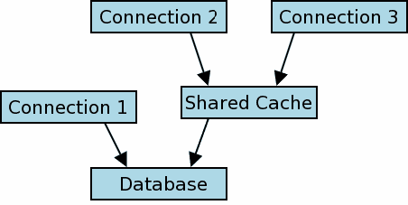

# 1\. SQLite 共享缓存模式

> 原文：[`sqlite.com/sharedcache.html`](https://sqlite.com/sharedcache.html)

从 3.3.0 版本（2006 年 01 月 11 日）开始，SQLite 包括一个特殊的“共享缓存”模式（默认情况下禁用），旨在用于嵌入式服务器。 如果启用了共享缓存模式，并且线程建立了对同一数据库的多个连接，则这些连接共享一个单一的数据和模式缓存。 这可以显著减少系统所需的内存和 IO 的数量。

在 3.5.0 版本（2007 年 09 月 04 日）中，共享缓存模式被修改，以便在整个进程中而不仅仅是在单个线程内共享相同的缓存。 在此更改之前，对于在线程之间传递数据库连接有限制。 这些限制在 3.5.0 更新中被取消。本文描述了版本 3.5.0 的共享缓存模式。

共享缓存模式在某些情况下更改了锁定模型的语义。 这份文件描述了详情。 我们假设您已对普通 SQLite 锁定模型（有关详细信息，请参阅 SQLite Version 3 中的文件锁定和并发性）有一个基本的理解。

## 1.1\. 不鼓励使用共享缓存

共享缓存模式是一项已过时的功能。 不鼓励使用共享缓存模式。 大多数共享缓存的用例最好通过 WAL 模式来服务。

共享缓存模式是在 2006 年根据[Symbian](https://en.wikipedia.org/wiki/Symbian)的开发人员的要求而发明的。 他们遇到的问题是，如果手机上的联系人数据库正在同步，那么会锁定数据库文件。 然后，如果有电话进来，数据库锁将阻止它们查询联系人数据库，以找到适当的铃声或来电者的照片显示在屏幕上等等。 WAL 模式（约 2010 年）是这个问题的更好解决方案，因为它允许同时访问而不会破坏事务隔离。

构建自己的 SQLite 源代码副本的应用程序建议使用-DSQLITE_OMIT_SHARED_CACHE 编译时选项，因为所得到的二进制文件将更小更快。

这里描述的共享缓存接口将继续受支持，以确保完全向后兼容。 但是，不鼓励使用共享缓存。

# 2\. 共享缓存锁定模型

从另一个进程或线程的角度来看，使用共享缓存的两个或更多数据库连接看起来像一个单一的连接。 用于在多个共享缓存或常规数据库用户之间仲裁的锁定协议在其他地方有描述。

|  |
| --- |

图 1

图 1 描绘了一个运行时配置示例，其中已建立了三个数据库连接。连接 1 是普通的 SQLite 数据库连接。连接 2 和连接 3 共享一个缓存。用于序列化连接 1 和共享缓存之间的数据库访问的普通锁定协议。用于描述连接 2 和连接 3 如何访问共享缓存的内部协议在本节的其余部分中详细说明。

SQLite 共享缓存锁模型有三个级别，分别是事务级锁、表级锁和模式级锁。它们在下面的三个小节中有详细描述。

## 2.1\. 事务级锁定

SQLite 连接可以打开两种类型的事务，读事务和写事务。这并不是显式完成的，事务在首次写入数据库表之前隐式是读事务，之后成为写事务。

单个共享缓存中的连接最多可以同时打开一个写事务。这可以与任意数量的读事务共存。

## 2.2\. 表级锁定

当两个或更多连接使用共享缓存时，锁用于序列化每个表的并发访问尝试。表支持两种类型的锁定，“读锁”和“写锁”。锁分配给连接 - 在任何时候，每个数据库连接对每个数据库表要么具有读锁，要么具有写锁，要么不具有任何锁。

在任何时候，单个表可以具有任意数量的活动读锁或单个活动写锁。要从表中读取数据，连接必须首先获取读锁。要向表中写入数据，连接必须获取该表的写锁。如果无法获取所需的表锁，则查询失败并返回 SQLITE_LOCKED 给调用者。

一旦连接获取了表锁，直到当前事务（读或写）结束后才会释放。

### 2.2.1\. 读未提交隔离模式

上述行为可以通过使用 read_uncommitted pragma 稍微修改，将隔离级别从串行化（默认）更改为读未提交。

处于读未提交模式的数据库连接在从数据库表中读取数据之前不会尝试获取读锁，如上所述。如果另一个数据库连接在读取期间修改表，可能导致查询结果不一致，但这也意味着由读未提交模式连接打开的读事务既不会被阻塞也不会阻塞任何其他连接。

读未提交模式对写入数据库表所需的锁没有影响（即使是读未提交连接仍然必须获取写锁，因此数据库写入仍可能被阻塞或阻塞）。此外，读未提交模式对下述规则中枚举的 sqlite_schema 锁也没有影响（参见“模式（sqlite_schema）级锁定”章节）。

> ```sql
>   /* Set the value of the read-uncommitted flag:
>   **
>   **   True  -> Set the connection to read-uncommitted mode.
>   **   False -> Set the connection to serialized (the default) mode.
>   */
>   PRAGMA read_uncommitted = <boolean>;
> 
>   /* Retrieve the current value of the read-uncommitted flag */
>   PRAGMA read_uncommitted;
> 
> ```

## 2.3\. 模式（sqlite_schema）级别锁定

sqlite_schema 表支持与所有其他数据库表（见上文描述）相同的共享缓存读取和写入锁定。还适用以下特殊规则：

+   在访问任何数据库表或获取任何其他读取或写入锁之前，连接必须在*sqlite_schema*上获取读锁。

+   在执行修改数据库模式的语句（即 CREATE 或 DROP TABLE 语句）之前，连接必须在*sqlite_schema*上获取写锁。

+   如果任何其他连接持有任何附加数据库（包括默认数据库“main”）上的*sqlite_schema*表的写锁，则连接可能无法编译 SQL 语句。

# 3\. 线程相关问题

在 SQLite 版本 3.3.0 到 3.4.2 中，当启用共享缓存模式时，只能由调用 sqlite3_open()创建它的线程使用数据库连接。而且，一个连接只能与同一线程中的另一个连接共享缓存。从 SQLite 版本 3.5.0（2007-09-04）开始取消了这些限制。

# 4\. 共享缓存和虚拟表

在旧版 SQLite 中，共享缓存模式不能与虚拟表一起使用。这一限制在 SQLite 版本 3.6.17（2009-08-10）中被移除。

# 5\. 启用共享缓存模式

共享缓存模式是在进程级别启用的。使用 C 接口，可以使用以下 API 全局启用或禁用共享缓存模式：

> ```sql
> int sqlite3_enable_shared_cache(int);
> 
> ```

每次调用 sqlite3_enable_shared_cache()都会影响使用 sqlite3_open()、sqlite3_open16()或 sqlite3_open_v2()创建的后续数据库连接。已经存在的数据库连接不受影响。在同一进程中，每次调用 sqlite3_enable_shared_cache()都会覆盖所有先前的调用。

使用 sqlite3_open_v2()创建的各个数据库连接可以通过使用第三个参数中的 SQLITE_OPEN_SHAREDCACHE 或 SQLITE_OPEN_PRIVATECACHE 标志选择参与或不参与共享缓存模式。使用这些标志中的任何一个将覆盖由 sqlite3_enable_shared_cache()建立的全局共享缓存模式设置。不应同时使用两个标志；如果在调用 sqlite3_open_v2()时的第三个参数中同时使用 SQLITE_OPEN_SHAREDCACHE 和 SQLITE_OPEN_PRIVATECACHE 标志，则行为未定义。

当使用 URI 文件名时，可以使用"cache"查询参数来指定数据库是否使用共享缓存。使用 "cache=shared" 启用共享缓存，使用 "cache=private" 禁用共享缓存。使用 URI 查询参数来指定数据库连接的缓存共享行为允许在 ATTACH 语句中控制缓存共享。例如：

> ```sql
> ATTACH 'file:aux.db?cache=shared' AS aux;
> 
> ```

# 6\. 共享缓存与内存数据库

从 SQLite 版本 3.7.13（2012-06-11）开始，可以在使用 URI 文件名创建的内存数据库中使用共享缓存。出于向后兼容性考虑，如果使用未加修饰的名称 ":memory:" 打开数据库，则始终禁用内存数据库的共享缓存。在版本 3.7.13 之前，无论使用的数据库名称、当前系统的共享缓存设置或查询参数或标志如何，内存数据库的共享缓存始终被禁用。

启用内存数据库的共享缓存允许同一进程中的两个或更多数据库连接访问同一个内存数据库。共享缓存中的内存数据库在最后一个连接关闭时自动删除并回收内存。
