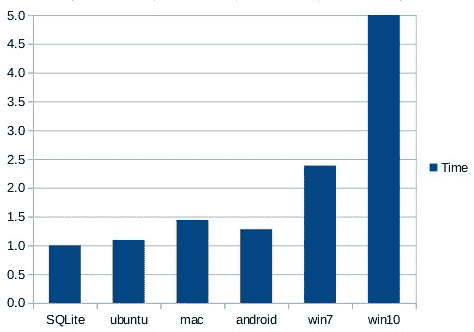
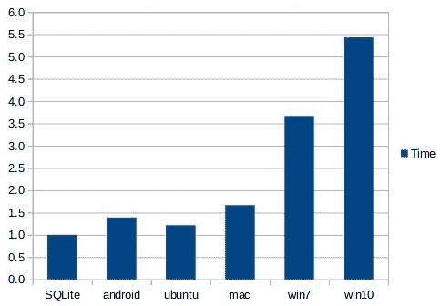
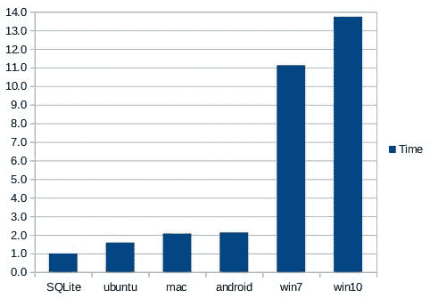
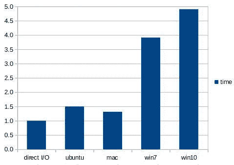

# 1\. 总结

> 原文：[`sqlite.com/fasterthanfs.html`](https://sqlite.com/fasterthanfs.html)

SQLite 读写小的 blob（例如缩略图图像）比使用 fread()或 fwrite()从磁盘上的单独文件读取或写入这些 blob 要快 35%¹。

此外，一个单独的 SQLite 数据库存储 10 千字节的 blob，比将 blob 存储在单独文件中少约 20%的磁盘空间。

我们认为性能差异是因为从 SQLite 数据库中工作时，只调用一次 open()和 close()系统调用，而使用单独文件中存储的 blob 时，每个 blob 会调用一次 open()和 close()。似乎调用 open()和 close()的开销大于使用数据库的开销。大小的减少是因为单独文件会填充到文件系统块大小的下一个倍数，而 blob 更紧密地打包到 SQLite 数据库中。

这篇文章中的测量是在 2017-06-05 那周使用的 SQLite 版本介于 3.19.2 和 3.20.0 之间。您可以预期未来的 SQLite 版本会表现得更好。

## 1.1\. 注意事项

¹上述的 35%数字是大约的。实际的时间会因硬件、操作系统和实验细节的不同而变化，也会因真实硬件上的性能波动而变化。详细信息请参阅下文。请自行尝试这些实验。在 SQLite 论坛上报告显著偏差。

这 35%的数字基于在作者手边容易获取的每台机器上运行测试。本文的一些审阅者报告说在他们的系统上，SQLite 的延迟高于直接 I/O。我们还不理解这种差异。我们还看到迹象表明，当使用冷文件系统缓存运行实验时，SQLite 的表现不如直接 I/O。

因此，您的收获是：SQLite 的读写延迟与磁盘上单个文件的读写延迟相竞争。通常情况下，SQLite 更快。有时候，SQLite 几乎一样快。总之，本文证明了一个常见的假设是错误的，即关系数据库一定比直接文件系统 I/O 更慢。

## 1.2\. 相关研究

一项 [2022 年的研究](https://golangexample.com/an-unscientific-benchmark-of-sqlite-vs-the-file-system-btrfs/) ([GitHub 上的备用链接](https://github.com/chrisdavies/dbench)) 发现，SQLite 在真实世界的工作负载中大约比 Linux 上的 Btrfs 和 Ext4 快两倍。

[Jim Gray](https://www.microsoft.com/en-us/research/people/gray/) 和其他人研究了 Microsoft SQL Server 中 BLOB 与文件 I/O 的读取性能，并发现对于小于 250KiB 到 1MiB 的 BLOB 大小，直接从数据库中读取 BLOB 的速度更快。([Paper](https://www.microsoft.com/en-us/research/publication/to-blob-or-not-to-blob-large-object-storage-in-a-database-or-a-filesystem/))。在该研究中，即使内容存储在单独的文件中，数据库仍会存储内容的文件名。因此，对于每个 BLOB 都要查询数据库，即使仅仅是提取文件名。在本文中，BLOB 的关键是文件名，因此不需要预先访问数据库。由于在本文中从单个文件读取内容时根本不使用数据库，所以直接文件 I/O 的速度优势的临界点比 Gray 的论文中更小。

该网站上的 内部与外部 BLOBs 文章是一个早期的研究（大约在 2011 年），采用了与 Jim Gray 论文相同的方法 —— 将 BLOB 文件名作为数据库中的条目存储 —— 但用于 SQLite 而不是 SQL Server。

# 2\. 如何进行这些测量

I/O 性能使用 SQLite 源码树中的 [kvtest.c](https://www.sqlite.org/src/file/test/kvtest.c) 程序进行测量。要编译此测试程序，首先将 kvtest.c 源文件与 SQLite 汇编源文件 "sqlite3.c" 和 "sqlite3.h" 放入同一个目录中。然后在 Unix 系统上，运行如下命令：

```sql
gcc -Os -I. -DSQLITE_DIRECT_OVERFLOW_READ \
  kvtest.c sqlite3.c -o kvtest -ldl -lpthread

```

在使用 MSVC 的 Windows 上：

```sql
cl -I. -DSQLITE_DIRECT_OVERFLOW_READ kvtest.c sqlite3.c

```

编译 Android 的说明在下面 显示。

使用生成的 "kvtest" 程序生成包含 100,000 个随机不可压缩 blob 的测试数据库，每个 blob 的随机大小在 8,000 到 12,000 字节之间，使用如下命令：

```sql
./kvtest init test1.db --count 100k --size 10k --variance 2k

```

如果需要，可以通过运行以下命令验证新数据库：

```sql
./kvtest stat test1.db

```

接下来，使用如下命令将所有 blob 的副本复制到一个目录中的各个文件中：

```sql
./kvtest export test1.db test1.dir

```

此时，您可以测量 test1.db 数据库使用的磁盘空间量以及 test1.dir 目录及其所有内容使用的空间量。在标准的 Ubuntu Linux 桌面上，数据库文件大小为 1,024,512,000 字节，而 test1.dir 目录将使用 1,228,800,000 字节的空间（根据 "du -k"），比数据库多约 20%。

上述创建的 "test1.dir" 目录将所有 blob 放入单个文件夹中。有人推测，当单个目录包含 100,000 个对象时，某些操作系统的性能可能会较差。为了测试这一点，kvtest 程序还可以将 blob 存储在一个最多包含 100 个文件和/或子目录的文件夹层次结构中。可以使用 "export" 命令的 --tree 命令行选项来创建 blob 的备选磁盘表示，例如：

```sql
./kvtest export test1.db test1.tree --tree

```

test1.dir 目录将包含 100,000 个文件，文件名类似于 "000000"、"000001"、"000002" 等，而 test1.tree 目录将包含相同文件，但在子目录中，如 "00/00/00"、"00/00/01" 等。尽管 test1.test 稍微大一点，因为有额外的目录条目，但 test1.dir 和 test1.test 目录大致占用相同的空间。

后续的所有实验使用 "test1.dir" 或 "test1.tree" 时效果相同。无论操作系统如何，在任一情况下测量的性能差异都很小。

使用以下命令来测量从数据库和从单个文件读取 blobs 的性能：

```sql
./kvtest run test1.db --count 100k --blob-api
./kvtest run test1.dir --count 100k --blob-api
./kvtest run test1.tree --count 100k --blob-api

```

根据您的硬件和操作系统，您应该能看到从 test1.db 数据库文件读取的速度比从 test1.dir 或 test1.tree 文件夹中的单个文件读取快大约 35%。由于缓存的原因，结果可能在多次运行中有显著变化，因此建议多次运行测试并取平均值或最坏情况或最佳情况，具体取决于您的要求。

在数据库读取测试中使用 --blob-api 选项会导致 kvtest 使用 sqlite3_blob_read() 特性来加载 blobs 的内容，而不是运行纯 SQL 语句。这有助于 SQLite 在读取测试中运行得更快一些。您可以省略该选项以比较运行 SQL 语句时的 SQLite 性能。在这种情况下，SQLite 仍然优于直接读取，尽管不如使用 sqlite3_blob_read() 时那么明显。对于从单独的磁盘文件读取的测试，--blob-api 选项会被忽略。

通过添加 --update 选项来测量写入性能。这会导致在原地用另一个大小完全相同的随机 blob 覆盖 blobs。

```sql
./kvtest run test1.db --count 100k --update
./kvtest run test1.dir --count 100k --update
./kvtest run test1.tree --count 100k --update

```

上述写入测试并不完全公平，因为 SQLite 正在执行安全事务，而直接写入磁盘则不是。为了使测试更加公平，可以向 SQLite 写入添加`--nosync`选项以禁用调用 fsync()或 FlushFileBuffers()来强制内容写入磁盘，或者使用`--fsync`选项将直接写入磁盘的测试强制调用 fsync()或 FlushFileBuffers()来更新磁盘文件。

默认情况下，kvtest 在单个事务中运行所有数据库 I/O 测量。使用`--multitrans`选项可在单独事务中运行每个 blob 的读取或写入操作。`--multitrans`选项会使 SQLite 变得更慢，并且与直接磁盘 I/O 不竞争。这一选项再次证明，要想在 SQLite 中获得最佳性能，应尽可能将尽可能多的数据库交互集中在单个事务中进行。

还有许多其他测试选项，可以通过运行以下命令查看：

```sql
./kvtest help

```

## 2.1\. 读取性能测量

下图显示了在五种不同系统上使用[kvtest.c](https://www.sqlite.org/src/file/test/kvtest.c)收集的数据：

+   **Win7**: 约 2009 年的戴尔 Inspiron 笔记本电脑，双核 Pentium 处理器，主频 2.30GHz，4GiB RAM，Windows7。

+   **Win10**: 2016 年款 Lenovo YOGA 910，Intel i7-7500 处理器，主频 2.70GHz，16GiB RAM，Windows10。

+   **Mac**: 2015 年款 MacBook Pro，3.1GHz Intel Core i7 处理器，16GiB RAM，MacOS 10.12.5

+   **Ubuntu**: 台式机配置为 Intel i7-4770K，主频 3.50GHz，32GiB RAM，Ubuntu 16.04.2 LTS

+   **Android**: Galaxy S3, ARMv7, 2GiB RAM

所有机器均使用 SSD，除了 Win7 使用硬盘驱动器。测试数据库包含 100K 个 blob，大小均匀分布在 8K 到 12K 之间，总计约 1GB 内容。数据库页面大小为 4KiB。所有这些测试都使用了编译时选项`-DSQLITE_DIRECT_OVERFLOW_READ`。测试运行了多次，第一次运行用于热身缓存，其时间测量被丢弃。

下面的图表显示直接从文件系统读取一个 blob 的平均时间与从 SQLite 数据库读取相同 blob 所需的时间之间的差异。实际的时间在不同系统之间有很大的变化（例如，Ubuntu 桌面比 Galaxy S3 手机快得多）。该图表显示了从数据库读取 blob 所需时间与从文件读取 blob 所需时间的比率。图表最左边的列是从数据库读取的标准化时间，作为参考。

在这张图表中，一个 SQL 语句（"SELECT v FROM kv WHERE k=?1"）被预先准备好。然后对于每个 blob，blob 键值被绑定到参数 ?1，并且该语句被评估以提取 blob 内容。

图表显示，在 Windows10 上，从 SQLite 数据库读取内容大约比直接从磁盘读取快 5 倍。在 Android 上，SQLite 只比从磁盘读取快约 35%。



图表 1：SQLite 相对于直接文件系统读取的读取延迟。

100K 个 blobs，每个平均 10KB，随机顺序使用 SQL。

通过绕过 SQL 层并直接使用 sqlite3_blob_read()接口读取 blob 内容，可以略微提高性能，如下一个图表所示：



图表 2：SQLite 相对于直接文件系统读取的读取延迟。

100K 个 blobs，平均大小为 10KB，随机顺序。

使用 sqlite3_blob_read()。

通过使用 SQLite 的内存映射 I/O 特性可以进一步提高性能。在下一个图表中，整个 1GB 的数据库文件被内存映射，并且使用 sqlite3_blob_read()接口以随机顺序读取 blob 数据。通过这些优化，SQLite 的速度是 Android 或 MacOS-X 的两倍，比 Windows 快 10 倍以上。



图表 3：SQLite 相对于直接文件系统读取的读取延迟。

100K 个 blob，平均大小 10KB，随机顺序

使用来自内存映射数据库的 sqlite3_blob_read()。

第三个图表显示，从 SQLite 中读取 blob 内容在 Mac 和 Android 上可以比从磁盘上的单个文件快两倍，而在 Windows 上则快十倍之多。

## 2.2\. 写入性能测量

写入较慢。在所有系统上，无论是使用直接 I/O 还是 SQLite，写入性能都比读取慢 5 至 15 倍。

通过将一个完整的 blob 用不同的 blob 进行替换（覆盖）来进行写入性能测量。这些实验中的所有 blob 都是随机且不可压缩的。由于写入比读取慢得多，数据库中的 10,000 个 blob 中仅替换了 100,000 个。要替换的 blob 是随机选择的，没有特定顺序。

直接写入磁盘使用 fopen()/fwrite()/fclose() 来完成。默认情况下，在下面显示的所有结果中，操作系统文件系统缓冲区不会使用 fsync() 或 FlushFileBuffers() 刷新到持久存储。换句话说，没有尝试使直接写入磁盘的操作具有事务性或安全性保障。我们发现，对每个写入的文件调用 fsync() 或 FlushFileBuffers() 会使直接写入磁盘的速度比写入 SQLite 慢大约 10 倍或更多。

下一个图表将 SQLite 数据库在 WAL 模式 下的更新与在磁盘上的原始直接覆盖文件进行了比较。PRAGMA synchronous 设置为 NORMAL。所有数据库写入都在一个单一事务中。在事务提交后，但在运行 checkpoint 之前停止了数据库写入的计时器。请注意，与直接写入磁盘写入不同，SQLite 写入是事务性和安全的，尽管因为同步设置为 NORMAL 而不是 FULL，事务并不是持久的。


图表 4：SQLite 写入延迟相对于直接文件系统写入。

10K 个 blob，平均大小为 10KB，随机顺序，

使用具有同步 NORMAL 的 WAL 模式，

不包括检查点时间

对于写入实验，Android 的性能数据被省略，因为 Galaxy S3 上的性能测试结果太随机了。两次连续运行完全相同的实验会得到截然不同的时间。而且公平地说，SQLite 在 Android 上的性能略慢于直接写入磁盘。

下一张图显示了当禁用事务（PRAGMA journal_mode=OFF）和 PRAGMA synchronous 设置为 OFF 时，SQLite 与直接写入磁盘的性能对比。这些设置使 SQLite 在与直接写入磁盘相等的环境下运行，这意味着数据容易因系统崩溃和电源故障而损坏。



图表 5：SQLite 写入延迟相对于直接文件系统写入。

10K 个 blob，平均大小为 10KB，随机顺序，

禁用日志记录，同步 OFF。

在所有写入测试中，重要的是在运行直接写入磁盘性能测试之前禁用防病毒软件。我们发现，防病毒软件会使直接写入磁盘的速度减慢一个数量级，而它对 SQLite 写入的影响很小。这可能是因为直接写入磁盘会改变成千上万个单独的文件，所有这些文件都需要被防病毒软件检查，而 SQLite 写入只会改变单个数据库文件。

## 2.3\. 变体

-DSQLITE_DIRECT_OVERFLOW_READ 编译时选项会导致 SQLite 在从溢出页面读取内容时绕过其页面缓存。这有助于提高对 10K blob 的数据库读取速度，但提高并不多。SQLite 仍然比没有 SQLITE_DIRECT_OVERFLOW_READ 编译时选项的直接文件系统读取速度快。

其他编译时选项，如使用 -O3 而不是 -Os，或者使用 -DSQLITE_THREADSAFE=0 和/或一些其他 推荐的编译时选项，可能会帮助 SQLite 相对于直接文件系统读取更快地运行。

测试数据中 blobs 的大小影响性能。对于更大的 blobs，文件系统通常更快，因为 open() 和 close() 的开销分摊在更多的 I/O 字节上，而平均 blob 大小减小时，数据库在速度和空间上的效率更高。

# 3\. 总体发现

1.  SQLite 在读写上通常比存储在独立文件中的二进制大对象（blobs）更具竞争力，且通常更快。

1.  在 Windows 上，当启用反病毒保护时，SQLite 比直接写入磁盘快得多。由于在 Windows 中反病毒软件通常默认开启，这意味着 SQLite 通常比直接写入磁盘快得多。

1.  对于所有系统以及 SQLite 和直接写入磁盘 I/O 来说，读取大约比写入快一个数量级。

1.  I/O 性能因操作系统和硬件而异。在得出结论之前，请进行自己的测量。

1.  一些其他 SQL 数据库引擎建议开发者将 blobs 存储在单独的文件中，然后在数据库中存储文件名。在这种情况下，必须首先查询数据库以查找文件名，然后打开和读取文件，而将整个 blob 存储在数据库中则可以提供比 SQLite 更快的读写性能。详见 Internal Versus External BLOBs 文章获取更多信息。

# 4\. 附加说明

## 4.1\. 在 Android 上编译和测试

kvtest 程序在 Android 上编译和运行如下。首先安装 Android SDK 和 NDK。然后准备一个名为 "android-gcc" 的脚本，大致如下所示：

```sql
#!/bin/sh
#
NDK=/home/drh/Android/Sdk/ndk-bundle
SYSROOT=$NDK/platforms/android-16/arch-arm
ABIN=$NDK/toolchains/arm-linux-androideabi-4.9/prebuilt/linux-x86_64/bin
GCC=$ABIN/arm-linux-androideabi-gcc
$GCC --sysroot=$SYSROOT -fPIC -pie $*

```

将该脚本设为可执行并放置在你的 $PATH 中。然后按如下方式编译 kvtest 程序：

```sql
android-gcc -Os -I. kvtest.c sqlite3.c -o kvtest-android

```

接下来，将生成的 kvtest-android 可执行文件移动到安卓设备上：

```sql
adb push kvtest-android /data/local/tmp

```

最后，使用 "adb shell" 在安卓设备上获取一个 shell 提示符，进入 /data/local/tmp 目录，并像在任何其他 Unix 主机上一样开始运行测试。
