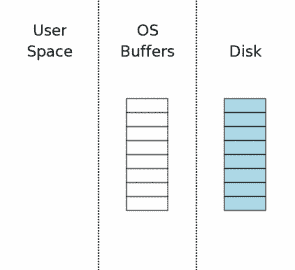

# 1\. 引言

> 译文：[`sqlite.com/atomiccommit.html`](https://sqlite.com/atomiccommit.html)

像 SQLite 这样的事务性数据库的一个重要特性是“原子提交”。 原子提交意味着单个事务内的所有数据库更改要么全部发生，要么全部不发生。 通过原子提交，就好像数据库文件的许多不同部分的不同写操作同时和即时发生一样。 真实硬件会对大容量存储进行串行写入，写入单个扇区需要有限的时间。 因此，真正同时和/或即时写入数据库文件的多个不同扇区是不可能的。 但是 SQLite 内的原子提交逻辑使得一个事务的更改看起来好像是同时和即时写入的。

SQLite 具有一个重要特性，即使事务被操作系统崩溃或电源故障中断，事务看起来也是原子的。

本文介绍了 SQLite 使用的技术，以创建原子提交的幻觉。

本文的信息仅适用于 SQLite 在“回滚模式”下运行时，或者换句话说，当 SQLite 不使用 预写日志 时。 当启用预写日志时，SQLite 仍然支持原子提交，但是它通过不同于本文描述的机制实现原子提交。 有关 SQLite 如何在该上下文中支持原子提交的额外信息，请参阅 预写日志文档。

# 2\. 硬件假设

在本文中，我们将大容量存储设备称为“磁盘”，即使大容量存储设备可能实际上是闪存。

我们假设磁盘是按块（我们称之为“扇区”）写入的。不可能修改小于扇区大小的磁盘的任何部分。要修改小于扇区大小的磁盘的部分，必须读取包含您想要更改的部分的完整扇区，进行更改，然后重新写回完整的扇区。

在传统的旋转硬盘上，扇区是读写的最小传输单位。然而，在闪存上，读取的最小大小通常比写入的最小大小要小得多。SQLite 只关心最小的写入量，因此在本文中，当我们说“扇区”时，我们指的是可以一次性写入到大容量存储中的最小数据量。

在 SQLite 版本 3.3.14 之前，所有情况下都假设扇区大小为 512 字节。虽然编译时有选项可以更改此值，但代码从未测试过较大的值。512 字节的扇区假设似乎合理，因为直到最近所有磁盘驱动器都内部使用 512 字节扇区。然而，最近有推动将磁盘的扇区大小增加到 4096 字节。此外，闪存的扇区大小通常大于 512 字节。因此，从版本 3.3.14 开始的 SQLite 版本在操作系统接口层中有一种方法，用于查询底层文件系统以找到真实的扇区大小。截至当前实现（版本 3.5.0），此方法仍返回一个硬编码的值为 512 字节，因为在 Unix 或 Windows 上没有标准的方法来发现真实的扇区大小。但该方法可供嵌入式设备制造商根据自身需求进行调整。未来可能在 Unix 和 Windows 上填充更有意义的实现。

SQLite 传统上假定扇区写操作不是原子性的。然而，SQLite 总是假定扇区写操作是线性的。所谓“线性”，意味着 SQLite 假定当写入一个扇区时，硬件会从数据的一端开始逐字节地写到另一端。写操作可能从开头到结尾，也可能从结尾到开头。如果在扇区写操作中间发生了断电，可能会导致部分扇区被修改而另一部分保持不变。SQLite 的关键假设是，如果扇区的任何部分发生了变化，那么第一个或最后一个字节将会被修改。因此，硬件永远不会从扇区的中间开始写入并向两端工作。我们不知道这种假设是否总是成立，但它似乎是合理的。

前面的段落表明，SQLite 不假定扇区写操作是原子性的，默认情况下确实如此。但从 SQLite 版本 3.5.0 开始，有一个称为虚拟文件系统（VFS）接口的新接口。VFS 是 SQLite 与底层文件系统通信的唯一手段。代码附带了 Unix 和 Windows 的默认 VFS 实现，并且有一个在运行时创建新的自定义 VFS 实现的机制。在这个新的 VFS 接口中，有一个称为 xDeviceCharacteristics 的方法。这个方法会查询底层文件系统，以发现文件系统可能存在或不存在的各种属性和行为。xDeviceCharacteristics 方法可能会指示扇区写操作是否是原子性的，如果是，SQLite 将尝试利用这一事实。但是对于 Unix 和 Windows 的默认 xDeviceCharacteristics 方法并不指示扇区写操作是原子性的，因此通常会省略这些优化操作。

SQLite 假设操作系统会缓冲写入，并且写入请求会在数据实际存储在大容量存储设备之前返回。SQLite 进一步假设操作系统会重新排序写操作。因此，SQLite 在关键点进行“flush”或“fsync”操作。SQLite 假设 flush 或 fsync 操作不会在正在刷新的文件的所有待处理写操作完成之前返回。我们被告知，在某些版本的 Windows 和 Linux 上，flush 和 fsync 原语存在问题。这是不幸的。这使得 SQLite 容易在提交过程中断电后可能出现数据库损坏的情况。但是，SQLite 无能为力地无法测试或解决这种情况。SQLite 假设它运行的操作系统就像广告中所说的那样工作。如果情况并非如此，那么希望你不会经常断电。

SQLite 假设文件长度增加时，新的文件空间最初包含垃圾数据，然后后续填入实际写入的数据。换句话说，SQLite 假设文件大小在文件内容之前更新。这是一种悲观的假设，SQLite 必须做一些额外的工作，以确保如果在文件大小增加和新内容写入之间断电时不会导致数据库损坏。VFS 的 xDeviceCharacteristics 方法可能表明文件系统总是在更新文件大小之前写入数据。（对于查看代码的读者，这是 SQLITE_IOCAP_SAFE_APPEND 属性。）当 xDeviceCharacteristics 方法指示文件内容在增加文件大小之前写入时，SQLite 可以省略一些过于严格的数据库保护步骤，从而减少执行提交所需的磁盘 I/O 量。然而，当前实现对于 Windows 和 Unix 的默认 VFS 并不做出此类假设。

SQLite 假设用户进程视角下的文件删除是原子操作。这意味着如果 SQLite 请求删除文件，并且在删除操作期间断电，一旦电力恢复，要么文件完整存在且所有原始内容未改变，要么文件在文件系统中完全看不到。如果电力恢复后文件只被部分删除，数据部分被改变或擦除，或者文件被截断但没有完全删除，则可能导致数据库损坏。

SQLite 假定由宇宙射线、热噪声、量子波动、设备驱动程序错误或其他机制引起的位错误的检测和/或校正是底层硬件和操作系统的责任。SQLite 不会为了检测损坏或 I/O 错误而向数据库文件添加任何冗余。SQLite 假定它读取的数据与它之前写入的数据完全相同。

默认情况下，SQLite 假定操作系统调用写入一定范围的字节不会损坏或更改该范围之外的任何字节，即使在写入期间发生断电或操作系统崩溃。我们称之为“安全覆写”特性。在 3.7.9 版本（2011-11-01）之前，SQLite 不假定安全覆写。但随着大多数磁盘驱动器标准扇区大小从 512 增加到 4096 字节，为了保持历史性能水平，有必要假定安全覆写，默认情况下最新版本的 SQLite 假定安全覆写。可以在编译时或运行时禁用安全覆写属性，如果需要的话。有关详细信息，请参阅 安全覆写文档。

# 3\. 单文件提交

我们首先概述 SQLite 在执行针对单个数据库文件的事务的原子提交时所采取的步骤。有关用于防止因断电而造成损坏的文件格式细节以及跨多个数据库执行原子提交的技术将在后续章节中讨论。

## 3.1\. 初始状态



当数据库连接首次打开时，计算机的状态如右侧图示所示。图中极右边的区域（标记为“磁盘”）表示存储在大容量存储设备上的信息。每个矩形代表一个扇区。蓝色表示扇区包含原始数据。中间区域是操作系统的磁盘缓存。在我们的示例开始时，缓存是冷的，这通过磁盘缓存的矩形为空来表示。图示的左侧区域显示了正在使用 SQLite 的进程的内存内容。数据库连接刚刚打开，还没有读取任何信息，因此用户空间为空。

## 3.2\. 获得读取锁定


在 SQLite 可以向数据库写入数据之前，必须首先读取数据库，查看已有的内容。即使只是追加新数据，SQLite 仍然必须从 "sqlite_schema" 表中读取数据库架构，以便能够解析 INSERT 语句并发现新信息应存储在数据库文件的何处。

从数据库文件读取的第一步是获得对数据库文件的共享锁定。 "共享" 锁定允许两个或更多数据库连接同时从数据库文件中读取。但是，共享锁定在我们读取时阻止其他数据库连接向数据库文件写入。这是必要的，因为如果另一个数据库连接在我们读取数据库文件时同时向其写入，我们可能会在变更之前读取一些数据，而在变更之后读取其他数据。这将导致似乎由其他进程进行的更改不是原子的现象。

请注意，共享锁是在操作系统磁盘缓存上而不是磁盘本身。文件锁实际上只是操作系统内核中的标志，通常如此。（具体细节取决于特定的操作系统层接口。）因此，如果操作系统崩溃或断电，锁将立即消失。通常情况下，如果创建锁的进程退出，锁也会消失。

## 3.3\. 从数据库中读取信息


获得共享锁后，我们可以开始从数据库文件中读取信息。在这种情况下，我们假设是冷缓存，因此信息必须首先从大容量存储器读入操作系统缓存，然后从操作系统缓存传输到用户空间。在后续的读取中，部分或所有信息可能已经存在于操作系统缓存中，因此只需要传输到用户空间。

通常只会读取数据库文件中的部分页面。在此示例中，我们展示了八个页面中的三个页面被读取。在典型的应用程序中，数据库将拥有数千个页面，而查询通常只会触及其中的少部分页面。

## 3.4\. 获取保留锁


在对数据库进行更改之前，SQLite 首先在数据库文件上获取“保留”锁。保留锁类似于共享锁，因为保留锁和共享锁都允许其他进程从数据库文件中读取。单个保留锁可以与来自其他进程的多个共享锁共存。然而，数据库文件上只能有一个保留锁。因此，在同一时间只能有一个进程尝试对数据库进行写入。

预留锁的概念是指它表示进程打算在不久的将来修改数据库文件，但尚未开始进行修改。因为修改尚未开始，其他进程可以继续从数据库中读取。然而，没有其他进程应该开始尝试对数据库进行写入。

## 3.5\. 创建回滚日志文件


在对数据库文件进行任何更改之前，SQLite 首先创建一个单独的回滚日志文件，并将要修改的数据库页的原始内容写入回滚日志。回滚日志的理念是它包含将数据库恢复到原始状态所需的所有信息。

回滚日志包含一个小的头部（在图示中显示为绿色），记录了数据库文件的原始大小。因此，如果更改导致数据库文件增大，我们仍然可以知道数据库的原始大小。页面编号与写入回滚日志的每个数据库页面一起存储。

当创建新文件时，大多数桌面操作系统（Windows、Linux、Mac OS X）实际上不会立即向磁盘写入任何内容。新文件仅在操作系统磁盘缓存中创建。直到稍后某个时候，操作系统有空闲时才会将文件创建到主存储器中。这给用户留下了一种错觉，即 I/O 比实际进行真正的磁盘 I/O 时要快得多。我们在右侧的图示中说明了这个概念，显示新的回滚日志仅出现在操作系统磁盘缓存中，而不是在磁盘本身上。

## 3.6\. 在用户空间更改数据库页面


在原始页面内容保存在回滚日志之后，页面可以在用户内存中修改。每个数据库连接都有自己的用户空间的私有副本，因此在用户空间进行的更改仅对进行更改的数据库连接可见。其他数据库连接仍然看到操作系统磁盘缓存缓冲区中尚未更改的信息。因此，即使一个进程正在忙于修改数据库，其他进程仍然可以继续读取其原始数据库内容的副本。

## 3.7\. 将回滚日志文件刷新到大容量存储


下一步是将回滚日志文件的内容刷新到非易失性存储。正如我们将在后面看到的那样，这是确保数据库能够在意外断电情况下生存的关键步骤。由于写入非易失性存储通常是一个缓慢的操作，这一步也需要很多时间。

这一步通常比简单地将回滚日志刷新到磁盘复杂得多。在大多数平台上，需要进行两次单独的刷新（或 fsync()）操作。第一次刷新将写出基本的回滚日志内容。然后修改回滚日志的头部以显示回滚日志中页面的数量。然后将头部刷新到磁盘。关于为什么要进行这种头部修改和额外刷新的详细信息将在本文的后续部分提供。

## 3.8\. 获取排他锁


在对数据库文件本身进行更改之前，我们必须获取数据库文件的排他锁。获取排他锁实际上是一个两步过程。首先，SQLite 获取一个“挂起”锁。然后将挂起锁升级为排他锁。

一个挂起锁允许已经具有共享锁的其他进程继续读取数据库文件。但它阻止新的共享锁的建立。挂起锁的理念是防止由大量读取者组成的写入者饥饿问题。可能有数十、甚至数百个其他进程试图读取数据库文件。每个进程在开始读取之前都会获取一个共享锁，读取所需内容，然后释放共享锁。然而，如果有许多不同的进程都从同一个数据库读取，可能会发生新的进程总是在前一个进程释放其共享锁之前获取其共享锁的情况。因此，数据库文件上永远没有没有共享锁的时刻，因此写入者永远没有机会获取独占锁。挂起锁的设计就是为了阻止这种循环，允许现有的共享锁继续进行，但阻止新的共享锁的建立。最终，所有的共享锁都会清除，挂起锁随后可以升级为独占锁。

## 3.9\. 将更改写入数据库文件


一旦持有独占锁，我们知道没有其他进程从数据库文件中读取，因此可以安全地将更改写入数据库文件。通常这些更改只会到达操作系统的磁盘缓存，而不会完全传输到大容量存储。

## 3.10\. 将更改刷新到大容量存储


还需要另一次刷新操作，以确保所有的数据库更改都被写入非易失性存储。这是一个关键步骤，确保数据库在断电时不会受到损坏。然而，由于向磁盘或闪存写入的固有缓慢性，这一步与上文第 3.7 节中回滚日志文件的刷新一起，占据了完成 SQLite 事务提交所需时间的大部分。

## 3.11\. 1 删除回滚日志


当所有数据库更改都安全地存储在大容量存储设备上后，回滚日志文件被删除。这是事务提交的时刻。如果在此时发生断电或系统崩溃，则稍后描述的恢复过程将使得看起来数据库文件从未进行过任何更改。如果在删除回滚日志文件之后发生断电或系统崩溃，则看起来所有更改都已写入磁盘。因此，SQLite 看起来没有对数据库文件进行任何更改，或者已对数据库文件进行了完整的一组更改，这取决于回滚日志文件是否存在。

删除文件并不是真正的原子操作，但从用户进程的角度看，它似乎是。进程始终可以询问操作系统“这个文件存在吗？”，并且进程将得到一个是或否的答案。在事务提交期间发生的断电后，SQLite 将询问操作系统回滚日志文件是否存在。如果答案是“是”，则事务不完整并且回滚。如果答案是“否”，则表示事务已提交。

事务的存在取决于回滚日志文件是否存在，并且从用户空间进程的角度来看，文件删除似乎是一个原子操作。因此，事务看起来是一个原子操作。

删除文件的操作在许多系统上是昂贵的。作为优化，SQLite 可以配置为将日志文件截断为零字节长度或用零覆盖日志文件头部。无论哪种情况，结果的日志文件都不能再回滚，因此事务仍然提交。将文件截断为零长度，就像删除文件一样，从用户进程的角度来看，被假定为是原子操作。用零覆盖日志的头部并不是原子的，但如果头部的任何部分格式错误，日志将无法回滚。因此，可以说一旦头部被足够改变以使其无效，提交就发生了。通常情况下，这会在头部的第一个字节被置零后立即发生。

## 3.12\. 2 释放锁


提交过程的最后一步是释放排他锁，以便其他进程可以再次开始访问数据库文件。

在右侧的图表中，我们展示了当锁被释放时用户空间中的信息被清除。这在旧版本的 SQLite 中曾经是真实的。但是在较新的 SQLite 版本中，用户空间的信息保留在内存中，以防在下一次事务开始时可能再次需要。重复使用本地内存中已有的信息比从操作系统磁盘缓存中传输信息或者再次从磁盘驱动器读取信息更为廉价。在重复使用用户空间信息之前，我们必须重新获取共享锁，然后必须检查确保在我们没有持有锁时没有其他进程修改了数据库文件。数据库的第一页有一个计数器，每次修改数据库文件时该计数器增加。通过检查该计数器我们可以知道是否有其他进程修改了数据库。如果数据库已被修改，则必须清除并重新读取用户空间缓存。但通常情况下并没有进行任何更改，用户空间缓存可以重复使用，从而显著提升性能节省。

# 4\. 回滚

原子提交应该是瞬间发生的。但上述描述的处理显然需要一定的时间。假设在提交操作的中途断电。为了保持变更瞬间发生的假象，我们必须"回滚"任何部分更改，并将数据库恢复到事务开始前的状态。

## 4.1\. 当出现问题时...


假设电源在第 3.10 节中数据库更改写入磁盘期间丢失。在恢复电源后，情况可能像右边所示。我们试图更改数据库文件的三个页面，但只有一个页面成功写入。另一个页面部分写入，第三个页面根本未写入。

在恢复电源时，回滚日志在磁盘上是完整且完好无损的。这是一个关键点。第 3.7 节中的刷新操作的原因是确保所有的回滚日志在对数据库文件本身进行任何更改之前都安全地存储在非易失性存储器上。

## 4.2\. 热回滚日志


任何 SQLite 进程首次尝试访问数据库文件时，如第 3.2 节所述，会获取一个共享锁。但随后它会注意到存在回滚日志文件。SQLite 然后检查回滚日志是否为“热日志”。热日志是需要回放以将数据库恢复到正常状态的回滚日志。只有在之前的进程在提交事务时崩溃或断电时，才会存在热日志。

如果满足以下所有条件，则回滚日志是“热”日志：

+   回滚日志已存在。

+   回滚日志不是空文件。

+   主数据库文件上没有保留锁。

+   回滚日志的头部格式良好，特别是没有被清零。

+   回滚日志不包含超级日志文件的名称（参见第 5.5 节）或者如果包含超级日志的名称，则超级日志文件已存在。

热日志的存在表明之前的一个进程尝试提交一个事务，但由于某些原因在提交完成之前中止了。热日志意味着数据库文件处于不一致状态，需要在使用之前通过回滚进行修复。

## 4.3\. 获取数据库的独占锁


处理热日志的第一步是获得数据库文件的独占锁。这可以防止两个或更多进程同时尝试回滚同一个热日志。

## 4.4\. 回滚未完成的更改


一旦进程获得独占锁，就允许写入数据库文件。然后，它继续从回滚日志中读取页面的原始内容，并将该内容写回到数据库文件中原来的位置。回滚日志的头部记录了在中止事务开始前数据库文件的原始大小。SQLite 使用此信息在不完整的事务导致数据库增长时将数据库文件截断回其原始大小。在此步骤结束时，数据库应该与中止事务开始前的相同大小，并包含相同的信息。

## 4.5\. 删除热日志


在回滚日志中的所有信息都已经播放回数据库文件（并在遇到另一次断电时刷新到磁盘）之后，可以删除热回滚日志。

就像在 section 3.11 中提到的，日志文件可能会被截断为零长度，或者在删除文件代价高昂的系统上，其头部可能会被覆盖为零以进行优化。无论哪种方式，此步骤之后，日志都不再是热的。

## 4.6\. 继续仿佛未完成的写入从未发生过


最后的恢复步骤是将排他锁降级为共享锁。一旦这种情况发生，数据库就恢复到了如果中止事务从未开始时的状态。由于所有这些恢复活动都是完全自动和透明的，对于使用 SQLite 的程序而言，中止的事务就好像从未开始过一样。

# 5\. 多文件提交

SQLite 允许单个数据库连接同时访问两个或多个数据库文件，通过使用 ATTACH DATABASE 命令。当多个数据库文件在单个事务内修改时，所有文件都会原子地更新。换句话说，要么所有数据库文件都更新，要么都不更新。实现跨多个数据库文件的原子提交比单个文件更复杂。本节描述了 SQLite 如何实现这一魔术。

## 5.1\. 每个数据库单独的回滚日志


当一个事务涉及多个数据库文件时，每个数据库都有自己的回滚日志，并且每个数据库都单独锁定。右侧的图表显示了在一个事务内修改了三个不同数据库文件的情况。在这一步，情况类似于单文件事务场景中的步骤 3.6。每个数据库文件都有一个保留锁。对于每个数据库，正在更改的页面的原始内容已被写入该数据库的回滚日志，但是日志内容尚未刷新到磁盘。数据库文件本身尚未做任何更改，尽管可能在用户内存中保存了更改。

为简洁起见，本节中的图表与前文有所简化。蓝色仍表示原始内容，粉色仍表示新内容。但是，回滚日志和数据库文件中的各个页面未显示，我们不区分操作系统缓存中的信息和磁盘上的信息。在多文件提交的情况下，所有这些因素仍然适用。它们只是在图表中占用了很大的空间，而且没有添加任何新信息，因此在此被省略掉。

## 5.2\. 超级日志文件


多文件提交中的下一步是创建一个“超级日志”文件。超级日志文件的名称与原始数据库文件名相同（使用 sqlite3_open()接口打开的数据库，而不是其中的 ATTACHed 附数据库之一），附加文本“**-mj***HHHHHHHH*”，其中*HHHHHHHH*是一个随机的 32 位十六进制数。每个新的超级日志都会更改随机后缀*HHHHHHHH*。

*(Nota bene: 此前段落中给出的计算超级日志文件名的公式对应于 SQLite 版本 3.5.0 的实现。但是，这个公式不是 SQLite 规范的一部分，可能会在未来的版本中更改。)*

与回滚日志不同，超级日志不包含任何原始数据库页面内容。相反，超级日志包含每个参与事务的数据库的回滚日志的完整路径名。

创建超级日志后，在采取任何进一步操作之前，其内容会被刷写到磁盘上。在 Unix 系统上，包含超级日志的目录也会被同步，以确保在断电后超级日志文件会出现在目录中。

超级日志的目的是确保跨电源故障的多文件事务是原子性的。但是，如果数据库文件具有其他设置，在电源故障事件中可能会损害完整性（例如 PRAGMA synchronous=OFF 或 PRAGMA journal_mode=MEMORY），则会省略创建超级日志，作为一种优化。

## 5.3\. 更新回滚日志头部


下一步是在每个回滚日志的头部记录超级日志文件的完整路径名。在创建每个回滚日志时，已经预留了空间来保存超级日志文件名。

在将超级日志文件名写入回滚日志头部之前和之后，会将每个回滚日志的内容刷新到磁盘。执行这两次刷新非常重要。幸运的是，第二次刷新通常成本不高，因为通常只有日志文件的一个页面（第一页）发生了变化。

此步骤类似于上述单文件提交场景中的 步骤 3.7。

## 5.4\. 更新数据库文件


一旦所有回滚日志文件都已刷新到磁盘，就可以安全地开始更新数据库文件了。在写入更改之前，我们必须对所有数据库文件获取排他锁。写入所有更改后，刷新更改到磁盘非常重要，以便在电源故障或操作系统崩溃时保留这些更改。

此步骤对应先前描述的单文件提交场景中的步骤 3.8, 3.9, 和 3.10。

## 5.5\. 删除超级日志文件


接下来的步骤是删除超级日志文件。这是多文件事务提交的时刻。这一步对应于单文件提交场景中删除回滚日志的步骤 3.11。

如果在此时发生停电或操作系统崩溃，系统重新启动时事务将不会回滚，即使存在回滚日志。区别在于回滚日志头中的超级日志路径名。重新启动时，SQLite 只会考虑一个日志是否热点，并且只有在头部没有超级日志文件名（这是单文件提交的情况）或者超级日志文件仍然存在于磁盘上时才会回放日志。

## 5.6\. 清理回滚日志


多文件提交的最后一步是删除各个回滚日志，并释放数据库文件上的独占锁，以便其他进程可以看到更改。这对应于单文件提交序列中的步骤 3.12。

在此时事务已经提交，因此删除回滚日志的时机并不关键。当前的实现在继续下一个回滚日志之前会删除一个回滚日志并解锁相应的数据库文件。但是在未来，我们可能会更改这一点，使得所有回滚日志在解锁任何数据库文件之前都被删除。只要在解锁其相应的数据库文件之前删除回滚日志，回滚日志的删除顺序或数据库文件的解锁顺序就无关紧要。

# 6\. 提交过程的附加细节

3.0 节 提供了 SQLite 中原子提交如何工作的概述。但它略过了许多重要的细节。以下子节将尝试填补这些空白。

## 6.1\. 总是记录完整的扇区

当数据库页面的原始内容被写入回滚日志（如 3.5 节所示）时，SQLite 始终写入完整的数据扇区，即使数据库的页面大小小于扇区大小也是如此。在历史上，SQLite 中的扇区大小一直被硬编码为 512 字节，由于最小页面大小也是 512 字节，这从未成为问题。但是从 SQLite 版本 3.3.14 开始，SQLite 可以使用扇区大小大于 512 字节的大容量存储设备。因此，从版本 3.3.14 开始，每当在日志文件中写入扇区内的任何页面时，该扇区中的所有页面都会与之一起存储。

将每个扇区的所有页面存储在回滚日志中非常重要，以防止在写入扇区时发生断电而导致数据库损坏。假设页面 1、2、3 和 4 都存储在扇区 1 中，并且修改了页面 2。为了将页面 2 的更改写入，底层硬件也必须重写页面 1、3 和 4 的内容，因为硬件必须写入完整的扇区。如果写操作在断电时中断，页面 1、3 或 4 中的一个或多个页面的数据可能会出现错误。因此，为了避免数据库持久性损坏，所有这些页面的原始内容必须包含在回滚日志中。

## 6.2\. 处理写入日志文件的垃圾

当数据被添加到回滚日志的末尾时，SQLite 通常会做一种悲观的假设，即文件首先被扩展以包含无效的“垃圾”数据，然后正确的数据替换掉垃圾。换句话说，SQLite 假设文件大小首先增加，然后再将内容写入文件。如果在文件大小增加后但在内容写入之前发生电源故障，回滚日志可能会留下垃圾数据。如果在电源恢复后，另一个 SQLite 进程看到回滚日志中包含垃圾数据，并尝试将其回滚到原始数据库文件中，它可能会将一些垃圾数据复制到数据库文件中，从而损坏数据库文件。

SQLite 采用了两种方法来防止这个问题。首先，SQLite 在回滚日志的头部记录了回滚日志中的页面数量。这个数字最初是零。因此，在尝试回滚一个不完整（可能是损坏的）回滚日志时，进行回滚的进程会看到日志中包含零页，因此不会对数据库进行任何更改。在提交之前，回滚日志会被刷新到磁盘，以确保所有内容都已同步到磁盘，并且文件中没有任何“垃圾”，然后才将头部中的页面计数从零更改为回滚日志中实际的页面数。回滚日志头部始终保存在与任何页面数据分开的扇区中，因此可以在不损坏数据页面的情况下覆盖和刷新，即使发生停电。请注意，回滚日志会被刷新到磁盘两次：一次是为了写入页面内容，另一次是为了在头部写入页面计数。

前面的段落描述了同步声明设置为“full”时会发生什么。

> PRAGMA synchronous=FULL;

默认的同步设置为 full，所以上述通常是发生的情况。但是，如果同步设置降低到"normal"，SQLite 只在写入页面计数后刷新回滚日志一次。这会带来损坏的风险，因为可能发生修改后（非零）页面计数在数据之前到达磁盘表面。数据将首先被写入，但 SQLite 假设底层文件系统可以重新排序写入请求，并且即使其写入请求发生在最后，页面计数也可以首先写入氧化物中。因此，作为第二道防线，SQLite 还在回滚日志中的每个数据页上使用 32 位校验和。在回滚日志中回滚日志时，将针对每个页面评估此校验和，如第 4.4 节中所述。如果看到不正确的校验和，将放弃回滚。请注意，校验和并不保证页面数据是正确的，因为即使数据损坏，校验和也有极小但有限的概率是正确的。但是，校验和至少可以使这样的错误变得不太可能。

注意，如果同步设置为 FULL，则回滚日志中的校验和并不是必需的。只有当同步降低到 NORMAL 时，我们才依赖于校验和。然而，校验和从来不会有坏处，所以无论同步设置如何，都会包括在回滚日志中。

## 6.3\. 提前提交的缓存溢出

在第 3.0 节 中显示的提交过程假设所有数据库更改都适合内存直到提交时间。这是常见情况。但有时，较大的更改会在事务提交之前溢出用户空间缓存。在这种情况下，缓存必须在事务完成之前溢出到数据库。

在缓存溢出开始时，数据库连接的状态如第 3.6 节所示。原始页面内容已保存在回滚日志中，页面的修改存在于用户内存中。为了溢出缓存，SQLite 执行了第 3.7 节 到第 3.9 节 的步骤。换句话说，回滚日志被刷新到磁盘，获得了独占锁，并且更改被写入数据库。但是剩余的步骤被推迟，直到事务真正提交。新的日志头被追加到回滚日志的末尾（在自己的扇区），并且保留了独占数据库锁，但除此之外，处理返回到第 3.6 节。当事务提交时，或者如果另一个缓存溢出发生时，将重复执行第 3.7 节 和第 3.9 节 的步骤。（第 3.8 节 在第二次及后续通过时被省略，因为由于第一次通过已经持有了独占数据库锁。）

缓存溢出导致对数据库文件的锁从保留状态升级到独占状态。这减少了并发性。缓存溢出还导致额外的磁盘刷新或 fsync 操作发生，而这些操作是缓慢的，因此缓存溢出可能严重降低性能。因此，尽可能避免缓存溢出。

# 7\. 优化

通过分析表明，对于大多数系统和大多数情况，SQLite 花费大部分时间在磁盘 I/O 上。因此，任何可以减少磁盘 I/O 量的措施可能会对 SQLite 的性能产生积极影响。本节描述了 SQLite 用来尝试将磁盘 I/O 量减少到最低的一些技术。

## 7.1\. 事务间保留缓存

步骤 3.12 的提交过程显示，一旦共享锁被释放，所有数据库内容的用户空间缓存图像必须被丢弃。这是因为没有共享锁，其他进程可以自由地修改数据库文件内容，因此任何该内容的用户空间图像可能会过时。因此，每个新事务都将从重读先前读取的数据开始。事实上，并不像听起来那么糟糕，因为被读取的数据仍然可能在操作系统文件缓存中。所以这个“读取”实际上只是从内核空间复制数据到用户空间。但即使如此，这仍需要时间。

从 SQLite 版本 3.3.14 开始，添加了一种机制来尝试减少无谓的数据重读。在更新的 SQLite 版本中，当释放数据库文件上的锁时，用户空间页管理器缓存中的数据将被保留。稍后，在下一个事务开始时获取共享锁之后，SQLite 检查是否有其他进程修改了数据库文件。如果自上次释放锁以来数据库发生了任何变化，则在那一点上擦除用户空间缓存。但通常情况下数据库文件未更改，用户空间缓存可以被保留，一些不必要的读取操作可以避免。

为了确定数据库文件是否已更改，SQLite 在数据库头部（字节 24 到 27）中使用一个计数器，在每次更改操作时递增。SQLite 在释放其数据库锁之前保存了该计数器的副本。然后在获取下一个数据库锁之后，它会将保存的计数器值与当前计数器值进行比较，如果值不同，则清除缓存，如果相同，则重用缓存。

## 7.2\. 独占访问模式

SQLite 3.3.14 版本引入了"独占访问模式"的概念。在独占访问模式下，SQLite 在每个事务结束时保持独占数据库锁定。这阻止其他进程访问数据库，但在许多部署中，只有一个进程在使用数据库，因此这并不是一个严重的问题。独占访问模式的优点是可以通过以下三种方式减少磁盘 I/O：

1.  对于第一个事务后的事务，不需要增加数据库头部的变更计数器。这通常可以节省向回滚日志和主数据库文件写入第一页。

1.  其他进程无法更改数据库，因此不需要检查变更计数器并在事务开始时清除用户空间缓存。

1.  每个事务都可以通过覆盖回滚日志头部的方式来提交，而不是删除日志文件。这样做避免了必须修改日志文件的目录项，也避免了必须释放与日志相关联的磁盘扇区。此外，下一个事务将覆盖现有的日志文件内容，而不是追加新内容，而在大多数系统上，覆盖要比追加快得多。

第三种优化方法，即零化日志文件头部而不是删除回滚日志文件，并不依赖于始终保持独占锁。此优化可以独立于独占锁模式设置，使用 journal_mode pragma 来设置，如下文 section 7.6 所述。

## -   7.3\. 不要记录空闲页

当从 SQLite 数据库中删除信息时，用于保存已删除信息的页面将被添加到"空闲列表"中。后续的插入操作将从这个空闲列表中获取页面，而不是扩展数据库文件。

一些空闲列表页包含关键数据，特别是其他空闲列表页的位置。但大多数空闲列表页并不包含任何有用的内容。这些后者的空闲列表页称为“叶子”页。我们可以在不以任何方式改变数据库含义的情况下修改数据库中的叶子空闲列表页内容。

因为叶子空闲列表页的内容不重要，SQLite 在提交过程的 步骤 3.5 中避免将叶子空闲列表页内容存储在回滚日志中。如果叶子空闲列表页被更改，并且在事务恢复过程中未回滚该更改，则此省略不会损坏数据库。类似地，在 步骤 3.9 中，新空闲列表页的内容永远不会被写回到数据库中，也不会在 步骤 3.3 中从数据库中读取。这些优化可以大大减少对包含空闲空间的数据库文件进行更改时发生的 I/O 操作量。

## 7.4\. 单页更新和原子性扇区写入

自 SQLite 版本 3.5.0 起，新的虚拟文件系统（VFS）接口包含一个名为 xDeviceCharacteristics 的方法，用于报告底层质量存储设备可能具有的特殊属性。xDeviceCharacteristics 可能报告的特殊属性之一是执行原子性扇区写入的能力。

默认情况下，SQLite 假定扇区写入是线性的，但不是原子性的。线性写入从扇区的一端开始，逐字节地改变信息，直到达到扇区的另一端。如果在线性写入过程中发生断电，则可能会导致扇区的一部分被修改，而扇区的另一部分保持不变。在原子性扇区写入中，要么整个扇区被覆写，要么扇区中的任何内容都不会改变。

我们相信大多数现代磁盘驱动器实现了原子扇区写入。当断电时，驱动器使用存储在电容器中的能量和/或盘片的角动量来提供完成中的任何操作所需的电能。然而，在写入系统调用和板载磁盘驱动器电子设备之间存在如此多的层次，我们在 Unix 和 w32 VFS 实现中采取了安全的方法，并假设扇区写入不是原子的。另一方面，拥有对其文件系统更多控制权的设备制造商可能希望考虑启用 xDeviceCharacteristics 的原子写入属性，如果他们的硬件确实支持原子写入的话。

当扇区写入是原子的，并且数据库的页面大小与扇区大小相同时，当数据库的变化仅涉及单个数据库页面时，SQLite 将跳过整个日志记录和同步过程，直接将修改后的页面写入数据库文件。数据库文件的第一页中的变更计数器将单独修改，因为如果在更新变更计数器之前断电，不会造成任何损害。

## 7.5\. 具有安全追加语义的文件系统

SQLite 3.5.0 版本引入的另一个优化利用了底层磁盘的“安全追加”行为。回想一下，SQLite 假设当数据被追加到文件（具体来说是回滚日志）时，文件的大小首先增加，然后才写入内容。因此，如果在文件大小增加后但内容写入前断电，文件会包含无效的“垃圾”数据。然而，VFS 的 xDeviceCharacteristics 方法可能表明文件系统实现了“安全追加”语义。这意味着内容在文件大小增加之前就已经被写入，因此不可能因为断电或系统崩溃而导致回滚日志中出现垃圾数据。

当文件系统指示使用安全追加语义时，SQLite 总是在回滚日志的头部存储特殊值 -1 作为页数。-1 的页数值告诉任何试图回滚日志的进程，应该从日志大小计算页面数。此 -1 值永不更改。因此，当提交发生时，我们可以节省一次刷新操作和对日志文件第一页的扇区写入。此外，当发生缓存溢出时，我们不再需要向日志的末尾追加新的日志头，而是可以简单地继续向现有日志的末尾追加新页面。

## 7.6\. 持久回滚日志

删除   删除文件在许多系统上是一个昂贵的操作。因此，作为一种优化，SQLite 可以配置为避免删除 section 3.11 的操作。在提交事务时，可以将日志文件要么截断为零字节长度，要么将其头部覆盖为零。将文件截断为零长度可以避免对包含文件的目录进行修改，因为文件没有从目录中删除。覆盖头部还可以额外节省不必更新文件长度（在许多系统上的“inode”中）和不必处理新释放的磁盘扇区。此外，在下一个事务期间，日志将通过覆盖现有内容而不是追加新内容来创建，覆盖操作通常比追加快得多。

可以通过设置 journal_mode PRAGMA 来将 SQLite 配置为通过将日志头部覆盖为零而不是删除日志文件来提交事务，例如：

> ```sql
> PRAGMA journal_mode=PERSIST;
> 
> ```

在许多系统上，使用持久性日志模式可以显著提高性能。当然，缺点是事务提交后，日志文件仍然保留在磁盘上，占用磁盘空间并且使目录混乱。删除持久性日志文件的唯一安全方法是提交一个使用删除模式的日志事务：

> ```sql
> PRAGMA journal_mode=DELETE;
> BEGIN EXCLUSIVE;
> COMMIT;
> 
> ```

要小心通过其他方式删除持久性日志文件，因为日志文件可能处于热状态，删除它将损坏相应的数据库文件。

从 SQLite 版本 3.6.4（2008-10-15）开始，也支持 TRUNCATE 日志模式：

> ```sql
> PRAGMA journal_mode=TRUNCATE;
> 
> ```

在截断日志模式中，通过将日志文件截断为零长度而不是删除日志文件（与 DELETE 模式相反），或通过将头部清零（与 PERSIST 模式相反）来提交事务。TRUNCATE 模式共享 PERSIST 模式的优势，即包含日志文件和数据库的目录不需要更新。因此，截断文件通常比删除文件更快。截断的另一个优势是它没有跟随系统调用（例如 fsync()）来将更改同步到磁盘。如果这样做会更安全的话那就好了。但在许多现代文件系统中，截断是一个原子和同步的操作，因此我们认为 TRUNCATE 通常在断电或操作系统崩溃时是安全的。如果您不确定 TRUNCATE 在您的文件系统上是否是同步和原子的，并且对您的数据库在截断操作期间幸存于断电或操作系统崩溃很重要，那么您可能需要考虑使用不同的日志模式。

在具有同步文件系统的嵌入式系统中，TRUNCATE 操作比 PERSIST 操作速度较慢。提交操作的速度相同。但在 TRUNCATE 后，后续的事务速度会变慢，因为覆盖现有内容比追加到文件末尾更快。新的日志文件条目总是会在 TRUNCATE 后追加，但通常会在 PERSIST 操作中覆盖。

# 8\. 测试原子提交行为

SQLite 的开发者们相信，它在面对断电和系统崩溃时非常强大，因为自动化测试程序对 SQLite 从模拟断电中恢复的能力进行了广泛检查。我们称这些为“崩溃测试”。

SQLite 中的崩溃测试使用修改过的虚拟文件系统（VFS），可以模拟在断电或操作系统崩溃期间发生的各种文件系统损坏。崩溃测试的虚拟文件系统可以模拟不完整的扇区写入，因为写入未完成而导致的页面填充垃圾数据，以及无序的写入，这些在测试场景中的不同时间点发生。崩溃测试会重复执行事务，变化模拟断电发生的时间以及所造成的损害属性。每次测试后会重新打开数据库并验证事务是否完全或根本没有发生，并且数据库处于完全一致的状态。

SQLite 中的崩溃测试已经发现了一些非常微妙的 bug（现已修复），这些 bug 在恢复机制中。一些 bug 非常隐蔽，仅通过代码检查和分析技术可能不太可能发现。通过这些经验，SQLite 的开发者们相信，任何不使用类似崩溃测试系统的其他数据库系统可能存在未检测到的 bug，这些 bug 会在系统崩溃或断电后导致数据库损坏。

# 9\. 可能出错的事情

SQLite 中的原子提交机制被证明是稳健的，但在足够有创造力的对手或足够破碎的操作系统实现的情况下，可能会被规避。本节描述了一些 SQLite 数据库可能会在断电或系统崩溃时被破坏的方式。（参见：如何破坏你的数据库文件。）

## 9.1\. 破损的锁实现

SQLite 使用文件系统锁定来确保一次只有一个进程和数据库连接尝试修改数据库。文件系统锁定机制在 VFS 层实现，并且每个操作系统都不同。SQLite 依赖于这种实现的正确性。如果出现问题，两个或多个进程能够同时写入同一个数据库文件，可能会导致严重的损坏。

我们收到了关于 Windows 网络文件系统和 NFS 实现中锁定被微妙地破坏的报告。我们无法验证这些报告，但由于在网络文件系统上正确实现锁定是困难的，我们没有理由怀疑它们。建议您首先避免在网络文件系统上使用 SQLite，因为性能会很慢。但如果您必须使用网络文件系统存储 SQLite 数据库文件，请考虑使用第二锁定机制来防止即使本机文件系统锁定机制出现故障时也能防止对同一数据库的同时写入。

Apple Mac OS X 计算机预装的 SQLite 版本包含一个经过扩展的 SQLite 版本，以使用在苹果支持的所有网络文件系统上工作的替代锁定策略。这些由苹果使用的扩展在所有进程以相同方式访问数据库文件时运行良好。不幸的是，这些锁定机制彼此不排斥，因此如果一个进程使用（例如）AFP 锁定访问文件，而另一个进程（可能在不同的机器上）使用点文件锁定，这两个进程可能会发生冲突，因为 AFP 锁定不排斥点文件锁定，反之亦然。

## 9.2\. 不完全的磁盘刷新

SQLite 在 Unix 上使用 fsync() 系统调用，在 w32 上使用 FlushFileBuffers() 系统调用，以将文件系统缓冲区同步到磁盘氧化物，如 步骤 3.7 和 步骤 3.10 所示。不幸的是，我们收到的报告显示，这两个接口在许多系统上都不像宣传的那样工作。我们听说，在某些 Windows 版本上可以通过注册表设置完全禁用 FlushFileBuffers()。据说某些历史版本的 Linux 包含对某些文件系统上的 fsync() 是无操作的版本。即使在声称 FlushFileBuffers() 和 fsync() 正常工作的系统上，通常 IDE 磁盘控制器也会说数据已经到达氧化物，而实际上它仍然只保留在易失性控制缓存中。

在 Mac 上，您可以设置以下 pragma：

> PRAGMA fullfsync=ON;

在 Mac 上设置 fullfsync 将确保数据确实在刷新时推送到磁盘碟片。但是，fullfsync 的实施涉及重置磁盘控制器。因此，它不仅速度极慢，而且还会减慢其他无关的磁盘 I/O。因此不建议使用它。

## 9.3\. 部分文件删除

SQLite 假定文件删除在用户进程的视角中是一个原子操作。如果在文件删除过程中断电，那么在电源恢复后，SQLite 预期要么看到完整的文件和所有原始数据完整，要么根本找不到这个文件。在不支持这种操作的系统上，事务可能不是原子的。

## 9.4\. 文件中写入的垃圾数据

SQLite 数据库文件是普通的磁盘文件，可以被普通用户进程打开和写入。一个恶意进程可以打开一个 SQLite 数据库并填充它以损坏的数据。操作系统或磁盘控制器的错误也可能导致 SQLite 数据库中出现损坏的数据；特别是在断电时触发的错误。SQLite 无法对这些问题进行防御。

## 9.5\. 删除或重命名热日志

如果发生崩溃或断电，并且在磁盘上留下了一个热日志文件，那么在另一个 SQLite 进程打开并回滚数据库文件之前，必须确保原始数据库文件和热日志以其原始名称保留在磁盘上。在 步骤 4.2 的恢复期间，SQLite 通过在与要打开的数据库相同的目录中查找一个文件，并且其名称源自要打开文件的名称来定位热日志文件。如果原始数据库文件或热日志文件被移动或重命名，那么热日志将无法被找到，数据库也将无法回滚。

我们怀疑，SQLite 恢复的常见故障模式可能是这样发生的：发生电源故障。电源恢复后，一个善意的用户或系统管理员开始在磁盘上寻找损坏。他们看到他们的数据库文件名为"important.data"。这个文件可能对他们来说很熟悉。但在崩溃之后，还有一个名为"important.data-journal"的热日志。用户随后删除了热日志，以为这样有助于清理系统。我们不知道如何防止这种情况发生，除非进行用户教育。

如果数据库文件有多个（硬链接或符号链接），则日志将使用通过打开文件的链接名称来创建。如果发生崩溃，并且使用不同的链接再次打开数据库，则将无法找到热日志，也不会发生回滚。

有时，电源故障会导致文件系统损坏，使得最近更改的文件名被遗忘，并且文件被移动到"/lost+found"目录下。当发生这种情况时，热日志将无法找到，因此无法进行恢复。SQLite 尝试通过同时打开和同步包含回滚日志的目录来防止这种情况发生，就像它同步日志文件本身一样。然而，文件移动到/lost+found 可能是由于无关进程在主数据库文件相同目录中创建无关文件所致。由于这出于 SQLite 的控制之外，SQLite 无法阻止这种情况发生。如果你运行在容易受到这种文件系统命名空间损坏影响的系统上（我们相信大多数现代日志文件系统是免疫的），那么你可能需要考虑将每个 SQLite 数据库文件放在自己的私有子目录中。

# 10\. 未来发展与结论

偶尔会有人发现 SQLite 中原子提交机制的新故障模式，开发人员不得不加入补丁。这种情况越来越少，故障模式也变得越来越难以理解。但认为 SQLite 的原子提交逻辑完全没有错误是愚蠢的。开发人员致力于尽快修复这些可能被发现的错误。

开   开发人员还在寻找优化提交机制的新方法。当前针对 Unix（Linux 和 Mac OS X）和 Windows 的 VFS 实现对这些系统的行为有悲观的假设。在与专家讨论这些系统如何工作之后，我们可能能够放宽对这些系统的一些假设，并允许它们运行得更快。特别是，我们怀疑大多数现代文件系统具有安全追加属性，并且其中许多可能支持原子扇区写入。但在确定之前，SQLite 将采取保守的方法，并假设最坏的情况。
