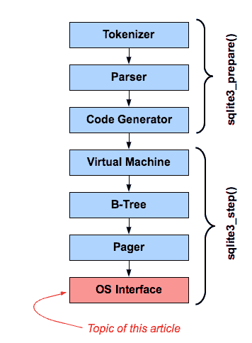

# 1\. 介绍

> 原文：[`sqlite.com/vfs.html`](https://sqlite.com/vfs.html)

本文描述了 SQLite 的操作系统可移植性层或称为“VFS” - 这是 SQLite 实现堆栈中的底部模块，提供跨操作系统的可移植性。

# 2\. VFS 与 SQLite 的其他部分的关系



SQLite 库的内部组织可以看作是右侧显示的模块堆栈。分词器（Tokenizer）、解析器（Parser）和代码生成器（Code Generator）组件用于处理 SQL 语句并将其转换为虚拟机语言或字节码中的可执行程序。粗略地说，这些顶层的三个层实现了 sqlite3_prepare_v2()。顶层三层生成的字节码是一个 prepared statement。虚拟机模块负责运行 SQL 语句的字节码。B-Tree 模块将数据库文件组织成具有有序键和对数性能的多个键/值存储。Pager 模块负责将数据库文件的页面加载到内存中，实现和控制事务，并创建和维护日志文件，以防止由崩溃或断电引起的数据库损坏。操作系统接口是一个薄的抽象层，提供了一组通用例程，以使 SQLite 在不同的操作系统上运行。粗略地说，底部的四层实现了 sqlite3_step()。

本文讨论底层。

操作系统接口 - 也称为“VFS” - 是使 SQLite 能够跨操作系统运行的关键。当 SQLite 的其他模块需要与操作系统通信时，它们调用 VFS 中的方法。然后，VFS 调用需要满足请求的特定操作系统代码。因此，将 SQLite 移植到新的操作系统只是编写新的操作系统接口层或“VFS”的问题。

# 3\. 多个 VFS

标准 SQLite 源代码树包含内置的 Unix 和 Windows VFS。可以在启动时或运行时使用 sqlite3_vfs_register() 接口添加替代 VFS。

可以同时注册多个 VFS。每个 VFS 都有唯一的名称。同一进程中的单独的 数据库连接 可以同时使用不同的 VFS。就此而言，如果单个数据库连接使用 ATTACH 命令打开了多个数据库文件，则每个附加的数据库可能使用不同的 VFS。

## 3.1\. 标准 Unix VFS

Unix 构建提供多个内置 VFS。Unix 的默认 VFS 名称为 "unix"，在大多数应用程序中使用。在 Unix 中还可以找到其他 VFS（取决于编译时选项），例如：

1.  **unix-dotfile** - 使用点文件锁定而不是 POSIX 建议锁。

1.  **unix-excl** - 获取并保持对数据库文件的独占锁，防止其他进程访问数据库。还将 wal-index 保存在堆中，而不是在共享内存中。

1.  **unix-none** - 所有文件锁定操作都是无操作。

1.  **unix-namedsem** - 使用命名信号量进行文件锁定。仅适用于 VXWorks。

各种 Unix VFS 仅在处理文件锁定的方式上有所不同 - 它们大部分实现都是相同的，并且都位于同一个 SQLite 源文件中：[os_unix.c](https://www.sqlite.org/src/doc/trunk/src/os_unix.c)。请注意，除了 "unix" 和 "unix-excl" 外，各种 Unix VFS 使用的锁定实现都是不兼容的。如果两个进程使用不同的 Unix VFS 访问同一个 SQLite 数据库，则它们可能看不到对方的锁定，可能会相互干扰，导致数据库损坏。特别是 "unix-none" VFS 根本不进行任何锁定，如果同时被两个或更多的数据库连接使用，很容易导致数据库损坏。建议程序员只使用 "unix" 或 "unix-excl"，除非有充分的理由使用其他 VFS。

## 3.2\. 标准的 Windows VFS

Windows 构建还带有多个内置的 VFS。默认的 Windows VFS 称为 "win32"，在大多数应用程序中使用。Windows 构建可能包含的其他 VFS 包括：

1.  **win32-longpath** - 类似于 "win32"，但路径名可以长达 65534 字节，而在 "win32" 中路径名最多为 1040 字节。

1.  **win32-none** - 所有文件锁定操作都是空操作。

1.  **win32-longpath-none** - 结合了 "win32-longpath" 和 "win32-none" - 支持长路径名，所有锁定操作都是空操作。

与 Unix 一样，各种 Windows VFS 的大部分代码是共享的。

## 3.3\. 指定要使用的 VFS

总是有一个 VFS 是默认的 VFS。在 Unix 系统上，默认为 "unix" VFS，在 Windows 上为 "win32"。如果没有其他操作，新的数据库连接将使用默认的 VFS。

可以通过使用 sqlite3_vfs_register() 接口并将第二个参数设置为 1 来注册或重新注册 VFS 以更改默认 VFS。因此，如果一个（unix）进程希望始终使用 "unix-nolock" VFS 替代 "unix"，以下代码将起作用：

> ```sql
> sqlite3_vfs_register(sqlite3_vfs_find("unix-nolock"), 1);
> 
> ```

也可以将备用 VFS 作为 sqlite3_open_v2() 函数的第四个参数指定。例如：

> ```sql
> int rc = sqlite3_open_v2("demo.db", &db, SQLITE_OPEN_READWRITE, "unix-nolock");
> 
> ```

最后，如果启用了 URI 文件名，那么可以通过 URI 上的 "vfs=" 参数来指定替代 VFS。这个技术可以与 sqlite3_open()，sqlite3_open16()，sqlite3_open_v2() 以及在已存在的数据库连接上进行新数据库 ATTACH 时使用。例如：

> ```sql
> ATTACH 'file:demo2.db?vfs=unix-none' AS demo2;
> 
> ```

由 URI 指定的 VFS 优先级最高。其次是作为 sqlite3_open_v2() 第四个参数指定的 VFS。如果未指定 VFS，则使用默认 VFS。

## 3.4\. VFS Shims

从 SQLite 栈的上层来看，每个打开的数据库文件都会使用一个 VFS。但实际上，某个特定的 VFS 可能只是另一个执行实际工作的 VFS 的薄包装。我们称包装的 VFS 为“shim”。

一个简单的 shim 示例是 "vfstrace" VFS。这是一个 VFS（在 [test_vfstrace.c](https://www.sqlite.org/src/doc/trunk/src/test_vfstrace.c) 源文件中实现），它在每个 VFS 方法调用时将关联的消息写入日志文件，然后将控制传递给另一个 VFS 来执行实际工作。

## 3.5\. 其他示例 VFS

下面是公共 SQLite 源树中可用的其他 VFS 实现：

+   [appendvfs.c](https://www.sqlite.org/src/file/ext/misc/appendvfs.c) - 这个 VFS 允许将 SQLite 数据库附加到另一个文件的末尾。例如，可以将 SQLite 数据库附加到可执行文件的末尾，这样在运行时可以轻松定位附加的数据库。如果使用--append 选项启动命令行 shell，它将使用这个 VFS，其.archive 命令在使用--append 标志时也会使用它。

+   [test_demovfs.c](https://www.sqlite.org/src/doc/trunk/src/test_demovfs.c) - 该文件实现了一个名为"demo"的非常简单的虚拟文件系统（VFS），使用诸如 open()、read()、write()、fsync()、close()、fsync()、sleep()、time() 等 POSIX 函数。这个 VFS 只在 Unix 系统上工作。但它不打算替代 Unix 平台上默认使用的标准"unix" VFS。"demo" VFS 故意保持非常简单，以便用作学习辅助工具或作为构建其他 VFS 或将 SQLite 移植到新操作系统的模板。

+   [test_quota.c](https://www.sqlite.org/src/doc/trunk/src/test_quota.c) - 该文件实现了一个名为"quota"的适配器，它在一组数据库文件上强制执行累积文件大小限制。使用辅助接口来定义"quota groups"。Quota group 是一组文件（数据库文件、日志和临时文件），它们的名称都匹配一个 GLOB 模式。跟踪每个配额组中所有文件的大小总和，如果该总和超过为配额组定义的阈值，则调用回调函数。该回调可以增加阈值，或者导致超过配额的操作失败，并显示 SQLITE_FULL 错误。这个适配器的一个用途是在 Firefox 中对应用程序数据库施加资源限制。

+   [test_multiplex.c](https://www.sqlite.org/src/doc/trunk/src/test_multiplex.c) - 此文件实现了一个插座，允许数据库文件超过底层文件系统的最大文件大小。这个插座为 SQLite 的上层六层提供了一个接口，使得看起来像是在使用非常大的文件，但实际上每个这样的大文件在底层系统上被分割成许多更小的文件。例如，这个插座已经被用来允许数据库在 FAT16 文件系统上增长超过 2 gibibytes。

+   [test_onefile.c](https://www.sqlite.org/src/doc/trunk/src/test_onefile.c) - 此文件实现了一个名为“fs”的演示虚拟文件系统（VFS），展示了 SQLite 如何在缺乏文件系统的嵌入式设备上使用。内容直接写入底层介质。可以从这个演示代码派生一个 VFS，使得一个具有有限闪存的小设备能够使 SQLite 表现为设备上的闪存文件系统。

+   [test_journal.c](https://www.sqlite.org/src/doc/trunk/src/test_journal.c) - 此文件实现了 SQLite 测试中使用的一个插座，用于验证数据库和回滚日志的正确写入顺序，并在适当的时候进行“同步”，以确保数据库可以在任何时候从断电或硬重置中恢复。该插座检查数据库和回滚日志操作的几个不变量，并在违反任何这些不变量时引发异常。这些不变量反过来又保证了数据库始终是可恢复的。使用此插座运行一大套测试用例能够额外保证 SQLite 数据库不会因意外的断电或设备重置而损坏。

+   [test_vfs.c](https://www.sqlite.org/src/doc/trunk/src/test_vfs.c) - 此文件实现了一个用于模拟文件系统故障的接口。在测试过程中使用此接口来验证 SQLite 对硬件故障或其他难以在真实系统上测试的错误条件的合理响应。

核心 SQLite 源代码库和可用扩展中还有其他 VFS 实现。上述列表并非详尽无遗，只是 VFS 接口可以实现的功能类型的代表。

# 4\. VFS 实现

通过对三个对象进行子类化来实现新的 VFS：

+   sqlite3_vfs

+   sqlite3_io_methods

+   sqlite3_file

一个 sqlite3_vfs 对象定义了 VFS 的名称和实现操作系统接口的核心方法，比如检查文件是否存在、删除文件、创建文件、打开文件进行读取和/或写入、将文件名转换为它们的规范形式。sqlite3_vfs 对象还包含了从操作系统获取随机数的方法，挂起进程（睡眠）的方法以及查找当前日期和时间的方法。

sqlite3_file 对象表示一个打开的文件。当文件打开时，sqlite3_vfs 的 xOpen 方法构造一个 sqlite3_file 对象。sqlite3_file 对象在文件打开期间跟踪文件的状态。

sqlite3_io_methods 对象包含用于与打开文件交互的方法。每个 sqlite3_file 包含一个指向适用于其所代表文件的 sqlite3_io_methods 对象的指针。sqlite3_io_methods 对象包含诸如读取和写入文件、截断文件、将任何更改刷新到持久存储、查找文件大小、锁定和解锁文件、关闭文件和销毁 sqlite3_file 对象等方法。

编写新 VFS 的代码涉及构造一个 sqlite3_vfs 对象的子类，然后通过调用 sqlite3_vfs_register() 注册该 VFS 对象。VFS 的实现还为 sqlite3_file 和 sqlite3_io_methods 提供了子类，但这些对象不会直接注册到 SQLite。相反，sqlite3_file 对象从 sqlite3_vfs 的 xOpen 方法返回，并且 sqlite3_file 对象指向 sqlite3_io_methods 对象的一个实例。
