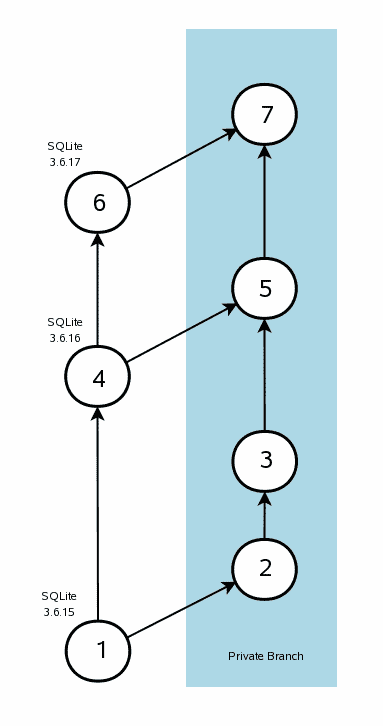

# 1\. Introduction

> 原文：[`sqlite.com/privatebranch.html`](https://sqlite.com/privatebranch.html)

SQLite 被设计为在不进行任何更改或自定义的情况下满足大多数开发者的需求。当需要更改时，通常可以使用启动时 (1) 或运行时 (2) (3) (4) 配置方法或通过编译时选项来完成。在将 SQLite 集成到产品中时，几乎不需要应用程序开发者编辑 SQLite 源代码。

我们称对 SQLite 源代码进行的定制修改，仅供单个应用程序使用的私有分支为"私有分支"。当需要私有分支时，应用程序开发者必须承担将私有分支与公共 SQLite 源代码同步的任务。这是一项繁琐的工作。它也可能会很棘手，因为尽管 SQLite 的文件格式和公布的接口非常稳定，但 SQLite 的内部实现变化非常迅速。对于任何给定的 SQLite 点发布，可能会有数百甚至数千行代码发生变化。

本文概述了一种可能的方法，用于将 SQLite 的私有分支与公共 SQLite 源代码保持同步。当然，有许多维护私有分支的方法。没有人被迫使用本文所描述的方法。本文并不试图强加于私有分支的维护者特定的程序。本文的目的是提供一个维护私有分支的示例过程，可以作为设计最适合每个项目情况的过程模板。



# 2\. The Basic Idea

我们建议使用[fossil 软件配置管理](http://www.fossil-scm.org)系统设置两个分支。一个分支（“公共分支”或“主干”）包含发布的 SQLite 源代码，另一个分支是包含为项目定制的代码的私有分支。每当发布新的公共 SQLite 版本时，该版本将被添加到公共分支，然后将更改合并到私有分支。

本文建议使用[fossil](http://www.fossil-scm.org/)，但任何其他分布式软件配置管理系统，如[monotone](http://www.monotone.ca/)或[mercurial](http://www.selenic.com/mercurial/wiki/)（也称为“hg”），或[git](http://www.git-scm.org/)同样适用。概念是相同的，尽管具体的步骤会有所不同。

右侧的图示说明了这个概念。我们从标准的 SQLite 发布版本开始。举个例子，假设我们打算从 SQLite 版本 3.6.15 创建一个私有分支。在图中，这是版本（1）。维护者将基线的 SQLite 完全复制到分支空间中，显示为版本（2）。请注意版本（1）和（2）完全相同。然后维护者将私有更改应用于版本（2），得到版本（3）。换句话说，版本（3）是 SQLite 版本 3.6.15 加上修改。

后来，SQLite 版本 3.6.16 发布了，如图中的圆圈（4）所示。在这一点上，私有分支的维护者执行合并操作，将从（1）到（4）的所有更改应用于（3）。结果是版本（5），这是 SQLite 3.6.16 加上修改。

可能会出现合并冲突。换句话说，从（2）到（3）的更改可能与从（1）到（4）的更改不兼容。在这种情况下，维护者将不得不手动解决冲突。希望冲突不会经常发生。当最小化私有编辑时，冲突发生的可能性较小。

上述周期可以重复多次。图示显示第三个 SQLite 发布版本为 3.6.17，位于圆圈（6）中。私有分支维护者可以进行另一次合并，以将从（4）到（6）的更改合并到私有分支中，形成版本（7）。

# 3\. 过程

本文档的其余部分将引导读者完成维护私有分支所需的步骤。总体思路与上文概述的相同。本节仅提供更详细的信息。

我们再次强调，这些步骤并不意味着维护私有分支的唯一可接受方法。这种方法只是众多方法之一。将本文档作为准备项目特定程序的基准。不要害怕尝试不同的方法。

## 3.1\. 获取软件

[Fossil](http://www.fossil-scm.org/) 是一款必须在您的计算机上安装后才能使用的计算机程序。幸运的是，安装 Fossil 非常简单。Fossil 只是一个单独的 "*.exe" 文件，您只需下载并运行即可。要卸载 Fossil，只需删除 exe 文件。有关安装和开始使用 Fossil 的详细说明，请访问 [fossil 网站](http://www.fossil-scm.org/index.html/doc/tip/www/quickstart.wiki)。您可以在 [fossil 网站](http://www.fossil-scm.org) 上找到。

## 3.2\. 创建项目存储库

使用以下命令创建一个 Fossil 存储库来托管私有分支：

> ```sql
> fossil new private-project.fossil
> 
> ```

你可以随意命名你的项目。".fossil" 后缀是可选的。对于本文档，我们将继续称该项目为 "`private-project.fossil`"。请注意，`private-project.fossil` 是一个普通的磁盘文件（实际上是一个 SQLite 数据库），它将包含你的完整项目历史记录。你可以通过复制该文件来简单地备份项目。

如果你想配置新项目，请输入：

> ```sql
> fossil ui private-project.fossil
> 
> ```

"ui" 命令会让 Fossil 运行一个迷你内置 Web 服务器，并启动你的 Web 浏览器指向该服务器。你可以使用 Web 浏览器以各种方式配置你的项目。请参阅 Fossil 网站上的说明获取更多信息。

一旦项目存储库创建完成，通过移动到你希望保留所有项目源代码的目录，并输入以下命令，创建项目的开放式检出：

> ```sql
> fossil open private-project.fossil
> 
> ```

如果需要，你可以在同一项目上进行多个检出。并且你可以将存储库“克隆”到不同的计算机上，以便多个开发者可以使用它。有关详细信息，请参阅 Fossil 网站。

## 3.3\. 在 Fossil 中安装 SQLite 基线

在上一步创建的存储库最初是空的。下一步是加载基线 SQLite 发布版本 - 如上图中的圆圈（1）所示。

首先获取 SQLite 的副本，以你使用的任何形式。你获取的公共 SQLite 应尽可能接近你的私人编辑副本。如果你的项目使用 SQLite 集成版本，那么获取集成版本的副本。如果使用预处理的单独源文件，则获取这些文件。将所有源文件放在上一步创建的检出目录中。

公共 SQLite 发布版本中的源代码使用 Unix 换行符（ASCII 码 10："换行符"，NL）和空格代替制表符。如果你将换行符更改为 Windows 风格的换行符（ASCII 码 13、10："回车符"和"换行符"，CR-NL），或者将空格缩进改为制表符缩进，**现在就进行更改**，然后再签入基准线。只有公共分支和私有分支之间的差异很小，合并过程才能正常工作。如果因为从 NL 到 CR-NL 换行符的更改导致私有分支中每一行源文件都被更改，那么合并步骤将无法正确执行。

假设你正在使用聚合源代码。按以下步骤将基准线添加到你的项目中：

> ```sql
> fossil add sqlite3.c sqlite3.h
> 
> ```

如果你使用单独的源文件，请命名所有源文件，而不仅仅是两个聚合源文件。完成此步骤后，请按以下步骤提交你的更改：

> ```sql
> fossil commit
> 
> ```

系统会要求你输入一个签入注释。可以随意输入。提交完成后，你的基准线将成为仓库的一部分。如果愿意，可以运行以下命令查看此过程在“时间轴”上的显示：

> ```sql
> fossil ui
> 
> ```

最后一个命令与我们之前运行的“ui”命令相同。它启动一个运行中的迷你 Web 服务器，并将你的 Web 浏览器指向它。但这次我们不需要指定仓库文件，因为我们位于一个检出中，所以 Fossil 可以自行找到仓库。如果愿意，可以将仓库文件名作为第二个参数输入，但这是可选的。

如果你不想使用浏览器查看新的签入信息，你可以使用类似以下命令从命令行获取一些信息：

> ```sql
> fossil timeline
> fossil info
> fossil status
> 
> ```

## 3.4\. 创建私有分支

上一步在上图中创建了圆圈（1）。这一步将创建圆圈（2）。运行以下命令：

> ```sql
>  
> fossil branch new private trunk -bgcolor "#add8e8"
> 
> ```

此命令将创建一个名为"private"的新分支（如果愿意，可以使用不同的名称），并分配给它浅蓝色的背景色（"#add8e8"）。如果你愿意，可以省略背景色，不过有一个独特的背景色可以使得在时间轴显示中更容易区分"trunk"（公共分支）和"private"分支。如果愿意，你可以通过 Web 界面更改私有分支或公共分支（"trunk"）的背景色。

上述命令创建了新分支。但你的检出仍然在主干上 - 你可以通过运行以下命令确认这一点：

> ```sql
> fossil info
> 
> ```

要将检出切换到私有分支，请输入：

> ```sql
> fossil update private
> 
> ```

你可以再次运行"info"命令来验证你当前位于私有分支上。要返回到公共分支，请键入：

> ```sql
> fossil update trunk
> 
> ```

通常，当在私有和公共分支之间切换时，fossil 会修改检出中的所有文件。但在此时，两个分支中的文件是相同的，因此不需要进行修改。

## 3.5\. 在私有分支中为代码添加自定义内容

现在是时候对 SQLite 进行私有的自定义修改了，这也是此操作的重点。使用"`fossil update private`"命令切换到私有分支（如果你还没有在那里），然后在文本编辑器中打开源文件并进行你想要的任何更改。完成更改后，请使用以下命令提交这些更改：

> ```sql
> fossil commit
> 
> ```

你将再次被提示输入描述更改的提交。然后提交将会执行。提交将在存储库中创建一个新的检入，对应于上图中的圆圈（3）。

现在公共分支和私有分支不同，你可以运行"`fossil update trunk`"和"`fossil update private`"命令，看看在你在分支之间切换时，fossil 确实会改变检出中的文件。

注意，在上述图表中，我们将私有编辑显示为单个提交。这仅是为了清晰地展示。实际上，你完全可以进行数十甚至数百个单独的微小更改，并分别提交每一个更改。事实上，进行许多小的更改是工作的首选方式。将所有更改合并为单个提交的唯一原因是它使图表更容易绘制。

## 3.6\. 合并新发布的公共 SQLite 版本

假设过了一段时间（通常约一个月），SQLite 的新版本发布了：3.6.16\. 你会想要将这个新的公共版本的 SQLite 合并到你的仓库的公共分支（主干）中。为了做到这一点，首先切换到主干：

> ```sql
> fossil update trunk
> 
> ```

然后下载新版本的 SQLite 源码并覆盖检出的文件。

如果在原始基线中进行了从 NL 到 CR-NL 的换行符更改或者从空格到制表符的缩进更改，那么对新的源文件进行相同的更改。

一切准备就绪后，运行 "`fossil commit`" 命令来提交更改。这在上述图表中创建圆圈（4）。

## 3.7\. 将公共 SQLite 更新合并到私有分支

下一步是将公共分支中的更改移动到私有分支。换句话说，我们希望在上图中创建圆圈（5）。首先使用 "`fossil update private`" 命令切换到私有分支。然后输入以下命令：

> ```sql
> fossil merge trunk
> 
> ```

"merge" 命令试图将圆圈（1）到（4）之间的所有更改应用到本地检出的文件中。注意，圆圈（5）还没有创建。你需要运行 "commit" 命令来创建圆圈（5）。

可能会在合并中出现冲突。当在圈（1）和（4）与圈（2）和（3）之间以不同方式更改同一行代码时，就会发生冲突。合并命令会在输出中宣布任何冲突，并将冲突行的两个版本都包含在内。您需要打开包含冲突的文件并手动解决冲突。

在解决冲突后，许多用户喜欢在提交到存储库之前编译和测试新版本。或者您可以先提交后测试。无论哪种方式，运行“`fossil commit`”命令来提交版本（5）。

## 3.8\. 进一步更新

随着新版本的 SQLite 发布，重复步骤 3.6 和 3.7，将新发布的更改添加到私有分支中。如果需要，还可以在发布之间在私有分支上进行额外的私有更改。

# 4\. 变化

自此文档首次撰写以来，官方 SQLite 源代码已从古老的 CVS 系统迁移到了 [Fossil 存储库](https://www.sqlite.org/src)。这意味着，如果您使用的是官方 SQLite 源代码（而不是合并源代码文件 sqlite3.c 和 sqlite3.h），那么只需克隆官方存储库即可创建私有存储库：

> ```sql
> fossil clone https://www.sqlite.org/src private-project.fossil
> 
> ```

此命令同时创建新存储库并填充所有最新的 SQLite 代码。然后，可以按照第 3.4 节的描述创建一个私有分支。

当通过克隆创建私有存储库时，也更容易将新的公共 SQLite 发布集成进来。要获取公共 SQLite 存储库中的所有最新更改，只需进入开放式检出并执行：

> ```sql
> fossil update
> 
> ```

然后继续按照第 3.7 节中描述的方式将“主干”中的更改与您的“私有”更改合并。
